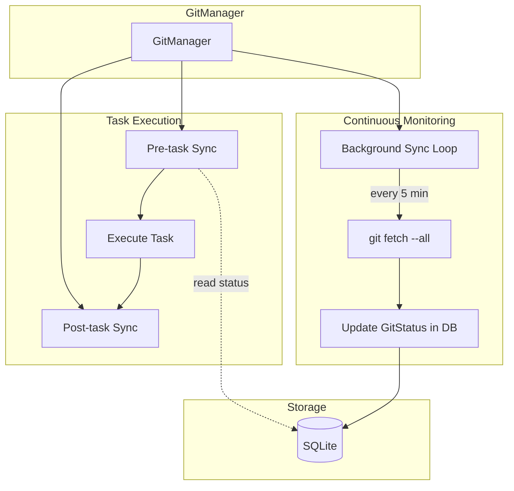
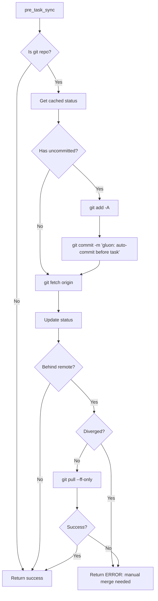
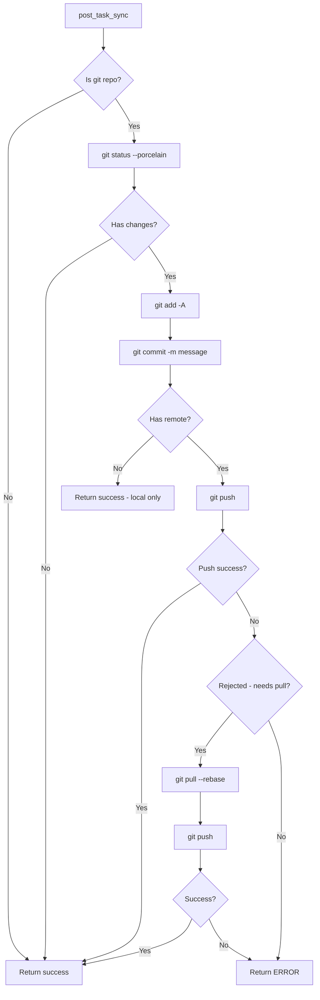
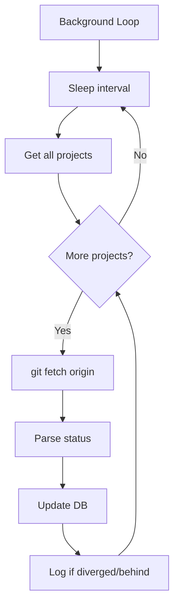

# Gluon Agent - MVP Implementation Plan

## Overview

**Goal:** Build a minimal viable product (MVP) that can manage one or more Claude Code instances operating on different projects, with the ability to resume sessions to continue working later.

**Tech Stack:**
- Python 3.12+
- `claude-agent-sdk` - Official Anthropic SDK for Claude Code
- `typer` + `rich` - Beautiful CLI interface
- `sqlite3` - Lightweight persistence for sessions (stdlib, no external deps)
- `pydantic` - Data validation and serialization
- `anyio` - Async runtime (required by claude-agent-sdk)

---

## Architecture

```
┌─────────────────────────────────────────────────────────────────────┐
│                         Gluon Agent                                 │
├─────────────────────────────────────────────────────────────────────┤
│                                                                     │
│  ┌─────────────┐    ┌─────────────┐    ┌─────────────────────────┐ │
│  │    CLI      │───▶│   Core      │───▶│   Claude Agent SDK      │ │
│  │  (typer)    │    │  Orchestrator│    │   (claude-agent-sdk)    │ │
│  └─────────────┘    └─────────────┘    └─────────────────────────┘ │
│         │                  │                                        │
│         │                  ▼                                        │
│         │           ┌─────────────┐                                 │
│         │           │   Session   │                                 │
│         └──────────▶│   Store     │                                 │
│                     │  (SQLite)   │                                 │
│                     └─────────────┘                                 │
│                                                                     │
└─────────────────────────────────────────────────────────────────────┘
```

---

## ✅ MVP Status: COMPLETE

All MVP phases have been implemented. See README.md for usage.

---

# Git Manager Feature

## Overview

Add a `GitManager` component to ensure projects stay synchronized with remote repositories, preventing conflicts when multiple Claude instances work on the same codebase across different machines.

## Design Philosophy

**Continuous Awareness**: Track git status for ALL projects at all times, not just when tasks run. This means:
- Background periodic `git fetch` keeps status current
- Before tasks, we already KNOW the state (from cache)
- Pre-task sync just performs necessary operations (fast-forward, commit)
- Post-task sync commits changes and pushes

## User Requirements

| Phase | Behavior |
|-------|----------|
| **Pre-task** | Auto-commit uncommitted changes, then fast-forward if behind |
| **Remote ahead** | Auto fast-forward if possible (fail if diverged) |
| **Post-task** | Auto-commit all changes & push to remote |
| **Background** | Periodically fetch all projects to maintain awareness |

## Architecture



## Data Models

### GitStatus (stored per project)

```python
@dataclass
class GitStatus:
    """Git repository status cached in database."""
    is_git_repo: bool
    branch: str | None
    remote: str | None           # e.g., "origin"
    remote_url: str | None

    # Working tree status (updated on fetch)
    has_uncommitted: bool
    uncommitted_count: int

    # Sync status relative to remote
    commits_ahead: int           # Local commits not pushed
    commits_behind: int          # Remote commits not pulled
    is_diverged: bool            # True if both ahead AND behind

    # Timestamps
    last_fetch_at: datetime | None
    last_push_at: datetime | None
    last_commit_at: datetime | None
```

### GitSyncResult

```python
@dataclass
class GitSyncResult:
    """Result of a sync operation."""
    success: bool
    action: str                  # "none", "commit", "pull", "push", "commit+push"
    message: str
    error: str | None = None

    # Operation details
    commits_pulled: int = 0
    commits_pushed: int = 0
    files_committed: int = 0
```

## Database Schema Updates

```sql
-- Add git tracking columns to projects table
ALTER TABLE projects ADD COLUMN is_git_repo INTEGER DEFAULT 0;
ALTER TABLE projects ADD COLUMN git_branch TEXT;
ALTER TABLE projects ADD COLUMN git_remote TEXT;
ALTER TABLE projects ADD COLUMN git_remote_url TEXT;
ALTER TABLE projects ADD COLUMN git_uncommitted_count INTEGER DEFAULT 0;
ALTER TABLE projects ADD COLUMN git_commits_ahead INTEGER DEFAULT 0;
ALTER TABLE projects ADD COLUMN git_commits_behind INTEGER DEFAULT 0;
ALTER TABLE projects ADD COLUMN git_is_diverged INTEGER DEFAULT 0;
ALTER TABLE projects ADD COLUMN git_last_fetch_at TEXT;
ALTER TABLE projects ADD COLUMN git_last_push_at TEXT;
ALTER TABLE projects ADD COLUMN git_last_commit_at TEXT;
```

## GitManager Class

```python
class GitManager:
    """Manages git synchronization for all projects."""

    def __init__(self, store: GluonStore):
        self.store = store
        self._sync_task: asyncio.Task | None = None
        self._sync_interval = 300  # 5 minutes

    # === Status Operations ===

    async def refresh_status(self, project: Project) -> GitStatus:
        """Fetch and update git status for a single project."""

    async def refresh_all_statuses(self) -> dict[str, GitStatus]:
        """Fetch and update git status for all projects."""

    def get_cached_status(self, project: Project) -> GitStatus | None:
        """Get cached git status from database (no git operations)."""

    # === Sync Operations ===

    async def pre_task_sync(self, project: Project) -> GitSyncResult:
        """
        Prepare project for task execution:
        1. If uncommitted changes → auto-commit
        2. If behind remote → fast-forward (fail if diverged)
        """

    async def post_task_sync(
        self,
        project: Project,
        commit_message: str
    ) -> GitSyncResult:
        """
        Finalize after task completion:
        1. Stage all changes
        2. Commit with message
        3. Push to remote
        """

    # === Background Sync ===

    async def start_background_sync(self, interval_seconds: int = 300):
        """Start background fetch loop for all projects."""

    async def stop_background_sync(self):
        """Stop background fetch loop."""
```

## Sync Flows

### Pre-task Sync Flow



### Post-task Sync Flow



### Background Sync Flow



## Integration Points

### 1. Orchestrator Integration

```python
# In core.py Orchestrator.execute()
async def execute(self, project_name, prompt, ...):
    project = self.get_project(project_name)

    # Pre-task git sync
    if self.git_manager:
        sync_result = await self.git_manager.pre_task_sync(project)
        if not sync_result.success:
            raise GitSyncError(sync_result.error)
        if sync_result.action != "none":
            yield AgentMessage(type="system", content=f"Git: {sync_result.message}")

    # ... existing execution logic ...

    # Post-task git sync (only on success)
    if result and result.success and self.git_manager:
        commit_msg = f"gluon: {prompt[:50]}{'...' if len(prompt) > 50 else ''}"
        sync_result = await self.git_manager.post_task_sync(project, commit_msg)
        if sync_result.action != "none":
            yield AgentMessage(type="system", content=f"Git: {sync_result.message}")
```

### 2. Bot Integration

```python
# In bot.py GluonBot
async def run_polling(self):
    # Start background git sync
    await self.git_manager.start_background_sync(interval_seconds=300)

    try:
        # ... existing polling loop ...
    finally:
        await self.git_manager.stop_background_sync()
```

### 3. CLI Commands

```bash
# Show git status of all projects
gluon git status

# Fetch all projects now
gluon git fetch

# Sync specific project (fetch + ff if needed)
gluon git sync <project>

# Push any unpushed commits
gluon git push <project>
```

## Implementation Files

| File | Action | Description |
|------|--------|-------------|
| `src/gluon/git_manager.py` | CREATE | GitManager class with all sync logic |
| `src/gluon/models.py` | MODIFY | Add GitStatus, GitSyncResult dataclasses |
| `src/gluon/store.py` | MODIFY | Add git columns, migration, CRUD methods |
| `src/gluon/core.py` | MODIFY | Integrate GitManager into execute() |
| `src/gluon/bot.py` | MODIFY | Start/stop background sync |
| `src/gluon/cli.py` | MODIFY | Add `gluon git` subcommands |
| `tests/test_git_manager.py` | CREATE | Unit tests with mocked git |

## Commit Message Format

Auto-generated commits use this format:

```
gluon: {first 50 chars of prompt}

🤖 Auto-committed by Gluon Agent
Task: {full prompt}
Session: {session_id}
Run: {run_id}
```

## Error Handling

| Scenario | Behavior |
|----------|----------|
| Not a git repo | Skip all git operations, proceed normally |
| No remote configured | Commit locally, skip push operations |
| Diverged branches | **FAIL** pre-task sync with clear error |
| Push rejected (behind) | Pull with rebase, then retry push once |
| Merge conflict | **FAIL** with error, require manual resolution |
| Network error (fetch) | **WARN** but proceed (may work on stale code) |
| Network error (push) | **FAIL** post-task sync, but task already completed |

## Configuration

Environment variables:

```bash
GLUON_GIT_ENABLED=true              # Enable/disable git sync (default: true)
GLUON_GIT_SYNC_INTERVAL=300         # Background fetch interval in seconds
GLUON_GIT_AUTO_COMMIT=true          # Auto-commit before/after tasks
GLUON_GIT_AUTO_PUSH=true            # Auto-push after tasks
GLUON_GIT_COMMIT_PREFIX="gluon:"    # Prefix for auto-commit messages
```

## Implementation Order

1. **Phase 1**: Add GitStatus model and database columns
2. **Phase 2**: Create GitManager with status refresh methods
3. **Phase 3**: Implement pre_task_sync and post_task_sync
4. **Phase 4**: Integrate with Orchestrator.execute()
5. **Phase 5**: Add background sync loop
6. **Phase 6**: Add CLI commands
7. **Phase 7**: Write tests

## Testing Strategy

1. **Unit tests**: Mock `asyncio.create_subprocess_exec` for git commands
2. **Integration tests**: Create temp git repos with local remotes
3. **Edge cases**:
   - Non-git directories
   - Repos without remotes
   - Diverged branches
   - Network failures (timeout mocking)
   - Empty commits (nothing to commit)
   - Binary files
   - .gitignore handling
