# Gluon Agent

AI orchestrator for managing multiple Claude Code agents across projects. Features a web dashboard with Kanban board, git worktree isolation for parallel tasks, PR integration, real-time WebSocket updates, and multi-platform bot interfaces (Telegram, Discord).

## Features

- **Web Dashboard** - React-based Kanban board with real-time updates
- **Git Worktree Isolation** - Run tasks in isolated branches without affecting main
- **PR Integration** - Create PRs, detect conflicts, merge directly from dashboard
- **Image Attachments** - Attach screenshots/diagrams to tasks for AI context
- **Usage Tracking** - Monitor costs, tokens, and usage per project
- **Multi-Platform Bots** - Telegram and Discord interfaces with natural language
- **Session Resume** - Continue Claude sessions with follow-up prompts

## Installation

```bash
uv venv
uv pip install -e '.[dev]'
```

## Quick Start

```bash
# Register a project
gluon project add myapp /path/to/myapp

# Run a task
gluon run myapp 'Fix the authentication bug'

# Resume session
gluon resume myapp 'Also add logging'
```

## Commands

### Project Management

- `gluon project add <name> <path>` - Register project
- `gluon project list` - List projects
- `gluon project remove <name>` - Remove project

### Workspace Management

- `gluon workspace add <name> <path>` - Register workspace and auto-discover projects
- `gluon workspace list` - List workspaces
- `gluon workspace scan [name]` - Scan workspace(s) for new projects
- `gluon workspace projects <name>` - List projects in workspace
- `gluon workspace remove <name>` - Remove workspace

### Task Execution

- `gluon run <project> <prompt>` - Execute task (foreground)
- `gluon run <project> <prompt> --background` - Execute task in background
- `gluon resume <project> [prompt]` - Resume last session
- `gluon sessions [project]` - List sessions
- `gluon status` - Show status

### Background Runs

- `gluon runs` - List all background execution runs
- `gluon runs --active` - Show only active runs
- `gluon logs <run_id>` - View logs for a run
- `gluon logs <run_id> --follow` - Tail logs in real-time
- `gluon cancel <run_id>` - Cancel a running task

### Git Management

- `gluon git status [project]` - Show git status for project(s)
- `gluon git fetch [project]` - Fetch latest from remote
- `gluon git sync <project>` - Commit, fetch, and fast-forward
- `gluon git push <project>` - Commit and push changes

### Bot Interfaces

- `gluon bot` - Run Telegram bot interface
- `gluon discord` - Run Discord bot interface
- `gluon serve --telegram --discord` - Run multiple transports concurrently

## Web Dashboard

Gluon includes a full-featured web dashboard built with FastAPI + React, providing a Kanban board view of all tasks with real-time WebSocket updates.

### Quick Start

```bash
# Start the web server (port 45866)
gluon web

# Or run in development mode
cd web-ui && npm run dev  # Terminal 1: Vite dev server
uvicorn gluon.web.api:app --reload --port 45866  # Terminal 2: FastAPI
```

Open http://localhost:45866 to access the dashboard.

### Dashboard Features

- **Kanban Board** - Drag-and-drop task management across columns (Queued, Running, Review, Completed, Failed)
- **Real-time Updates** - WebSocket-powered live status updates
- **Project Filtering** - Filter tasks by project or workspace
- **Run Details Modal** - View logs, commits, file changes, PR status
- **Image Attachments** - Upload screenshots for AI context (paste with ⌘V)
- **PR Integration** - Create PRs, view merge status, resolve conflicts
- **Usage Dashboard** - Track costs and token usage by project/day

### Web Dashboard Architecture

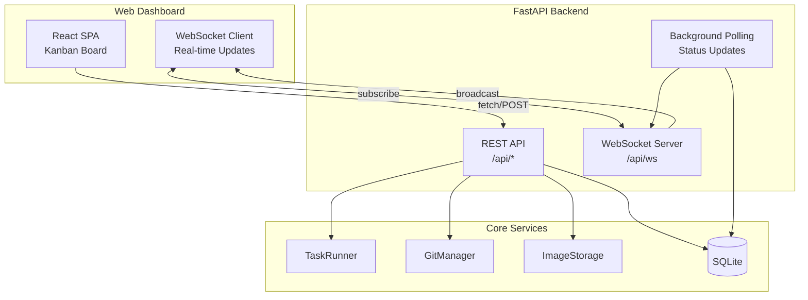

## Architecture

### High-Level Overview

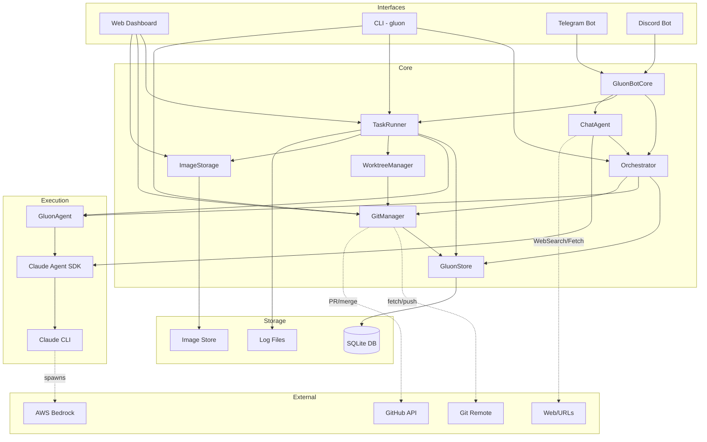

### Data Model

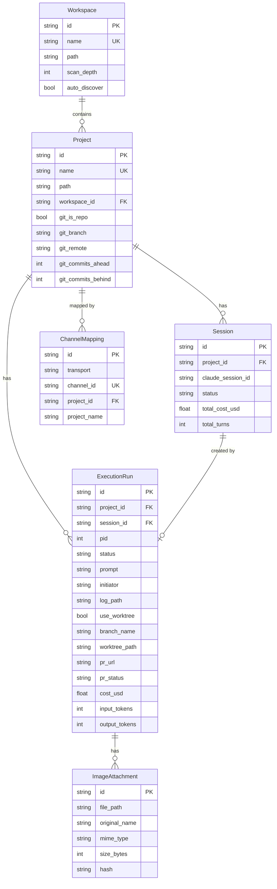

### CLI Execution Flow

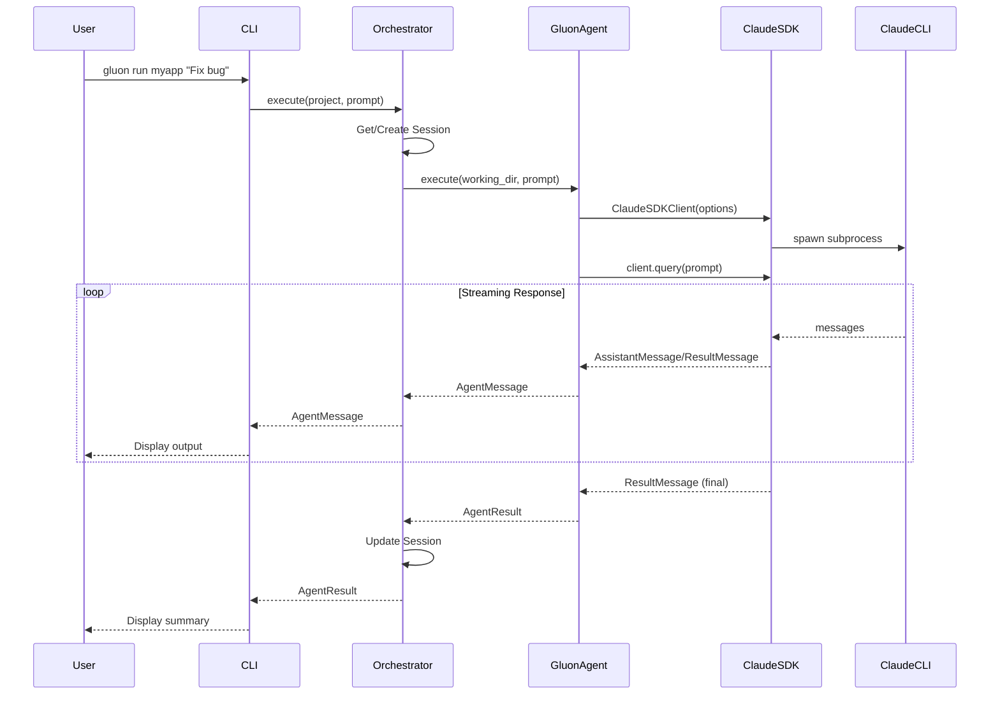

### Background Execution Flow

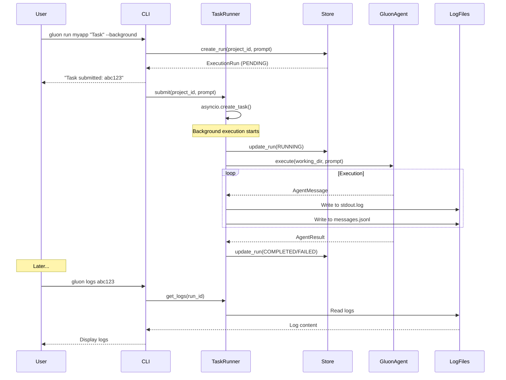

### Git Worktree Isolation Flow

Tasks can run in isolated git worktrees, creating a dedicated branch without affecting the main codebase.

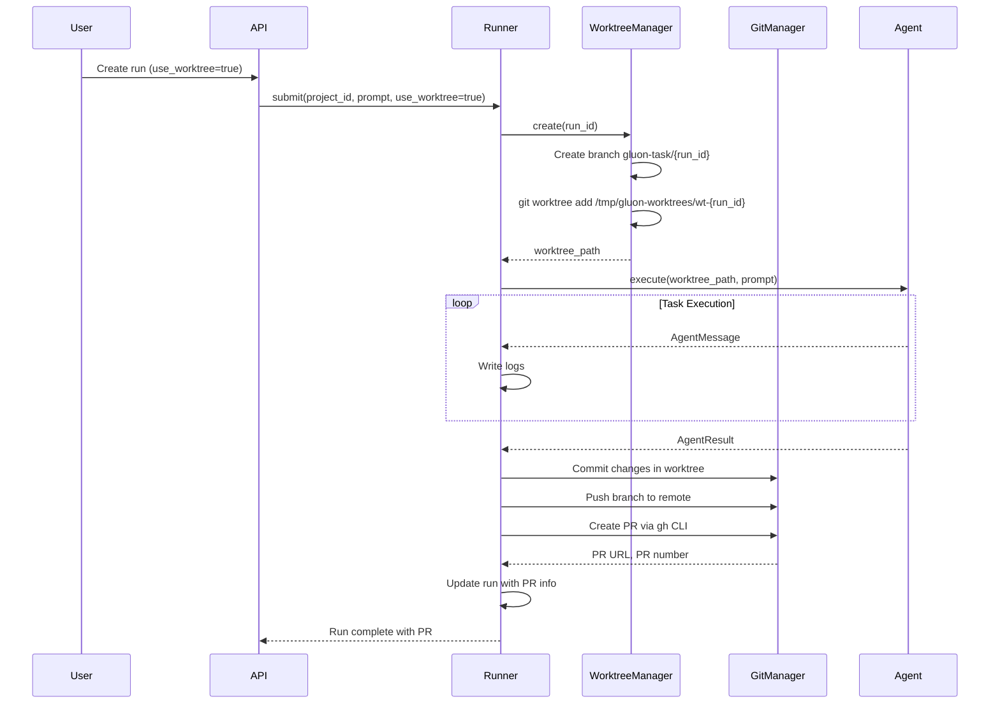

### Worktree Directory Structure

```
/tmp/gluon-worktrees/
└── wt-{run_id}/           # Isolated worktree
    ├── .gluon-images/     # Attached images copied here
    ├── .env.local         # Copied from parent repo
    └── ... project files
```

**Benefits:**
- Tasks don't affect the main branch until merged
- Multiple tasks can run in parallel on different branches
- Easy PR review and selective merging
- Rollback by simply not merging

### Telegram Bot Flow

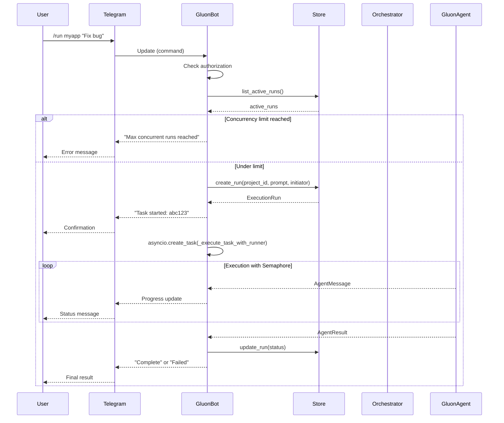

### Bot Startup Recovery

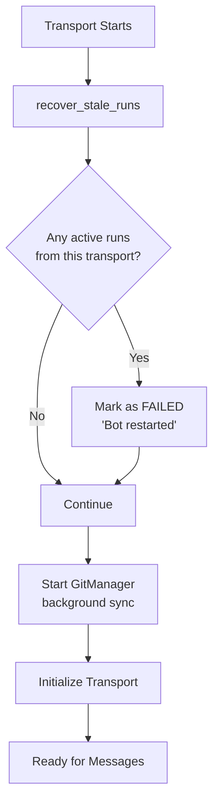

### Agent Execution Detail

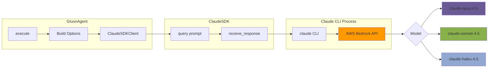

### Concurrency Model

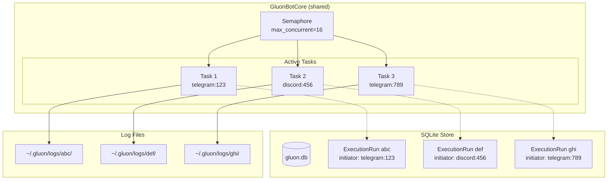

### Transport Layer Architecture

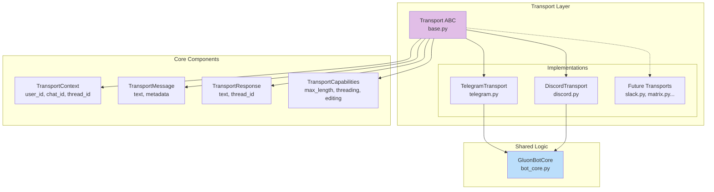

### Discord Bot Flow

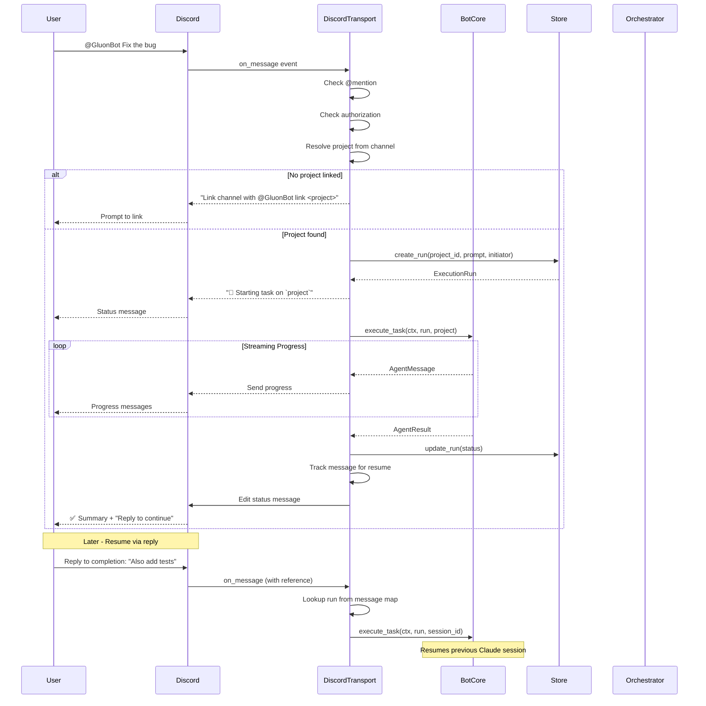

### Discord Channel Mapping

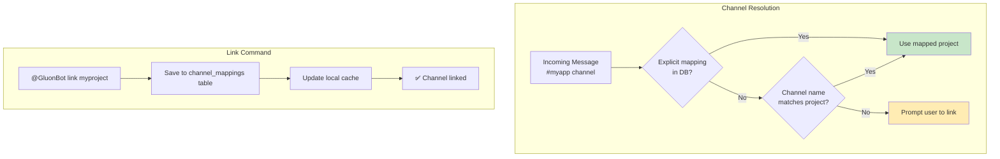

### Chat Agent Architecture

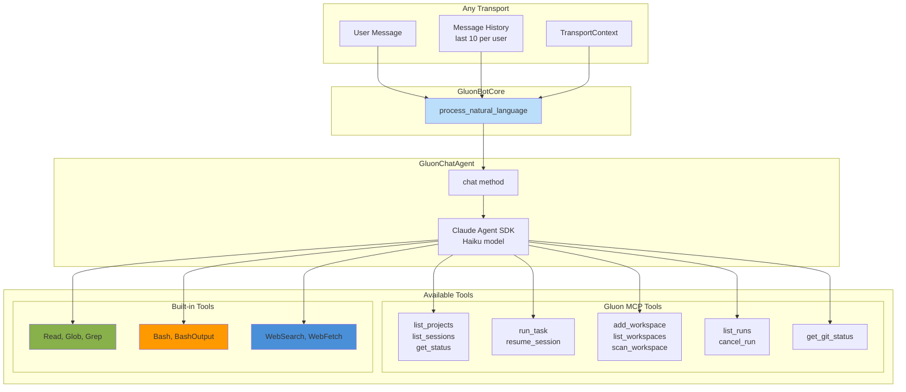

## Background Execution

Gluon supports running tasks in the background with persistent tracking:

```bash
# Start a background task
gluon run myapp 'Implement user authentication' --background
# Output: Task submitted: abc12345

# Check status
gluon runs
# Shows all runs with status (pending/running/completed/failed)

# View logs
gluon logs abc12345

# Follow logs in real-time
gluon logs abc12345 --follow

# Cancel if needed
gluon cancel abc12345
```

Background runs are tracked in SQLite and persist across restarts. Logs are stored at `~/.gluon/logs/<run_id>/`.

## Telegram Bot

Run Gluon as an always-on daemon via Telegram with support for multiple concurrent tasks.

### Setup

1. Message [@BotFather](https://t.me/BotFather) on Telegram
2. Send `/newbot` and follow instructions to create your bot
3. Copy the token you receive

4. (Optional) Get your user ID from [@userinfobot](https://t.me/userinfobot)

### Run the Bot

```bash
# Set token via environment variable
export GLUON_TELEGRAM_TOKEN="your-bot-token"

# Optional: restrict to specific users (comma-separated IDs)
export GLUON_TELEGRAM_USERS="123456789,987654321"

# Start the bot
gluon bot

# Or pass token directly
gluon bot --token "your-bot-token" --users "123456789"
```

### Bot Commands

- `/projects` - List registered projects
- `/sessions [project]` - List sessions
- `/run <project> <prompt>` - Run a task
- `/resume <project> [session_id] [prompt]` - Resume session (latest or specific)
- `/runs` - List your background runs
- `/runs all` - List all runs
- `/status` - Show overall status
- `/cancel` - Cancel your latest active run
- `/cancel <run_id>` - Cancel specific run
- `/clear` - Clear chat history
- `/help` - Show help

### Features

- **Multiple concurrent tasks**: Run tasks across multiple projects simultaneously
- **Persistent tracking**: All runs are tracked in SQLite and survive bot restarts
- **Global concurrency limit**: Configurable limit (default: 16) prevents resource exhaustion
- **Natural language support**: Chat naturally instead of using commands
- **Conversation context**: Bot remembers recent messages for follow-up questions
- **Reply to resume**: Reply to a completion message to automatically resume that session
- **Real-time updates**: Get progress updates as tasks execute

### Natural Language Examples

Instead of commands, you can chat naturally:

| What you say | What happens |
|--------------|--------------|
| "Show me my projects" | Lists all registered projects |
| "What's the git status of myapp?" | Shows git branch, uncommitted changes, ahead/behind |
| "Run a task on myapp to fix the login bug" | Starts a coding task with Claude |
| "What tasks are running?" | Lists active background runs |
| "Cancel the last task" | Cancels most recent active run |
| "Search the web for React best practices" | Performs web search |
| "Read the README in myapp" | Reads file contents from project |
| "Find all Python files in myapp" | Searches for files by pattern |
| *(reply to completion)* "Also add tests" | Resumes the session with follow-up prompt |

The chat agent has access to:
- **Gluon tools**: Project management, task execution, run monitoring, git status
- **File tools**: Read, Glob, Grep for exploring project code
- **Shell tools**: Bash, BashOutput for running commands
- **Web tools**: WebSearch, WebFetch for internet lookups

## Discord Bot

Run Gluon as a Discord bot with channel-based project mapping and threaded task output.

### Installation

Discord support is an optional dependency:

```bash
pip install 'gluon-agent[discord]'
# or for all optional features
pip install 'gluon-agent[all]'
```

### Setup

1. Go to [Discord Developer Portal](https://discord.com/developers/applications)
2. Create a New Application
3. Go to "Bot" tab and click "Add Bot"
4. Copy the bot token
5. Enable "MESSAGE CONTENT INTENT" in Bot settings
6. Go to "OAuth2" → "URL Generator"
7. Select scopes: `bot`, `applications.commands`
8. Select permissions: `Send Messages`, `Create Public Threads`, `Read Message History`
9. Copy the generated URL and open it to invite the bot to your server

### Run the Bot

```bash
# Set required environment variables
export GLUON_DISCORD_TOKEN="your-bot-token"
export GLUON_DISCORD_GUILD="your-guild-id"

# Optional: restrict to specific users (comma-separated Discord user IDs)
export GLUON_DISCORD_USERS="123456789,987654321"

# Start the bot
gluon discord

# Or pass options directly
gluon discord --token "token" --guild 123456789
```

### Bot Commands

Mention the bot (`@GluonBot`) with a command:

- `@GluonBot link <project>` - Link this channel to a project
- `@GluonBot projects` - List registered projects
- `@GluonBot runs` - List your runs
- `@GluonBot status` - Show overall status
- `@GluonBot cancel [run_id]` - Cancel a run
- `@GluonBot <any task>` - Execute task on the linked project

### Channel-Project Mapping

Discord channels map to projects in two ways:

1. **Auto-match**: Channel name matches project name (e.g., `#myapp` → `myapp` project)
2. **Explicit link**: Use `@GluonBot link <project>` to bind any channel

Once linked, all @mentions execute tasks on that project automatically.

### Message-Based Resume

Task execution uses Discord's reply feature for session continuity:
- Initial message shows task status and run ID
- Progress updates sent as follow-up messages
- Completion message is edited with final status and "💬 Reply to continue" hint
- **Reply to any completion message to resume that session**

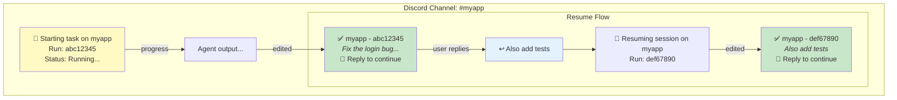

## Multi-Transport Mode

Run both Telegram and Discord simultaneously with a shared bot core:

```bash
# Set all required environment variables
export GLUON_TELEGRAM_TOKEN="telegram-token"
export GLUON_TELEGRAM_USERS="123456789"
export GLUON_DISCORD_TOKEN="discord-token"
export GLUON_DISCORD_GUILD="987654321"
export GLUON_DISCORD_USERS="111222333"

# Run both transports
gluon serve --telegram --discord
```

### Multi-Transport Architecture

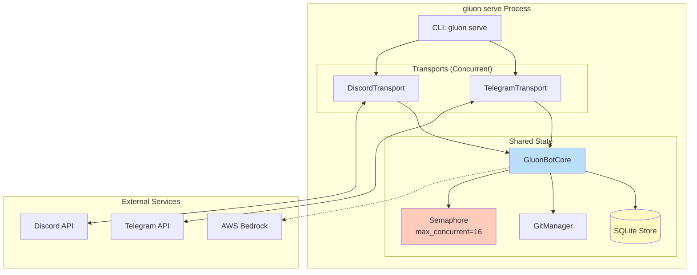

### Cross-Platform Visibility

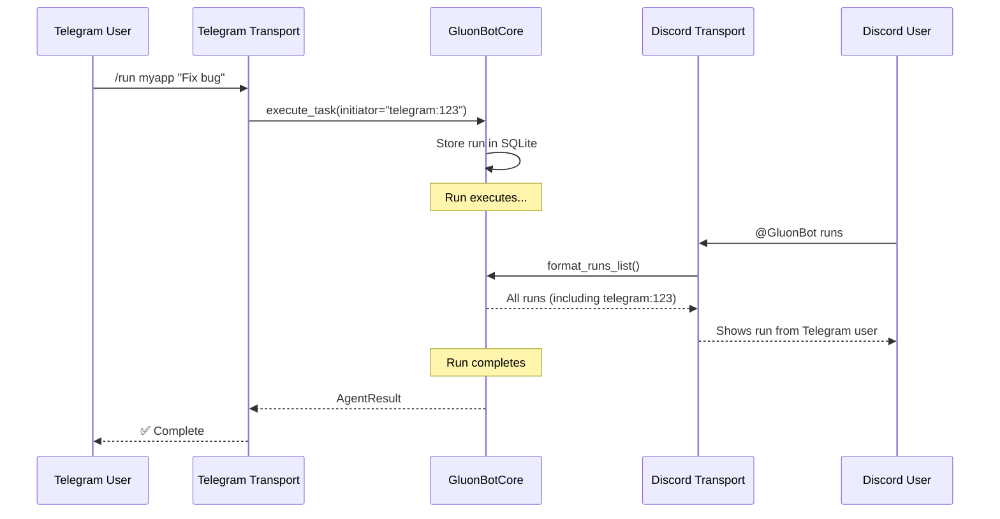

### Features

- **Shared project, session, and run state** - All transports read/write to the same SQLite database
- **Shared git background sync** - Single GitManager instance fetches for all transports
- **Shared concurrency limits** - Global semaphore prevents overload across all platforms
- **Cross-platform run visibility** - Users on any platform can see runs from other platforms

## Configuration

### Environment Variables

**Telegram:**
- `GLUON_TELEGRAM_TOKEN` - Telegram bot token
- `GLUON_TELEGRAM_USERS` - Comma-separated list of allowed Telegram user IDs

**Discord:**
- `GLUON_DISCORD_TOKEN` - Discord bot token
- `GLUON_DISCORD_GUILD` - Discord guild (server) ID
- `GLUON_DISCORD_USERS` - Comma-separated list of allowed Discord user IDs

**AWS Bedrock:**
- AWS credentials for Bedrock models (see `.env.local.example`)

### Model Selection

Gluon uses Claude models via AWS Bedrock:

| Tier | Model | Use Case |
|------|-------|----------|
| `haiku` | claude-haiku-4.5 | Fast, economical tasks |
| `sonnet` | claude-sonnet-4.5 | Balanced performance (default) |
| `opus` | claude-opus-4.5 | Complex, demanding tasks |

```bash
gluon run myapp 'Fix bug' --model haiku
gluon run myapp 'Complex refactor' --model sonnet
gluon run myapp 'Architecture review' --model opus
```

## Git Synchronization

Gluon automatically keeps projects synchronized with remote Git repositories to prevent conflicts when multiple Claude instances work on the same codebase.

### Pre-task Sync Flow

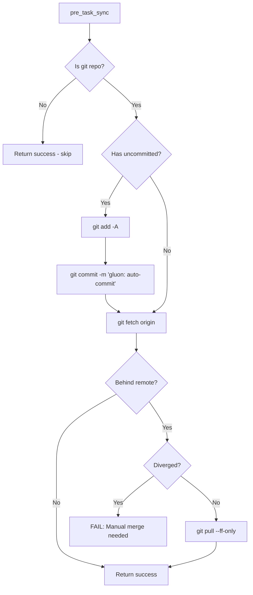

### Post-task Sync Flow

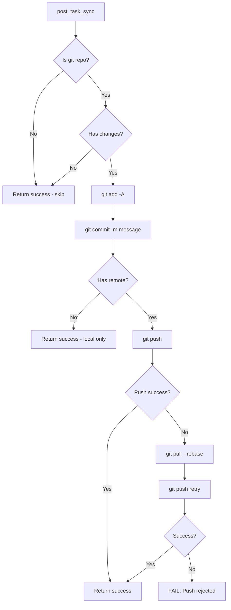

### Background Sync

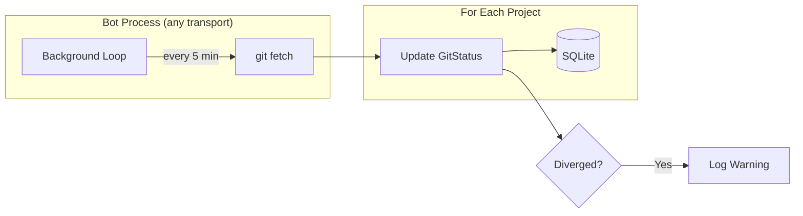

### Automatic Behavior

- **Pre-task**: Before running a task, Gluon will:
  1. Auto-commit any uncommitted changes
  2. Fetch from remote
  3. Fast-forward if behind (fails if diverged)

- **Post-task**: After successful task completion:
  1. Stage and commit all changes
  2. Push to remote

- **Background**: Bot transports (Telegram, Discord) periodically fetch all projects (every 5 minutes) to maintain status awareness

### Configuration

```bash
# Environment variables
GLUON_GIT_ENABLED=true              # Enable/disable git sync (default: true)
GLUON_GIT_SYNC_INTERVAL=300         # Background fetch interval in seconds
GLUON_GIT_AUTO_COMMIT=true          # Auto-commit before/after tasks
GLUON_GIT_AUTO_PUSH=true            # Auto-push after tasks
GLUON_GIT_COMMIT_PREFIX="gluon:"    # Prefix for auto-commit messages
```

### Error Handling

| Scenario | Behavior |
|----------|----------|
| Not a git repo | Skip git operations, proceed normally |
| No remote configured | Commit locally only |
| Diverged branches | **FAIL** pre-task with error |
| Push rejected | Pull with rebase, retry once |
| Network error (fetch) | **WARN** but proceed |

## Image Attachments

Attach images (screenshots, diagrams, mockups) to tasks to provide visual context to the AI agent.

### Upload Methods

1. **Web Dashboard** - Paste with ⌘V in the task creation dialog or resume textarea
2. **API** - POST multipart form to `/api/runs/{run_id}/attachments`

### How It Works

```mermaid
flowchart LR
    subgraph "Upload"
        USER[User pastes image]
        UPLOAD[Upload API]
        HASH[SHA256 Hash]
    end

    subgraph "Storage"
        DEDUP{Duplicate?}
        STORE[~/.gluon/images/]
        DB[(run_images table)]
    end

    subgraph "Task Execution"
        COPY[Copy to worktree]
        AI[Claude Agent sees images]
    end

    USER --> UPLOAD
    UPLOAD --> HASH
    HASH --> DEDUP
    DEDUP -->|No| STORE
    DEDUP -->|Yes| DB
    STORE --> DB
    DB --> COPY
    COPY --> AI
```

### Features

- **Deduplication** - Same image uploaded twice only stored once (SHA256)
- **Worktree Copy** - Images copied to `.gluon-images/` in worktree for AI visibility
- **Gallery View** - View all images attached to a run in the dashboard
- **Supported Formats** - PNG, JPEG, GIF, WebP (max 50MB)

## PR Integration

Gluon integrates with GitHub for PR creation, status tracking, and merging.

### PR Workflow

```mermaid
flowchart TD
    subgraph "Task Completion"
        RUN[Run completes in worktree]
        PUSH[Push branch to remote]
        CREATE[Create PR via gh CLI]
    end

    subgraph "Review Phase"
        PR[PR Open on GitHub]
        STATUS[Poll PR status]
        MERGE_CHECK{Mergeable?}
    end

    subgraph "Actions"
        MERGE[Merge locally + push]
        RESOLVE[AI resolves conflicts]
        CLOSE[PR auto-closed]
    end

    RUN --> PUSH --> CREATE --> PR
    PR --> STATUS --> MERGE_CHECK
    MERGE_CHECK -->|Yes| MERGE --> CLOSE
    MERGE_CHECK -->|Conflicts| RESOLVE --> PUSH
```

### Dashboard PR Features

| Feature | Description |
|---------|-------------|
| **PR Badge** | Shows PR number, status (open/merged/closed), conflict indicator |
| **Create PR** | Button to manually create PR for worktree runs |
| **Merge** | Merge branch locally and push (GitHub auto-closes PR) |
| **Resolve Conflicts** | One-click to resume task with conflict resolution prompt |

### Conflict Resolution

When a PR has merge conflicts, the dashboard shows a "Resolve" button that:

1. Pre-fills a prompt instructing Claude to rebase and resolve conflicts
2. Resumes the session in the existing worktree
3. Claude rebases onto main and intelligently merges changes
4. Force-pushes the resolved branch

## Usage Tracking

Monitor costs and token usage across all runs.

### Dashboard View

The Usage page (`/usage`) shows:

- **Today's Cost** - Total spend today
- **Weekly Cost** - 7-day rolling total
- **Cost by Project** - Breakdown per project
- **Daily Chart** - Visual cost/token trends
- **Run List** - Sortable by cost, tokens, date

### API Endpoints

```
GET /api/usage/summary      # Today/week totals
GET /api/usage/by-project   # Cost per project
GET /api/usage/by-day       # Daily aggregates
GET /api/usage/runs         # Runs with cost data
```

### Tracked Metrics

| Metric | Description |
|--------|-------------|
| `cost_usd` | Total API cost for the run |
| `input_tokens` | Tokens sent to Claude |
| `output_tokens` | Tokens received from Claude |
| `model_used` | Model tier (haiku/sonnet/opus) |

## File Structure

```
~/.gluon/
├── gluon.db          # SQLite database (projects, sessions, runs)
├── images/           # Image attachments (content-addressed)
│   └── {hash[:2]}/
│       └── {hash}.{ext}
└── logs/
    └── <run_id>/     # Per-run log directories
        ├── stdout.log
        ├── stderr.log
        └── messages.jsonl

/tmp/gluon-worktrees/   # Temporary worktrees for isolated tasks
└── wt-{run_id}/
    └── .gluon-images/  # Images copied for AI visibility
```

## Development

```bash
# Run tests
pytest

# Run linter
ruff check src/ tests/

# Format code
ruff format src/ tests/
```

## Web API Reference

The web dashboard exposes a REST API at `/api/*` and WebSocket at `/api/ws`.

### Core Endpoints

| Endpoint | Method | Description |
|----------|--------|-------------|
| `/api/runs` | GET | List runs (filter by project, status, archived) |
| `/api/runs` | POST | Create new run |
| `/api/runs/{id}` | GET | Get run details |
| `/api/runs/{id}/cancel` | POST | Cancel running task |
| `/api/runs/{id}/resume` | POST | Resume with follow-up prompt |
| `/api/runs/{id}/logs` | GET | Get stdout/stderr/messages |
| `/api/runs/{id}/archive` | POST | Archive run (hide from board) |

### Git/PR Endpoints

| Endpoint | Method | Description |
|----------|--------|-------------|
| `/api/runs/{id}/commits` | GET | Commits on run's branch |
| `/api/runs/{id}/files` | GET | Files changed on branch |
| `/api/runs/{id}/create-pr` | POST | Create PR for worktree run |
| `/api/runs/{id}/merge` | POST | Merge branch locally |
| `/api/projects/{id}/conflicts` | GET | Detect merge conflicts |
| `/api/projects/{id}/rebase` | POST | Start rebase operation |

### Image Endpoints

| Endpoint | Method | Description |
|----------|--------|-------------|
| `/api/images/upload` | POST | Upload image (multipart) |
| `/api/images/{id}/file` | GET | Serve image file |
| `/api/runs/{id}/attachments` | GET | List attached images |
| `/api/runs/{id}/attachments` | POST | Attach image to run |

### WebSocket Events

Connect to `/api/ws` for real-time updates:

```json
{"type": "run_created", "run": {...}}
{"type": "run_updated", "run": {...}}
{"type": "log_line", "run_id": "...", "stream": "stdout", "line": "..."}
```

## Limitations

- **No interactive STDIN**: Once a task starts, you cannot send additional input to the running Claude process. To continue work, wait for completion and use `resume` with a new prompt.
- **Single-process concurrency**: The semaphore only limits concurrency within a single process. Multiple CLI `--background` invocations each run in separate processes. However, `gluon serve` runs all transports in a single process with shared concurrency limits.
- **Fire-and-forget execution**: The Claude Agent SDK sends the prompt once via `client.query()` and then only receives responses.
- **Discord requires optional dependency**: Install with `pip install 'gluon-agent[discord]'` to enable Discord support.
- **GitHub CLI required for PRs**: The `gh` CLI must be installed and authenticated for PR creation/merge features.
