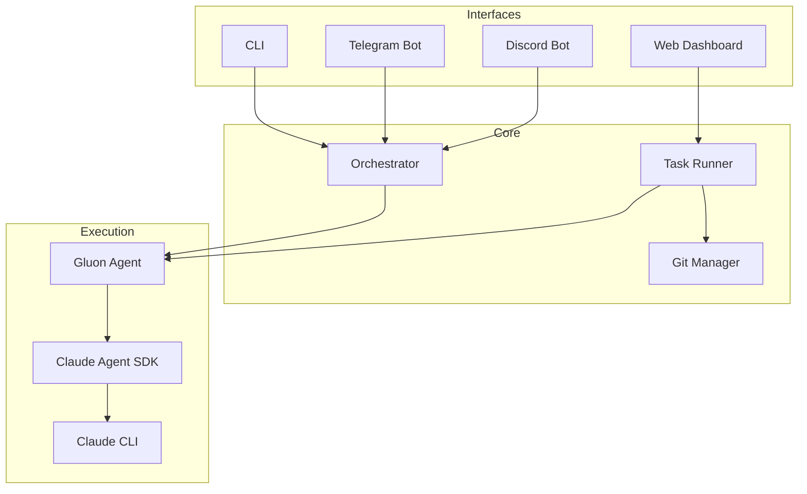

# Gluon Agent

[](https://opensource.org/licenses/MIT)
[](https://www.python.org/downloads/)

AI orchestrator for managing multiple Claude Code agents across projects. Run AI-powered coding tasks with session persistence, git worktree isolation, and real-time monitoring via web dashboard or chat bots.

## Features

- **Multi-Project Management** - Register projects and workspaces, run tasks across your entire codebase
- **Session Resume** - Continue Claude sessions with follow-up prompts
- **Web Dashboard** - React-based Kanban board with real-time WebSocket updates
- **Git Worktree Isolation** - Run tasks in isolated branches without affecting main
- **PR Integration** - Create PRs, detect conflicts, merge directly from dashboard
- **AI Conflict Resolution** - One-click to have Claude rebase and resolve merge conflicts
- **Image Attachments** - Attach screenshots/diagrams to tasks for AI context
- **Usage Tracking** - Monitor costs, tokens, and usage per project
- **Multi-Platform Bots** - Telegram and Discord interfaces with natural language

## Requirements

- Python 3.12+
- [Claude Code CLI](https://github.com/anthropics/claude-code) installed and authenticated
- [uv](https://github.com/astral-sh/uv) package manager
- AWS credentials configured for Bedrock (for Claude models)
- Git (for repository synchronization)
- GitHub CLI (`gh`) - optional, for PR features

## Installation

```bash
# Clone the repository
git clone https://github.com/carrotly-ai/gluon-agent.git
cd gluon-agent

# Create virtual environment and install
uv venv
uv pip install -e .

# Or with optional dependencies
uv pip install -e '.[telegram]'      # Telegram bot support
uv pip install -e '.[discord]'       # Discord bot support
uv pip install -e '.[all]'           # All optional features
```

## Quick Start

### CLI Usage

```bash
# Register a project
gluon project add myapp /path/to/myapp

# Run a coding task
gluon run myapp 'Fix the authentication bug'

# Resume the session with a follow-up
gluon resume myapp 'Also add logging'

# Run in background
gluon run myapp 'Implement user registration' --background

# Check status
gluon status
gluon runs
```

### Web Dashboard

```bash
# Start the web server
gluon web

# Open http://localhost:45866
```

The dashboard provides a Kanban board view of all tasks with real-time updates, PR integration, and usage tracking.

### Telegram Bot

```bash
export GLUON_TELEGRAM_TOKEN="your-bot-token"
gluon bot
```

### Discord Bot

```bash
export GLUON_DISCORD_TOKEN="your-bot-token"
export GLUON_DISCORD_GUILD="your-guild-id"
gluon discord
```

### Multi-Transport

```bash
# Run all interfaces simultaneously
gluon serve --telegram --discord --web
```

## Architecture



## Documentation

| Document | Description |
|----------|-------------|
| [CLI Reference](docs/CLI-REFERENCE.md) | Complete CLI command reference |
| [Web Dashboard](docs/WEB-DASHBOARD.md) | Dashboard features and API |
| [Telegram Bot](docs/TELEGRAM-BOT.md) | Telegram setup and commands |
| [Discord Bot](docs/DISCORD-BOT.md) | Discord setup and commands |
| [Git Operations](docs/GIT-OPERATIONS.md) | Git sync, worktrees, PR integration |
| [Architecture](docs/ARCHITECTURE.md) | System architecture and data models |
| [API Reference](docs/API.md) | REST and WebSocket API |
| [Development](docs/DEVELOPMENT.md) | Contributing and extending |

## Configuration

### Environment Variables

| Variable | Description |
|----------|-------------|
| `GLUON_TELEGRAM_TOKEN` | Telegram bot token |
| `GLUON_TELEGRAM_USERS` | Allowed Telegram user IDs (comma-separated) |
| `GLUON_DISCORD_TOKEN` | Discord bot token |
| `GLUON_DISCORD_GUILD` | Discord guild (server) ID |
| `GLUON_DISCORD_USERS` | Allowed Discord user IDs (comma-separated) |

### Model Selection

```bash
gluon run myapp 'Fix bug' --model haiku    # Fast, economical
gluon run myapp 'Refactor' --model sonnet  # Balanced (default)
gluon run myapp 'Review' --model opus      # Complex tasks
```

## Data Storage

```
~/.gluon/
├── gluon.db          # SQLite database
├── images/           # Image attachments
└── logs/             # Per-run logs
    └── <run_id>/
        ├── stdout.log
        ├── stderr.log
        └── messages.jsonl
```

## License

MIT License - see [LICENSE](LICENSE) for details.

## Contributing

Contributions are welcome! Please read [DEVELOPMENT.md](docs/DEVELOPMENT.md) for guidelines.
