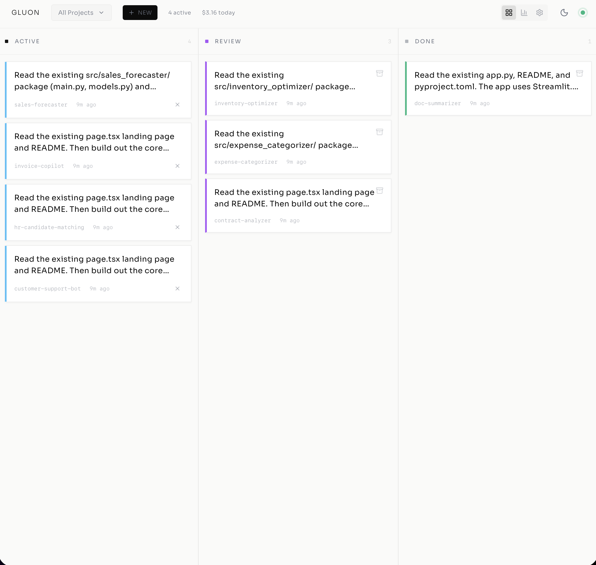
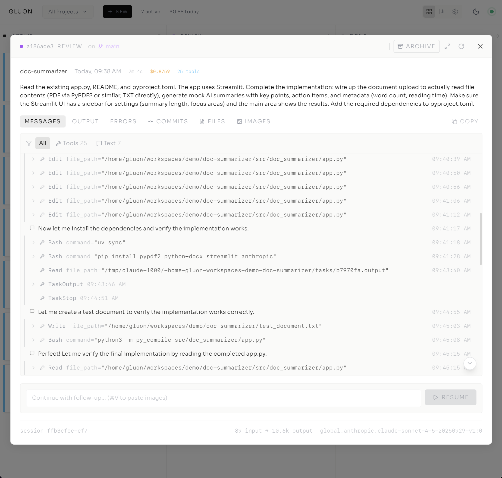
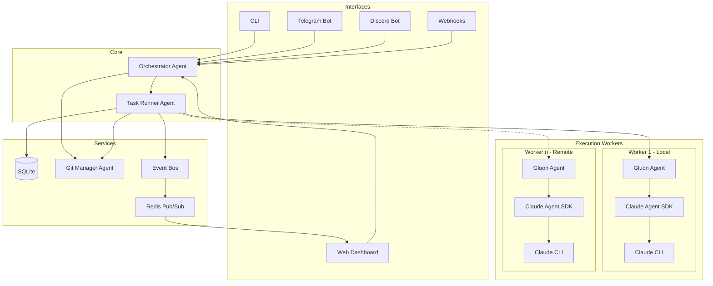

# Gluon Agent

[](https://opensource.org/licenses/MIT)
[](https://www.python.org/downloads/)

**Self-hosted orchestrator for Claude Code.** Run fleets of AI coding agents from your own infrastructure — with session persistence, git worktree isolation, and remote control from CLI, web dashboard, Telegram, or Discord. Agents run in a containerized Docker environment with bubblewrap sandboxing.

**Bring your own backend** — Gluon routes inference through whichever Claude backend your organisation already pays for: **AWS Bedrock**, **Google Vertex AI**, **Microsoft Foundry** (Azure AI Foundry), or the direct **Anthropic API** / Claude CLI subscription. Switch between them with one command (`gluon provider <name>`) or from the Settings page. See [`docs/LLM-PROVIDER.md`](docs/LLM-PROVIDER.md) for the full provider guide.





> See all screenshots in [docs/SCREENSHOTS.md](docs/SCREENSHOTS.md)

## Table of Contents

- [Why Gluon?](#why-gluon)
- [Docker Quickstart](#docker-quickstart)
- [Installation (from source)](#installation-from-source)
- [Quick Start (CLI)](#quick-start-cli-reference)
- [Choosing Your LLM Backend](#choosing-your-llm-backend-detailed-guide)
- [Features](#features)
- [Web Dashboard](#web-dashboard-docs--api)
- [Chat Bots](#chat-bots-telegram--discord)
- [Architecture](#architecture-docs)
- [Model Selection](#model-selection)
- [Documentation](#documentation)
- [Data Storage](#data-storage)
- [Environment Variables](#environment-variables)
- [Remote Access](#remote-access)
- [License](#license)

## Why Gluon?

Three things most Claude Code orchestrators don't give you:

**1. You own the agents.** Docker compose, your server, your data. `~/.gluon`
holds the full SQLite database and every run log — nothing leaves your
infrastructure. Mount `~/.claude` and `~/.aws` from the host and the container
uses your existing credentials.

**2. Pluggable LLM backends.** Gluon ships with a provider abstraction that
speaks AWS Bedrock, Google Vertex AI, Microsoft Foundry, and the direct
Anthropic API. Use whichever your organisation already bills through —
Gluon exports the right `CLAUDE_CODE_USE_*` flag, wires in the right
credentials, and resolves the right model IDs automatically. Pay per-token
at your cloud's rates, cap spend per run, and keep running if any one
provider changes plans underfoot.

**3. Control from anywhere.** Kick off a task from your desk via CLI or web,
approve the PR from your phone via Telegram, review failures in Discord while
you're at lunch. All four transports talk to the same orchestrator and see
the same runs.

### Well-suited for

- Running several feature implementations simultaneously across a project
- Delegating bug fixes to AI agents while you focus on architecture
- Managing a backlog of AI-assisted tasks across multiple projects
- Teams that want visibility into AI-assisted development work
- Operators who need Bedrock-, Vertex-, or Foundry-native deployment for compliance or cost reasons

### Gluon vs other Claude Code orchestrators

|  | Gluon | Claude Deck | claudectl | KingCoding |
| --- | --- | --- | --- | --- |
| Self-hosted | ✅ | ✅ | ✅ | ❌ |
| Multi-cloud LLM backend (Bedrock + Vertex + Foundry + direct) | ✅ | ❌ | ❌ | ❌ |
| Multi-transport (CLI+TG+Discord+Web) | ✅ | Web only | CLI only | Mobile only |
| Session resume (fork_session) | ✅ | — | — | — |
| Git worktree isolation + GC | ✅ | — | Partial | — |
| Witness auto-recovery | ✅ | — | — | — |
| Background execution | ✅ | ✅ | ✅ | ✅ |
| Docker one-liner | ✅ | ✅ | — | — |
| Work queue (self-propelling) | ✅ | — | Partial | — |

*Table reflects published features as of 2026-04. See each project's README
for current state; this is not a sponsored comparison.*

## No really, why the name Gluon?

Because every team needs a fundamental force for getting things (and code) to stick together.

In physics, a gluon is a massless, spin-1 gauge boson — in plain speak, it's the subatomic "glue" holding quarks together, keeping protons, neutrons, and the heart of atoms from flying apart like a badly managed project. Gluons do the heavy lifting in quantum chromodynamics, ensuring that the universe, as well as your software, doesn't unravel at the seams.

So, like its namesake, Gluon binds together your scattered projects and tasks, orchestrating collaboration with the (strong) force of a particle accelerator and the finesse of quantum mechanics. Strong interaction? That's our vibe.

## Docker Quickstart

Run Gluon from a pre-built image — no clone or build required:

```bash
# 1. Download the compose file and env template
curl -fsSL https://raw.githubusercontent.com/carrotly-ai/gluon-agent/main/docker-compose.yml -o docker-compose.yml
curl -fsSL https://raw.githubusercontent.com/carrotly-ai/gluon-agent/main/.env.example -o .env

# 2. Edit .env with your credentials
#    Required (all backends): PUID, PGID, GH_TOKEN, GIT_USER_NAME, GIT_USER_EMAIL
#    Then pick ONE provider block (Bedrock is the default):
#      Bedrock  → AWS_REGION + AWS_BEARER_TOKEN_BEDROCK (or AWS access keys)
#      Anthropic → ANTHROPIC_API_KEY (or `claude login` session at ~/.claude)
#      Vertex    → ANTHROPIC_VERTEX_PROJECT_ID + CLOUD_ML_REGION + gcloud ADC
#      Foundry   → ANTHROPIC_FOUNDRY_RESOURCE + (API key or Entra ID via `az login`)
#    Find your UID/GID with: id -u && id -g

# 3. Start the container
docker compose up -d

# 4. Open the dashboard
open http://localhost:45866
```

The image is published to `ghcr.io/carrotly-ai/gluon-agent:latest` on every push to `main`.

> **Prerequisites:** Docker, a [Claude Code CLI](https://github.com/anthropics/claude-code) auth session at `~/.claude`, and cloud credentials for your chosen provider:
>
> | Provider | Credentials |
> |---|---|
> | AWS Bedrock (default) | `~/.aws` (mounted read-only) |
> | Anthropic Direct | `ANTHROPIC_API_KEY` env var or `~/.claude` login |
> | Google Vertex AI | `~/.config/gcloud` (run `gcloud auth application-default login`) |
> | Microsoft Foundry | `~/.azure` (run `az login`) or `ANTHROPIC_FOUNDRY_API_KEY` env var |

**Docker Features:**
- **PUID/PGID Support** - Container adapts to any host user's UID/GID — no permission issues with bind mounts
- **HTTPS Git Authentication** - Uses `GH_TOKEN` for GitHub access (no SSH keys needed)
- **MCP Server Auto-Registration** - Mount `.mcp.json` to auto-register MCP servers on startup
- **Pre-built Image** - `ghcr.io/carrotly-ai/gluon-agent:latest` updated on every push to `main`

See [DOCKER.md](docs/DOCKER.md) for detailed deployment instructions, building from source, and `docker-compose.dev.yml` for local development.

## Installation (from source)

```bash
# Clone the repository
git clone https://github.com/carrotly-ai/gluon-agent.git
cd gluon-agent

# Create virtual environment and install
uv venv
uv pip install -e .

# Or install with bot support
uv pip install -e '.[telegram]'      # Telegram bot
uv pip install -e '.[discord]'       # Discord bot
uv pip install -e '.[all]'           # All features
```

**Requirements:** Python 3.12+, [Claude Code CLI](https://github.com/anthropics/claude-code) installed and authenticated, [uv](https://github.com/astral-sh/uv) package manager, credentials for your chosen LLM backend (AWS / GCP / Azure / Anthropic API key), Git, GitHub CLI (`gh`) optional.

## Quick Start ([CLI Reference](docs/CLI-REFERENCE.md))

### 1. Register a Project

```bash
gluon project add myapp ~/projects/myapp
```

### 2. Run a Task

```bash
# Interactive mode (see output in terminal)
gluon run myapp 'Fix the authentication bug in login.py'

# Background mode (monitor via dashboard)
gluon run myapp 'Implement user registration' --background

# Use git worktree for isolated branch
gluon run myapp 'Add dark mode support' --background --worktree
```

### 3. Run a Formula (Multi-Step Workflow)

```bash
# Full feature lifecycle: Plan → Implement → Test → Review
gluon formula run feature myapp --var description="Add dark mode support"

# Bug diagnosis and fix: Diagnose → Fix → Test
gluon formula run bugfix myapp --var description="Login fails on expired tokens"
```

### 4. Resume with Follow-up

```bash
# Continue the conversation
gluon resume myapp 'Also add unit tests for the new code'
```

### 5. Monitor Progress

```bash
# Check all runs
gluon runs

# View specific run logs
gluon logs <run-id>
gluon logs <run-id> -f  # Follow live
```

## Choosing Your LLM Backend ([detailed guide](docs/LLM-PROVIDER.md))

Gluon talks to Claude through a pluggable provider abstraction. Pick whichever backend your organisation already uses — every feature (cost tracking, witness, approvals, budgets, session resume) works identically across all four.

```bash
# View current provider + model mappings
gluon provider

# Switch backend (persists to the DB)
gluon provider bedrock      # AWS Bedrock (default)
gluon provider anthropic    # Direct Anthropic API / Claude CLI subscription
gluon provider vertex       # Google Vertex AI
gluon provider foundry      # Microsoft Foundry (Azure AI Foundry)
```

Or set `GLUON_LLM_PROVIDER=<name>` in `.env`, or toggle from the dashboard Settings page.

| Backend | Model ID scheme | Credentials |
|---|---|---|
| **AWS Bedrock** (default) | `global.anthropic.claude-sonnet-4-6` | AWS env or `~/.aws` |
| **Anthropic Direct** | `claude-sonnet-4-6` | `ANTHROPIC_API_KEY` or `claude login` |
| **Google Vertex AI** | `claude-sonnet-4-6` / `claude-haiku-4-5@20251001` | GCP ADC (`gcloud auth application-default login`) |
| **Microsoft Foundry** | `claude-sonnet-4-6` (your Azure deployment name) | `ANTHROPIC_FOUNDRY_API_KEY` or `az login` |

Gluon automatically exports the matching `CLAUDE_CODE_USE_*` flag into the Claude Code subprocess and resolves model IDs to the active provider's scheme, so the same `--model sonnet` works everywhere.

**Resolution order:** explicit argument → `GLUON_LLM_PROVIDER` env var → `llm_provider` setting in the DB → default `bedrock`.

## Features

### Core Capabilities ([CLI Reference](docs/CLI-REFERENCE.md))
- **Multi-Project Management** - Register projects and workspaces, run tasks across your entire codebase
- **Session Resume** - Continue Claude sessions with follow-up prompts, keeping full context
- **Unified Task Tracking** - All tasks visible across all interfaces (CLI, Web, Telegram, Discord)
- **Model Selection** - Choose between Haiku (fast), Sonnet (balanced), or Opus (complex tasks)
- **Formula Workflows** - YAML-defined multi-step pipelines (Plan → Implement → Test → Review) that execute as a single unified run
- **Blueprint Validation** - Automatic lint auto-fix, lint loop, and test gates after agent completion
- **Work Queue** - Shared task queue for batching and scheduling work items across projects
- **Merge Queue** - Sequential PR merge processing with conflict detection and retry
- **System Diagnostics** - Built-in `doctor` command for health checks and auto-fix

### Security & Isolation ([Docker](docs/DOCKER.md))
- **OS-Level Sandboxing** - Each agent runs inside a [bubblewrap](https://github.com/containers/bubblewrap) sandbox (Linux) or `sandbox-exec` (macOS), restricting filesystem access to the git worktree
- **Git Worktree Isolation** - Every task operates in its own worktree so agents never touch your main branch or other tasks' files
- **Minimal Docker Runtime** - `python:3.12-slim-bookworm` base with non-root `gluon` user; no full host filesystem access
- **Scoped Volume Mounts** - Only specific directories are mounted into the container (`~/.claude`, `~/.gluon`, `~/workspaces`), with common credentials (`~/.aws`, `~/.config/gh`) mounted read-only
- **Browser Session Isolation** - Each agent run gets its own `agent-browser` session, preventing cross-task cookie/state leakage
- **Sandbox-Aware Tool Approval** - When sandboxed, bash commands are auto-approved (the sandbox enforces boundaries), while git is excluded from the sandbox to allow commits and pushes
- **Resource Limits** - Docker Compose enforces CPU and memory caps (default 8 CPU / 12 GB) to prevent runaway agents from starving the host

### Multi-User Authentication (Optional)
Self-hosted Gluon defaults to **single-user mode** — no login screen, every action runs as the implicit `SYSTEM_USER`. Flip `GLUON_AUTH_ENABLED=true` and Gluon becomes a true multi-user system:

- **Local password auth** - argon2id-hashed credentials in SQLite, DB-backed sessions (not JWT) with rolling TTL and httpOnly cookies.
- **OIDC / SSO** ([detailed setup](docs/AUTH-OIDC.md)) - Plug in Auth0, Google Workspace, AWS Cognito, Microsoft Entra ID, Okta, or any spec-compliant IdP. Auto-provision is opt-in with a required email-domain allowlist. Coexists with local — typical setup is OIDC for humans + a few local accounts for automation.
- **Three roles** - `admin` (full control), `operator` (create runs, decide approvals), `viewer` (read-only).
- **Per-row attribution** - every `ExecutionRun`, `OrchestratorTask`, and `PendingApproval` records *who* created or decided it, surfaced in the dashboard and the audit trail.
- **Web dashboard** - login page (auto-detects available providers and shows password form, "Sign in with X" button, or both), header user-menu with avatar + role badge + change-password, admin-only `/admin/users` screen (list / create / edit role / disable / reset password).
- **Self-serve chat linking** - users bind their Telegram or Discord identity to their Gluon account from the dashboard. Generate a one-time code, send `/link <code>` (Telegram) or `link-account <code>` (Discord) to the bot, done. Approvals from chat are then attributed to the right user.
- **CLI bootstrap** - seed the first admin without a chicken-and-egg login: `gluon user add alice --role admin` (local) or `gluon user add alice --auth-provider oidc --email alice@org.example --role admin` (OIDC). Other commands: `gluon user list / show / disable / enable / set-role / set-password`.
- **Backwards-compatible** - when `GLUON_AUTH_ENABLED=false`, no login UI, no role checks, attribution columns stay NULL. Existing single-user installs see zero behaviour change.

### Web Dashboard ([docs](docs/WEB-DASHBOARD.md) · [screenshots](docs/SCREENSHOTS.md))
- **Kanban Board** - Drag-and-drop task management with Queue, Running, Review, and Done columns
- **Real-Time Log Streaming** - WebSocket-powered live log output with collapsible tool call visualization
- **Run Details Modal** - View messages, tool calls, commits, file diffs, and attachments
- **Notification Center** - Bell icon with unread count, persistent notification history, mark read/unread
- **Global Question Modal** - AskUserQuestion prompts appear as modal overlays from any page with run context (project, branch, task prompt), countdown timer, and multi-select/single-select support
- **Full-Screen Mode** - Expanded view for detailed run analysis
- **Message Filtering** - Filter by tools, text, or errors with counts
- **Toast Notifications** - Instant feedback for merge and PR actions
- **Browser Notifications** - Desktop push notifications for completed/failed runs and pending questions when tab is unfocused
- **Recovery UI** - Visual indicator when recovering interrupted runs with progress tracking
- **Activity Feed** - Cross-agent event stream showing run completions, PR actions, and system events
- **Work Queue Panel** - Queue and schedule tasks across projects from the dashboard
- **Merge Queue Panel** - Monitor and manage sequential PR merges with conflict status
- **Formula Step Progress** - Violet progress bar on run cards showing current step in multi-step workflows
- **Witness Health Indicators** - Real-time health classification dots on running tasks (healthy, slow, looping, stuck)
- **Input Required Badges** - Visual indicators on run cards when agents are waiting for user input

### Progressive Web App (PWA)
- **Installable App** - Install on mobile/desktop for native-like experience
- **Offline Support** - Service worker caching with offline state detection
- **Pull-to-Refresh** - Native mobile gesture for refreshing in PWA mode
- **Animated Offline Indicator** - Friendly visual feedback when connection lost
- **Update Notifications** - Banner alerts when new version is available

### Git Integration ([docs](docs/GIT-OPERATIONS.md))
- **Worktree Isolation** - Each task runs in its own git branch without affecting main
- **PR Integration** - Create PRs directly from the dashboard with one click
- **Conflict Detection** - Automatic detection of merge conflicts with file-level details
- **AI Conflict Resolution** - One-click to have Claude rebase and resolve merge conflicts
- **Local & Remote Support** - Works with both GitHub repos and local-only repositories

### Chat Bot Features ([Telegram](docs/TELEGRAM-BOT.md) · [Discord](docs/DISCORD-BOT.md))
- **Natural Language Interface** - Chat with Gluon using natural language commands
- **40+ MCP Tools** - Comprehensive tools for project, git, branch, and conflict management
- **Discord DM Support** - Run tasks via direct messages with project specifiers (`project:myapp`)
- **Model Selection via Flags** - Use `--model opus` in Discord/Telegram to specify models
- **Channel Topic Config** - Configure default project and model via Discord channel topics
- **Tool Call Visualization** - See agent tool calls in real-time during execution

### Ralph Loop (Autonomous Mode) ([docs](docs/RALPH-LOOP.md))
- **Autonomous Execution** - Claude works continuously until task completion
- **Completion Detection** - RALPH_STATUS blocks, keyword matching, TODO file parsing
- **Circuit Breaker** - 3-state machine prevents runaway loops (CLOSED → HALF_OPEN → OPEN)
- **Rate Limiting** - Hourly API call limits and optional cost caps
- **Supervision Daemon** - Background auto-resume for tasks in REVIEW status
- **Session Continuity** - Claude maintains context across loop iterations

```bash
# Start autonomous ralph run
gluon run myapp "Implement auth system" --ralph --max-loops 50 --max-cost 10

# Monitor progress
gluon ralph status <run_id>

# Start supervisor daemon for auto-resume
gluon supervisor start
```

### Formula Workflows

YAML-defined multi-step pipelines that execute as a single unified run. Each step gets its own Claude session but shares the same git worktree, run ID, and cost tracking.

**Built-in formulas:**

| Formula | Steps | Description |
|---------|-------|-------------|
| `feature` | Plan → Implement → Test → Review | Full feature development lifecycle |
| `bugfix` | Diagnose → Fix → Test | Bug diagnosis and resolution |

```bash
# List available formulas
gluon formula list

# Run a feature formula
gluon formula run feature myapp --var description="Add user authentication"

# Run a bugfix formula
gluon formula run bugfix myapp --var description="Login fails on expired tokens"

# Validate a custom formula template
gluon formula validate my-formula.yml
```

**How it works:**
1. The first step creates an `ExecutionRun` in a git worktree
2. Subsequent steps resume the same run with `fresh_session=True` — new Claude session, same worktree
3. The Kanban board shows a single card with a step progress bar (e.g., "Step 2/4 Implement")
4. Cost accumulates across all steps on the single run

**Custom formulas:** Place `.yml` files in `src/gluon/formulas/` or a project-level `formulas/` directory.

### Blueprint Validation

Automatic code quality gates that run after each agent completion (for `standard` profile steps):

1. **Auto-fix** — Runs the project's linter with auto-fix (e.g., `ruff check --fix && ruff format .`)
2. **Lint loop** — If lint errors remain, the agent is resumed to fix them (up to 3 attempts)
3. **Test gate** — Runs the project's test suite; failures trigger an agent resume to fix

Blueprint validation is enabled by default and can be toggled in the web dashboard Settings. It only runs for `standard` profile steps — `planning` and `review` profiles skip validation.

### Work Queue & Merge Queue

**Work Queue** — Batch and schedule tasks across projects:

```bash
gluon queue add myapp "Implement feature X"
gluon queue list
gluon queue cancel <item-id>
```

**Merge Queue** — Sequential PR merge processing with conflict detection:

```bash
gluon merge list
gluon merge retry <entry-id>
gluon merge cancel <entry-id>
```

Both queues are accessible from the web dashboard with real-time WebSocket updates.

### Witness Health Monitor

Background health classification for running agents. The witness periodically evaluates agent behavior and classifies runs as:

| Classification | Meaning |
|---------------|---------|
| `healthy` | Normal progress |
| `slow` | Below expected throughput |
| `looping` | Repeating similar actions |
| `stuck` | No meaningful progress |
| `zombie` | Process alive but unresponsive |

```bash
gluon witness <run-id>
```

Health status appears as colored dots on running task cards in the web dashboard.

### System Diagnostics

```bash
# Check system health
gluon doctor

# Auto-fix fixable issues
gluon doctor --fix
gluon doctor fix
```

Checks Claude CLI availability, AWS credentials, database integrity, disk space, and more.

### Activity Log

Cross-agent event stream showing run completions, PR actions, merge queue events, and system events:

```bash
gluon activity
```

Also available as a dedicated panel in the web dashboard.

### Agent Teams (Experimental)

Leverage Claude Code's [Agent Teams](https://code.claude.com/docs/en/agent-teams) capability to have a lead agent coordinate multiple subagents working in parallel on different parts of a task. Gluon tracks subagent lifecycle via SDK hooks and keeps the session alive until all team members finish, then prompts the lead agent to synthesize results.

**How it works:**
1. You submit a prompt that describes a multi-part task
2. Claude spawns subagents via the `Task` tool, each working on a portion concurrently
3. Gluon's `SubagentTracker` monitors start/stop events to know when team members finish
4. The lead agent synthesizes results from all subagents into a cohesive output

**Enable globally** via the web dashboard settings, or **per-task** via the API:

```bash
# Per-task via API
curl -X POST http://localhost:45866/api/runs \
  -H 'Content-Type: application/json' \
  -d '{"project_id": "myapp", "prompt": "...", "agent_teams": true}'
```

**Prompt structure for best results:**

Agent teams work best when the prompt clearly decomposes into parallel subtasks. Structure prompts with explicit deliverables that subagents can own independently:

```
Refactor the authentication module:

1. **API layer** — Update route handlers in src/api/auth.py to use the new token format
2. **Database layer** — Migrate the sessions table schema and update the ORM models
3. **Tests** — Add integration tests covering the new token flow and session expiry

Each area can be worked on independently. Coordinate at the end to ensure consistency.
```

Tips:
- List 2-5 distinct subtasks that can run concurrently without blocking each other
- Mention shared files or interfaces that subagents should be aware of
- End with a synthesis instruction so the lead agent knows to reconcile the work
- Pair with `--model opus` for the lead agent to get better task decomposition

> See the [Claude Code Agent Teams documentation](https://code.claude.com/docs/en/agent-teams) for full details on how the underlying SDK orchestrates subagents.

### Browser Automation & Screenshots
- **agent-browser** - Pre-installed Chromium for headless browser automation (open, click, type, screenshot)
- **Screenshot Interception** - Screenshots captured via `agent-browser screenshot` are automatically stored as run attachments
- **Inline Screenshot Messages** - Screenshots appear as clickable thumbnails in both the Messages and Images tabs
- **System Fonts** - Docker image includes Liberation, Noto CJK, DejaVu, and FreeFonts for high-quality screenshot rendering

### Additional Features
- **Image Attachments** - Paste screenshots/diagrams for AI context (Cmd+V in resume prompt)
- **Usage Tracking** - Monitor costs, tokens, and usage per project
- **Docker Deployment** - Full containerized deployment with docker-compose
- **CI/CD Workflows** - GitHub Actions for CI and Docker image publishing
- **Log Persistence** - Stdout, stderr, and structured message logs for every run
- **Mobile Optimized** - iOS Safari zoom prevention, touch-friendly interactions
- **Context Overflow Recovery** - Automatic recovery when agent exceeds context window (`gluon recover`)
- **Log Cleanup** - Retention-based cleanup of old log files (`gluon cleanup`)
- **Disk Stats** - Monitor `~/.gluon` disk usage (`gluon stats`)

## Web Dashboard ([docs](docs/WEB-DASHBOARD.md) · [API](docs/API.md))

```bash
gluon web
# Open http://localhost:45866
```

The dashboard provides:

| View | Description |
|------|-------------|
| **Kanban Board** | Queue → Running → Review → Done columns with drag-and-drop |
| **Activity Feed** | Cross-agent event stream (run completions, PRs, merges) |
| **Work Queue** | Batch and schedule tasks across projects |
| **Merge Queue** | Sequential PR merge processing with conflict status |
| **Settings** | Configure models, blueprints, agent teams, and more |

**Run Details** include:
- Live message stream with tool call visualization
- Git commits and file diffs
- Image attachments and browser screenshots
- Cost and token usage tracking
- Formula step progress (for multi-step workflows)
- One-click PR creation and merge
- Witness health classification

## Chat Bots ([Telegram](docs/TELEGRAM-BOT.md) · [Discord](docs/DISCORD-BOT.md))

### Telegram

```bash
export GLUON_TELEGRAM_TOKEN="your-bot-token"
export GLUON_TELEGRAM_USERS="123456789"  # Allowed user IDs
gluon bot
```

### Discord

```bash
export GLUON_DISCORD_TOKEN="your-bot-token"
export GLUON_DISCORD_GUILD="your-guild-id"
gluon discord
```

### Natural Language Interface

Chat with Gluon using natural language:

> "Run a task on myapp to fix the login bug"
> "What's the status of my running tasks?"
> "Show me the logs for the last task"

## Architecture ([docs](docs/ARCHITECTURE.md))



## Model Selection

| Model | Best For | Flag |
|-------|----------|------|
| **Haiku** | Quick fixes, simple tasks | `--model haiku` |
| **Sonnet** | Most coding tasks (default) | `--model sonnet` |
| **Opus 4.6** | Complex refactoring, architecture (latest) | `--model opus` |
| **Opus 4.5** | Previous generation Opus | `--model opus-4.5` |

```bash
gluon run myapp 'Fix typo' --model haiku
gluon run myapp 'Implement OAuth' --model sonnet
gluon run myapp 'Redesign database schema' --model opus
```

## Documentation

| Document | Description |
|----------|-------------|
| [Changelog](CHANGELOG.md) | Release history and notable changes |
| [CLI Reference](docs/CLI-REFERENCE.md) | Complete CLI command reference |
| [LLM Provider Guide](docs/LLM-PROVIDER.md) | Bedrock / Anthropic / Vertex / Foundry configuration |
| [Web Dashboard](docs/WEB-DASHBOARD.md) | Dashboard features and API |
| [Ralph Loop](docs/RALPH-LOOP.md) | Autonomous execution mode and supervision |
| [Agent Teams](https://code.claude.com/docs/en/agent-teams) | Claude Code multi-agent coordination (external) |
| [Git Operations](docs/GIT-OPERATIONS.md) | Worktrees, PR integration, conflict resolution |
| [Telegram Bot](docs/TELEGRAM-BOT.md) | Telegram setup and commands |
| [Discord Bot](docs/DISCORD-BOT.md) | Discord setup and commands |
| [Docker](docs/DOCKER.md) | Container deployment |
| [Architecture](docs/ARCHITECTURE.md) | System architecture and data models |
| [API Reference](docs/API.md) | REST and WebSocket API |
| [Screenshots](docs/SCREENSHOTS.md) | Web UI and mobile PWA gallery |
| [Development](docs/DEVELOPMENT.md) | Contributing and extending |

## Data Storage

```
~/.gluon/
├── gluon.db          # SQLite database
├── images/           # Image attachments
└── logs/             # Per-run logs
    └── <run_id>/
        ├── stdout.log
        ├── stderr.log
        └── messages.jsonl
```

## Environment Variables

### LLM Provider

| Variable | Description |
|----------|-------------|
| `GLUON_LLM_PROVIDER` | Provider name: `bedrock` (default), `anthropic`, `vertex`, or `foundry` |
| `ANTHROPIC_MODEL` | Override model for all runs |
| `ANTHROPIC_DEFAULT_OPUS_MODEL` | Pin a specific Opus version for third-party deployments |
| `ANTHROPIC_DEFAULT_SONNET_MODEL` | Pin a specific Sonnet version |
| `ANTHROPIC_DEFAULT_HAIKU_MODEL` | Pin a specific Haiku version |

**Bedrock** — `AWS_REGION`, `AWS_BEARER_TOKEN_BEDROCK` (or standard AWS creds), `ANTHROPIC_BEDROCK_BASE_URL` (optional gateway).

**Anthropic Direct** — `ANTHROPIC_API_KEY`, `ANTHROPIC_BASE_URL` (optional). Or use `claude login` for a CLI session.

**Google Vertex AI** — `ANTHROPIC_VERTEX_PROJECT_ID`, `CLOUD_ML_REGION` (e.g. `global` / `us-east5`), `GOOGLE_APPLICATION_CREDENTIALS` (optional), `ANTHROPIC_VERTEX_BASE_URL` (optional gateway).

**Microsoft Foundry** — `ANTHROPIC_FOUNDRY_RESOURCE` (or `ANTHROPIC_FOUNDRY_BASE_URL`), `ANTHROPIC_FOUNDRY_API_KEY` (or Entra ID via `az login`).

See [`docs/LLM-PROVIDER.md`](docs/LLM-PROVIDER.md) for the full reference.

### Bot Configuration

| Variable | Description |
|----------|-------------|
| `GLUON_TELEGRAM_TOKEN` | Telegram bot token |
| `GLUON_TELEGRAM_USERS` | Allowed Telegram user IDs (comma-separated) |
| `GLUON_DISCORD_TOKEN` | Discord bot token |
| `GLUON_DISCORD_GUILD` | Discord guild (server) ID |
| `GLUON_DISCORD_USERS` | Allowed Discord user IDs (comma-separated) |

### Docker-Specific

| Variable | Description |
|----------|-------------|
| `PUID` | Host user UID — container runs as this user (default `1000`, find with `id -u`) |
| `PGID` | Host group GID — container runs as this group (default `1000`, find with `id -g`) |
| `GH_TOKEN` | GitHub token for HTTPS authentication (replaces SSH) |
| `GIT_USER_NAME` | Git commit author name |
| `GIT_USER_EMAIL` | Git commit author email |
| `VERCEL_TOKEN` | Vercel API token (optional, used as fallback when not set in Settings UI) |

## Remote Access

Run Gluon on a home server (e.g., Mac mini) and access it securely from anywhere using [Tailscale](https://tailscale.com), a zero-config VPN:

1. Install Tailscale on your server and devices
2. Start Gluon: `gluon web` or `docker compose up -d`
3. Access the dashboard from any device via your Tailscale IP: `http://your-server:45866`

This enables monitoring and managing AI coding tasks from your phone, tablet, or laptop while on the go - with the PWA providing a native app-like experience on mobile.

## Credits & Inspiration

I was an early user of Vibe Kanban ([https://www.vibekanban.com](https://www.vibekanban.com)) and was inspired by the concept of a Kanban board for AI-assisted development. I wanted to create a similar experience for Gluon, but with a focus on multi-project orchestration.

## License

MIT License - see [LICENSE](LICENSE) for details.

## Contributing ([docs](docs/DEVELOPMENT.md))

Contributions are welcome! Please read [DEVELOPMENT.md](docs/DEVELOPMENT.md) for guidelines.
