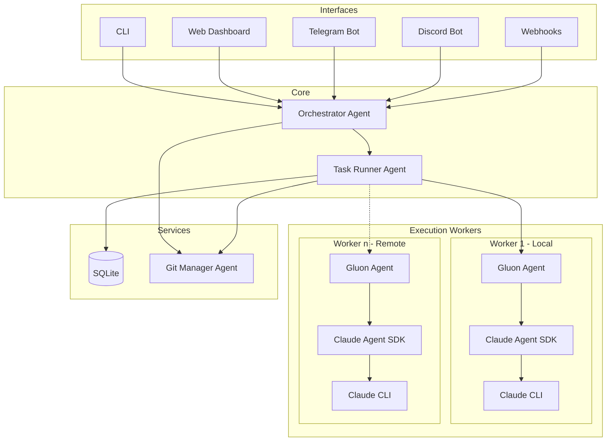

# Gluon Agent

[](https://opensource.org/licenses/MIT)
[](https://www.python.org/downloads/)

AI orchestrator for managing multiple Claude Code agents across projects. Run AI-powered coding tasks with session persistence, git worktree isolation, and real-time monitoring via web dashboard or chat interface (Telegram, Discord). It runs in a containerized Docker environment each instance of the agent is isolated with bubblewrap sandboxing.


> See all screenshots in [docs/SCREENSHOTS.md](docs/SCREENSHOTS.md)

## Why Gluon?

**Run multiple AI coding agents in parallel**, each in isolated git branches, while monitoring progress from a single dashboard. Deploy with Docker for containerized execution - AI agents run in isolated environments, keeping your host system secure. Perfect for:

- Running several feature implementations simultaneously
- Delegating bug fixes to AI agents while you focus on architecture
- Managing a backlog of AI-assisted tasks across multiple projects
- Teams wanting visibility into AI-assisted development work

## No really, why the name Gluon?

Because every team needs a fundamental force for getting things (and code) to stick together.

In physics, a gluon is a massless, spin-1 gauge boson — in plain speak, it's the subatomic “glue” holding quarks together, keeping protons, neutrons, and the heart of atoms from flying apart like a badly managed project. Gluons do the heavy lifting in quantum chromodynamics, ensuring that the universe, as well as your software, doesn’t unravel at the seams.

So, like its namesake, Gluon binds together your scattered projects and tasks, orchestrating collaboration with the (strong) force of a particle accelerator and the finesse of quantum mechanics. Strong interaction? That's our vibe.

## Features

### Core Capabilities ([CLI Reference](docs/CLI-REFERENCE.md))
- **Multi-Project Management** - Register projects and workspaces, run tasks across your entire codebase
- **Session Resume** - Continue Claude sessions with follow-up prompts, keeping full context
- **Unified Task Tracking** - All tasks visible across all interfaces (CLI, Web, Telegram, Discord)
- **Model Selection** - Choose between Haiku (fast), Sonnet (balanced), or Opus (complex tasks)

### Security & Isolation ([Docker](docs/DOCKER.md))
- **OS-Level Sandboxing** - Each agent runs inside a [bubblewrap](https://github.com/containers/bubblewrap) sandbox (Linux) or `sandbox-exec` (macOS), restricting filesystem access to the git worktree
- **Git Worktree Isolation** - Every task operates in its own worktree so agents never touch your main branch or other tasks' files
- **Minimal Docker Runtime** - `python:3.12-slim-bookworm` base with non-root `gluon` user; no full host filesystem access
- **Scoped Volume Mounts** - Only specific directories are mounted into the container (`~/.claude`, `~/.gluon`, `~/workspaces`), with common credentials (`~/.aws`, `~/.config/gh`) mounted read-only
- **Browser Session Isolation** - Each agent run gets its own `agent-browser` session, preventing cross-task cookie/state leakage
- **Sandbox-Aware Tool Approval** - When sandboxed, bash commands are auto-approved (the sandbox enforces boundaries), while git is excluded from the sandbox to allow commits and pushes
- **Resource Limits** - Docker Compose enforces CPU and memory caps (default 8 CPU / 12 GB) to prevent runaway agents from starving the host

### Web Dashboard ([docs](docs/WEB-DASHBOARD.md) · [screenshots](docs/SCREENSHOTS.md))
- **Kanban Board** - Drag-and-drop task management with Queue, Running, Review, and Done columns
- **Real-Time Log Streaming** - WebSocket-powered live log output with collapsible tool call visualization
- **Run Details Modal** - View messages, tool calls, commits, file diffs, and attachments
- **Full-Screen Mode** - Expanded view for detailed run analysis
- **Message Filtering** - Filter by tools, text, or errors with counts
- **Toast Notifications** - Instant feedback for merge and PR actions
- **Recovery UI** - Visual indicator when recovering interrupted runs with progress tracking

### Progressive Web App (PWA)
- **Installable App** - Install on mobile/desktop for native-like experience
- **Offline Support** - Service worker caching with offline state detection
- **Pull-to-Refresh** - Native mobile gesture for refreshing in PWA mode
- **Animated Offline Indicator** - Friendly visual feedback when connection lost
- **Update Notifications** - Banner alerts when new version is available

### Git Integration ([docs](docs/GIT-OPERATIONS.md))
- **Worktree Isolation** - Each task runs in its own git branch without affecting main
- **PR Integration** - Create PRs directly from the dashboard with one click
- **Conflict Detection** - Automatic detection of merge conflicts with file-level details
- **AI Conflict Resolution** - One-click to have Claude rebase and resolve merge conflicts
- **Local & Remote Support** - Works with both GitHub repos and local-only repositories

### Chat Bot Features ([Telegram](docs/TELEGRAM-BOT.md) · [Discord](docs/DISCORD-BOT.md))
- **Natural Language Interface** - Chat with Gluon using natural language commands
- **40+ MCP Tools** - Comprehensive tools for project, git, branch, and conflict management
- **Discord DM Support** - Run tasks via direct messages with project specifiers (`project:myapp`)
- **Model Selection via Flags** - Use `--model opus` in Discord/Telegram to specify models
- **Channel Topic Config** - Configure default project and model via Discord channel topics
- **Tool Call Visualization** - See agent tool calls in real-time during execution

### Ralph Loop (Autonomous Mode) ([docs](docs/RALPH-LOOP.md))
- **Autonomous Execution** - Claude works continuously until task completion
- **Completion Detection** - RALPH_STATUS blocks, keyword matching, TODO file parsing
- **Circuit Breaker** - 3-state machine prevents runaway loops (CLOSED → HALF_OPEN → OPEN)
- **Rate Limiting** - Hourly API call limits and optional cost caps
- **Supervision Daemon** - Background auto-resume for tasks in REVIEW status
- **Session Continuity** - Claude maintains context across loop iterations

```bash
# Start autonomous ralph run
gluon run myapp "Implement auth system" --ralph --max-loops 50 --max-cost 10

# Monitor progress
gluon ralph status <run_id>

# Start supervisor daemon for auto-resume
gluon supervisor start
```

### Agent Teams (Experimental)

Leverage Claude Code's [Agent Teams](https://code.claude.com/docs/en/agent-teams) capability to have a lead agent coordinate multiple subagents working in parallel on different parts of a task. Gluon tracks subagent lifecycle via SDK hooks and keeps the session alive until all team members finish, then prompts the lead agent to synthesize results.

**How it works:**
1. You submit a prompt that describes a multi-part task
2. Claude spawns subagents via the `Task` tool, each working on a portion concurrently
3. Gluon's `SubagentTracker` monitors start/stop events to know when team members finish
4. The lead agent synthesizes results from all subagents into a cohesive output

**Enable globally** via the web dashboard settings, or **per-task** via the API:

```bash
# Per-task via API
curl -X POST http://localhost:45866/api/runs \
  -H 'Content-Type: application/json' \
  -d '{"project_id": "myapp", "prompt": "...", "agent_teams": true}'
```

**Prompt structure for best results:**

Agent teams work best when the prompt clearly decomposes into parallel subtasks. Structure prompts with explicit deliverables that subagents can own independently:

```
Refactor the authentication module:

1. **API layer** — Update route handlers in src/api/auth.py to use the new token format
2. **Database layer** — Migrate the sessions table schema and update the ORM models
3. **Tests** — Add integration tests covering the new token flow and session expiry

Each area can be worked on independently. Coordinate at the end to ensure consistency.
```

Tips:
- List 2-5 distinct subtasks that can run concurrently without blocking each other
- Mention shared files or interfaces that subagents should be aware of
- End with a synthesis instruction so the lead agent knows to reconcile the work
- Pair with `--model opus` for the lead agent to get better task decomposition

> See the [Claude Code Agent Teams documentation](https://code.claude.com/docs/en/agent-teams) for full details on how the underlying SDK orchestrates subagents.

### Browser Automation & Screenshots
- **agent-browser** - Pre-installed Chromium for headless browser automation (open, click, type, screenshot)
- **Screenshot Interception** - Screenshots captured via `agent-browser screenshot` are automatically stored as run attachments
- **Inline Screenshot Messages** - Screenshots appear as clickable thumbnails in both the Messages and Images tabs
- **System Fonts** - Docker image includes Liberation, Noto CJK, DejaVu, and FreeFonts for high-quality screenshot rendering

### Additional Features
- **Image Attachments** - Paste screenshots/diagrams for AI context (Cmd+V in resume prompt)
- **Usage Tracking** - Monitor costs, tokens, and usage per project
- **Docker Deployment** - Full containerized deployment with docker-compose
- **CI/CD Workflows** - GitHub Actions for CI and Docker image publishing
- **Log Persistence** - Stdout, stderr, and structured message logs for every run
- **Mobile Optimized** - iOS Safari zoom prevention, touch-friendly interactions

## Requirements

- Python 3.12+
- [Claude Code CLI](https://github.com/anthropics/claude-code) installed and authenticated
- [uv](https://github.com/astral-sh/uv) package manager
- AWS credentials configured for Bedrock (for Claude models)
- Git (for repository synchronization)
- GitHub CLI (`gh`) - optional, for PR features

## Installation

```bash
# Clone the repository
git clone https://github.com/carrotly-ai/gluon-agent.git
cd gluon-agent

# Create virtual environment and install
uv venv
uv pip install -e .

# Or install with bot support
uv pip install -e '.[telegram]'      # Telegram bot
uv pip install -e '.[discord]'       # Discord bot
uv pip install -e '.[all]'           # All features
```

## Quick Start ([CLI Reference](docs/CLI-REFERENCE.md))

### 1. Register a Project

```bash
gluon project add myapp ~/projects/myapp
```

### 2. Run a Task

```bash
# Interactive mode (see output in terminal)
gluon run myapp 'Fix the authentication bug in login.py'

# Background mode (monitor via dashboard)
gluon run myapp 'Implement user registration' --background

# Use git worktree for isolated branch
gluon run myapp 'Add dark mode support' --background --worktree
```

### 3. Resume with Follow-up

```bash
# Continue the conversation
gluon resume myapp 'Also add unit tests for the new code'
```

### 4. Monitor Progress

```bash
# Check all runs
gluon runs

# View specific run logs
gluon logs <run-id>
gluon logs <run-id> -f  # Follow live
```

## Web Dashboard ([docs](docs/WEB-DASHBOARD.md) · [API](docs/API.md))

```bash
gluon web
# Open http://localhost:45866
```

The dashboard provides:

| Column | Description |
|--------|-------------|
| **Queue** | Pending tasks waiting to start |
| **Running** | Active AI agents with live progress |
| **Review** | Completed runs awaiting human review (can resume, cancel, or follow logs) |
| **Done** | Merged, archived, or manually completed tasks |

**Run Details** include:
- Live message stream with tool call visualization
- Git commits and file diffs
- Image attachments
- Cost and token usage
- One-click PR creation and merge

## Chat Bots ([Telegram](docs/TELEGRAM-BOT.md) · [Discord](docs/DISCORD-BOT.md))

### Telegram

```bash
export GLUON_TELEGRAM_TOKEN="your-bot-token"
export GLUON_TELEGRAM_USERS="123456789"  # Allowed user IDs
gluon bot
```

### Discord

```bash
export GLUON_DISCORD_TOKEN="your-bot-token"
export GLUON_DISCORD_GUILD="your-guild-id"
gluon discord
```

### Natural Language Interface

Chat with Gluon using natural language:

> "Run a task on myapp to fix the login bug"
> "What's the status of my running tasks?"
> "Show me the logs for the last task"

## Docker Deployment

```bash
# Copy and configure environment
cp .env.example .env

# Start all services
docker-compose up -d

# Access dashboard at http://localhost:45866
```

**Docker Features:**
- **HTTPS Git Authentication** - Uses `GH_TOKEN` for GitHub access (no SSH keys needed)
- **MCP Server Auto-Registration** - Mount `.mcp.json` to auto-register MCP servers on startup
- **Build-time Versioning** - Git SHA captured at build for update detection

See [DOCKER.md](docs/DOCKER.md) for detailed deployment instructions.

## Architecture ([docs](docs/ARCHITECTURE.md))



## Model Selection

| Model | Best For | Flag |
|-------|----------|------|
| **Haiku** | Quick fixes, simple tasks | `--model haiku` |
| **Sonnet** | Most coding tasks (default) | `--model sonnet` |
| **Opus 4.6** | Complex refactoring, architecture (latest) | `--model opus` |
| **Opus 4.5** | Previous generation Opus | `--model opus-4.5` |

```bash
gluon run myapp 'Fix typo' --model haiku
gluon run myapp 'Implement OAuth' --model sonnet
gluon run myapp 'Redesign database schema' --model opus
```

## Documentation

| Document | Description |
|----------|-------------|
| [CLI Reference](docs/CLI-REFERENCE.md) | Complete CLI command reference |
| [Web Dashboard](docs/WEB-DASHBOARD.md) | Dashboard features and API |
| [Ralph Loop](docs/RALPH-LOOP.md) | Autonomous execution mode and supervision |
| [Agent Teams](https://code.claude.com/docs/en/agent-teams) | Claude Code multi-agent coordination (external) |
| [Git Operations](docs/GIT-OPERATIONS.md) | Worktrees, PR integration, conflict resolution |
| [Telegram Bot](docs/TELEGRAM-BOT.md) | Telegram setup and commands |
| [Discord Bot](docs/DISCORD-BOT.md) | Discord setup and commands |
| [Docker](docs/DOCKER.md) | Container deployment |
| [Architecture](docs/ARCHITECTURE.md) | System architecture and data models |
| [API Reference](docs/API.md) | REST and WebSocket API |
| [Screenshots](docs/SCREENSHOTS.md) | Web UI and mobile PWA gallery |
| [Development](docs/DEVELOPMENT.md) | Contributing and extending |

## Data Storage

```
~/.gluon/
├── gluon.db          # SQLite database
├── images/           # Image attachments
└── logs/             # Per-run logs
    └── <run_id>/
        ├── stdout.log
        ├── stderr.log
        └── messages.jsonl
```

## Environment Variables

### Bot Configuration

| Variable | Description |
|----------|-------------|
| `GLUON_TELEGRAM_TOKEN` | Telegram bot token |
| `GLUON_TELEGRAM_USERS` | Allowed Telegram user IDs (comma-separated) |
| `GLUON_DISCORD_TOKEN` | Discord bot token |
| `GLUON_DISCORD_GUILD` | Discord guild (server) ID |
| `GLUON_DISCORD_USERS` | Allowed Discord user IDs (comma-separated) |

### Docker-Specific

| Variable | Description |
|----------|-------------|
| `GH_TOKEN` | GitHub token for HTTPS authentication (replaces SSH) |
| `GIT_USER_NAME` | Git commit author name |
| `GIT_USER_EMAIL` | Git commit author email |

## Remote Access

Run Gluon on a home server (e.g., Mac mini) and access it securely from anywhere using [Tailscale](https://tailscale.com), a zero-config VPN:

1. Install Tailscale on your server and devices
2. Start Gluon: `gluon web` or `docker-compose up -d`
3. Access the dashboard from any device via your Tailscale IP: `http://your-server:45866`

This enables monitoring and managing AI coding tasks from your phone, tablet, or laptop while on the go - with the PWA providing a native app-like experience on mobile.

## Credits & Inspiration

I was an early user of Vibe Kanban ([https://www.vibekanban.com](https://www.vibekanban.com)) and was inspired by the concept of a Kanban board for AI-assisted development. I wanted to create a similar experience for Gluon, but with a focus on multi-project orchestration.

## License

MIT License - see [LICENSE](LICENSE) for details.

## Contributing ([docs](docs/DEVELOPMENT.md))

Contributions are welcome! Please read [DEVELOPMENT.md](docs/DEVELOPMENT.md) for guidelines.
