# Gluon Agent

AI orchestrator for managing multiple Claude Code agents across projects.

## Installation

```bash
uv venv
uv pip install -e '.[dev]'
```

## Quick Start

```bash
# Register a project
gluon project add myapp /path/to/myapp

# Run a task
gluon run myapp 'Fix the authentication bug'

# Resume session
gluon resume myapp 'Also add logging'
```

## Commands

### Project Management

- `gluon project add <name> <path>` - Register project
- `gluon project list` - List projects
- `gluon project remove <name>` - Remove project

### Workspace Management

- `gluon workspace add <name> <path>` - Register workspace and auto-discover projects
- `gluon workspace list` - List workspaces
- `gluon workspace scan [name]` - Scan workspace(s) for new projects
- `gluon workspace projects <name>` - List projects in workspace
- `gluon workspace remove <name>` - Remove workspace

### Task Execution

- `gluon run <project> <prompt>` - Execute task (foreground)
- `gluon run <project> <prompt> --background` - Execute task in background
- `gluon resume <project> [prompt]` - Resume last session
- `gluon sessions [project]` - List sessions
- `gluon status` - Show status

### Background Runs

- `gluon runs` - List all background execution runs
- `gluon runs --active` - Show only active runs
- `gluon logs <run_id>` - View logs for a run
- `gluon logs <run_id> --follow` - Tail logs in real-time
- `gluon cancel <run_id>` - Cancel a running task

### Git Management

- `gluon git status [project]` - Show git status for project(s)
- `gluon git fetch [project]` - Fetch latest from remote
- `gluon git sync <project>` - Commit, fetch, and fast-forward
- `gluon git push <project>` - Commit and push changes

### Bot Interfaces

- `gluon bot` - Run Telegram bot interface
- `gluon discord` - Run Discord bot interface
- `gluon serve --telegram --discord` - Run multiple transports concurrently

## Architecture

### High-Level Overview

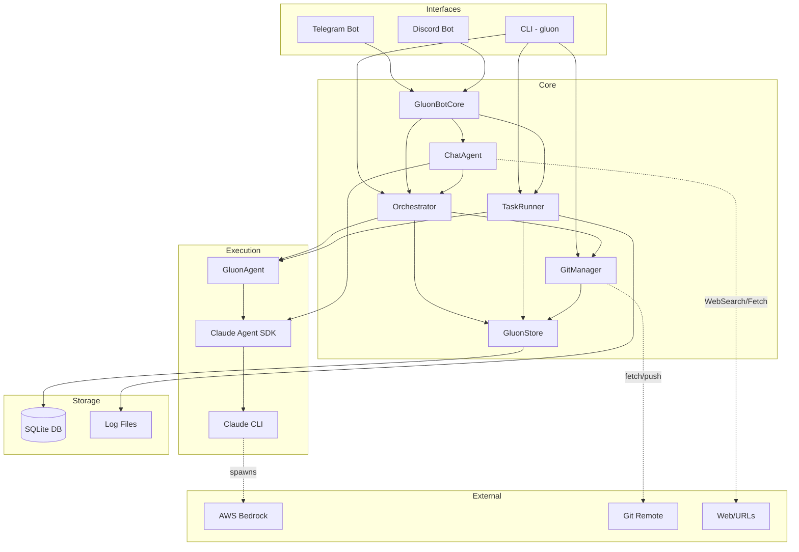

### Data Model

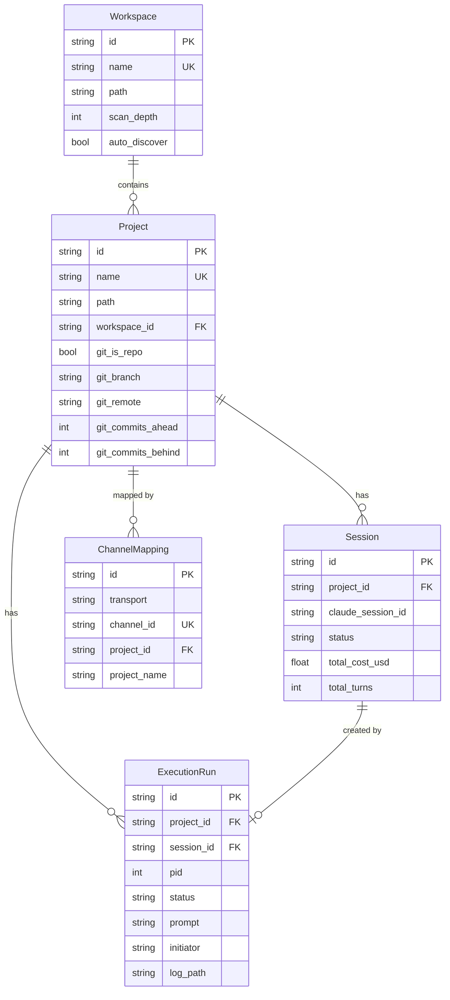

### CLI Execution Flow

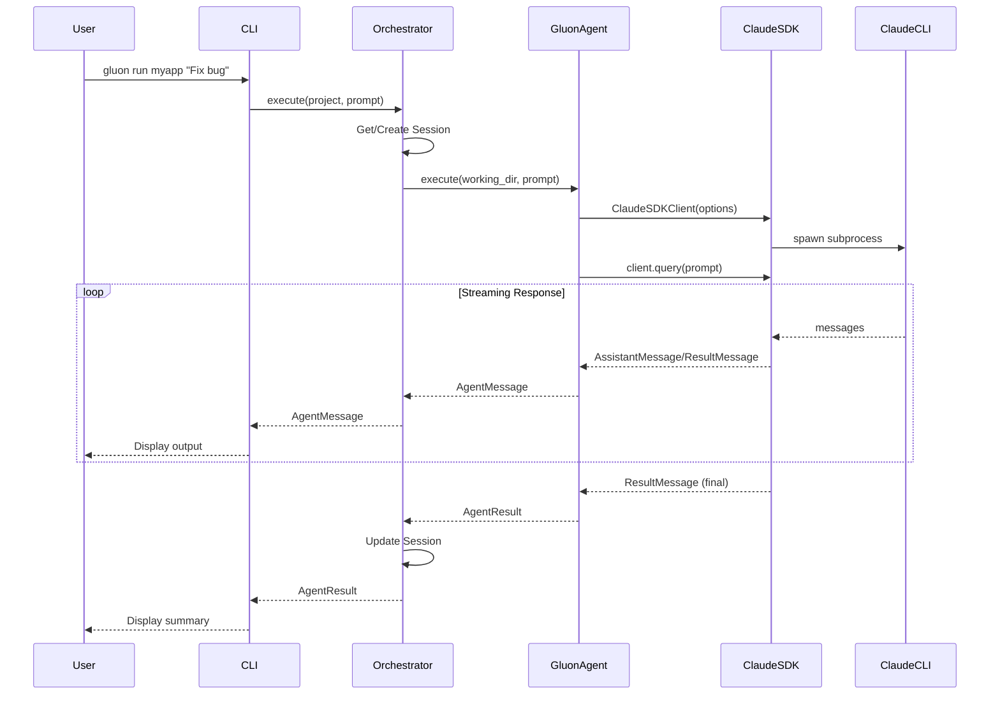

### Background Execution Flow

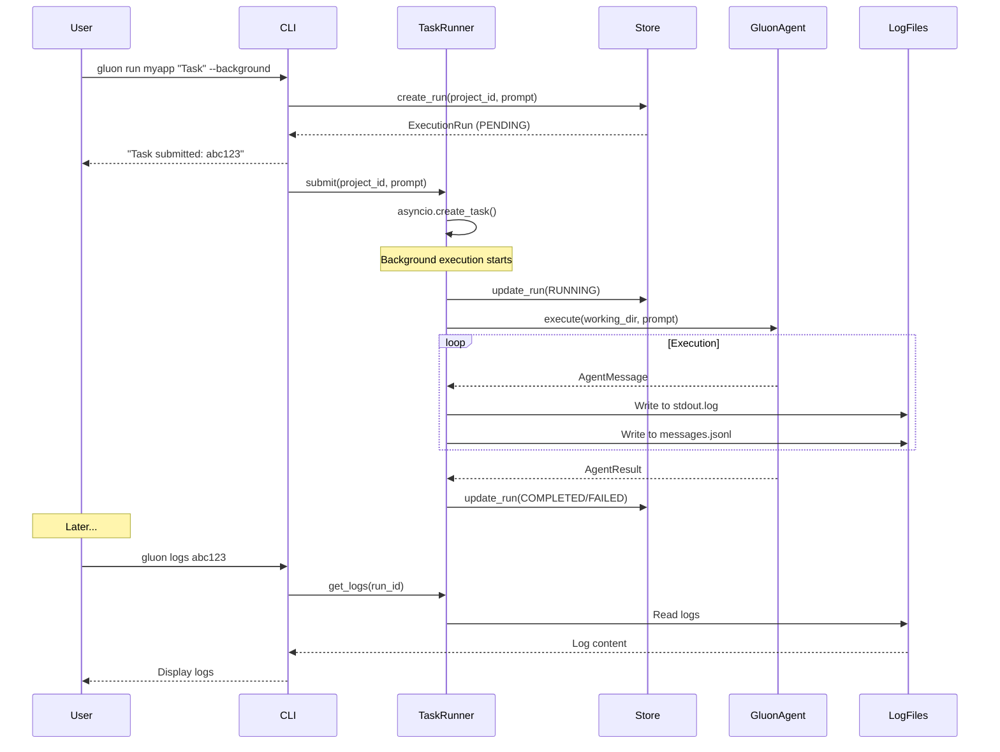

### Telegram Bot Flow

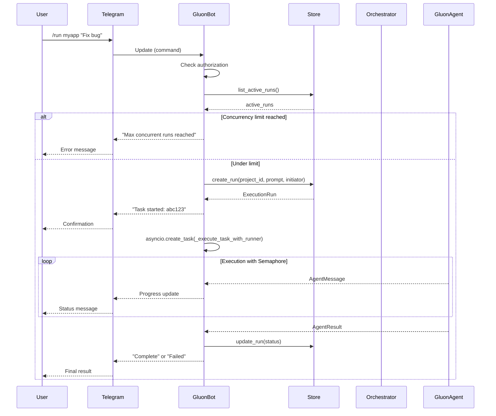

### Bot Startup Recovery

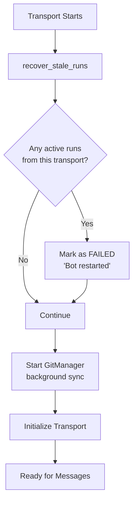

### Agent Execution Detail

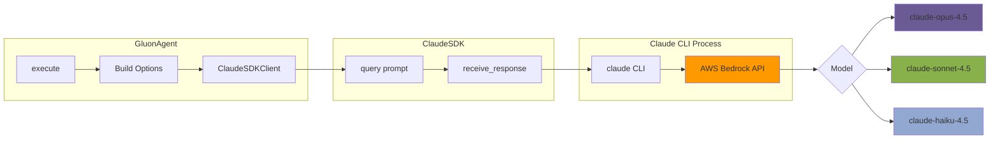

### Concurrency Model

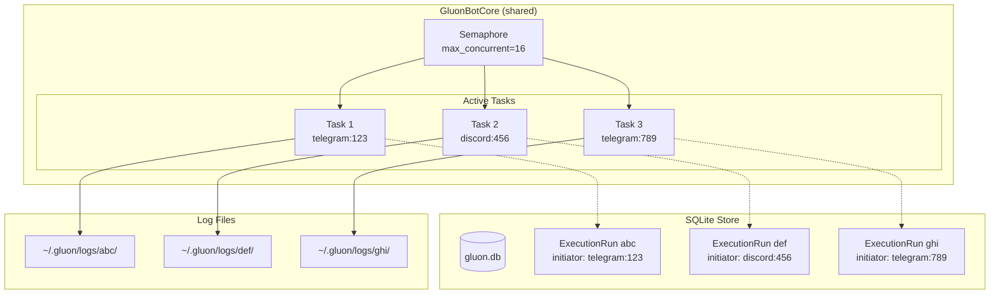

### Transport Layer Architecture

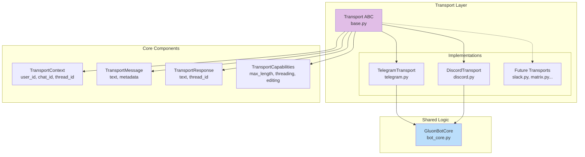

### Discord Bot Flow

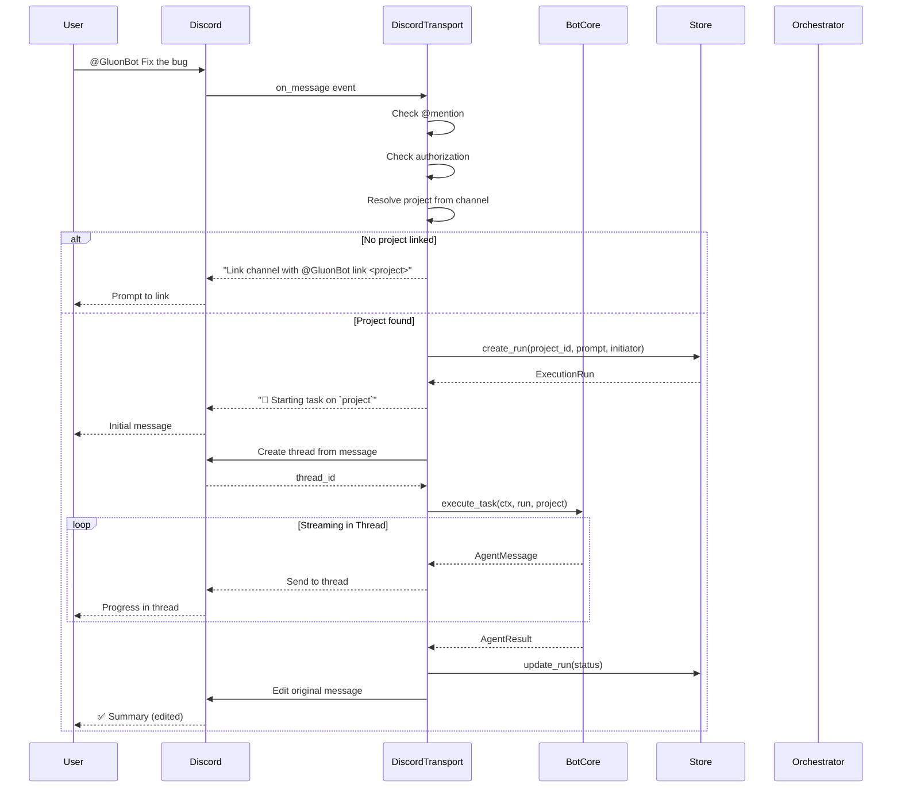

### Discord Channel Mapping

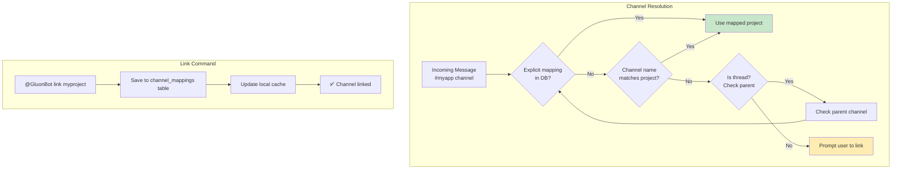

### Chat Agent Architecture

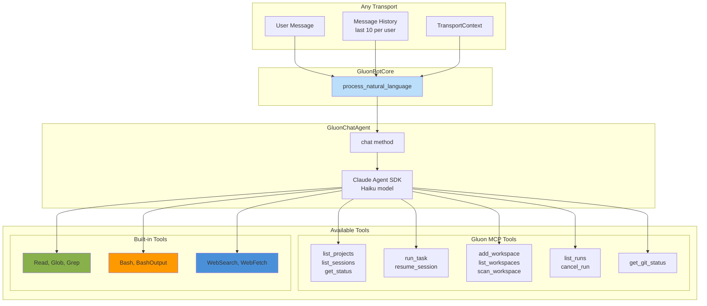

## Background Execution

Gluon supports running tasks in the background with persistent tracking:

```bash
# Start a background task
gluon run myapp 'Implement user authentication' --background
# Output: Task submitted: abc12345

# Check status
gluon runs
# Shows all runs with status (pending/running/completed/failed)

# View logs
gluon logs abc12345

# Follow logs in real-time
gluon logs abc12345 --follow

# Cancel if needed
gluon cancel abc12345
```

Background runs are tracked in SQLite and persist across restarts. Logs are stored at `~/.gluon/logs/<run_id>/`.

## Telegram Bot

Run Gluon as an always-on daemon via Telegram with support for multiple concurrent tasks.

### Setup

1. Message [@BotFather](https://t.me/BotFather) on Telegram
2. Send `/newbot` and follow instructions to create your bot
3. Copy the token you receive

4. (Optional) Get your user ID from [@userinfobot](https://t.me/userinfobot)

### Run the Bot

```bash
# Set token via environment variable
export GLUON_TELEGRAM_TOKEN="your-bot-token"

# Optional: restrict to specific users (comma-separated IDs)
export GLUON_TELEGRAM_USERS="123456789,987654321"

# Start the bot
gluon bot

# Or pass token directly
gluon bot --token "your-bot-token" --users "123456789"
```

### Bot Commands

- `/projects` - List registered projects
- `/sessions [project]` - List sessions
- `/run <project> <prompt>` - Run a task
- `/resume <project> [session_id] [prompt]` - Resume session (latest or specific)
- `/runs` - List your background runs
- `/runs all` - List all runs
- `/status` - Show overall status
- `/cancel` - Cancel your latest active run
- `/cancel <run_id>` - Cancel specific run
- `/clear` - Clear chat history
- `/help` - Show help

### Features

- **Multiple concurrent tasks**: Run tasks across multiple projects simultaneously
- **Persistent tracking**: All runs are tracked in SQLite and survive bot restarts
- **Global concurrency limit**: Configurable limit (default: 16) prevents resource exhaustion
- **Natural language support**: Chat naturally instead of using commands
- **Conversation context**: Bot remembers recent messages for follow-up questions
- **Reply to resume**: Reply to a completion message to automatically resume that session
- **Real-time updates**: Get progress updates as tasks execute

### Natural Language Examples

Instead of commands, you can chat naturally:

| What you say | What happens |
|--------------|--------------|
| "Show me my projects" | Lists all registered projects |
| "What's the git status of myapp?" | Shows git branch, uncommitted changes, ahead/behind |
| "Run a task on myapp to fix the login bug" | Starts a coding task with Claude |
| "What tasks are running?" | Lists active background runs |
| "Cancel the last task" | Cancels most recent active run |
| "Search the web for React best practices" | Performs web search |
| "Read the README in myapp" | Reads file contents from project |
| "Find all Python files in myapp" | Searches for files by pattern |
| *(reply to completion)* "Also add tests" | Resumes the session with follow-up prompt |

The chat agent has access to:
- **Gluon tools**: Project management, task execution, run monitoring, git status
- **File tools**: Read, Glob, Grep for exploring project code
- **Shell tools**: Bash, BashOutput for running commands
- **Web tools**: WebSearch, WebFetch for internet lookups

## Discord Bot

Run Gluon as a Discord bot with channel-based project mapping and threaded task output.

### Installation

Discord support is an optional dependency:

```bash
pip install 'gluon-agent[discord]'
# or for all optional features
pip install 'gluon-agent[all]'
```

### Setup

1. Go to [Discord Developer Portal](https://discord.com/developers/applications)
2. Create a New Application
3. Go to "Bot" tab and click "Add Bot"
4. Copy the bot token
5. Enable "MESSAGE CONTENT INTENT" in Bot settings
6. Go to "OAuth2" → "URL Generator"
7. Select scopes: `bot`, `applications.commands`
8. Select permissions: `Send Messages`, `Create Public Threads`, `Read Message History`
9. Copy the generated URL and open it to invite the bot to your server

### Run the Bot

```bash
# Set required environment variables
export GLUON_DISCORD_TOKEN="your-bot-token"
export GLUON_DISCORD_GUILD="your-guild-id"

# Optional: restrict to specific users (comma-separated Discord user IDs)
export GLUON_DISCORD_USERS="123456789,987654321"

# Start the bot
gluon discord

# Or pass options directly
gluon discord --token "token" --guild 123456789
```

### Bot Commands

Mention the bot (`@GluonBot`) with a command:

- `@GluonBot link <project>` - Link this channel to a project
- `@GluonBot projects` - List registered projects
- `@GluonBot runs` - List your runs
- `@GluonBot status` - Show overall status
- `@GluonBot cancel [run_id]` - Cancel a run
- `@GluonBot <any task>` - Execute task on the linked project

### Channel-Project Mapping

Discord channels map to projects in two ways:

1. **Auto-match**: Channel name matches project name (e.g., `#myapp` → `myapp` project)
2. **Explicit link**: Use `@GluonBot link <project>` to bind any channel

Once linked, all @mentions execute tasks on that project automatically.

### Threaded Output

Task execution creates Discord threads for organized output:
- Initial message shows task started
- Thread contains streaming progress
- Original message is edited with final summary (✅ or ❌)

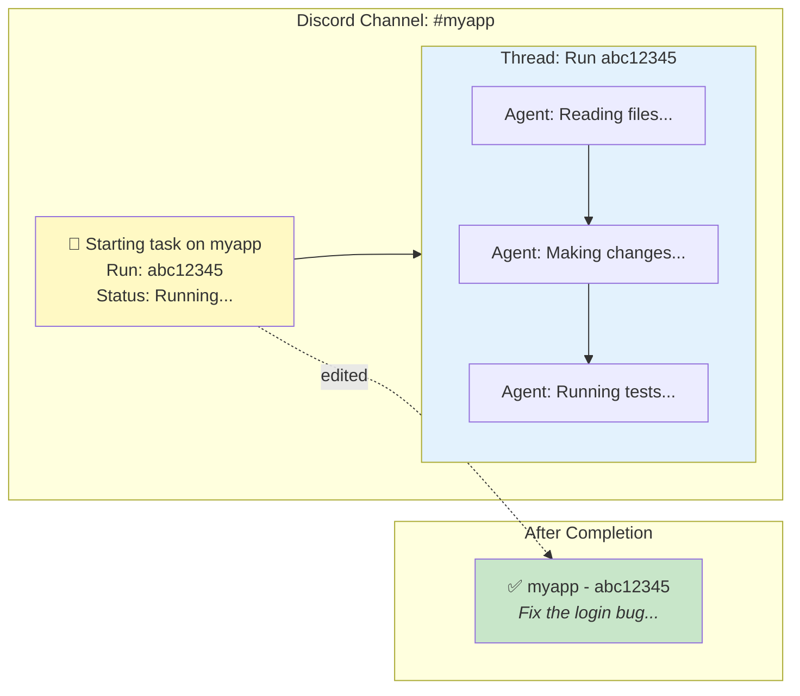

## Multi-Transport Mode

Run both Telegram and Discord simultaneously with a shared bot core:

```bash
# Set all required environment variables
export GLUON_TELEGRAM_TOKEN="telegram-token"
export GLUON_TELEGRAM_USERS="123456789"
export GLUON_DISCORD_TOKEN="discord-token"
export GLUON_DISCORD_GUILD="987654321"
export GLUON_DISCORD_USERS="111222333"

# Run both transports
gluon serve --telegram --discord
```

### Multi-Transport Architecture

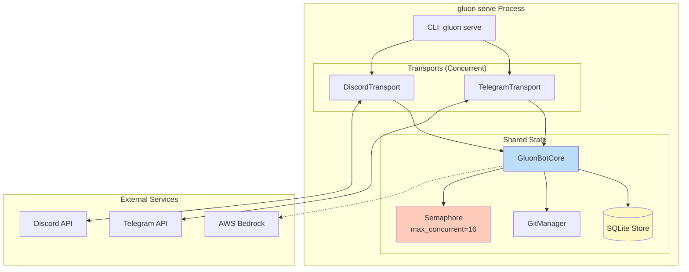

### Cross-Platform Visibility

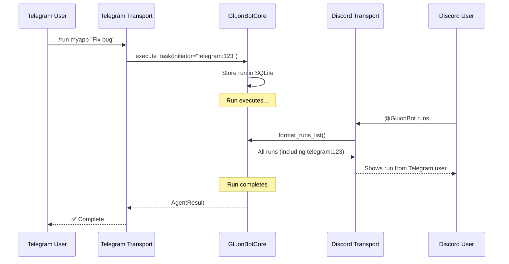

### Features

- **Shared project, session, and run state** - All transports read/write to the same SQLite database
- **Shared git background sync** - Single GitManager instance fetches for all transports
- **Shared concurrency limits** - Global semaphore prevents overload across all platforms
- **Cross-platform run visibility** - Users on any platform can see runs from other platforms

## Configuration

### Environment Variables

**Telegram:**
- `GLUON_TELEGRAM_TOKEN` - Telegram bot token
- `GLUON_TELEGRAM_USERS` - Comma-separated list of allowed Telegram user IDs

**Discord:**
- `GLUON_DISCORD_TOKEN` - Discord bot token
- `GLUON_DISCORD_GUILD` - Discord guild (server) ID
- `GLUON_DISCORD_USERS` - Comma-separated list of allowed Discord user IDs

**AWS Bedrock:**
- AWS credentials for Bedrock models (see `.env.local.example`)

### Model Selection

Gluon uses Claude models via AWS Bedrock:

| Tier | Model | Use Case |
|------|-------|----------|
| `haiku` | claude-haiku-4.5 | Fast, economical tasks |
| `sonnet` | claude-sonnet-4.5 | Balanced performance (default) |
| `opus` | claude-opus-4.5 | Complex, demanding tasks |

```bash
gluon run myapp 'Fix bug' --model haiku
gluon run myapp 'Complex refactor' --model sonnet
gluon run myapp 'Architecture review' --model opus
```

## Git Synchronization

Gluon automatically keeps projects synchronized with remote Git repositories to prevent conflicts when multiple Claude instances work on the same codebase.

### Pre-task Sync Flow

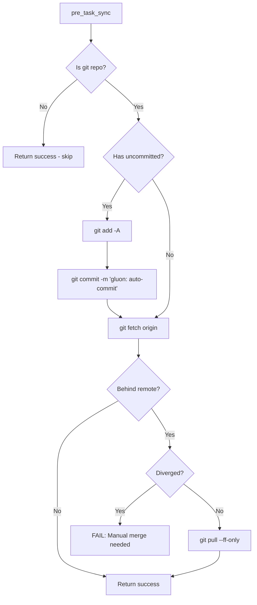

### Post-task Sync Flow

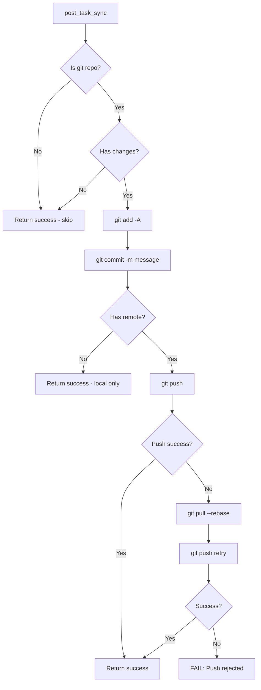

### Background Sync

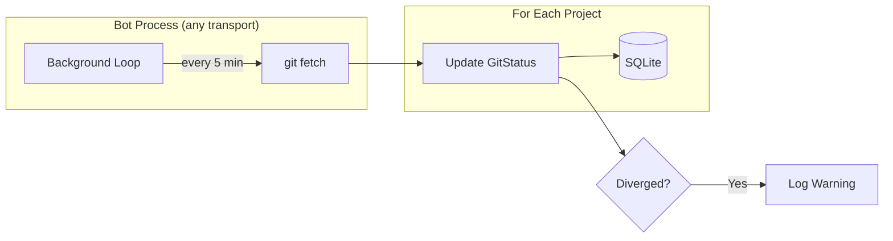

### Automatic Behavior

- **Pre-task**: Before running a task, Gluon will:
  1. Auto-commit any uncommitted changes
  2. Fetch from remote
  3. Fast-forward if behind (fails if diverged)

- **Post-task**: After successful task completion:
  1. Stage and commit all changes
  2. Push to remote

- **Background**: Bot transports (Telegram, Discord) periodically fetch all projects (every 5 minutes) to maintain status awareness

### Configuration

```bash
# Environment variables
GLUON_GIT_ENABLED=true              # Enable/disable git sync (default: true)
GLUON_GIT_SYNC_INTERVAL=300         # Background fetch interval in seconds
GLUON_GIT_AUTO_COMMIT=true          # Auto-commit before/after tasks
GLUON_GIT_AUTO_PUSH=true            # Auto-push after tasks
GLUON_GIT_COMMIT_PREFIX="gluon:"    # Prefix for auto-commit messages
```

### Error Handling

| Scenario | Behavior |
|----------|----------|
| Not a git repo | Skip git operations, proceed normally |
| No remote configured | Commit locally only |
| Diverged branches | **FAIL** pre-task with error |
| Push rejected | Pull with rebase, retry once |
| Network error (fetch) | **WARN** but proceed |

## File Structure

```
~/.gluon/
├── gluon.db          # SQLite database (projects, sessions, runs)
└── logs/
    └── <run_id>/     # Per-run log directories
        ├── stdout.log
        ├── stderr.log
        └── messages.jsonl
```

## Development

```bash
# Run tests
pytest

# Run linter
ruff check src/ tests/

# Format code
ruff format src/ tests/
```

## Limitations

- **No interactive STDIN**: Once a task starts, you cannot send additional input to the running Claude process. To continue work, wait for completion and use `resume` with a new prompt.
- **Single-process concurrency**: The semaphore only limits concurrency within a single process. Multiple CLI `--background` invocations each run in separate processes. However, `gluon serve` runs all transports in a single process with shared concurrency limits.
- **Fire-and-forget execution**: The Claude Agent SDK sends the prompt once via `client.query()` and then only receives responses.
- **Discord requires optional dependency**: Install with `pip install 'gluon-agent[discord]'` to enable Discord support.
