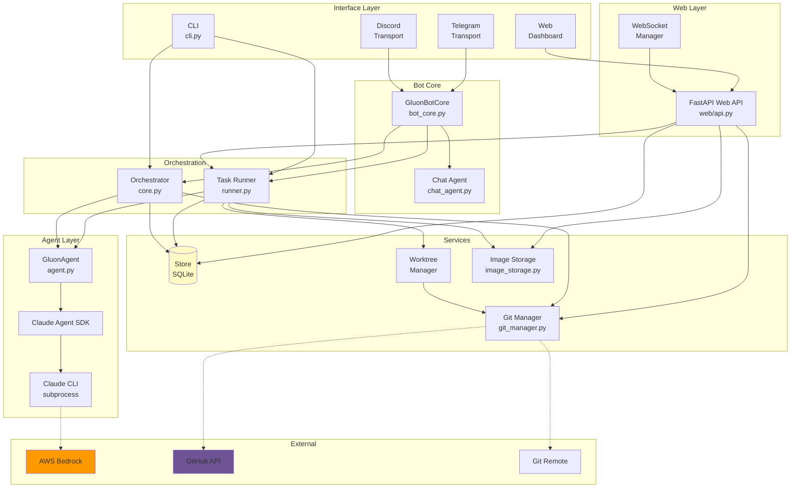
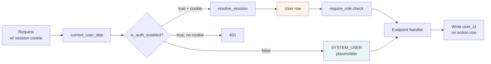
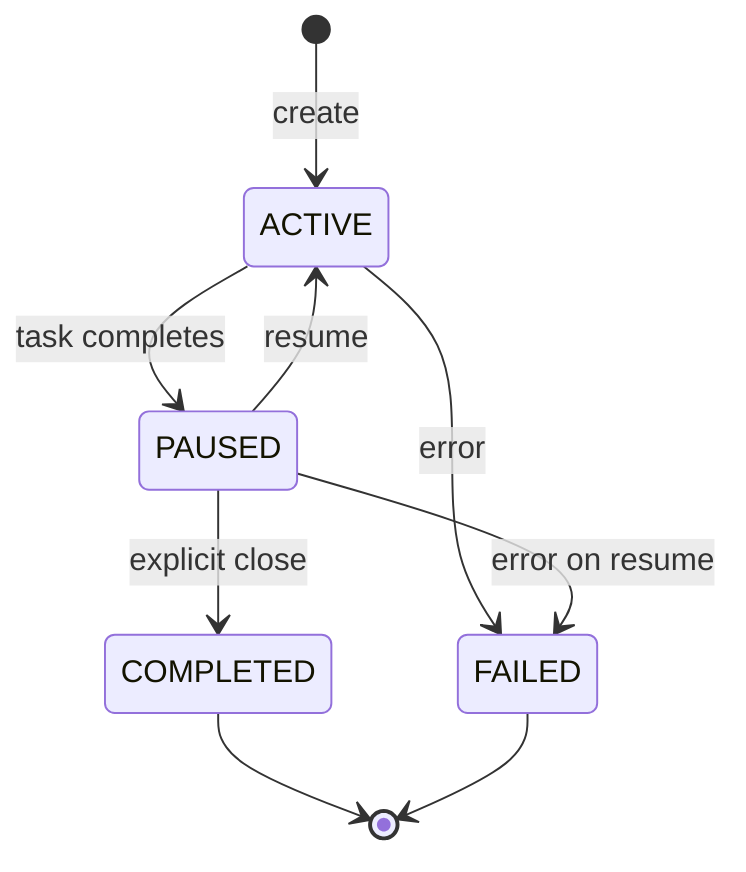
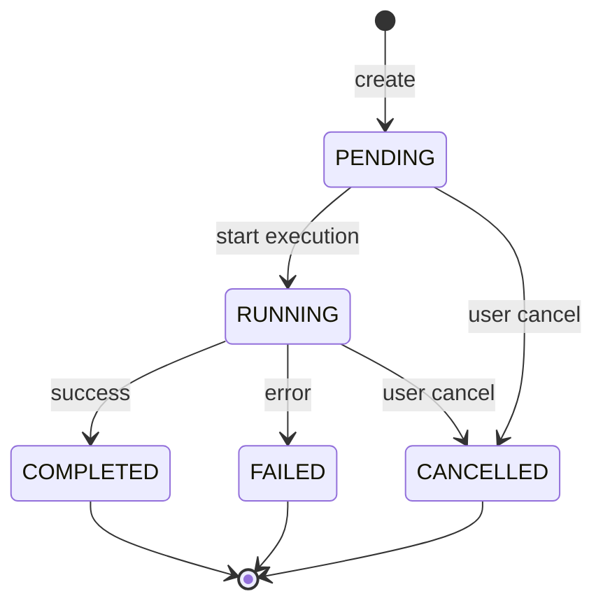
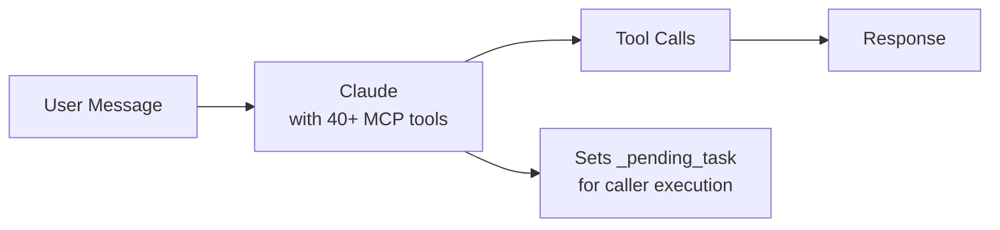
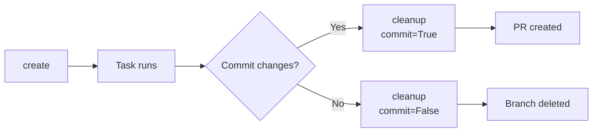
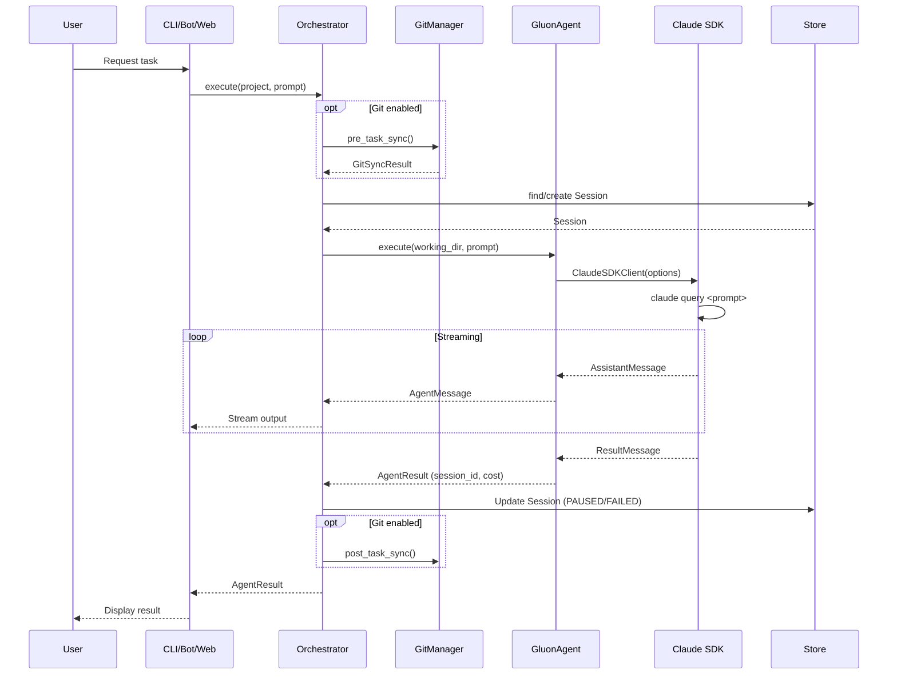
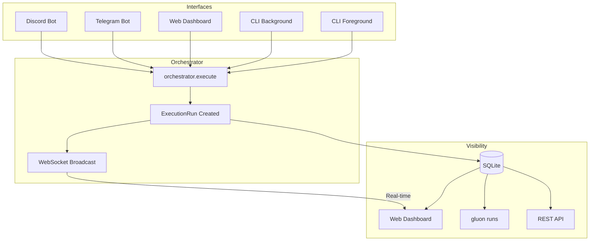
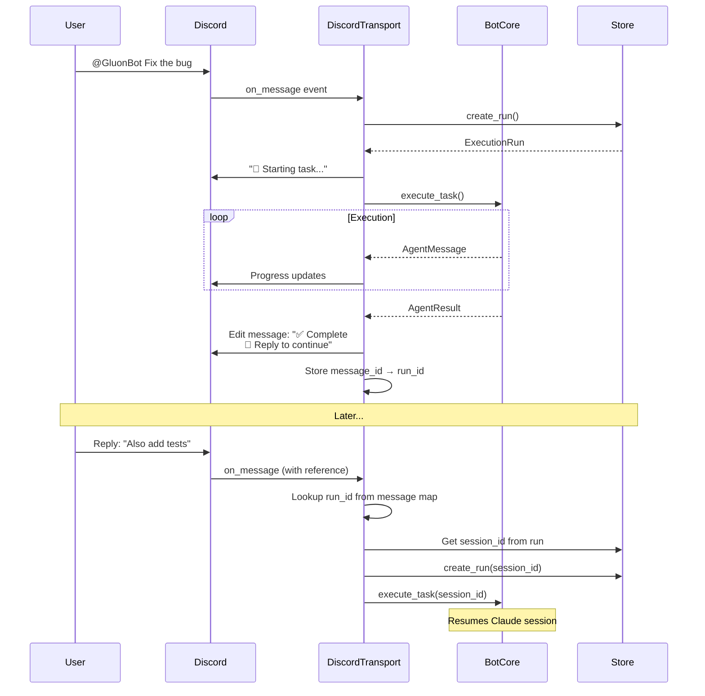
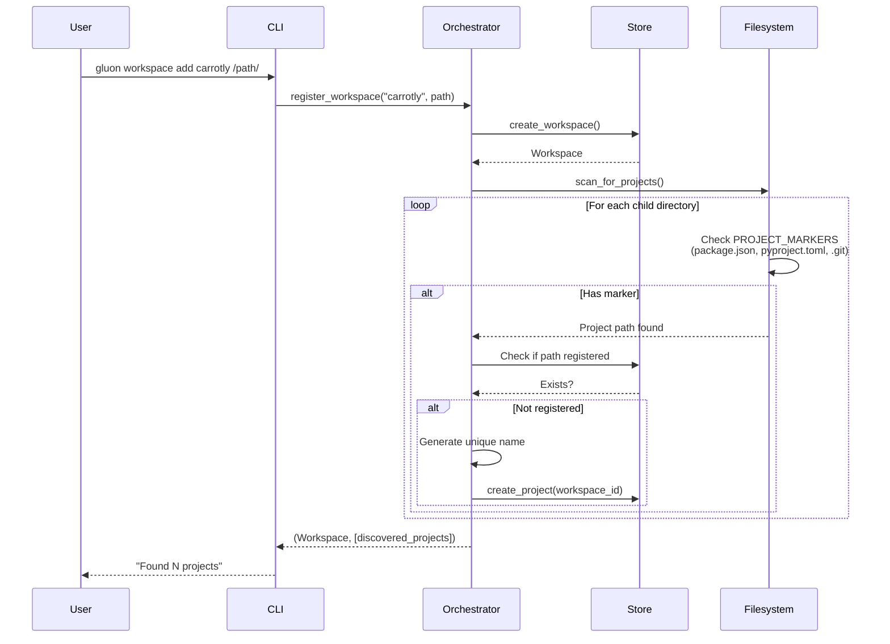

# Gluon Agent Architecture

## Overview

Gluon Agent is an AI orchestrator that manages multiple Claude Code agents across different software projects. It provides session persistence, resume capability, workspace-based project discovery, git synchronization, and multiple interfaces (CLI, Telegram bot, Discord bot).

## System Architecture



### Storage Layout

```
~/.gluon/
├── gluon.db           # SQLite database
├── images/            # Image attachments (content-addressed by SHA256)
│   └── {hash[:2]}/
│       └── {hash}.{ext}
└── logs/{run_id}/     # Per-run logs
    ├── stdout.log
    ├── stderr.log
    └── messages.jsonl

/tmp/gluon-worktrees/  # Temporary worktrees
└── wt-{run_id}/       # Branch: gluon-task/{run_id}
    └── .gluon-images/ # Copied images for AI visibility
```

### External Dependencies

| Dependency | Purpose |
|------------|---------|
| Claude Code CLI | claude-agent-sdk integration |
| python-telegram-bot | Telegram transport |
| discord.py | Discord transport |
| GitHub CLI (gh) | PR creation, merging, conflict detection |
| Git | Repository sync, worktrees, rebase |

## Key New Components (Recent Additions)

### Component Quick Reference

| Component | File | Purpose |
|-----------|------|---------|
| **RalphManager** | `ralph_manager.py` | Orchestrates multi-iteration autonomous loops |
| **CircuitBreaker** | `circuit_breaker.py` | Prevents infinite loops with state machine |
| **CompletionDetector** | `completion_detector.py` | Multi-signal task completion detection |
| **RateLimiter** | `rate_limiter.py` | Cost and API call rate enforcement |
| **ResumeCoordinator** | `resume_coordinator.py` | Polling-based auto-resume orchestration |
| **PolicyEngine** | `policies.py` | Supervision policy evaluation for auto-resume |
| **SupervisorDaemon** | `supervisor_daemon.py` | Long-running background supervision process |
| **LogCleanupService** | `cleanup.py` | Log retention and cleanup management |
| **PRMonitorService** | `pr_monitor.py` | PR comment/CI failure event monitoring |
| **TaskRunner** | `runner.py` (enhanced) | Question handling and worktree lifecycle |
| **ModelConfig** | `models_config.py` | Model tier configuration and mapping |
| **AuthProviderConfig** | `auth.py` | D5 multi-user auth — Local + OIDC providers, sessions, RBAC |
| **OIDCAuthProvider** | `auth.py` | D5 Phase 3 — Authlib-driven OpenID Connect SSO |
| **GluonStore (link_codes)** | `store.py` | D5 Phase 4 — One-time codes for self-serve chat-account binding |

### Ralph Loop Architecture
The **Ralph Loop** enables autonomous multi-iteration task execution with safety controls. Key components:

- **RalphManager** (`ralph_manager.py`) - Orchestrates loop lifecycle with:
  - Autonomous iteration until completion
  - Circuit breaker for runaway detection
  - Completion detection with multi-signal confidence scoring
  - Rate limiting and cost tracking
  - Status reporting via RALPH_STATUS blocks

- **CircuitBreaker** (`circuit_breaker.py`) - Prevents infinite loops:
  - CLOSED → HALF_OPEN → OPEN state machine
  - Detects: repeated errors, no file progress, output stagnation
  - Configurable thresholds and patience windows

- **CompletionDetector** (`completion_detector.py`) - Multi-signal completion:
  - RALPH_STATUS block parsing (primary signal)
  - TODO file analysis (all items checked = complete)
  - Consecutive "done" signals from Claude
  - Test saturation detection (only tests running)
  - Confidence scoring to avoid false positives

- **RateLimiter** (`rate_limiter.py`) - Cost & call controls:
  - Max calls per hour enforcement
  - Cumulative cost tracking (persisted across resume)
  - Graceful backoff when limits approached

### Supervision & Auto-Resume Architecture

- **ResumeCoordinator** (`resume_coordinator.py`) - Polling-based auto-resume:
  - Monitors REVIEW tasks periodically (default: 30s)
  - Evaluates supervision policies before resuming
  - Tracks decision audit trail in database

- **SupervisionPolicy** (`policies.py`) - Decision logic:
  - MANUAL: No auto-resume (default)
  - AGGRESSIVE: Resume if any chance of success
  - CONSERVATIVE: Resume only with high confidence
  - Applies safety guards (circuit breaker, cost limits, rate limits)

- **SupervisorDaemon** (`supervisor_daemon.py`) - Long-running background process:
  - CLI command: `gluon supervisor start/stop/status`
  - Uses ResumeCoordinator for polling
  - Maintains PID file for single-instance enforcement

### Model Configuration & Task Profiles

- **ModelTier** (`models_config.py`) - Model selection:
  - OPUS_46, OPUS_45, SONNET, HAIKU tiers
  - AWS Bedrock model ID mappings
  - UI aliases for user-friendly names

- **TaskProfile** (in `models.py`) - Pre-configured presets:
  - QUICK: Fast/cheap (Haiku)
  - STANDARD: Balanced (Sonnet, default)
  - DEEP: Maximum reasoning (Opus)
  - PLANNING: Force plan-first workflow (Opus)

- **ThinkingBudget** - Extended thinking tokens:
  - NONE, LOW (4K), MEDIUM (10K), HIGH (16K), ULTRATHINK (32K)

### Cleanup & Maintenance

- **LogCleanupService** (`cleanup.py`) - Retention policies:
  - Orphan logs: deleted immediately
  - Archived runs: deleted 30 days after completion
  - Failed runs: deleted 7 days after completion
  - Completed runs: deleted 30 days after completion

- **`_sweep_auth_state` background task** (`web/api.py`) - Hourly sweep of:
  - Expired `user_sessions` rows
  - Unconsumed-but-expired `link_codes` rows (consumed codes are kept as audit)
  - Tunable via `GLUON_AUTH_SWEEP_INTERVAL_SECS` (default `3600`)

### Multi-User Authentication (D5)

Optional multi-user auth gated by `GLUON_AUTH_ENABLED` (default off — single-user installs see no behaviour change). See [AUTH.md](AUTH.md) for the full model.



- **AuthProviderConfig** (`auth.py`) - Strategy interface for auth backends.
  - **LocalAuthProvider** - argon2id passwords (Phase 1)
  - **OIDCAuthProvider** - Authlib-driven OpenID Connect (Phase 3)
- **Session helpers** (`auth.py`) - DB-backed sessions (not JWT) with rolling TTL:
  - `create_session_for_user`, `resolve_session`, `delete_user_sessions_for_user`
- **FastAPI integration** (`auth.py`):
  - `make_current_user_dependency(store)` — closure factory returning a `Depends()` injector
  - `make_require_role(store, role)` — admin/operator/viewer gate via numeric `_role_rank`
- **Per-row attribution** (`models.py`, `store.py`) - Nullable FKs to `users(id)` on:
  - `execution_runs.user_id`
  - `orchestrator_tasks.created_by_user_id`
  - `pending_approvals.decided_by_user_id`
- **Self-serve transport linking** (Phase 4):
  - `link_codes` table + `create_link_code` / `consume_link_code` / `unlink_chat`
  - Bot transports call `bot_core.resolve_user_id_by_chat_id(transport, chat_id)` to attribute approvals/runs to a Gluon user

### Monitoring & Event Handling

- **PRMonitorService** (`pr_monitor.py`) - Auto-resume on PR events:
  - Watches for @gluon/trigger comments on PRs
  - Detects CI/CD failures (Vercel, GitHub Actions)
  - Resumes runs with failure context

- **Webhooks** (`webhooks/`) - GitHub event handling:
  - GitHub webhook receiver for PR events
  - Integrates with PRMonitorService

### Enhanced Runner Capabilities

- **TaskRunner** enhancements:
  - Question handler for user prompts (AskUserQuestion tool)
  - WebSocket integration for real-time question display
  - Git identity configuration
  - Worktree cleanup and recovery

## Component Details

### 1. Transport Layer (`transport/`)

Abstract interface for platform-specific bot implementations.

#### Base Classes (`transport/base.py`)

```python
@dataclass
class TransportContext:
    transport: str          # 'telegram', 'discord', 'slack', etc.
    user_id: str            # Universal ID: '{transport}:{id}'
    chat_id: str            # Channel/conversation identifier
    thread_id: str | None   # Thread ID if applicable
    project_hint: str | None # Project name from context
    message_id: str | None  # Triggering message ID
    raw_data: dict          # Platform-specific metadata

@dataclass
class TransportResponse:
    text: str               # Message text
    thread_id: str | None   # Thread to send into
    reply_to_id: str | None # Message to reply to
    parse_mode: str         # 'plain', 'markdown', 'html'
    editable: bool          # May be edited later

class Transport(ABC):
    @property
    @abstractmethod
    def name(self) -> str: ...

    @property
    @abstractmethod
    def capabilities(self) -> TransportCapabilities: ...

    @abstractmethod
    async def send(ctx, response) -> str: ...

    @abstractmethod
    async def edit(ctx, message_id, response) -> bool: ...

    @abstractmethod
    async def send_typing(ctx) -> None: ...

    async def create_thread(ctx, name, message_id) -> str | None:
        return None  # Optional, not all transports support threads

    @abstractmethod
    async def start() -> None: ...

    @abstractmethod
    async def stop() -> None: ...
```

#### Transport Capabilities (`transport/capabilities.py`)

```python
@dataclass
class TransportCapabilities:
    max_message_length: int     # Max characters per message
    supports_threads: bool      # Can create threads
    supports_editing: bool      # Can edit sent messages
    supports_typing: bool       # Can show typing indicator
    supports_formatting: bool   # Supports markdown/rich text
```

#### Implementations

- **TelegramTransport** (`transport/telegram.py`) - Telegram bot with natural language support
- **DiscordTransport** (`transport/discord.py`) - Discord bot with channel-project mapping

### 2. Models (`models.py`)

Pydantic models defining the core data structures.

#### Workspace
```python
class Workspace(BaseModel):
    id: str                    # UUID
    name: str                  # Unique human-readable name
    path: Path                 # Absolute path to workspace directory
    scan_depth: int = 1        # How deep to scan for projects
    auto_discover: bool = True # Auto-discover new projects
    ignore_patterns: list[str] # Patterns to ignore (e.g., node_modules)
```

**Key Method:** `scan_for_projects()` - Scans immediate children for project markers.

#### Project
```python
class Project(BaseModel):
    id: str                      # UUID
    name: str                    # Unique human-readable name
    path: Path                   # Absolute path to project directory
    workspace_id: str | None     # FK to Workspace (None = standalone)
    metadata: dict | None        # Optional extra data
```

#### Session
```python
class Session(BaseModel):
    id: str                        # Internal UUID
    project_id: str                # FK to Project
    claude_session_id: str | None  # Claude SDK session ID (for resume)
    status: SessionStatus          # active, paused, completed, failed
    last_prompt: str | None        # Last user prompt
    total_cost_usd: float          # Accumulated cost
    total_turns: int               # Number of turns
```

**Status Lifecycle:**



#### ExecutionRun
```python
class ExecutionRun(BaseModel):
    id: str                      # UUID
    project_id: str              # FK to Project
    session_id: str | None       # FK to Session (linked after execution)
    pid: int | None              # Process ID when running
    status: RunStatus            # pending, running, completed, failed, cancelled
    prompt: str                  # Task prompt
    initiator: str | None        # Who started: 'telegram:123', 'discord:456', 'cli'
    thread_id: str | None        # Discord/Slack thread ID
    log_path: Path | None        # Path to log files
    error_message: str | None    # Error if failed

    # Ralph Loop & Supervision (NEW)
    is_ralph_loop: bool          # Enable autonomous multi-iteration loop
    force_planning: bool         # Force plan-first workflow before execution
    model_tier: str              # Model tier: opus-4.6, sonnet, haiku, etc.
    thinking_budget: ThinkingBudget  # Extended thinking tokens

    # Supervision policy configuration
    supervision_config: SupervisionConfig | None  # Auto-resume policy & limits

    # Ralph Loop state tracking (persisted across resume)
    circuit_state: CircuitState  # CLOSED, HALF_OPEN, or OPEN
    consecutive_no_progress: int # Count for circuit breaker
    consecutive_same_error: int  # Count for circuit breaker
    last_progress_loop: int      # Last loop with file changes
    half_open_iterations: int    # Iterations in HALF_OPEN state

    # Rate limiting state
    cost_usd: float | None       # Cumulative cost across iterations
    max_cost_usd: float | None   # Maximum allowed cost
    max_calls_per_hour: int      # Rate limit for API calls

    # Completion detection state
    completion_signals: int      # Count of consecutive "done" signals
    test_only_loops: int         # Count of loops with only tests running

    # Loop iteration tracking
    loop_iteration: int          # Current iteration number (0-based)
    loop_iterations: list[RalphLoopIteration]  # History of all iterations
```

**Run Status Lifecycle:**



#### SupervisionConfig
```python
class SupervisionConfig(BaseModel):
    enabled: bool = False                           # Enable auto-resume
    policy: SupervisionPolicy = MANUAL              # Resume policy
    max_auto_resumes: int = 5                       # Max resumes before manual intervention
    max_cost_usd: float | None = None               # Cost guard
    max_calls_per_hour: int = 60                    # Rate limit
    min_completion_confidence: float = 0.8          # Minimum confidence to auto-resume
    wait_for_user_input: bool = False               # Wait for approval between iterations
```

#### RalphLoopIteration
```python
class RalphLoopIteration(BaseModel):
    loop_number: int                     # 0-based iteration counter
    status: str                          # "in_progress", "completed", "failed"

    # Progress tracking
    files_changed: int                   # Number of git changes detected
    error_summary: str | None            # First ~200 chars of error
    output_length: int                   # Length of Claude's response

    # Circuit breaker state after iteration
    circuit_state: CircuitState

    # Completion signals detected
    has_done_signal: bool
    has_complete_signal: bool
    completion_confidence: float

    # Cost tracking
    cost_usd: float
    total_cost_usd: float

    # Timestamps
    started_at: datetime
    completed_at: datetime | None
```

#### ChannelMapping
```python
class ChannelMapping(BaseModel):
    id: str                 # UUID
    transport: str          # 'telegram', 'discord'
    channel_id: str         # Platform-specific channel ID
    project_id: str         # FK to Project
    project_name: str       # Cached project name
```

#### GitStatus
```python
class GitStatus(BaseModel):
    is_git_repo: bool
    branch: str | None
    remote: str | None
    remote_url: str | None
    has_uncommitted: bool
    uncommitted_count: int
    commits_ahead: int
    commits_behind: int
    is_diverged: bool        # Property: ahead > 0 and behind > 0
    last_fetch_at: datetime | None
    last_push_at: datetime | None
    last_commit_at: datetime | None
```

### 3. Store (`store.py`)

SQLite persistence layer with CRUD operations for all entities.

**Tables:**
- `workspaces` - Workspace metadata
- `projects` - Project registry with git status columns
- `sessions` - Session tracking with Claude session IDs
- `execution_runs` - Background task tracking
- `channel_mappings` - Transport channel to project mappings

**Key Methods:**
```python
# Workspace operations
create_workspace(name, path) -> Workspace
get_workspace(id) -> Workspace | None
list_workspaces() -> list[Workspace]

# Project operations
create_project(name, path, metadata?, workspace_id?) -> Project
get_project(id) -> Project | None
get_project_by_name(name) -> Project | None
list_projects() -> list[Project]
list_projects_by_workspace(workspace_id) -> list[Project]

# Session operations
create_session(project_id, prompt?) -> Session
get_session(id) -> Session | None
get_latest_session(project_id, statuses?) -> Session | None
list_sessions(project_id?) -> list[Session]
get_active_sessions() -> list[Session]

# Run operations
create_run(project_id, prompt, initiator?) -> ExecutionRun
get_run(id) -> ExecutionRun | None
get_run_by_short_id(short_id) -> ExecutionRun | None
get_run_by_thread_id(thread_id) -> ExecutionRun | None
list_runs(project_id?, statuses?, initiator?, limit?) -> list[ExecutionRun]
list_active_runs() -> list[ExecutionRun]

# Channel mapping operations
create_channel_mapping(transport, channel_id, project_id, project_name) -> ChannelMapping
get_channel_mapping(transport, channel_id) -> ChannelMapping | None
list_channel_mappings(transport?) -> list[ChannelMapping]

# Git status operations
get_git_status(project_id) -> GitStatus | None
update_git_status(project_id, status) -> None
```

### 4. Agent (`agent.py`)

Wrapper around Claude Agent SDK.

**Key Class: `GluonAgent`**

```python
class GluonAgent:
    def __init__(
        model: str = "sonnet",
        allowed_tools: list[str] = DEFAULT_TOOLS,
        permission_mode: str = "acceptEdits"
    )

    async def execute(
        working_dir: Path,
        prompt: str,
        resume_session_id: str | None = None
    ) -> AsyncIterator[AgentMessage | AgentResult]
```

**Message Types:**
- `AgentMessage` - Streaming messages (text, tool_use, system, error)
- `AgentResult` - Final result with session_id, cost, turns, success

**Claude SDK Integration:**
```python
options = ClaudeAgentOptions(
    cwd=working_dir,
    allowed_tools=["Read", "Write", "Edit", "Bash", "Glob", "Grep", "Task", "TodoWrite"],
    permission_mode="acceptEdits",
    model="sonnet",
    resume=previous_session_id,  # For session resume
)
```

### 5. GitManager (`git_manager.py`)

Handles git synchronization for projects.

**Key Methods:**
```python
async def refresh_status(project) -> GitStatus
async def pre_task_sync(project) -> GitSyncResult  # Auto-commit, fetch, ff
async def post_task_sync(project, message, session_id?, run_id?) -> GitSyncResult  # Commit, push
async def start_background_sync() -> None  # Periodic fetch for all projects
async def stop_background_sync() -> None
```

**Sync Flows:**

Pre-task:
1. Auto-commit uncommitted changes
2. Fetch from remote
3. Fast-forward if behind (fails if diverged)

Post-task:
1. Stage and commit all changes
2. Push to remote (with retry on conflict)

### 6. GluonBotCore (`bot_core.py`)

Transport-agnostic shared bot logic.

**Key Responsibilities:**
- Message history per user
- Concurrency management (semaphore)
- Task registration and cancellation
- Project resolution
- Run info extraction from messages
- Command formatting

**Key Methods:**
```python
async def execute_task(ctx, run, project_name, send_callback, model?,
                       force_new_session?, session_id?, ...) -> None
async def process_natural_language(ctx, text, send_callback, reply_context?) -> dict | None
def format_projects_list(filter_term?, limit?) -> str
def format_runs_list(initiator?, limit?) -> str
def format_status() -> str
def recover_stale_runs(transport_prefix) -> int
```

### 7. Orchestrator (`core.py`)

Central coordinator connecting all components.

**Key Methods:**
```python
# Project Management
register_project(name, path, metadata?) -> Project
get_project(name_or_id) -> Project
list_projects() -> list[Project]
remove_project(name_or_id) -> bool

# Workspace Management
register_workspace(name, path, auto_scan?) -> tuple[Workspace, list[Project]]
get_workspace(name_or_id) -> Workspace
list_workspaces() -> list[Workspace]
remove_workspace(name_or_id, remove_projects?) -> bool
scan_workspace(name_or_id) -> list[Project]
refresh_all_workspaces() -> dict[str, list[Project]]

# Session Management
list_sessions(project_name?) -> list[Session]
get_session(session_id) -> Session | None
get_active_sessions() -> list[Session]
get_resumable_session(project) -> Session | None

# Run Management
list_runs(project_name?, active_only?, limit?) -> list[ExecutionRun]
get_run(run_id) -> ExecutionRun | None
cancel_run(run_id) -> tuple[bool, str]

# Execution
async execute(project_name, prompt, force_new?, model?, run_id?, session_id?)
    -> AsyncIterator[AgentMessage | AgentResult]
async resume(project_name, prompt?, model?) -> AsyncIterator[AgentMessage | AgentResult]

# Git Operations
async get_git_status(project_name) -> GitStatus | None
async git_sync(project_name) -> tuple[bool, str]
async git_push(project_name, commit_message) -> tuple[bool, str]
async git_fetch(project_name) -> tuple[bool, str]

# Status
status() -> dict
```

### 8. Chat Agent (`chat_agent.py`)

Natural language interface using Claude to interpret commands. Exposes 40+ MCP tools organized by category:

**MCP Tools Exposed:**

| Category | Tools |
|----------|-------|
| **Project/Session** | `list_projects`, `add_project`, `remove_project`, `list_sessions`, `get_status` |
| **Workspace** | `add_workspace`, `list_workspaces`, `scan_workspace`, `remove_workspace`, `list_workspace_projects` |
| **Task Execution** | `run_task`, `resume_session` |
| **Run Management** | `list_runs`, `get_run`, `get_logs`, `cancel_run`, `archive_run` |
| **Git Operations** | `get_git_status`, `git_sync`, `git_push`, `git_fetch` |
| **Branch/PR** | `list_branches`, `delete_branch`, `create_pr`, `merge_branch`, `get_run_commits`, `get_run_files`, `get_file_diff` |
| **Conflict Resolution** | `check_conflicts`, `get_conflict_diff`, `resolve_conflict`, `rebase_branch`, `rebase_continue`, `rebase_abort` |
| **Images** | `upload_image`, `list_run_images` |
| **Usage/Settings** | `get_usage`, `get_usage_by_project`, `get_setting`, `set_setting` |

**Usage Flow:**



### 9. CLI (`cli.py`)

Typer-based command interface.

**Command Groups:**
```
gluon project add/list/remove      # Project management
gluon workspace add/list/scan/remove  # Workspace management
gluon run/resume/sessions/status   # Task execution
gluon runs/logs/cancel             # Background run management
gluon git status/fetch/sync/push   # Git operations
gluon bot/discord/serve            # Bot interfaces
```

### 10. Runner (`runner.py`)

Background task execution with subprocess management.

**Key Classes:**
- `TaskRunner` - Manages background task execution
- Log file management (stdout, stderr, messages.jsonl)
- Process lifecycle management

### 11. WorktreeManager (`worktree.py`)

Manages isolated git worktrees for task execution.

**Key Methods:**
```python
async def create(run_id: str) -> Path
    # Creates worktree at /tmp/gluon-worktrees/wt-{run_id}
    # Creates branch gluon-task/{run_id}
    # Copies .env files and config

async def cleanup(commit_changes: bool | None = None) -> WorktreeResult
    # Commits changes if any
    # Removes worktree directory
    # Optionally merges to source branch
```

**Worktree Lifecycle:**



### 12. ImageStorage (`image_storage.py`)

Content-addressed image storage with deduplication.

**Key Methods:**
```python
def save_image(data: bytes, original_name: str, mime_type: str | None) -> ImageAttachment
    # Computes SHA256 hash
    # Stores at ~/.gluon/images/{hash[:2]}/{hash}.{ext}
    # Returns existing if duplicate

def copy_to_worktree(run_id: str, worktree_path: Path) -> list[str]
    # Copies attached images to {worktree_path}/.gluon-images/
    # Returns list of copied file paths for AI visibility

def list_images_for_run(run_id: str) -> list[ImageAttachment]
    # Returns all images attached to a run
```

**Storage Schema:**
```
~/.gluon/images/
├── ab/
│   └── abcdef123456...789.png
├── cd/
│   └── cdef456789...abc.jpg
```

### 13. Web API (`web/api.py`)

FastAPI-based REST API and WebSocket server.

**Key Features:**
- 50+ REST endpoints for runs, projects, workspaces, usage, images, git operations
- WebSocket endpoint at `/api/ws` for real-time updates
- Background polling task (every 2s) for status changes
- Serves React SPA from `web/dist/`

**WebSocket Manager (`web/websocket.py`):**
```python
class WebSocketManager:
    async def broadcast_run_created(run, project_name)
    async def broadcast_run_update(run, project_name)
    async def stream_log_line(run_id, stream, line)
    async def subscribe_to_run(websocket, run_id)     # Real-time log streaming
    async def unsubscribe_from_run(websocket, run_id)
```

**Real-Time Log Streaming:**

The web dashboard supports live log streaming for running tasks:

1. Client sends `{"type": "subscribe_run", "run_id": "..."}`
2. Server starts tailing the run's log files
3. New lines are broadcast via `{"type": "log_line", "run_id": "...", "stream": "stdout", "line": "..."}`
4. Client unsubscribes when leaving the run detail view

This enables live visibility into agent execution including tool calls, outputs, and errors.

**User Question Handling (Interactive Tasks):**

When Claude uses the `AskUserQuestion` tool during a ralph loop, the runner:

1. Stores questions in `pending_questions` table
2. Broadcasts via WebSocket to show modal in web dashboard
3. Polls for user answers (5 min timeout)
4. Returns selected answers back to Claude as tool response

**PendingQuestion Structure:**
```python
{
    "id": "q-uuid",
    "run_id": "r-uuid",
    "question_text": "Which option?",
    "header": "Choose Action",
    "options": [
        {"label": "Option A", "description": "..."},
        {"label": "Option B", "description": "..."}
    ],
    "multi_select": false,
    "answer": null,              # Filled when user responds
    "expires_at": "2025-02-08T..."  # 5 min from creation
}
```

This enables interactive prompts from Claude within autonomous loops without breaking automation.

**API Endpoint Categories:**
- Runs: CRUD, cancel, resume, archive, logs
- Projects: CRUD, git status, conflicts, rebase
- Workspaces: CRUD, scan
- Usage: summary, by-project, by-day, runs
- Images: upload, serve, attach/detach
- Git: commits, files, create-pr, merge, force-push

## Data Flow

### Ralph Loop Execution Flow

```mermaid
sequenceDiagram
    participant User
    participant Runner as TaskRunner
    participant Ralph as RalphManager
    participant Agent as GluonAgent
    participant Store
    participant CB as CircuitBreaker
    participant CD as CompletionDetector
    participant RL as RateLimiter

    User->>Runner: execute(project, prompt, is_ralph_loop=true)
    Runner->>Store: create_run(is_ralph_loop=true)
    Runner->>Ralph: initialize(run, agent, store)

    Ralph->>CB: initialize(circuit_state=CLOSED)
    Ralph->>CD: initialize()
    Ralph->>RL: initialize(max_cost=100)

    loop Until complete or circuit OPEN
        Ralph->>RL: check_limits()
        alt Rate limit exceeded
            Ralph-->>Runner: stop
        else Safe to proceed
            Ralph->>Agent: execute(working_dir, prompt)
            Agent-->>Ralph: iterate (text, tool_use, errors)

            Ralph->>Ralph: capture_output & analyze
            Ralph->>CB: record_iteration(files_changed, errors)
            alt Circuit OPEN
                Ralph-->>Runner: HALTED by circuit breaker
                break
            end

            Ralph->>CD: analyze_output()
            CD-->>Ralph: CompletionSignals
            alt Exit signal detected
                Ralph-->>Runner: COMPLETE
                break
            else Continue
                Ralph->>RL: record_cost(iteration_cost)
                Ralph->>Store: persist_iteration()
            end
        end
    end

    Ralph-->>Runner: RalphLoopResult
    Runner-->>User: Final result
```

### Supervision & Auto-Resume Flow

```mermaid
sequenceDiagram
    participant Web as Web API
    participant Store as Store
    participant Coord as ResumeCoordinator
    participant Policy as PolicyEngine
    participant Runner as TaskRunner

    Web->>Store: create_run(status=REVIEW, supervision_config)

    loop Every poll_interval seconds
        Coord->>Store: list_runs(status=REVIEW)
        Coord->>Coord: get_review_candidates()

        for each review_run
            Coord->>Store: get_circuit_breaker_state(run)
            Coord->>Policy: evaluate_policy(PolicyContext)

            alt Policy recommends resume
                Coord->>Store: create_new_run(session_id=prev_run.session_id)
                Coord->>Runner: execute_async(new_run)
            else Policy recommends skip
                Coord->>Store: mark_run(PAUSED, decision_reason)
            end
        end
    end
```

### Task Execution Flow



### Unified Task Tracking

All task executions, regardless of interface, are tracked via `ExecutionRun` records. This ensures complete visibility across all interfaces:



**Key Design Decisions:**

1. **Single Entry Point**: All interfaces call `orchestrator.execute()` which creates/manages `ExecutionRun` records
2. **Initiator Tracking**: Each run records its source via the `initiator` field (e.g., `cli:foreground`, `telegram:123456`, `web:dashboard`)
3. **Real-time Updates**: WebSocket broadcasts notify the dashboard of run state changes
4. **Log Persistence**: All runs write logs to `~/.gluon/logs/{run_id}/` regardless of interface

**Interface to Initiator Mapping:**

| Interface | Initiator Format | Example |
|-----------|------------------|---------|
| CLI Foreground | `cli:foreground` | `cli:foreground` |
| CLI Background | `cli:background` | `cli:background` |
| Web Dashboard | `web:dashboard` | `web:dashboard` |
| Telegram Bot | `telegram:{user_id}` | `telegram:123456789` |
| Discord Bot | `discord:{user_id}` | `discord:987654321` |
| Orchestrator (resume) | `orchestrator` | `orchestrator` |

### Message-Based Session Resume (Discord)



### Workspace Discovery Flow



## Database Schema

```sql
CREATE TABLE workspaces (
    id TEXT PRIMARY KEY,
    name TEXT UNIQUE NOT NULL,
    path TEXT NOT NULL,
    created_at TEXT NOT NULL,
    updated_at TEXT NOT NULL,
    scan_depth INTEGER DEFAULT 1,
    auto_discover INTEGER DEFAULT 1,
    ignore_patterns TEXT  -- JSON array
);

CREATE TABLE projects (
    id TEXT PRIMARY KEY,
    name TEXT UNIQUE NOT NULL,
    path TEXT NOT NULL,
    workspace_id TEXT REFERENCES workspaces(id) ON DELETE SET NULL,
    created_at TEXT NOT NULL,
    updated_at TEXT NOT NULL,
    metadata TEXT,  -- JSON blob
    -- Git status columns
    git_is_repo INTEGER DEFAULT 0,
    git_branch TEXT,
    git_remote TEXT,
    git_remote_url TEXT,
    git_uncommitted_count INTEGER DEFAULT 0,
    git_commits_ahead INTEGER DEFAULT 0,
    git_commits_behind INTEGER DEFAULT 0,
    git_last_fetch_at TEXT,
    git_last_push_at TEXT,
    git_last_commit_at TEXT
);

CREATE TABLE sessions (
    id TEXT PRIMARY KEY,
    project_id TEXT NOT NULL REFERENCES projects(id) ON DELETE CASCADE,
    claude_session_id TEXT,  -- From Claude SDK, for resume
    status TEXT NOT NULL DEFAULT 'active',
    created_at TEXT NOT NULL,
    updated_at TEXT NOT NULL,
    last_prompt TEXT,
    total_cost_usd REAL DEFAULT 0.0,
    total_turns INTEGER DEFAULT 0
);

CREATE TABLE execution_runs (
    id TEXT PRIMARY KEY,
    session_id TEXT REFERENCES sessions(id) ON DELETE SET NULL,
    project_id TEXT NOT NULL REFERENCES projects(id) ON DELETE CASCADE,
    pid INTEGER,
    status TEXT NOT NULL DEFAULT 'pending',
    prompt TEXT NOT NULL,
    initiator TEXT,
    thread_id TEXT,
    created_at TEXT NOT NULL,
    started_at TEXT,
    completed_at TEXT,
    exit_code INTEGER,
    log_path TEXT,
    error_message TEXT,

    -- Ralph Loop fields
    is_ralph_loop INTEGER DEFAULT 0,
    force_planning INTEGER DEFAULT 0,
    model_tier TEXT,
    thinking_budget TEXT,
    supervision_config TEXT,  -- JSON blob

    -- Circuit breaker state (persisted for resume)
    circuit_state TEXT DEFAULT 'CLOSED',
    consecutive_no_progress INTEGER DEFAULT 0,
    consecutive_same_error INTEGER DEFAULT 0,
    last_progress_loop INTEGER DEFAULT 0,
    half_open_iterations INTEGER DEFAULT 0,

    -- Rate limiting & cost
    cost_usd REAL,
    max_cost_usd REAL,
    max_calls_per_hour INTEGER DEFAULT 60,

    -- Completion detection
    completion_signals INTEGER DEFAULT 0,
    test_only_loops INTEGER DEFAULT 0,

    -- Loop tracking
    loop_iteration INTEGER DEFAULT 0
);

CREATE TABLE channel_mappings (
    id TEXT PRIMARY KEY,
    transport TEXT NOT NULL,
    channel_id TEXT NOT NULL,
    project_id TEXT NOT NULL REFERENCES projects(id) ON DELETE CASCADE,
    project_name TEXT NOT NULL,
    created_at TEXT NOT NULL,
    UNIQUE(transport, channel_id)
);

-- ============================================================================
-- Multi-User Authentication (D5)
-- These tables only contain rows when GLUON_AUTH_ENABLED=true. Single-user
-- installs ignore them entirely. See docs/AUTH.md for the full model.
-- ============================================================================

CREATE TABLE users (
    id TEXT PRIMARY KEY,
    username TEXT UNIQUE NOT NULL,
    display_name TEXT NOT NULL,
    email TEXT,
    auth_provider TEXT NOT NULL,        -- 'local' / 'oidc' / 'system'
    auth_subject TEXT NOT NULL,         -- argon2 hash for local; OIDC sub for oidc
    role TEXT NOT NULL DEFAULT 'operator',  -- admin / operator / viewer
    disabled INTEGER NOT NULL DEFAULT 0,
    telegram_user_id INTEGER,           -- bound chat ID, set via /link or admin UI
    discord_user_id INTEGER,
    created_at TEXT NOT NULL,
    updated_at TEXT NOT NULL,
    last_login_at TEXT,
    UNIQUE(auth_provider, auth_subject)
);

CREATE TABLE user_sessions (
    id TEXT PRIMARY KEY,                -- UUID4, server-issued opaque session ID
    user_id TEXT NOT NULL REFERENCES users(id) ON DELETE CASCADE,
    created_at TEXT NOT NULL,
    expires_at TEXT NOT NULL,           -- 7-day TTL, rolled forward when past half-life
    last_seen_at TEXT NOT NULL,
    ip TEXT,
    user_agent TEXT
);

CREATE TABLE link_codes (               -- D5 Phase 4 self-serve transport linking
    code TEXT PRIMARY KEY,              -- 10-char URL-safe token (no 0/1/I/O)
    user_id TEXT NOT NULL REFERENCES users(id) ON DELETE CASCADE,
    transport TEXT NOT NULL,            -- 'telegram' / 'discord'
    created_at TEXT NOT NULL,
    expires_at TEXT NOT NULL,           -- 10-min TTL
    consumed_at TEXT                    -- NULL until redeemed; kept as audit trail after
);

-- Per-row attribution columns added to existing tables (D5 Phase 2):
-- ALTER TABLE execution_runs       ADD COLUMN user_id TEXT;
-- ALTER TABLE orchestrator_tasks   ADD COLUMN created_by_user_id TEXT;
-- ALTER TABLE pending_approvals    ADD COLUMN decided_by_user_id TEXT;
--
-- Nullable, no FK constraint — NULL means SYSTEM_USER / pre-auth-era / unlinked chat.

CREATE TABLE ralph_loop_iterations (
    id TEXT PRIMARY KEY,
    run_id TEXT NOT NULL REFERENCES execution_runs(id) ON DELETE CASCADE,
    loop_number INTEGER NOT NULL,
    status TEXT NOT NULL,
    files_changed INTEGER DEFAULT 0,
    error_summary TEXT,
    output_length INTEGER DEFAULT 0,
    circuit_state TEXT,
    has_done_signal INTEGER DEFAULT 0,
    has_complete_signal INTEGER DEFAULT 0,
    completion_confidence REAL DEFAULT 0.0,
    cost_usd REAL DEFAULT 0.0,
    total_cost_usd REAL DEFAULT 0.0,
    started_at TEXT NOT NULL,
    completed_at TEXT,
    UNIQUE(run_id, loop_number)
);

CREATE TABLE pending_questions (
    id TEXT PRIMARY KEY,
    run_id TEXT NOT NULL REFERENCES execution_runs(id) ON DELETE CASCADE,
    question_index INTEGER NOT NULL,
    question_text TEXT NOT NULL,
    header TEXT NOT NULL,
    options TEXT NOT NULL,  -- JSON array
    multi_select INTEGER DEFAULT 0,
    answer TEXT,
    answered_at TEXT,
    expires_at TEXT NOT NULL,
    created_at TEXT NOT NULL,
    UNIQUE(run_id, question_index)
);

-- Indexes
CREATE INDEX idx_workspaces_name ON workspaces(name);
CREATE INDEX idx_projects_name ON projects(name);
CREATE INDEX idx_projects_workspace ON projects(workspace_id);
CREATE INDEX idx_sessions_project ON sessions(project_id);
CREATE INDEX idx_sessions_status ON sessions(status);
CREATE INDEX idx_runs_project ON execution_runs(project_id);
CREATE INDEX idx_runs_status ON execution_runs(status);
CREATE INDEX idx_runs_initiator ON execution_runs(initiator);
CREATE INDEX idx_runs_is_ralph_loop ON execution_runs(is_ralph_loop);
CREATE INDEX idx_mappings_transport ON channel_mappings(transport);
CREATE INDEX idx_mappings_channel ON channel_mappings(transport, channel_id);
CREATE INDEX idx_ralph_iterations_run ON ralph_loop_iterations(run_id);
CREATE INDEX idx_ralph_iterations_status ON ralph_loop_iterations(status);
CREATE INDEX idx_pending_questions_run ON pending_questions(run_id);
CREATE INDEX idx_pending_questions_expires ON pending_questions(expires_at);
```

## Ralph Loop & Autonomous Execution

### What is Ralph Loop?

The **Ralph Loop** enables Claude to autonomously iterate on tasks without human supervision for each iteration. Instead of a single execution, Ralph manages multiple iterations with:

1. **Automatic Iteration**: Claude runs until task completion or safety threshold
2. **Safety Controls**: Circuit breaker prevents infinite loops, rate limiter prevents cost overruns
3. **Progress Tracking**: Detects file changes, completion signals, and work type
4. **Status Reporting**: Claude provides structured status via RALPH_STATUS blocks
5. **Persistent State**: Loop state survives interrupts/resume for continuity

### Ralph Loop States

```
ITERATION 1                ITERATION 2                ITERATION 3
┌──────────────┐          ┌──────────────┐          ┌──────────────┐
│ TASK: Add    │          │ TASK: Fix    │          │ TASK: Add    │
│ feature X    │          │ tests        │          │ documentation│
└──────┬───────┘          └──────┬───────┘          └──────┬───────┘
       ↓                         ↓                         ↓
   Modified:              Modified:                   Modified:
   3 files                2 files                     1 file
   No errors              1 test pass                No errors
       ↓                         ↓                         ↓
   Progress ✓             Progress ✓                Progress ✓
   Checkpoint             Checkpoint                Checkpoint
   CONTINUE               CONTINUE                  COMPLETE ✓
```

### Ralph Loop Configuration

```python
# Enable ralph loop with config
run = orchestrator.execute(
    project="myproject",
    prompt="Implement user authentication",
    is_ralph_loop=True,                    # Enable autonomous loop
    force_planning=True,                   # Plan before executing (optional)
    model_tier="opus-4.6",                 # Model to use
    thinking_budget=ThinkingBudget.HIGH,   # Extended thinking
    supervision_config=SupervisionConfig(
        enabled=True,
        policy=SupervisionPolicy.CONSERVATIVE,
        max_auto_resumes=3,
        max_cost_usd=10.0,
        max_calls_per_hour=60,
    )
)
```

### Ralph Loop Termination Signals

Ralph loop terminates when ANY of these conditions are met:

1. **Exit Signal** (highest priority)
   - Claude includes `EXIT_SIGNAL: true` in RALPH_STATUS block

2. **Task Completion Confidence**
   - All TODO items checked off in @fix_plan.md/TODO.md
   - Multiple consecutive "done" signals from Claude

3. **Safety Threshold**
   - Circuit breaker opens (no progress or repeated errors)
   - Rate limit exceeded (max_cost_usd or max_calls_per_hour)

4. **Stale Execution**
   - Only running tests, not implementing (test saturation)
   - Same error repeated 5+ times (circuit opens)

### Ralph Status Block Format

Claude includes this block at the end of EVERY response when ralph_mode is active:

```
---RALPH_STATUS---
STATUS: IN_PROGRESS | COMPLETE | BLOCKED
TASKS_COMPLETED_THIS_LOOP: 2
FILES_MODIFIED: 5
TESTS_STATUS: PASSING | FAILING | NOT_RUN
WORK_TYPE: IMPLEMENTATION | TESTING | DOCUMENTATION | REFACTORING
EXIT_SIGNAL: false  # Set to true when ready to exit
RECOMMENDATION: Ready to run full test suite
---END_RALPH_STATUS---
```

### Ralph Loop Iteration History

Each iteration is persisted in `ralph_loop_iterations` table:

```python
iteration = RalphLoopIteration(
    loop_number=2,
    status="completed",
    files_changed=3,
    error_summary=None,
    output_length=2500,
    circuit_state=CircuitState.CLOSED,
    completion_confidence=0.6,
    cost_usd=0.32,
    total_cost_usd=0.89,
)
```

This enables:
- Complete audit trail of autonomous execution
- Resume from any iteration with full state
- Cost analysis per iteration
- Debugging loop behavior

### Force Planning Mode

When `force_planning=True`, task execution splits into two phases:

**Phase 1 - Planning**: Claude creates detailed plan in TODO.md with tasks, acceptance criteria, and risks

**Phase 2 - Execution**: With `ralph_mode=True`, Claude automatically executes plan without waiting for confirmation

```markdown
# Plan
- [ ] Task 1: Add database schema migration
  - Implement users table with indexes
  - Acceptance: `psql -l` shows new table

- [ ] Task 2: Create API endpoint
  - Implement POST /api/users
  - Acceptance: 200 response with user_id
```

### Planning with Autonomous Ralph Mode

When BOTH `force_planning=True` AND `is_ralph_loop=True`:

```
PHASE 1: PLANNING              PHASE 2: AUTONOMOUS EXECUTION
┌──────────────────┐           ┌────────────────────────────┐
│ 1. Analyze       │           │ Loop until complete:       │
│ 2. Create plan   │           │ ├─ Iteration 1: Execute   │
│ 3. Output plan   │           │ │  task 1 from plan       │
│ 4. NO WAIT FOR   │────────→  │ ├─ Iteration 2: Execute   │
│    CONFIRMATION  │           │ │  task 2 from plan       │
│    (autonomous)  │           │ └─ Done                   │
└──────────────────┘           └────────────────────────────┘
```

## Configuration

### System Prompts

**GLUON_SYSTEM_PROMPT** - Base context injected into all tasks:
- Runtime environment (Docker container, Ubuntu)
- Available runtimes and tools
- Critical: Never hallucinate paths, use working directory from context

**PLANNING_SYSTEM_PROMPT** - Injected when `force_planning=True` (interactive mode):
- Requires plan creation before any modifications
- Waits for user confirmation before execution
- Structure: Analyze → Plan → Present → Wait

**PLANNING_AUTONOMOUS_PROMPT** - Injected when BOTH `force_planning=True` AND `is_ralph_loop=True`:
- Two-phase autonomous workflow
- Phase 1: Create plan automatically
- Phase 2: Execute automatically without waiting

**RALPH_SYSTEM_PROMPT** - Injected when `is_ralph_loop=True`:
- Instructs Claude to include RALPH_STATUS block in every response
- Structure: STATUS, TASKS_COMPLETED, FILES_MODIFIED, TESTS_STATUS, EXIT_SIGNAL, RECOMMENDATION
- Enables completion detection and loop control

### Environment Variables

**Telegram:**
- `GLUON_TELEGRAM_TOKEN` - Telegram bot token
- `GLUON_TELEGRAM_USERS` - Comma-separated allowed user IDs

**Discord:**
- `GLUON_DISCORD_TOKEN` - Discord bot token
- `GLUON_DISCORD_GUILD` - Discord guild (server) ID
- `GLUON_DISCORD_USERS` - Comma-separated allowed user IDs

**Git:**
- `GLUON_GIT_ENABLED` - Enable/disable git sync (default: true)
- `GLUON_GIT_SYNC_INTERVAL` - Background fetch interval in seconds
- `GLUON_GIT_AUTO_COMMIT` - Auto-commit before/after tasks
- `GLUON_GIT_AUTO_PUSH` - Auto-push after tasks

### Environment Files (loaded in order)
1. `~/.gluon/.env` - Global config
2. `.env` - Project config
3. `.env.local` - Local overrides (highest priority)

### Data Storage
- Default database: `~/.gluon/gluon.db`
- Logs: `~/.gluon/logs/<run_id>/`

## Architectural Patterns

### Circuit Breaker Pattern

Prevents runaway loops by detecting and stopping execution when:
- **No Progress**: File changes stopped for N iterations
- **Repeated Errors**: Same error appears N times consecutively
- **State Machine**: CLOSED (normal) → HALF_OPEN (monitoring) → OPEN (halted)

Uses exponential patience window in HALF_OPEN to give recovery time before permanently halting.

### Completion Detection with Confidence Scoring

Multi-signal approach prevents false positives:
1. **Explicit Signal**: RALPH_STATUS block with EXIT_SIGNAL=true (highest confidence)
2. **TODO Completion**: All items marked done in @fix_plan.md
3. **Done Signals**: Multiple consecutive "done" keywords from Claude
4. **Stagnation**: Test-only loops with no implementation
5. **Confidence Score**: Weighted combination of all signals

### Rate Limiting with Cost Tracking

Prevents budget overruns by:
- Tracking cumulative cost across loop iterations
- Enforcing per-hour API call limits
- Graceful backoff and soft limits (warn before hard stop)
- Persistent state survives pause/resume cycles

### Policy Engine with Safety Guards

Supervision policies for auto-resume:
- **Circuit Breaker Guard**: Won't resume if circuit is OPEN
- **Cost Guard**: Won't resume if max_cost_usd exceeded
- **Rate Guard**: Won't resume if max_calls_per_hour exceeded
- **Confidence Guard**: Won't resume if completion_confidence too low
- **Policy-Specific Logic**: AGGRESSIVE vs CONSERVATIVE decision-making

### Polling-Based Coordination

ResumeCoordinator uses polling instead of events:
- Lightweight background process
- Stateless evaluation per poll cycle
- No event infrastructure required
- Scales to many tasks without per-task overhead

## Error Handling

### Exception Hierarchy
```python
ProjectNotFoundError    # Project not found by name/ID
ProjectExistsError      # Duplicate project name
WorkspaceNotFoundError  # Workspace not found by name/ID
WorkspaceExistsError    # Duplicate workspace name
GitSyncError            # Git sync failed (e.g., diverged branches)
```

### Session Error States
- On agent execution error: Session marked as `FAILED`
- On success: Session marked as `PAUSED` (ready for resume)
- On explicit completion: Session marked as `COMPLETED`

### Run Error States
- On agent error: Run marked as `FAILED` with error message
- On cancellation: Run marked as `CANCELLED`
- On success: Run marked as `COMPLETED` with exit_code=0
