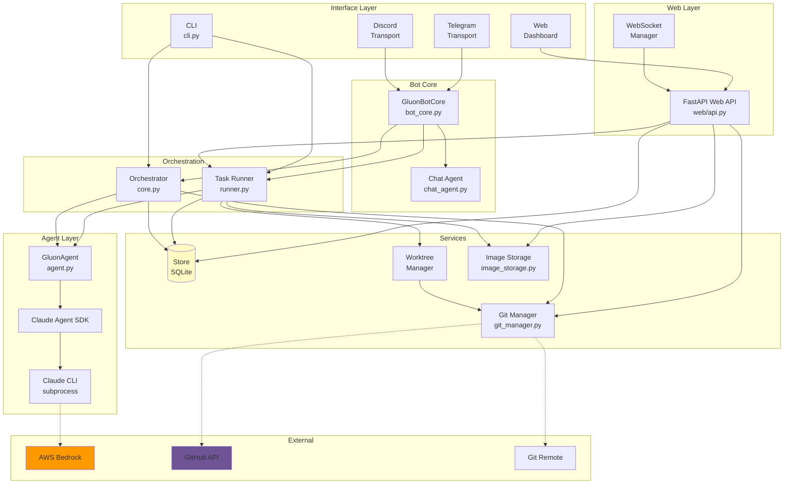
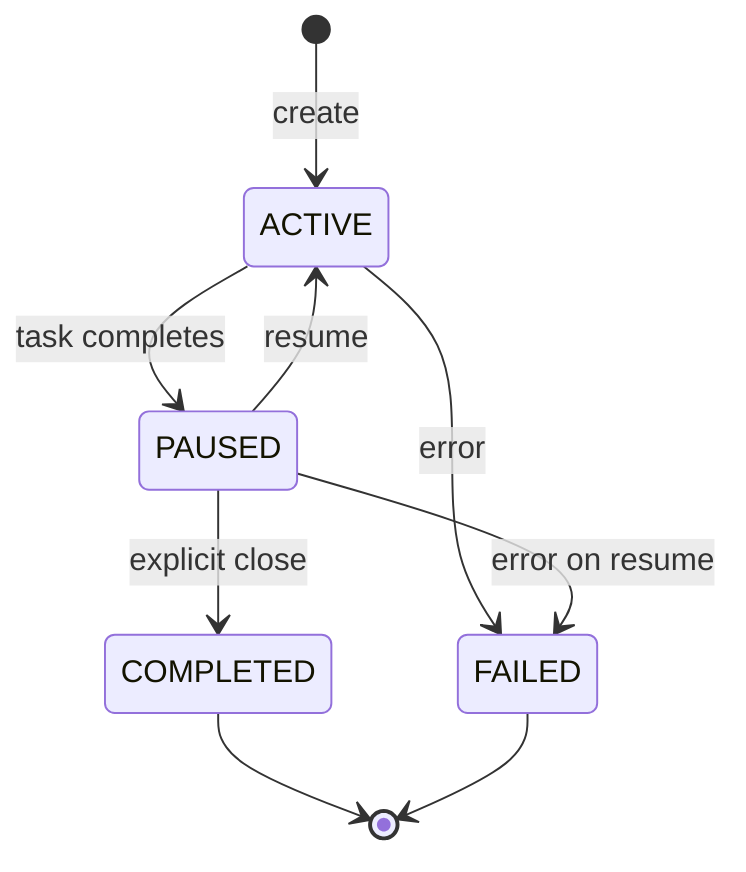
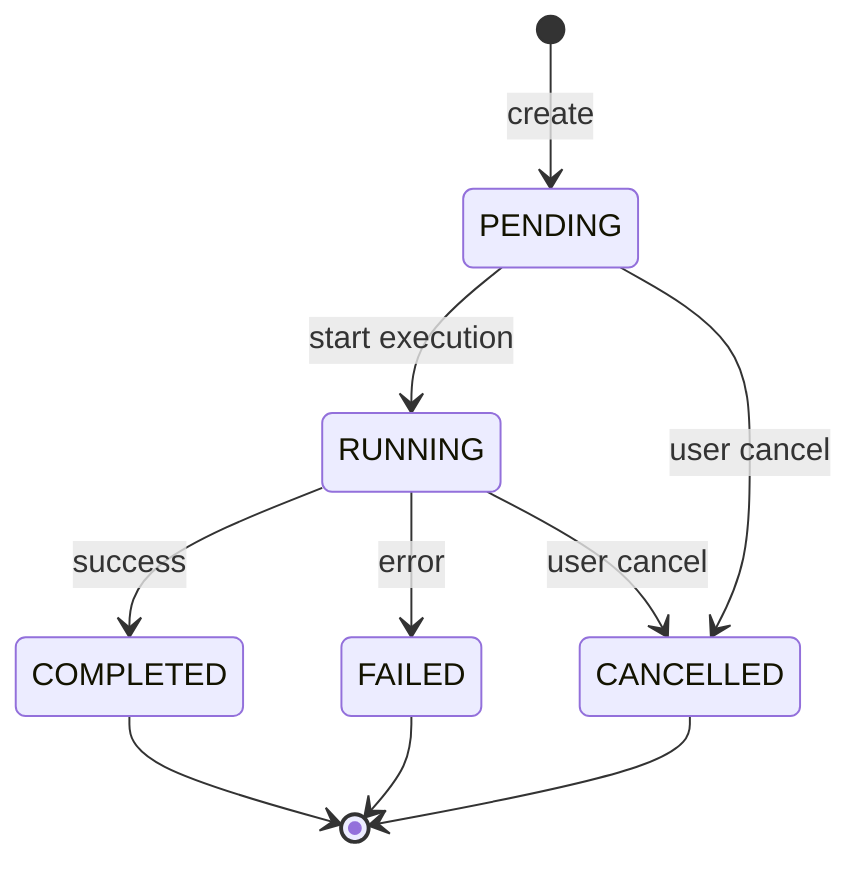
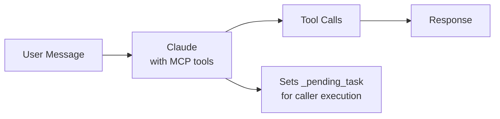
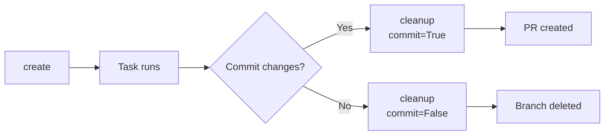
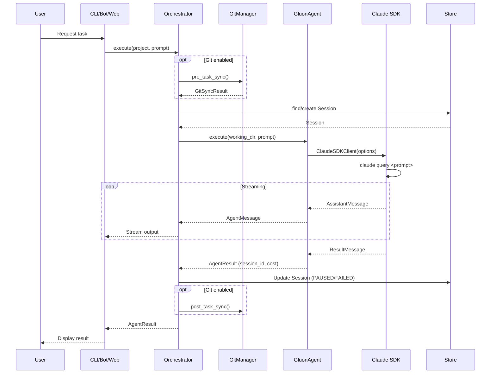
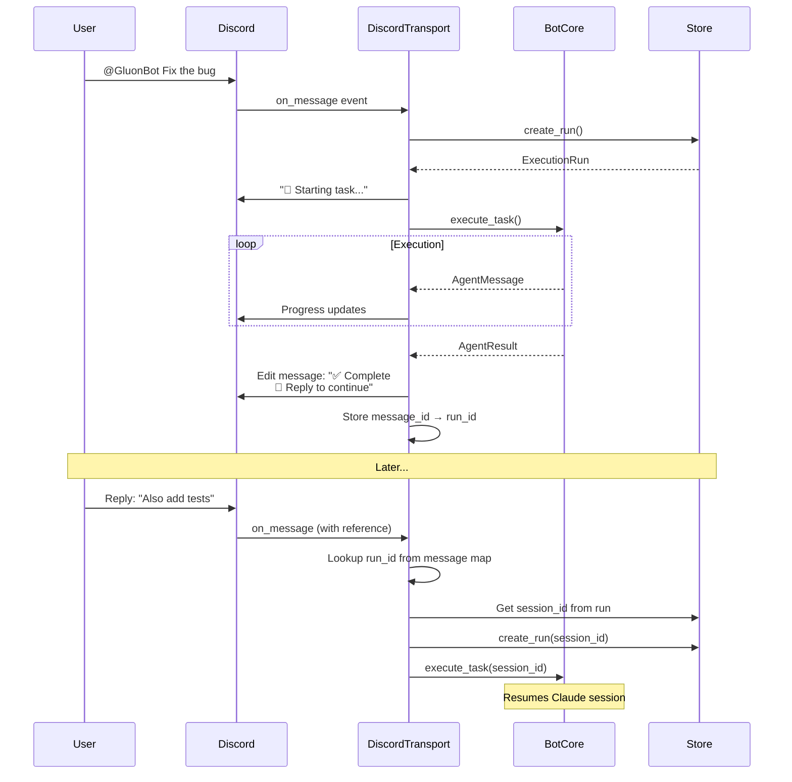
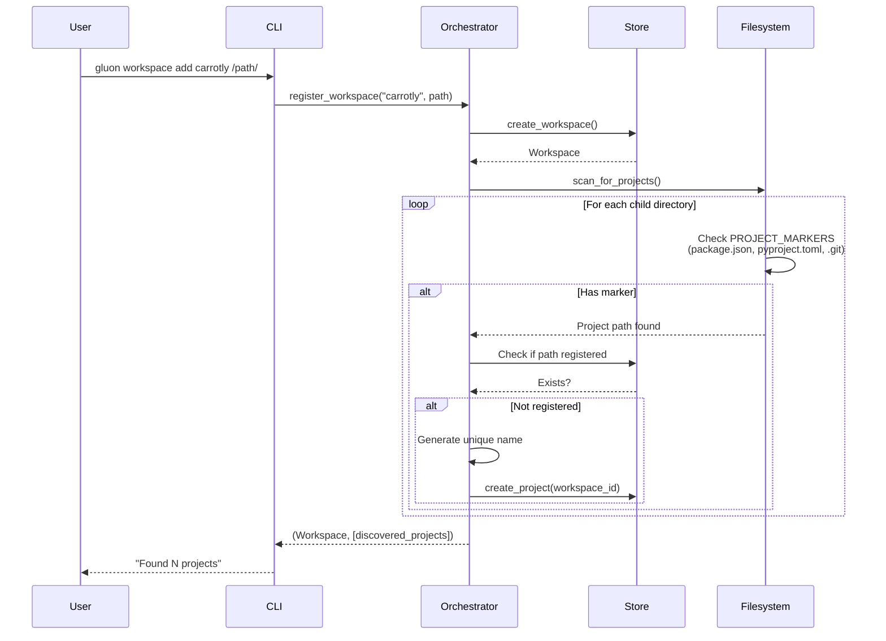

# Gluon Agent Architecture

## Overview

Gluon Agent is an AI orchestrator that manages multiple Claude Code agents across different software projects. It provides session persistence, resume capability, workspace-based project discovery, git synchronization, and multiple interfaces (CLI, Telegram bot, Discord bot).

## System Architecture



### Storage Layout

```
~/.gluon/
├── gluon.db           # SQLite database
├── images/            # Image attachments (content-addressed by SHA256)
│   └── {hash[:2]}/
│       └── {hash}.{ext}
└── logs/{run_id}/     # Per-run logs
    ├── stdout.log
    ├── stderr.log
    └── messages.jsonl

/tmp/gluon-worktrees/  # Temporary worktrees
└── wt-{run_id}/       # Branch: gluon-task/{run_id}
    └── .gluon-images/ # Copied images for AI visibility
```

### External Dependencies

| Dependency | Purpose |
|------------|---------|
| Claude Code CLI | claude-agent-sdk integration |
| python-telegram-bot | Telegram transport |
| discord.py | Discord transport |
| GitHub CLI (gh) | PR creation, merging, conflict detection |
| Git | Repository sync, worktrees, rebase |

## Component Details

### 1. Transport Layer (`transport/`)

Abstract interface for platform-specific bot implementations.

#### Base Classes (`transport/base.py`)

```python
@dataclass
class TransportContext:
    transport: str          # 'telegram', 'discord', 'slack', etc.
    user_id: str            # Universal ID: '{transport}:{id}'
    chat_id: str            # Channel/conversation identifier
    thread_id: str | None   # Thread ID if applicable
    project_hint: str | None # Project name from context
    message_id: str | None  # Triggering message ID
    raw_data: dict          # Platform-specific metadata

@dataclass
class TransportResponse:
    text: str               # Message text
    thread_id: str | None   # Thread to send into
    reply_to_id: str | None # Message to reply to
    parse_mode: str         # 'plain', 'markdown', 'html'
    editable: bool          # May be edited later

class Transport(ABC):
    @property
    @abstractmethod
    def name(self) -> str: ...

    @property
    @abstractmethod
    def capabilities(self) -> TransportCapabilities: ...

    @abstractmethod
    async def send(ctx, response) -> str: ...

    @abstractmethod
    async def edit(ctx, message_id, response) -> bool: ...

    @abstractmethod
    async def send_typing(ctx) -> None: ...

    async def create_thread(ctx, name, message_id) -> str | None:
        return None  # Optional, not all transports support threads

    @abstractmethod
    async def start() -> None: ...

    @abstractmethod
    async def stop() -> None: ...
```

#### Transport Capabilities (`transport/capabilities.py`)

```python
@dataclass
class TransportCapabilities:
    max_message_length: int     # Max characters per message
    supports_threads: bool      # Can create threads
    supports_editing: bool      # Can edit sent messages
    supports_typing: bool       # Can show typing indicator
    supports_formatting: bool   # Supports markdown/rich text
```

#### Implementations

- **TelegramTransport** (`transport/telegram.py`) - Telegram bot with natural language support
- **DiscordTransport** (`transport/discord.py`) - Discord bot with channel-project mapping

### 2. Models (`models.py`)

Pydantic models defining the core data structures.

#### Workspace
```python
class Workspace(BaseModel):
    id: str                    # UUID
    name: str                  # Unique human-readable name
    path: Path                 # Absolute path to workspace directory
    scan_depth: int = 1        # How deep to scan for projects
    auto_discover: bool = True # Auto-discover new projects
    ignore_patterns: list[str] # Patterns to ignore (e.g., node_modules)
```

**Key Method:** `scan_for_projects()` - Scans immediate children for project markers.

#### Project
```python
class Project(BaseModel):
    id: str                      # UUID
    name: str                    # Unique human-readable name
    path: Path                   # Absolute path to project directory
    workspace_id: str | None     # FK to Workspace (None = standalone)
    metadata: dict | None        # Optional extra data
```

#### Session
```python
class Session(BaseModel):
    id: str                        # Internal UUID
    project_id: str                # FK to Project
    claude_session_id: str | None  # Claude SDK session ID (for resume)
    status: SessionStatus          # active, paused, completed, failed
    last_prompt: str | None        # Last user prompt
    total_cost_usd: float          # Accumulated cost
    total_turns: int               # Number of turns
```

**Status Lifecycle:**



#### ExecutionRun
```python
class ExecutionRun(BaseModel):
    id: str                      # UUID
    project_id: str              # FK to Project
    session_id: str | None       # FK to Session (linked after execution)
    pid: int | None              # Process ID when running
    status: RunStatus            # pending, running, completed, failed, cancelled
    prompt: str                  # Task prompt
    initiator: str | None        # Who started: 'telegram:123', 'discord:456', 'cli'
    thread_id: str | None        # Discord/Slack thread ID
    log_path: Path | None        # Path to log files
    error_message: str | None    # Error if failed
```

**Run Status Lifecycle:**



#### ChannelMapping
```python
class ChannelMapping(BaseModel):
    id: str                 # UUID
    transport: str          # 'telegram', 'discord'
    channel_id: str         # Platform-specific channel ID
    project_id: str         # FK to Project
    project_name: str       # Cached project name
```

#### GitStatus
```python
class GitStatus(BaseModel):
    is_git_repo: bool
    branch: str | None
    remote: str | None
    remote_url: str | None
    has_uncommitted: bool
    uncommitted_count: int
    commits_ahead: int
    commits_behind: int
    is_diverged: bool        # Property: ahead > 0 and behind > 0
    last_fetch_at: datetime | None
    last_push_at: datetime | None
    last_commit_at: datetime | None
```

### 3. Store (`store.py`)

SQLite persistence layer with CRUD operations for all entities.

**Tables:**
- `workspaces` - Workspace metadata
- `projects` - Project registry with git status columns
- `sessions` - Session tracking with Claude session IDs
- `execution_runs` - Background task tracking
- `channel_mappings` - Transport channel to project mappings

**Key Methods:**
```python
# Workspace operations
create_workspace(name, path) -> Workspace
get_workspace(id) -> Workspace | None
list_workspaces() -> list[Workspace]

# Project operations
create_project(name, path, metadata?, workspace_id?) -> Project
get_project(id) -> Project | None
get_project_by_name(name) -> Project | None
list_projects() -> list[Project]
list_projects_by_workspace(workspace_id) -> list[Project]

# Session operations
create_session(project_id, prompt?) -> Session
get_session(id) -> Session | None
get_latest_session(project_id, statuses?) -> Session | None
list_sessions(project_id?) -> list[Session]
get_active_sessions() -> list[Session]

# Run operations
create_run(project_id, prompt, initiator?) -> ExecutionRun
get_run(id) -> ExecutionRun | None
get_run_by_short_id(short_id) -> ExecutionRun | None
get_run_by_thread_id(thread_id) -> ExecutionRun | None
list_runs(project_id?, statuses?, initiator?, limit?) -> list[ExecutionRun]
list_active_runs() -> list[ExecutionRun]

# Channel mapping operations
create_channel_mapping(transport, channel_id, project_id, project_name) -> ChannelMapping
get_channel_mapping(transport, channel_id) -> ChannelMapping | None
list_channel_mappings(transport?) -> list[ChannelMapping]

# Git status operations
get_git_status(project_id) -> GitStatus | None
update_git_status(project_id, status) -> None
```

### 4. Agent (`agent.py`)

Wrapper around Claude Agent SDK.

**Key Class: `GluonAgent`**

```python
class GluonAgent:
    def __init__(
        model: str = "sonnet",
        allowed_tools: list[str] = DEFAULT_TOOLS,
        permission_mode: str = "acceptEdits"
    )

    async def execute(
        working_dir: Path,
        prompt: str,
        resume_session_id: str | None = None
    ) -> AsyncIterator[AgentMessage | AgentResult]
```

**Message Types:**
- `AgentMessage` - Streaming messages (text, tool_use, system, error)
- `AgentResult` - Final result with session_id, cost, turns, success

**Claude SDK Integration:**
```python
options = ClaudeAgentOptions(
    cwd=working_dir,
    allowed_tools=["Read", "Write", "Edit", "Bash", "Glob", "Grep", "Task", "TodoWrite"],
    permission_mode="acceptEdits",
    model="sonnet",
    resume=previous_session_id,  # For session resume
)
```

### 5. GitManager (`git_manager.py`)

Handles git synchronization for projects.

**Key Methods:**
```python
async def refresh_status(project) -> GitStatus
async def pre_task_sync(project) -> GitSyncResult  # Auto-commit, fetch, ff
async def post_task_sync(project, message, session_id?, run_id?) -> GitSyncResult  # Commit, push
async def start_background_sync() -> None  # Periodic fetch for all projects
async def stop_background_sync() -> None
```

**Sync Flows:**

Pre-task:
1. Auto-commit uncommitted changes
2. Fetch from remote
3. Fast-forward if behind (fails if diverged)

Post-task:
1. Stage and commit all changes
2. Push to remote (with retry on conflict)

### 6. GluonBotCore (`bot_core.py`)

Transport-agnostic shared bot logic.

**Key Responsibilities:**
- Message history per user
- Concurrency management (semaphore)
- Task registration and cancellation
- Project resolution
- Run info extraction from messages
- Command formatting

**Key Methods:**
```python
async def execute_task(ctx, run, project_name, send_callback, model?,
                       force_new_session?, session_id?, ...) -> None
async def process_natural_language(ctx, text, send_callback, reply_context?) -> dict | None
def format_projects_list(filter_term?, limit?) -> str
def format_runs_list(initiator?, limit?) -> str
def format_status() -> str
def recover_stale_runs(transport_prefix) -> int
```

### 7. Orchestrator (`core.py`)

Central coordinator connecting all components.

**Key Methods:**
```python
# Project Management
register_project(name, path, metadata?) -> Project
get_project(name_or_id) -> Project
list_projects() -> list[Project]
remove_project(name_or_id) -> bool

# Workspace Management
register_workspace(name, path, auto_scan?) -> tuple[Workspace, list[Project]]
get_workspace(name_or_id) -> Workspace
list_workspaces() -> list[Workspace]
remove_workspace(name_or_id, remove_projects?) -> bool
scan_workspace(name_or_id) -> list[Project]
refresh_all_workspaces() -> dict[str, list[Project]]

# Session Management
list_sessions(project_name?) -> list[Session]
get_session(session_id) -> Session | None
get_active_sessions() -> list[Session]
get_resumable_session(project) -> Session | None

# Run Management
list_runs(project_name?, active_only?, limit?) -> list[ExecutionRun]
get_run(run_id) -> ExecutionRun | None
cancel_run(run_id) -> tuple[bool, str]

# Execution
async execute(project_name, prompt, force_new?, model?, run_id?, session_id?)
    -> AsyncIterator[AgentMessage | AgentResult]
async resume(project_name, prompt?, model?) -> AsyncIterator[AgentMessage | AgentResult]

# Git Operations
async get_git_status(project_name) -> GitStatus | None
async git_sync(project_name) -> tuple[bool, str]
async git_push(project_name, commit_message) -> tuple[bool, str]
async git_fetch(project_name) -> tuple[bool, str]

# Status
status() -> dict
```

### 8. Chat Agent (`chat_agent.py`)

Natural language interface using Claude to interpret commands.

**MCP Tools Exposed:**
- `list_projects` - List all projects
- `list_sessions` - List sessions for a project
- `get_status` - Get overall status
- `run_task` - Run a task on a project
- `resume_session` - Resume last session
- `add_workspace` - Register a workspace
- `list_workspaces` - List workspaces
- `scan_workspace` - Scan for new projects
- `list_runs` - List execution runs
- `cancel_run` - Cancel a running task
- `get_git_status` - Get git status for a project

**Usage Flow:**



### 9. CLI (`cli.py`)

Typer-based command interface.

**Command Groups:**
```
gluon project add/list/remove      # Project management
gluon workspace add/list/scan/remove  # Workspace management
gluon run/resume/sessions/status   # Task execution
gluon runs/logs/cancel             # Background run management
gluon git status/fetch/sync/push   # Git operations
gluon bot/discord/serve            # Bot interfaces
```

### 10. Runner (`runner.py`)

Background task execution with subprocess management.

**Key Classes:**
- `TaskRunner` - Manages background task execution
- Log file management (stdout, stderr, messages.jsonl)
- Process lifecycle management

### 11. WorktreeManager (`worktree.py`)

Manages isolated git worktrees for task execution.

**Key Methods:**
```python
async def create(run_id: str) -> Path
    # Creates worktree at /tmp/gluon-worktrees/wt-{run_id}
    # Creates branch gluon-task/{run_id}
    # Copies .env files and config

async def cleanup(commit_changes: bool | None = None) -> WorktreeResult
    # Commits changes if any
    # Removes worktree directory
    # Optionally merges to source branch
```

**Worktree Lifecycle:**



### 12. ImageStorage (`image_storage.py`)

Content-addressed image storage with deduplication.

**Key Methods:**
```python
def save_image(data: bytes, original_name: str, mime_type: str | None) -> ImageAttachment
    # Computes SHA256 hash
    # Stores at ~/.gluon/images/{hash[:2]}/{hash}.{ext}
    # Returns existing if duplicate

def copy_to_worktree(run_id: str, worktree_path: Path) -> list[str]
    # Copies attached images to {worktree_path}/.gluon-images/
    # Returns list of copied file paths for AI visibility

def list_images_for_run(run_id: str) -> list[ImageAttachment]
    # Returns all images attached to a run
```

**Storage Schema:**
```
~/.gluon/images/
├── ab/
│   └── abcdef123456...789.png
├── cd/
│   └── cdef456789...abc.jpg
```

### 13. Web API (`web/api.py`)

FastAPI-based REST API and WebSocket server.

**Key Features:**
- 50+ REST endpoints for runs, projects, workspaces, usage, images, git operations
- WebSocket endpoint at `/api/ws` for real-time updates
- Background polling task (every 2s) for status changes
- Serves React SPA from `web/dist/`

**WebSocket Manager (`web/websocket.py`):**
```python
class WebSocketManager:
    async def broadcast_run_created(run, project_name)
    async def broadcast_run_update(run, project_name)
    async def stream_log_line(run_id, stream, line)
```

**API Endpoint Categories:**
- Runs: CRUD, cancel, resume, archive, logs
- Projects: CRUD, git status, conflicts, rebase
- Workspaces: CRUD, scan
- Usage: summary, by-project, by-day, runs
- Images: upload, serve, attach/detach
- Git: commits, files, create-pr, merge, force-push

## Data Flow

### Task Execution Flow



### Message-Based Session Resume (Discord)



### Workspace Discovery Flow



## Database Schema

```sql
CREATE TABLE workspaces (
    id TEXT PRIMARY KEY,
    name TEXT UNIQUE NOT NULL,
    path TEXT NOT NULL,
    created_at TEXT NOT NULL,
    updated_at TEXT NOT NULL,
    scan_depth INTEGER DEFAULT 1,
    auto_discover INTEGER DEFAULT 1,
    ignore_patterns TEXT  -- JSON array
);

CREATE TABLE projects (
    id TEXT PRIMARY KEY,
    name TEXT UNIQUE NOT NULL,
    path TEXT NOT NULL,
    workspace_id TEXT REFERENCES workspaces(id) ON DELETE SET NULL,
    created_at TEXT NOT NULL,
    updated_at TEXT NOT NULL,
    metadata TEXT,  -- JSON blob
    -- Git status columns
    git_is_repo INTEGER DEFAULT 0,
    git_branch TEXT,
    git_remote TEXT,
    git_remote_url TEXT,
    git_uncommitted_count INTEGER DEFAULT 0,
    git_commits_ahead INTEGER DEFAULT 0,
    git_commits_behind INTEGER DEFAULT 0,
    git_last_fetch_at TEXT,
    git_last_push_at TEXT,
    git_last_commit_at TEXT
);

CREATE TABLE sessions (
    id TEXT PRIMARY KEY,
    project_id TEXT NOT NULL REFERENCES projects(id) ON DELETE CASCADE,
    claude_session_id TEXT,  -- From Claude SDK, for resume
    status TEXT NOT NULL DEFAULT 'active',
    created_at TEXT NOT NULL,
    updated_at TEXT NOT NULL,
    last_prompt TEXT,
    total_cost_usd REAL DEFAULT 0.0,
    total_turns INTEGER DEFAULT 0
);

CREATE TABLE execution_runs (
    id TEXT PRIMARY KEY,
    session_id TEXT REFERENCES sessions(id) ON DELETE SET NULL,
    project_id TEXT NOT NULL REFERENCES projects(id) ON DELETE CASCADE,
    pid INTEGER,
    status TEXT NOT NULL DEFAULT 'pending',
    prompt TEXT NOT NULL,
    initiator TEXT,
    thread_id TEXT,
    created_at TEXT NOT NULL,
    started_at TEXT,
    completed_at TEXT,
    exit_code INTEGER,
    log_path TEXT,
    error_message TEXT
);

CREATE TABLE channel_mappings (
    id TEXT PRIMARY KEY,
    transport TEXT NOT NULL,
    channel_id TEXT NOT NULL,
    project_id TEXT NOT NULL REFERENCES projects(id) ON DELETE CASCADE,
    project_name TEXT NOT NULL,
    created_at TEXT NOT NULL,
    UNIQUE(transport, channel_id)
);

-- Indexes
CREATE INDEX idx_workspaces_name ON workspaces(name);
CREATE INDEX idx_projects_name ON projects(name);
CREATE INDEX idx_projects_workspace ON projects(workspace_id);
CREATE INDEX idx_sessions_project ON sessions(project_id);
CREATE INDEX idx_sessions_status ON sessions(status);
CREATE INDEX idx_runs_project ON execution_runs(project_id);
CREATE INDEX idx_runs_status ON execution_runs(status);
CREATE INDEX idx_runs_initiator ON execution_runs(initiator);
CREATE INDEX idx_mappings_transport ON channel_mappings(transport);
CREATE INDEX idx_mappings_channel ON channel_mappings(transport, channel_id);
```

## Configuration

### Environment Variables

**Telegram:**
- `GLUON_TELEGRAM_TOKEN` - Telegram bot token
- `GLUON_TELEGRAM_USERS` - Comma-separated allowed user IDs

**Discord:**
- `GLUON_DISCORD_TOKEN` - Discord bot token
- `GLUON_DISCORD_GUILD` - Discord guild (server) ID
- `GLUON_DISCORD_USERS` - Comma-separated allowed user IDs

**Git:**
- `GLUON_GIT_ENABLED` - Enable/disable git sync (default: true)
- `GLUON_GIT_SYNC_INTERVAL` - Background fetch interval in seconds
- `GLUON_GIT_AUTO_COMMIT` - Auto-commit before/after tasks
- `GLUON_GIT_AUTO_PUSH` - Auto-push after tasks

### Environment Files (loaded in order)
1. `~/.gluon/.env` - Global config
2. `.env` - Project config
3. `.env.local` - Local overrides (highest priority)

### Data Storage
- Default database: `~/.gluon/gluon.db`
- Logs: `~/.gluon/logs/<run_id>/`

## Error Handling

### Exception Hierarchy
```python
ProjectNotFoundError    # Project not found by name/ID
ProjectExistsError      # Duplicate project name
WorkspaceNotFoundError  # Workspace not found by name/ID
WorkspaceExistsError    # Duplicate workspace name
GitSyncError            # Git sync failed (e.g., diverged branches)
```

### Session Error States
- On agent execution error: Session marked as `FAILED`
- On success: Session marked as `PAUSED` (ready for resume)
- On explicit completion: Session marked as `COMPLETED`

### Run Error States
- On agent error: Run marked as `FAILED` with error message
- On cancellation: Run marked as `CANCELLED`
- On success: Run marked as `COMPLETED` with exit_code=0
