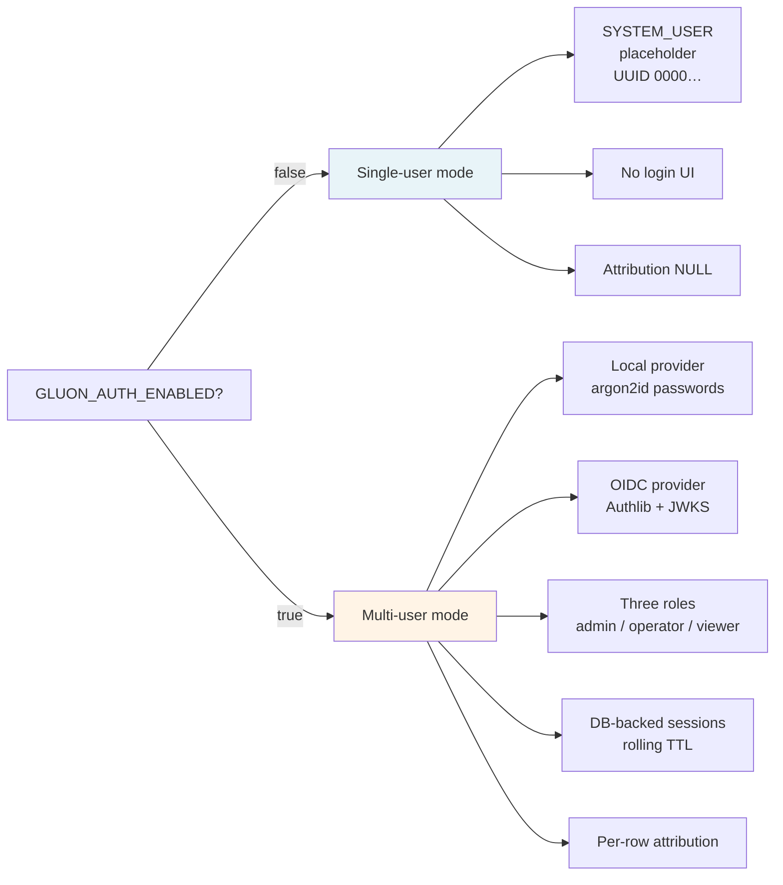
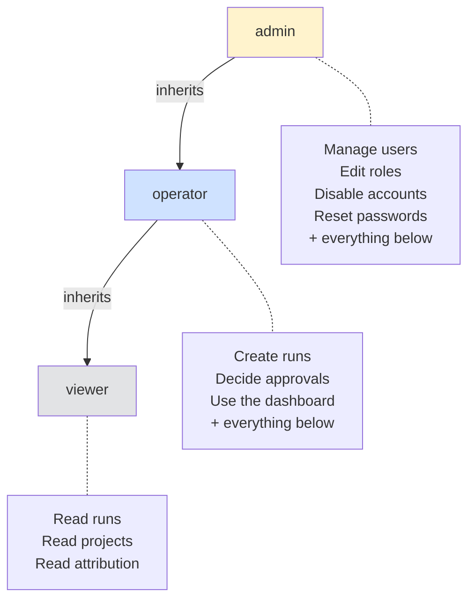
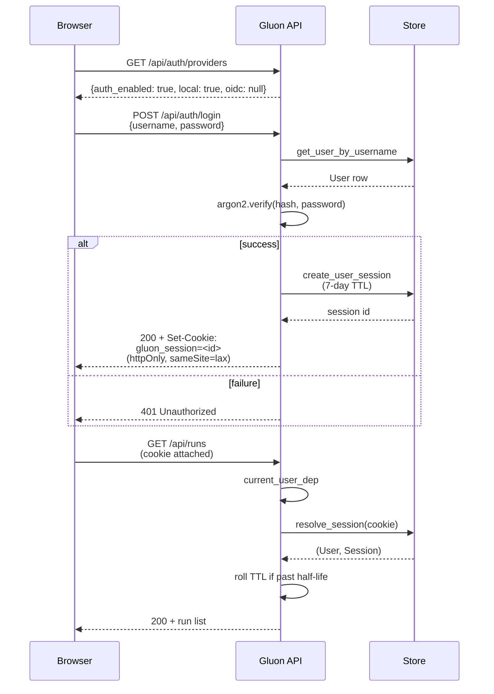
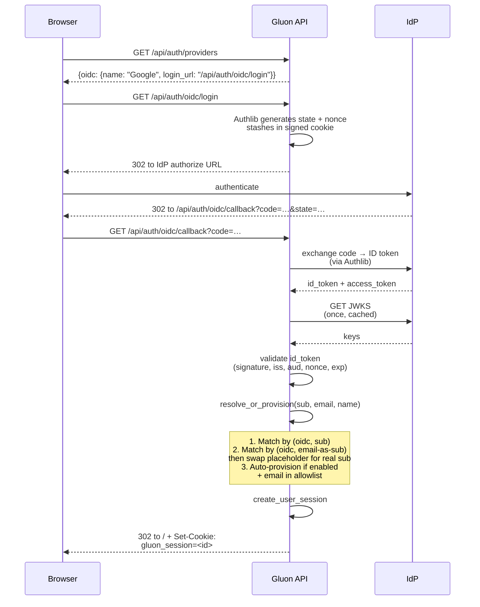
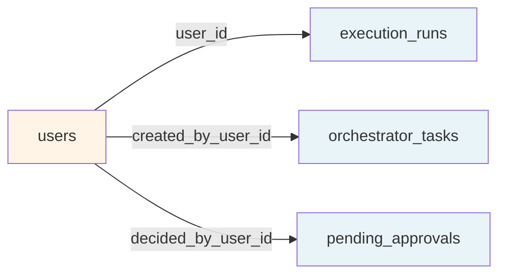
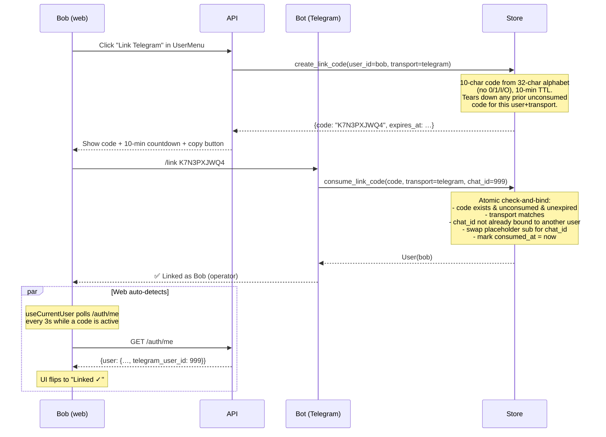

# Authentication & Access Control

Gluon ships with a fully optional multi-user auth system. **Single-user installs see zero behaviour change** until they explicitly opt in by setting `GLUON_AUTH_ENABLED=true`. When auth is on, Gluon supports local passwords, OIDC SSO (Auth0, Google Workspace, Cognito, Entra ID, Okta, ...), per-row attribution on every action, and self-serve chat-account linking from Telegram and Discord.

This is the canonical auth doc. Specialised topics live in:

- [`AUTH-OIDC.md`](AUTH-OIDC.md) — OIDC setup, provider-specific recipes, troubleshooting

---

## Table of contents

- [The single feature flag](#the-single-feature-flag)
- [Two operating modes](#two-operating-modes)
- [Architecture](#architecture)
- [Roles & RBAC](#roles--rbac)
- [Auth providers](#auth-providers)
  - [Local (password)](#local-password)
  - [OIDC (SSO)](#oidc-sso)
  - [SYSTEM_USER (single-user fallback)](#system_user-single-user-fallback)
- [Login flows](#login-flows)
- [Per-row attribution](#per-row-attribution)
- [Self-serve transport linking](#self-serve-transport-linking)
- [CLI commands](#cli-commands)
- [Web dashboard UI](#web-dashboard-ui)
- [Sessions, cookies & rotation](#sessions-cookies--rotation)
- [Periodic cleanup](#periodic-cleanup)
- [Migrating an existing single-user install](#migrating-an-existing-single-user-install)
- [Security model](#security-model)
- [Environment variable reference](#environment-variable-reference)

---

## The single feature flag

```
GLUON_AUTH_ENABLED=false   # default — single-user mode, no login UI, no role checks
GLUON_AUTH_ENABLED=true    # multi-user mode — local + OIDC providers as configured
```

This **one flag** rules everything. When false:

- The dashboard renders without a login screen — `useCurrentUser` resolves to `SYSTEM_USER`
- All API endpoints accept requests without sessions
- Attribution columns (`runs.user_id`, `tasks.created_by_user_id`, `approvals.decided_by_user_id`) stay `NULL`
- The bots resolve approvals to `decided_by="telegram:<id>"` only — no Gluon user binding
- The CLI `gluon user *` commands still work (so you can pre-stage users before flipping the flag)

When true, the multi-user model engages — but only the providers you've actually configured become usable. Local is on by default; OIDC requires its own env vars (see [OIDC setup](AUTH-OIDC.md)).

---

## Two operating modes



---

## Architecture

```mermaid
graph TB
    subgraph Clients
        WEB[Web Dashboard]
        CLI[CLI]
        TG[Telegram Bot]
        DC[Discord Bot]
    end

    subgraph "Auth Layer (gluon.auth)"
        GATE[is_auth_enabled]
        DEP[current_user_dep<br/>FastAPI dependency]
        REQ[require_role<br/>admin/operator/viewer gate]
        LOC[LocalAuthProvider<br/>argon2id]
        OIDC[OIDCAuthProvider<br/>Authlib]
        SESS[Session helpers<br/>create / resolve / sweep]
    end

    subgraph "Store (SQLite)"
        UT[(users)]
        UST[(user_sessions)]
        LCT[(link_codes)]
        ATT[(runs / tasks / approvals<br/>+ user_id columns)]
    end

    WEB -->|cookie| DEP
    CLI -->|local-only<br/>direct store access| UT
    TG -->|chat ID| LOC
    DC -->|chat ID| OIDC

    DEP --> GATE
    GATE -.->|"false"| SYSTEM[SYSTEM_USER fallback]
    GATE -->|"true"| LOC
    GATE --> OIDC

    LOC --> UT
    OIDC --> UT
    SESS --> UST
    DEP --> SESS
    REQ --> DEP

    LCT --> UT
    ATT --> UT

    style SYSTEM fill:#e8f4f8
    style GATE fill:#fff4e6
```



**Key invariants:**

- Every request that touches a user-attributable action (create run, decide approval, etc.) goes through `current_user_dep`.
- `current_user_dep` returns `SYSTEM_USER` when auth is off, the resolved `User` when on, or raises 401 when on but no valid session.
- Each `User` is permanently bound to **one** `auth_provider` (`local` / `oidc` / `system`). No provider-switching after creation.

---

## Roles & RBAC



Implemented as `_role_rank` in `gluon.auth`: `admin = 3, operator = 2, viewer = 1`. `require_role(min=operator)` passes admins and operators, blocks viewers.

| Role | API access | UI access |
|---|---|---|
| `admin` | All endpoints, including `/api/users/*` | Everything + `/admin/users` |
| `operator` | Create runs/tasks, decide approvals, change own password | Dashboard + everything except admin screens |
| `viewer` | Read-only on everything | Dashboard in read-only style |

`SYSTEM_USER` carries `role=admin` (single-user mode = full access).

---

## Auth providers

The `AuthProviderConfig` ABC in `src/gluon/auth.py` is the strategy interface. Three concrete implementations.

### Local (password)

argon2id-hashed passwords stored in `users.auth_subject`. Default provider.

| Knob | Default | Purpose |
|---|---|---|
| `GLUON_LOCAL_AUTH_ENABLED` | `true` | Set `false` for OIDC-only mode (disables `/api/auth/login`) |
| `GLUON_AUTH_BACKEND` | `local` | Legacy single-provider selector — used by `get_auth_provider()` for the CLI |

```bash
# Seed the first admin (works regardless of GLUON_AUTH_ENABLED)
gluon user add alice --role admin
# prompts for password (12+ chars)
```

The library autoamtically uses argon2id with sane defaults (~100ms verify time). Passwords are checked for rehash-needed on every successful verify and silently upgraded.

### OIDC (SSO)

OpenID Connect via Authlib's discovery client. Pairs with Auth0, Google Workspace, AWS Cognito, Microsoft Entra ID, Okta, Keycloak, or any spec-compliant IdP. Coexists with local — the login page shows both options when both are configured.

See **[`AUTH-OIDC.md`](AUTH-OIDC.md)** for full setup, provider recipes, troubleshooting.

```bash
# Pre-register an OIDC user (admin doesn't need to know the IdP's `sub` yet)
gluon user add alice --auth-provider oidc --email alice@org.example --role admin
```

### SYSTEM_USER (single-user fallback)

A singleton with deterministic UUID `00000000-0000-0000-0000-000000000000`. Never persisted. Returned by `current_user_dep` when `GLUON_AUTH_ENABLED=false`. Carries `role=admin` because in single-user mode the operator holding the DB file has full authority.

Attribution columns stay `NULL` for actions performed as SYSTEM_USER — we deliberately never write the placeholder UUID into FK columns.

---

## Login flows

### Local password flow



### OIDC flow



Authlib handles the heavy lifting (state/nonce, PKCE if enabled, JWKS-backed JWT verification). We just provide the resolution policy.

---

## Per-row attribution

Every action-attributable row records *who* performed it via a nullable FK to `users(id)`:

| Table | Column | Set when |
|---|---|---|
| `execution_runs` | `user_id` | A user creates a run from web/bot/CLI. NULL for SYSTEM_USER actions. |
| `orchestrator_tasks` | `created_by_user_id` | A user adds a task to the work queue. |
| `pending_approvals` | `decided_by_user_id` | A user grants/denies an approval. |

The columns are nullable (no FK constraint) because:
- The `users` table only exists when `GLUON_AUTH_ENABLED=true`
- Pre-auth-era rows must remain valid
- SYSTEM_USER actions deliberately don't pollute audit trails

The legacy `pending_approvals.decided_by` string column (e.g. `"telegram:12345"`, `"web"`) is kept alongside the new FK for transport-side debugging — attribution is *additive*, not replacing.



The dashboard and audit trail surface the resolved username on every row.

---

## Self-serve transport linking

Telegram and Discord users can bind their chat identity to their Gluon account themselves — no admin involvement needed.



**Security properties:**

- **Code-only flow** — only the code travels to the bot; the user_id is server-side. A leaked code can only bind the *original requester's* account.
- **No silent takeover** — if chat ID 999 is already bound to alice, bob's code can't bind to it. Returns `chat_taken` error.
- **Single active code per (user, transport)** — generating a new code invalidates the old.
- **TTL: 10 min** by default. Expired codes refused; swept hourly by `delete_expired_link_codes`.
- **Case + whitespace tolerant** on input (autocorrect-friendly), but case-folded server-side.

After linking, every approval and run from chat is attributed to the bound user via `bot_core.resolve_user_id_by_chat_id(transport, chat_id)`.

For details, the bot-specific commands are in [`TELEGRAM-BOT.md`](TELEGRAM-BOT.md#account-linking) and [`DISCORD-BOT.md`](DISCORD-BOT.md#account-linking).

---

## CLI commands

The `gluon user *` namespace is the bootstrap path — it works regardless of `GLUON_AUTH_ENABLED` so you can seed users before flipping the flag.

```bash
# Create users
gluon user add alice --role admin                                                # local password
gluon user add alice --auth-provider oidc --email alice@org.example --role admin # OIDC pre-reg
gluon user add alice --auth-provider oidc --auth-subject 'auth0|abc123' --email alice@org.example

# Inspect
gluon user list                       # all users
gluon user list --include-disabled    # include soft-deleted
gluon user show alice                 # detail view

# Modify
gluon user set-role alice operator    # admin / operator / viewer
gluon user set-password alice         # prompts; admin can change anyone's password
gluon user disable alice              # soft delete + invalidate sessions
gluon user enable alice               # re-enable
```

| Command | Description |
|---|---|
| `gluon user add` | Create a user. `--auth-provider local` (default) prompts for password; `--auth-provider oidc` requires `--email` or `--auth-subject` for binding. |
| `gluon user list` | Tabular list. Disabled users hidden unless `--include-disabled`. |
| `gluon user show` | Full detail of one user. |
| `gluon user disable` | Soft-delete (preserves attribution links) + invalidates active sessions. |
| `gluon user enable` | Restore a disabled user. |
| `gluon user set-role` | Change role. Rotates user's sessions. |
| `gluon user set-password` | Reset password. Admin-only for changing other users; non-admins must supply current password. |

See [`CLI-REFERENCE.md`](CLI-REFERENCE.md#user-management) for the full reference.

---

## Web dashboard UI

When `GLUON_AUTH_ENABLED=true` and no session, the dashboard renders a `LoginPage` that auto-detects available providers via `GET /api/auth/providers`:

| Server config | Login page renders |
|---|---|
| Local only | Username/password form |
| OIDC only | "Sign in with {ProviderName}" button |
| Local + OIDC | OIDC button + divider + password form |
| Neither | Friendly empty state ("No auth methods configured") |

After login, the **header user-menu** shows:

- Avatar with initials
- Display name + role badge (admin / operator / viewer)
- **Inline change-password form** (hidden for OIDC users)
- **Connected accounts** panel (D5 Phase 4) — link/unlink Telegram + Discord with one-time codes
- **Manage users** shortcut — admins only — opens `/admin/users`
- **Sign out**

The **`/admin/users`** screen is admin-only (gated by `AdminUsersGuard`):

- Tabular list with role badges + last-seen timestamps
- Inline edit row (display name, email, role, disabled toggle, Telegram/Discord IDs)
- Reset-password form (admin doesn't need to know current password)
- Soft-delete with inline confirm

See [`WEB-DASHBOARD.md`](WEB-DASHBOARD.md#multi-user-auth-ui) for screenshots and detailed behaviour.

---

## Sessions, cookies & rotation

Sessions are **DB-backed**, not JWT — server-side logout works, sessions can be rotated independently of token expiry, and there's no token-revocation list to maintain.

| Property | Value |
|---|---|
| Storage | `user_sessions` table (id, user_id, created_at, expires_at, last_seen_at, ip, user_agent) |
| TTL | 7 days default, rolled forward when past half-life |
| Cookie | `gluon_session` — httpOnly, sameSite=lax, secure on HTTPS |
| Rotation | All of a user's sessions are wiped on: password change, role change, disable, OIDC reset |

The OAuth state cookie used during the OIDC redirect dance is a **separate** signed cookie carrying state+nonce only; it has a 10-minute max-age and is cleared after the callback. Set `GLUON_OIDC_SESSION_SECRET` in multi-replica deployments so all replicas can verify each other's redirects.

---

## Periodic cleanup

A background task (`_sweep_auth_state` in `gluon.web.api`) runs hourly to delete:

1. Expired `user_sessions` rows
2. Unconsumed-but-expired `link_codes` (consumed codes are kept as audit trail)

Tunable via `GLUON_AUTH_SWEEP_INTERVAL_SECS` (default `3600`). Mirrors the existing `_cleanup_old_logs` / `_cleanup_old_worktrees` pattern; gracefully cancelled at app shutdown.

---

## Migrating an existing single-user install

The migration is **zero-effort by default** — your existing database already has the auth tables (added in Phase 1) but they're empty. Schema migrations run automatically on next startup.

To upgrade to multi-user:

```bash
# 1. Seed the first admin while still in single-user mode
gluon user add alice --role admin

# 2. Flip the feature flag in your .env / docker-compose.yml
GLUON_AUTH_ENABLED=true

# 3. Restart Gluon
docker compose restart gluon-agent

# 4. Open the dashboard — login screen appears, sign in as alice

# 5. Add other users via /admin/users in the dashboard, or:
gluon user add bob --role operator --email bob@org.example
```

Pre-existing runs/tasks/approvals **keep `user_id=NULL`** — they predate the multi-user era. New rows from this point forward record attribution.

To roll back: set `GLUON_AUTH_ENABLED=false` and restart. The login screen disappears; everything reverts to single-user behaviour. Your `users` and `user_sessions` rows are preserved (so re-enabling later picks up where you left off) but ignored.

---

## Security model

| Concern | Mitigation |
|---|---|
| Brute-force on local passwords | argon2id with library defaults (~100ms per verify). For high-value deployments, set `GLUON_LOCAL_AUTH_ENABLED=false` and rely on OIDC's IdP-side rate limiting. |
| Session fixation | Sessions are server-issued opaque IDs (UUID4), never client-supplied. |
| CSRF | Cookies are `sameSite=lax`. State-changing endpoints require the session cookie, which doesn't fire on cross-origin POSTs. |
| OIDC token replay | Authlib validates `nonce` + `aud` + `iss` + `exp`. JWKS fetched from the IdP's `.well-known` endpoint and cached. |
| OIDC open-redirect via `?next=…` | Constrained to relative paths only; absolute URLs refused server-side. |
| Auto-provision abuse | Refused at config-load time without a `GLUON_OIDC_DOMAIN_ALLOWLIST` — defense-in-depth against accidental "any Google user can sign in" misconfig. |
| Chat-account hijacking | `consume_link_code` refuses to bind a chat ID already owned by a different user (`chat_taken`). |
| Disabled-user bypass | `resolve_session` cleans up sessions on disabled users. Bot transports check `user.disabled` before recording attribution. |
| Cookie theft | `httpOnly` + `secure` (on HTTPS) + `sameSite=lax`. Server-side rotation on credential change so a stolen cookie loses value if the user notices and resets. |

---

## Environment variable reference

### Top-level

| Variable | Default | Purpose |
|---|---|---|
| `GLUON_AUTH_ENABLED` | `false` | Master switch. When false, **all** auth is disabled. |
| `GLUON_AUTH_BACKEND` | `local` | Legacy single-provider selector (CLI uses this; `get_auth_provider()` resolution). |
| `GLUON_AUTH_SWEEP_INTERVAL_SECS` | `3600` | How often the background task sweeps expired sessions + link codes. |

### Local provider

| Variable | Default | Purpose |
|---|---|---|
| `GLUON_LOCAL_AUTH_ENABLED` | `true` | Set `false` for OIDC-only mode. The CLI `gluon user add` still works. |

### OIDC provider

See [`AUTH-OIDC.md`](AUTH-OIDC.md) for full reference. Required vars: `GLUON_OIDC_ISSUER`, `GLUON_OIDC_CLIENT_ID`, `GLUON_OIDC_CLIENT_SECRET`, `GLUON_OIDC_REDIRECT_URI`. Common optional: `GLUON_OIDC_PROVIDER_NAME`, `GLUON_OIDC_AUTO_PROVISION`, `GLUON_OIDC_DOMAIN_ALLOWLIST`, `GLUON_OIDC_DEFAULT_ROLE`, `GLUON_OIDC_SESSION_SECRET`.
