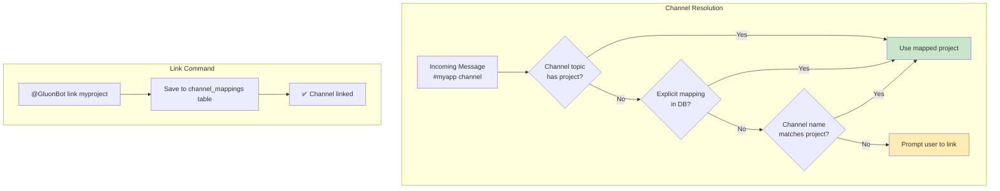
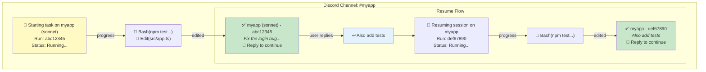
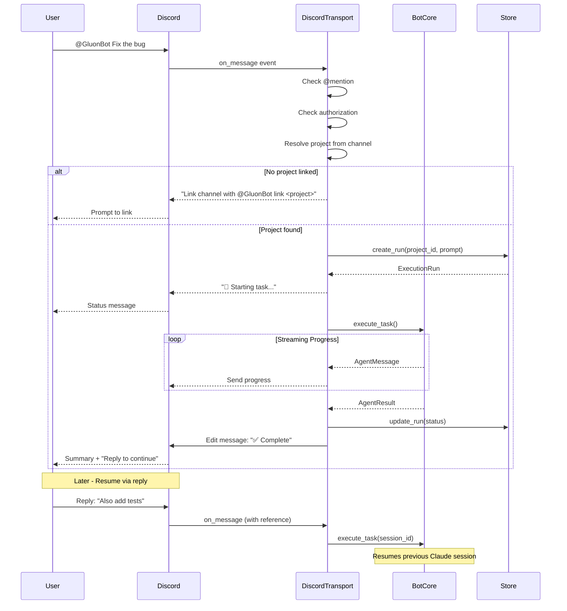
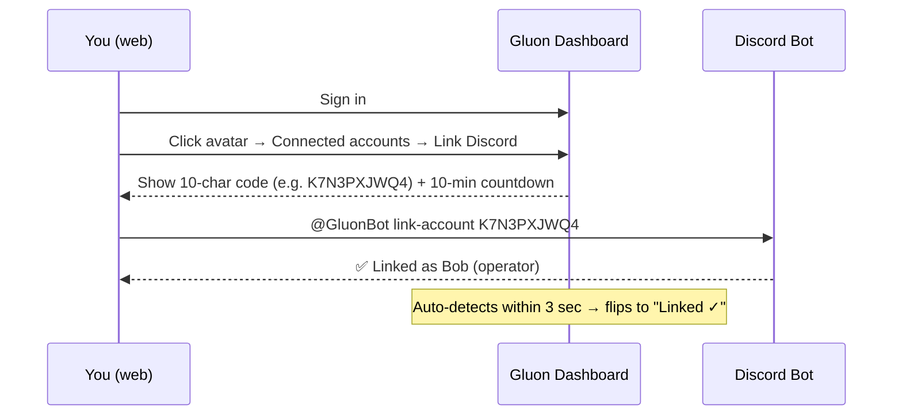

# Discord Bot

Run Gluon as a Discord bot with channel-based project mapping, DM support, real-time task streaming, and message-based session resume.

## Installation

Discord support is an optional dependency:

```bash
pip install 'gluon-agent[discord]'
# or for all optional features
pip install 'gluon-agent[all]'
```

## Setup

1. Go to [Discord Developer Portal](https://discord.com/developers/applications)
2. Create a New Application
3. Go to "Bot" tab and click "Add Bot"
4. Copy the bot token
5. Enable "MESSAGE CONTENT INTENT" in Bot settings
6. Go to "OAuth2" → "URL Generator"
7. Select scopes: `bot`, `applications.commands`
8. Select permissions: `Send Messages`, `Read Message History`
9. Copy the generated URL and open it to invite the bot to your server

Note: `Create Public Threads` is optional - message-based resume uses message replies instead.

## Run the Bot

```bash
# Set required environment variables
export GLUON_DISCORD_TOKEN="your-bot-token"
export GLUON_DISCORD_GUILD="your-guild-id"

# Optional: restrict to specific users (comma-separated Discord user IDs)
export GLUON_DISCORD_USERS="123456789,987654321"

# Start the bot
gluon discord

# Or pass options directly
gluon discord --token "token" --guild 123456789
```

## Commands

### Channel Commands
Mention the bot (`@GluonBot`) in channels:

| Command | Description |
|---------|-------------|
| `@GluonBot link <project>` | Link this **channel** to a project |
| `@GluonBot link-account <code>` | Bind your Discord **user account** to a Gluon user (D5 Phase 4 — see [Account linking](#account-linking)) |
| `@GluonBot unlink-account` | Remove the Gluon-account binding from your Discord user |
| `@GluonBot projects` | List registered projects |
| `@GluonBot runs` | List your runs |
| `@GluonBot status` | Show overall status |
| `@GluonBot models` | List available models |
| `@GluonBot cancel [run_id]` | Cancel a run (or last active if not specified) |
| `@GluonBot help` | Show command help |
| `@GluonBot <any task>` | Execute task on the linked project |

> **Naming note:** `link <project>` binds a *channel* to a *project* (existing). `link-account <code>` binds a *Discord user* to a *Gluon user* (new in D5 Phase 4). The keywords are distinct so a project name can't collide with a link code.

### Direct Message (DM) Commands
Send commands directly to the bot (no @mention required):

| Command | Description |
|---------|-------------|
| `project:myapp <task>` | Run task on specified project (task mode) |
| `<any message>` | Chat naturally (chat mode) |
| `projects` | List registered projects |
| `runs` | List your runs |
| `status` | Show overall status |
| `models` | List available models |
| `cancel [run_id]` | Cancel a run |
| `clear` | Clear conversation history |
| `link-account <code>` | Bind this Discord account to a Gluon user |
| `unlink-account` | Remove the Gluon binding |
| `help` | Show DM-specific help |

## Direct Messages (DM Support)

Gluon DMs support two modes:

### Task Mode
Execute a task on a specific project using project specifiers:

```
# Project prefix syntax
project:myapp Fix the login bug
p:myapp Add user authentication

# Flag syntax (also supported)
Fix the login bug --project myapp
Fix the login bug -p myapp
```

### Chat Mode
Chat naturally without a project specifier. The chat agent will:
- Answer questions about your projects
- Help with planning and analysis
- Suggest tasks if appropriate
- Maintain conversation history across messages

```
What projects do I have?
Help me plan the authentication feature
What would fix this bug?
```

Chat conversations maintain context, allowing natural follow-up questions. Use `clear` to reset history.

## Model Selection

Specify model tier using the `--model` or `-m` flag in your prompt:

```
@GluonBot Fix the bug --model opus
@GluonBot Quick fix --model haiku
@GluonBot Implement feature -m sonnet
```

| Model | Best For |
|-------|----------|
| `haiku` | Quick fixes, simple tasks |
| `sonnet` | Most coding tasks (default) |
| `opus` | Complex refactoring, architecture |

## Channel Topic Configuration

Configure default project and model by adding flags to your channel topic:

```
--project myapp --model opus
```

Supported formats:
- `--project myapp` or `-p myapp`
- `--model opus` or `-m opus`

Examples:
```
Our dev channel --project myapp --model sonnet
Production fixes --project prod-api -m opus
```

This allows the channel to auto-link to a project and use a specific model without explicit flags in every message.

## Channel-Project Mapping

Discord channels map to projects in multiple ways (in priority order):

1. **Channel topic** - Set `--project myapp` in the channel topic (see Channel Topic Configuration above)
2. **Explicit link** - Use `@GluonBot link <project>` to bind any channel (persisted in DB)
3. **Auto-match** - Channel name matches project name (e.g., `#myapp` → `myapp` project)

Once linked, all @mentions execute tasks on that project automatically.



## Message-Based Resume

Task execution uses Discord's reply feature for session continuity:

- Initial message shows task status and run ID
- Progress updates sent as follow-up messages (every 2 seconds)
- Tool calls are displayed in real-time (e.g., `🔧 Bash(command...)`)
- Completion message is edited with final status and "💬 Reply to continue" hint
- **Reply to any completion message to resume that session**

The session persistence is tracked in the database, so you can:
- Resume across multiple replies
- Resume even after the bot restarts
- Maintain conversation context



## Bot Flow



## Environment Variables

| Variable | Description |
|----------|-------------|
| `GLUON_DISCORD_TOKEN` | Discord bot token (required) |
| `GLUON_DISCORD_GUILD` | Discord guild (server) ID (required) |
| `GLUON_DISCORD_USERS` | Comma-separated list of allowed user IDs |

## Real-Time Tool Call Display

During task execution, the bot displays agent tool calls in real-time for visibility:

```
🔧 `Bash(npm test)`
🔧 `Edit(src/app.ts)`
🔧 `Read(package.json)`
🔧 `Bash(git diff)`
```

Common tool displays:
- `🔧 Bash(command...)` - Bash command execution
- `🔧 Edit(filepath)` - File editing
- `🔧 Read(filepath)` - File reading
- `🔧 Glob(pattern)` - File pattern search
- `🔧 Grep(search...)` - Content search
- `🔧 Write(filepath)` - File writing

Updates are sent approximately every 2 seconds to keep you informed of agent progress without overwhelming the chat.

## Account linking

When Gluon is running with `GLUON_AUTH_ENABLED=true` (multi-user mode), you can bind your Discord account to your Gluon user so approvals you grant from chat get attributed to you in the audit trail.

### Self-serve flow (recommended)



**Usage:**

```
@GluonBot link-account K7N3PXJWQ4    ← in any channel where the bot can read
@GluonBot unlink-account             ← remove the binding

# Or in DMs (no @mention needed):
link-account K7N3PXJWQ4
unlink-account
```

**Error messages and what to do:**

| Bot reply | Cause | Fix |
|---|---|---|
| ❌ That code doesn't exist | Typo or expired & swept | Generate a fresh code from the dashboard |
| ⏰ That code has expired | Past 10-min TTL | Generate a fresh code |
| ♻️ That code has already been used | Code already consumed | Generate a fresh one if you need to rebind |
| ❌ That code was generated for a different platform | Mixed up Telegram and Discord codes | Click "Link Discord" specifically |
| ❌ This Discord account is already linked to a different Gluon user | Discord ID already bound | Use that user's session to `unlink-account` first |

### Admin pre-registration (alternative)

An admin with dashboard access can bind your Discord numeric ID to your user record directly via `/admin/users` → Edit → Discord user ID. No code-passing needed; useful when bootstrapping a new team.

See [AUTH.md](AUTH.md#self-serve-transport-linking) for the full security model.

## Multi-Transport Mode

Run both Telegram and Discord simultaneously with a shared bot core:

```bash
# Set all required environment variables
export GLUON_TELEGRAM_TOKEN="telegram-token"
export GLUON_TELEGRAM_USERS="123456789"
export GLUON_DISCORD_TOKEN="discord-token"
export GLUON_DISCORD_GUILD="987654321"
export GLUON_DISCORD_USERS="111222333"

# Run both transports
gluon serve --telegram --discord
```

### Features

- **Shared project, session, and run state** - All transports read/write to the same SQLite database
- **Shared git background sync** - Single GitManager instance fetches for all transports
- **Shared concurrency limits** - Global semaphore prevents overload across all platforms
- **Cross-platform run visibility** - Users on any platform can see runs from other platforms
