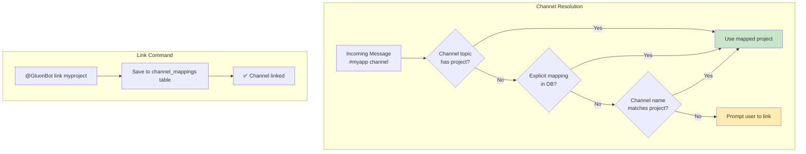
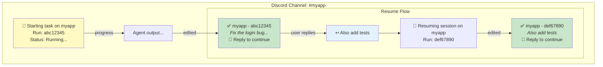
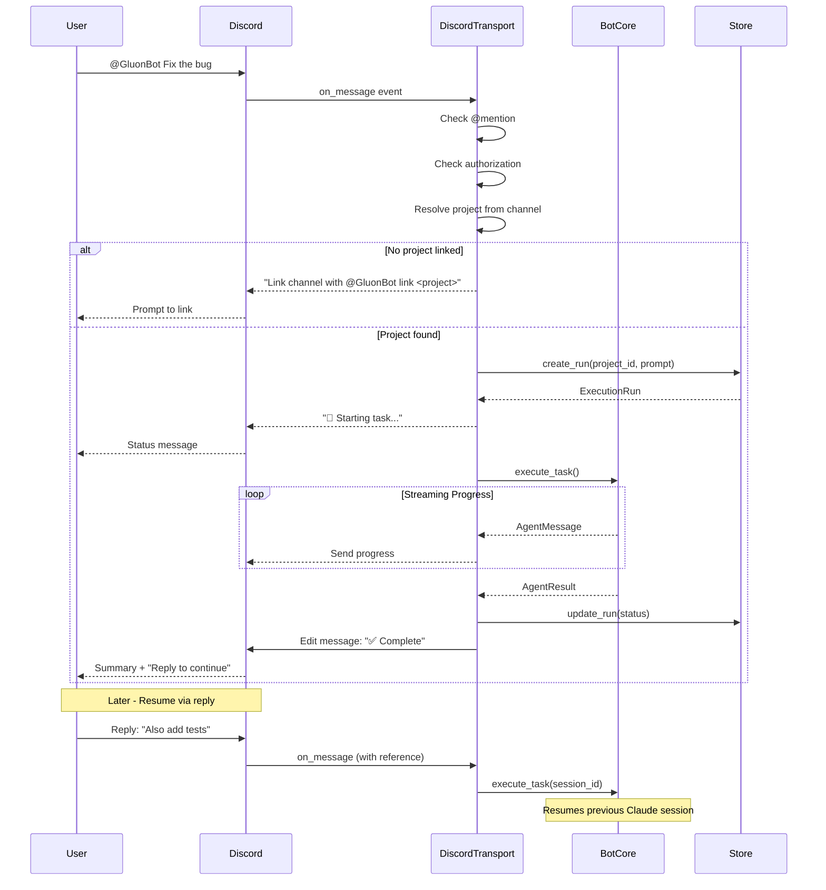

# Discord Bot

Run Gluon as a Discord bot with channel-based project mapping, DM support, and real-time task streaming.

## Installation

Discord support is an optional dependency:

```bash
pip install 'gluon-agent[discord]'
# or for all optional features
pip install 'gluon-agent[all]'
```

## Setup

1. Go to [Discord Developer Portal](https://discord.com/developers/applications)
2. Create a New Application
3. Go to "Bot" tab and click "Add Bot"
4. Copy the bot token
5. Enable "MESSAGE CONTENT INTENT" in Bot settings
6. Go to "OAuth2" → "URL Generator"
7. Select scopes: `bot`, `applications.commands`
8. Select permissions: `Send Messages`, `Create Public Threads`, `Read Message History`
9. Copy the generated URL and open it to invite the bot to your server

## Run the Bot

```bash
# Set required environment variables
export GLUON_DISCORD_TOKEN="your-bot-token"
export GLUON_DISCORD_GUILD="your-guild-id"

# Optional: restrict to specific users (comma-separated Discord user IDs)
export GLUON_DISCORD_USERS="123456789,987654321"

# Start the bot
gluon discord

# Or pass options directly
gluon discord --token "token" --guild 123456789
```

## Commands

Mention the bot (`@GluonBot`) in channels or send direct messages:

| Command | Description |
|---------|-------------|
| `@GluonBot link <project>` | Link this channel to a project |
| `@GluonBot projects` | List registered projects |
| `@GluonBot runs` | List your runs |
| `@GluonBot status` | Show overall status |
| `@GluonBot cancel [run_id]` | Cancel a run |
| `@GluonBot <any task>` | Execute task on the linked project |

## Direct Messages (DM Support)

You can interact with Gluon via direct messages. Since DMs aren't associated with a channel, use project specifiers:

```
# Project prefix syntax
project:myapp Fix the login bug
p:myapp Add user authentication

# Flag syntax
Fix the login bug --project myapp
Fix the login bug -p myapp
```

DM conversations maintain chat mode context, allowing natural follow-up questions without repeating the project name.

## Model Selection

Specify model tier using the `--model` or `-m` flag in your prompt:

```
@GluonBot Fix the bug --model opus
@GluonBot Quick fix --model haiku
@GluonBot Implement feature -m sonnet
```

| Model | Best For |
|-------|----------|
| `haiku` | Quick fixes, simple tasks |
| `sonnet` | Most coding tasks (default) |
| `opus` | Complex refactoring, architecture |

## Channel Topic Configuration

Configure default project and model by adding markers to your channel topic:

```
Project: myapp | Model: opus
```

Supported formats:
- `Project: myapp` or `project:myapp`
- `Model: opus` or `model:opus`

This allows the channel to auto-link to a project and use a specific model without explicit flags.

## Channel-Project Mapping

Discord channels map to projects in multiple ways:

1. **Channel topic** - Set `project:myapp` in the channel topic (see above)
2. **Auto-match** - Channel name matches project name (e.g., `#myapp` → `myapp` project)
3. **Explicit link** - Use `@GluonBot link <project>` to bind any channel

Once linked, all @mentions execute tasks on that project automatically.



## Message-Based Resume

Task execution uses Discord's reply feature for session continuity:

- Initial message shows task status and run ID
- Progress updates sent as follow-up messages
- Completion message is edited with final status and "💬 Reply to continue" hint
- **Reply to any completion message to resume that session**



## Bot Flow



## Environment Variables

| Variable | Description |
|----------|-------------|
| `GLUON_DISCORD_TOKEN` | Discord bot token (required) |
| `GLUON_DISCORD_GUILD` | Discord guild (server) ID (required) |
| `GLUON_DISCORD_USERS` | Comma-separated list of allowed user IDs |

## Real-Time Tool Call Display

During task execution, the bot displays agent tool calls in real-time:

```
🔄 Running task on myapp...
🔧 Bash: Running tests
🔧 Edit: Fixing test file
🔧 Bash: Running tests again
✅ Task completed!
```

This provides visibility into what the agent is doing without overwhelming the chat with full output.

## Multi-Transport Mode

Run both Telegram and Discord simultaneously with a shared bot core:

```bash
# Set all required environment variables
export GLUON_TELEGRAM_TOKEN="telegram-token"
export GLUON_TELEGRAM_USERS="123456789"
export GLUON_DISCORD_TOKEN="discord-token"
export GLUON_DISCORD_GUILD="987654321"
export GLUON_DISCORD_USERS="111222333"

# Run both transports
gluon serve --telegram --discord
```

### Features

- **Shared project, session, and run state** - All transports read/write to the same SQLite database
- **Shared git background sync** - Single GitManager instance fetches for all transports
- **Shared concurrency limits** - Global semaphore prevents overload across all platforms
- **Cross-platform run visibility** - Users on any platform can see runs from other platforms
