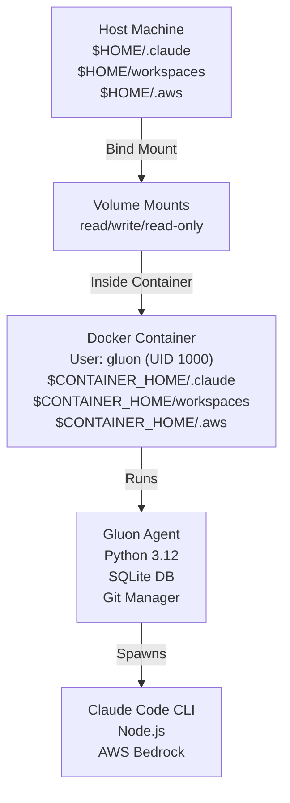

# Running Gluon Agent in Docker

This guide covers running Gluon Agent in Docker with proper directory mapping, authentication, and configuration.

## Quick Start

### Build the image

```bash
docker build -t gluon-agent:latest .
```

### Run with docker-compose (recommended)

```bash
docker-compose up -d
```

### Run with docker run (one-off commands)

```bash
# Simple task
docker run --rm -it \
  -v "$HOME/.claude:/home/gluon/.claude" \
  -v "$HOME/.gluon:/home/gluon/.gluon" \
  -v "$HOME/workspaces:/home/gluon/workspaces" \
  -v "$HOME/.aws:/home/gluon/.aws:ro" \
  -e AWS_PROFILE=default \
  gluon-agent:latest \
  gluon status

# Web dashboard
docker run --rm -it \
  -v "$HOME/.gluon:/home/gluon/.gluon" \
  -v "$HOME/workspaces:/home/gluon/workspaces" \
  -p 45866:45866 \
  gluon-agent:latest \
  gluon web
```

### Use the wrapper script

```bash
# Add to PATH
export PATH="$PATH:$(pwd)/docker"

# Use like native CLI
gluon-docker status
gluon-docker run myapp "Fix the bug"
gluon-docker web
```

## Architecture



## Volume Mapping

### Required Directories

| Host | Container | Purpose | Mode |
|------|-----------|---------|------|
| `$HOME/.claude` | `/home/gluon/.claude` | Claude Code config & auth | `rw` |
| `$HOME/.gluon` | `/home/gluon/.gluon` | Gluon state, DB, logs | `rw` |
| `$HOME/workspaces` | `/home/gluon/workspaces` | Project files | `rw` |
| `$HOME/.aws` | `/home/gluon/.aws` | AWS credentials | `ro` |

### Optional Directories

| Host | Container | Purpose | Mode |
|------|-----------|---------|------|
| `$HOME/.cache/gluon` | `/home/gluon/.cache/gluon` | Cache, temporary files | `rw` |
| `$HOME/.ssh` | `/home/gluon/.ssh` | SSH keys for git | `ro` |

### Volume Mounting Syntax

```bash
# Read-write (default)
-v "$HOME/.gluon:/home/gluon/.gluon"

# Read-only (for credentials)
-v "$HOME/.aws:/home/gluon/.aws:ro"

# Mount with delegation for better performance (macOS/Windows)
-v "$HOME/workspaces:/home/gluon/workspaces:delegated"
```

## Environment Variables

### AWS Authentication

```bash
# Profile-based
-e AWS_PROFILE=default
-e AWS_REGION=us-east-1

# Explicit credentials
-e AWS_ACCESS_KEY_ID
-e AWS_SECRET_ACCESS_KEY
-e AWS_SESSION_TOKEN
```

### Claude Configuration

```bash
# API key (if not using local AWS Bedrock)
-e CLAUDE_API_KEY=sk-...

# Logging
-e CLAUDE_LOG_LEVEL=info
```

### Gluon Configuration

```bash
# Bot tokens
-e GLUON_TELEGRAM_TOKEN=your-token
-e GLUON_DISCORD_TOKEN=your-token
-e GLUON_DISCORD_GUILD=your-guild-id

# Git synchronization
-e GLUON_GIT_ENABLED=true
```

## Usage Examples

### 1. CLI Mode (one-off commands)

```bash
# Register project
docker run --rm \
  -v "$HOME/workspaces:/home/gluon/workspaces" \
  -v "$HOME/.gluon:/home/gluon/.gluon" \
  gluon-agent:latest \
  gluon project add myapp /home/gluon/workspaces/myapp

# Run task
docker run --rm \
  -v "$HOME/workspaces:/home/gluon/workspaces" \
  -v "$HOME/.gluon:/home/gluon/.gluon" \
  -v "$HOME/.aws:/home/gluon/.aws:ro" \
  -e AWS_PROFILE=default \
  gluon-agent:latest \
  gluon run myapp "Fix the login bug"
```

### 2. Web Dashboard

```bash
docker run --rm -it \
  -v "$HOME/.gluon:/home/gluon/.gluon" \
  -v "$HOME/workspaces:/home/gluon/workspaces" \
  -v "$HOME/.aws:/home/gluon/.aws:ro" \
  -e AWS_PROFILE=default \
  -p 45866:45866 \
  gluon-agent:latest \
  gluon web
```

Then open http://localhost:45866

### 3. Telegram/Discord Bots

```bash
docker run --rm -it \
  -v "$HOME/.gluon:/home/gluon/.gluon" \
  -v "$HOME/workspaces:/home/gluon/workspaces" \
  -v "$HOME/.aws:/home/gluon/.aws:ro" \
  -e AWS_PROFILE=default \
  -e GLUON_TELEGRAM_TOKEN=your-token \
  -e GLUON_DISCORD_TOKEN=your-token \
  -e GLUON_DISCORD_GUILD=your-guild-id \
  gluon-agent:latest \
  gluon serve --telegram --discord
```

### 4. Background Execution

```bash
# Start long-running service
docker run -d \
  --name gluon-agent-service \
  -v "$HOME/.gluon:/home/gluon/.gluon" \
  -v "$HOME/workspaces:/home/gluon/workspaces" \
  -v "$HOME/.aws:/home/gluon/.aws:ro" \
  -e AWS_PROFILE=default \
  -e GLUON_TELEGRAM_TOKEN=your-token \
  -p 45866:45866 \
  gluon-agent:latest \
  gluon serve --telegram --web

# View logs
docker logs -f gluon-agent-service

# Stop service
docker stop gluon-agent-service
```

### 5. Development Mode with docker-compose

```bash
# Create .env.local for local overrides
cat > .env.local << 'EOF'
AWS_PROFILE=default
CLAUDE_API_KEY=your-key
EOF

# Run all services
docker-compose up

# View logs
docker-compose logs -f gluon

# Stop services
docker-compose down
```

## Wrapper Script

The `docker/gluon-docker` script simplifies using gluon-agent from Docker:

```bash
# Add to PATH (in your shell RC file)
export PATH="$PATH:$(pwd)/docker"

# Use like native CLI
gluon-docker status
gluon-docker run myapp "Fix the bug"
gluon-docker resume myapp "Also add tests"
gluon-docker web
gluon-docker serve --telegram --discord
```

The script automatically:
- Builds the image if not present
- Mounts all required directories
- Passes through environment variables
- Handles interactive/non-interactive modes

## Security Considerations

### 1. Non-root User

Container runs as `gluon` user (UID 1000) for security:

```dockerfile
USER gluon
```

If your host user has a different UID, adjust file ownership:

```bash
# Option 1: Run container as your host user
docker run --user "$(id -u):$(id -g)" ...

# Option 2: Create matching user in Dockerfile
# (build a custom image with your UID)
```

### 2. Read-only Mounts

Mount credentials as read-only:

```bash
-v "$HOME/.aws:/home/gluon/.aws:ro"      # AWS credentials
-v "$HOME/.ssh:/home/gluon/.ssh:ro"      # SSH keys
```

### 3. Secret Management

Never commit secrets to version control:

```bash
# ❌ Don't do this
docker run -e AWS_ACCESS_KEY_ID=secret ...

# ✅ Do this instead
export AWS_ACCESS_KEY_ID=secret
docker run -e AWS_ACCESS_KEY_ID ...
```

Or use Docker secrets for production:

```bash
docker secret create aws_key -
# (then use in swarm/compose)
```

### 4. Image Scanning

Scan for vulnerabilities:

```bash
docker scan gluon-agent:latest
```

## Troubleshooting

### Permission Denied Errors

**Problem:** Files created in container have wrong owner

```bash
ls -la ~/.gluon
# drwxr-xr-x root root .gluon  # ❌ Wrong
```

**Solution:** Run container with your user ID

```bash
docker run --user "$(id -u):$(id -g)" ...
```

Or fix permissions:

```bash
chown -R $(id -u):$(id -g) ~/.gluon
```

### "Cannot connect to AWS Bedrock"

**Problem:** AWS credentials not passed correctly

```bash
docker run -e AWS_ACCESS_KEY_ID ... -e AWS_SECRET_ACCESS_KEY ...
```

**Check:** Verify env vars inside container

```bash
docker run --rm gluon-agent:latest env | grep AWS
```

### "Claude Code CLI not found"

**Problem:** Claude CLI not installed in image

```bash
docker run --rm gluon-agent:latest claude --version
```

**Solution:** Rebuild image

```bash
docker build --no-cache -t gluon-agent:latest .
```

### Database Lock Errors

**Problem:** Multiple containers accessing same `.gluon/` directory

```bash
sqlite3 database is locked
```

**Solution:** Only run one container per `.gluon/` directory, or use a shared service:

```bash
# ✅ One container managing database
docker-compose up

# ❌ Don't do this
docker run -v ~/.gluon:... &
docker run -v ~/.gluon:... &
```

## Performance Tuning

### macOS/Windows: Delegated Mounts

For faster I/O with large project directories:

```bash
-v "$HOME/workspaces:/home/gluon/workspaces:delegated"
```

### Docker Desktop Resources

In Docker Desktop settings:

```
Resources > CPUs: 2-4
Resources > Memory: 2-4 GB
```

### Multi-stage Build

The provided `Dockerfile` uses multi-stage builds to keep image size small (~800MB for slim image).

## Advanced: Custom Dockerfile

To use Ubuntu base instead of Python slim:

```dockerfile
FROM ubuntu:24.04

RUN apt-get update && apt-get install -y \
    python3.12 \
    python3-pip \
    nodejs \
    npm \
    git \
    curl \
    ca-certificates \
    && rm -rf /var/lib/apt/lists/*

# ... rest of setup
```

## Integration with CI/CD

### GitHub Actions

```yaml
- name: Run Gluon in Docker
  run: |
    docker build -t gluon-agent:latest .
    docker run --rm \
      -v "${{ github.workspace }}/workspaces:/home/gluon/workspaces" \
      -e AWS_ACCESS_KEY_ID=${{ secrets.AWS_ACCESS_KEY_ID }} \
      -e AWS_SECRET_ACCESS_KEY=${{ secrets.AWS_SECRET_ACCESS_KEY }} \
      gluon-agent:latest \
      gluon run myapp "Run tests and validate"
```

### Docker Compose for Local Testing

```bash
# Pre-configured for local development
docker-compose -f docker-compose.yml up -d
```

## Next Steps

- **Join the community**: Contribute improvements to `docker/`
- **Report issues**: https://github.com/carrotly-ai/gluon-agent/issues
- **Read more**: See [Development](DEVELOPMENT.md) for extending gluon-agent
