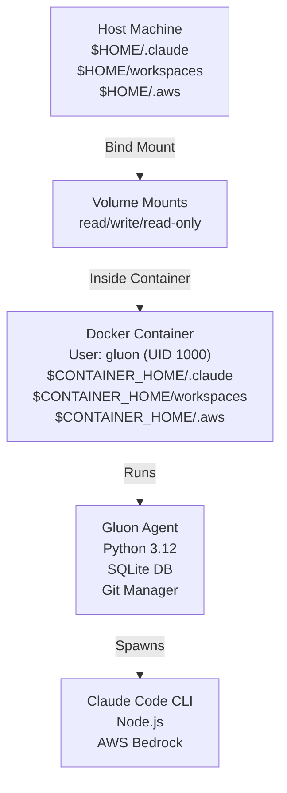

# Running Gluon Agent in Docker

This guide covers running Gluon Agent in Docker with proper directory mapping, authentication, and configuration.

## Quick Start

### Build the image

```bash
docker build -t gluon-agent:latest .
```

### Run with docker compose (recommended)

```bash
docker compose up -d
```

**Note**: Modern Docker includes `docker compose` as a subcommand. If you have an older Docker version, use `docker-compose` instead.

### Run with docker run (one-off commands)

```bash
# Simple task
docker run --rm -it \
  -v "$HOME/.claude:/home/gluon/.claude" \
  -v "$HOME/.gluon:/home/gluon/.gluon" \
  -v "$HOME/workspaces:/home/gluon/workspaces" \
  -v "$HOME/.aws:/home/gluon/.aws:ro" \
  -e AWS_PROFILE=default \
  gluon-agent:latest \
  gluon status

# Web dashboard
docker run --rm -it \
  -v "$HOME/.gluon:/home/gluon/.gluon" \
  -v "$HOME/workspaces:/home/gluon/workspaces" \
  -p 45866:45866 \
  gluon-agent:latest \
  gluon web
```

### Use the wrapper script

```bash
# Add to PATH
export PATH="$PATH:$(pwd)/docker"

# Use like native CLI
gluon-docker status
gluon-docker run myapp "Fix the bug"
gluon-docker web
```

## Architecture



## Volume Mapping

### Required Directories

| Host | Container | Purpose | Mode |
|------|-----------|---------|------|
| `$HOME/.claude` | `/home/gluon/.claude` | Claude Code config & auth | `rw` |
| `$HOME/.gluon` | `/home/gluon/.gluon` | Gluon state, DB, logs | `rw` |
| `$HOME/workspaces` | `/home/gluon/workspaces` | Project files | `rw` |
| `$HOME/.aws` | `/home/gluon/.aws` | AWS credentials | `ro` |
| `$HOME/.config/gh` | `/home/gluon/.config/gh` | GitHub CLI auth (for PR ops) | `ro` |

### Optional Directories

| Host | Container | Purpose | Mode |
|------|-----------|---------|------|
| `$HOME/.gluon/worktrees` | `/tmp/gluon-worktrees` | Git worktrees cache | `rw` |
| `$HOME/.cache/gluon` | `/home/gluon/.cache/gluon` | Cache, temporary files | `rw` |
| `$HOME/.cache/agent-browser` | `/home/gluon/.cache/ms-playwright` | Browser automation cache | `rw` |
| `$HOME/.ssh` | `/home/gluon/.ssh` | SSH keys for git | `ro` |

### Volume Mounting Syntax

```bash
# Read-write (default)
-v "$HOME/.gluon:/home/gluon/.gluon"

# Read-only (for credentials)
-v "$HOME/.aws:/home/gluon/.aws:ro"

# Mount with delegation for better performance (macOS/Windows)
-v "$HOME/workspaces:/home/gluon/workspaces:delegated"
```

## Environment Variables

### AWS Authentication

```bash
# Profile-based
-e AWS_PROFILE=default
-e AWS_REGION=us-east-1

# Explicit credentials
-e AWS_ACCESS_KEY_ID
-e AWS_SECRET_ACCESS_KEY
-e AWS_SESSION_TOKEN
```

### Claude Configuration

```bash
# API key (if not using local AWS Bedrock)
-e CLAUDE_API_KEY=sk-...

# Logging
-e CLAUDE_LOG_LEVEL=info
```

### Gluon Configuration

```bash
# Bot tokens
-e GLUON_TELEGRAM_TOKEN=your-token
-e GLUON_DISCORD_TOKEN=your-token
-e GLUON_DISCORD_GUILD=your-guild-id

# Git synchronization
-e GLUON_GIT_ENABLED=true

# Claude Code backend (use AWS Bedrock)
-e CLAUDE_CODE_USE_BEDROCK=1

# Browser automation (agent-browser streaming)
-e AGENT_BROWSER_STREAM_PORT=9223

# Node.js memory limit (leave headroom for subprocesses)
-e NODE_OPTIONS=--max-old-space-size=6144
```

### GitHub / Git Authentication

The container uses **HTTPS with GitHub Personal Access Token** for all git operations (cloning, PR creation, push, pull). This is configured by the entrypoint script at container startup.

```bash
# GitHub Personal Access Token (for HTTPS git operations)
# Load from .env.local in docker-compose
-e GH_TOKEN=ghp_xxxxxxxxxxxxx

# Git user identity (for commit attribution)
-e GIT_USER_EMAIL=your-email@example.com
-e GIT_USER_NAME="Your Name"
```

### Entrypoint Git Configuration

On container startup, `docker-entrypoint.sh` automatically:

1. **Rewrites SSH URLs to HTTPS**
   - `git@github.com:org/repo.git` → `https://github.com/org/repo.git`
   - `ssh://git@github.com/org/repo.git` → `https://github.com/org/repo.git`

2. **Configures credential helper** to use `GH_TOKEN` for HTTPS authentication

3. **Sets git user identity** from `GIT_USER_EMAIL` and `GIT_USER_NAME` environment variables

This allows the container to:
- Clone private repos without SSH keys
- Push commits and create PRs with `gh` CLI
- Work with GitHub Actions workflows

**Important**: Store `GH_TOKEN` in `.env.local` (not version control):

```bash
# .env.local
GH_TOKEN=ghp_xxxxxxxxxxxxx
GIT_USER_EMAIL=user@example.com
GIT_USER_NAME="Your Name"
```

The docker-compose file loads this via `env_file: [.env.local]`

## Port Mappings

The container exposes the following ports:

| Port | Purpose | Default |
|------|---------|---------|
| `45866` | Web dashboard | Optional |
| `9223` | Browser automation preview | Optional |

Map these ports when you need web access or browser preview:

```bash
docker run -p 45866:45866 -p 9223:9223 gluon-agent:latest
```

## Resource Limits

For optimal performance with concurrent Claude agents, set resource limits in `docker-compose.yml`:

```yaml
deploy:
  resources:
    limits:
      cpus: '8'        # Maximum CPU cores
      memory: 12G      # Maximum memory
    reservations:
      cpus: '4'        # Guaranteed CPU cores
      memory: 6G       # Guaranteed memory
```

Each concurrent Claude agent can consume 512MB-1GB depending on context window size. With 5-6 concurrent agents and web dashboard overhead, allocate 8-12GB total.

## Usage Examples

### 1. CLI Mode (one-off commands)

```bash
# Register project
docker run --rm \
  -v "$HOME/workspaces:/home/gluon/workspaces" \
  -v "$HOME/.gluon:/home/gluon/.gluon" \
  gluon-agent:latest \
  gluon project add myapp /home/gluon/workspaces/myapp

# Run task
docker run --rm \
  -v "$HOME/workspaces:/home/gluon/workspaces" \
  -v "$HOME/.gluon:/home/gluon/.gluon" \
  -v "$HOME/.aws:/home/gluon/.aws:ro" \
  -v "$HOME/.config/gh:/home/gluon/.config/gh:ro" \
  -v "$HOME/.claude:/home/gluon/.claude" \
  -e AWS_PROFILE=default \
  gluon-agent:latest \
  gluon run myapp "Fix the login bug"
```

### 2. Web Dashboard

```bash
docker run --rm -it \
  -v "$HOME/.gluon:/home/gluon/.gluon" \
  -v "$HOME/workspaces:/home/gluon/workspaces" \
  -v "$HOME/.aws:/home/gluon/.aws:ro" \
  -v "$HOME/.config/gh:/home/gluon/.config/gh:ro" \
  -v "$HOME/.claude:/home/gluon/.claude" \
  -e AWS_PROFILE=default \
  -p 45866:45866 \
  gluon-agent:latest \
  gluon web
```

Then open http://localhost:45866

**Note**: If you want to use the web dashboard for editing code or creating PRs, make sure to include `-v "$HOME/.config/gh"` for GitHub authentication and `-v "$HOME/.claude"` for Claude Code credentials.

### 3. Telegram/Discord Bots

```bash
docker run --rm -it \
  -v "$HOME/.gluon:/home/gluon/.gluon" \
  -v "$HOME/workspaces:/home/gluon/workspaces" \
  -v "$HOME/.aws:/home/gluon/.aws:ro" \
  -v "$HOME/.config/gh:/home/gluon/.config/gh:ro" \
  -v "$HOME/.claude:/home/gluon/.claude" \
  -e AWS_PROFILE=default \
  -e GLUON_TELEGRAM_TOKEN=your-token \
  -e GLUON_DISCORD_TOKEN=your-token \
  -e GLUON_DISCORD_GUILD=your-guild-id \
  gluon-agent:latest \
  gluon serve --telegram --discord
```

### 4. Background Execution

```bash
# Start long-running service
docker run -d \
  --name gluon-agent-service \
  -v "$HOME/.gluon:/home/gluon/.gluon" \
  -v "$HOME/workspaces:/home/gluon/workspaces" \
  -v "$HOME/.aws:/home/gluon/.aws:ro" \
  -e AWS_PROFILE=default \
  -e GLUON_TELEGRAM_TOKEN=your-token \
  -p 45866:45866 \
  gluon-agent:latest \
  gluon serve --telegram --web

# View logs
docker logs -f gluon-agent-service

# Stop service
docker stop gluon-agent-service
```

### 5. Development Mode with docker-compose

The recommended way to run Gluon Agent locally. The `docker-compose.yml` includes:
- Volume mounts for all necessary directories
- Environment variables from `.env.local`
- Resource limits (8 CPU, 12GB RAM)
- Network access to host services (`host.docker.internal`)
- All three services (web, Telegram, Discord)

```bash
# Create .env.local for local configuration
cat > .env.local << 'EOF'
AWS_PROFILE=default
GH_TOKEN=ghp_xxxxxxxxxxxxx
GIT_USER_EMAIL=your-email@example.com
GIT_USER_NAME="Your Name"
EOF

# Build and start services
docker compose up -d

# View logs
docker compose logs -f gluon-agent-dev

# Check container status
docker compose ps

# Stop services
docker compose down

# Rebuild image (after code changes)
docker compose build && docker compose up -d

# Shell into container
docker exec -it gluon-agent-dev bash
```

**Container name**: `gluon-agent-dev` (visible in `docker ps`)

**Default command**: `gluon serve --web --telegram --discord`

To run a different command:

```bash
# Override command
docker compose run gluon-agent-dev gluon status
docker compose run gluon-agent-dev gluon project list
docker compose run gluon-agent-dev gluon run myproject "your prompt"
```

## Wrapper Script

The `docker/gluon-docker` script simplifies using gluon-agent from Docker:

```bash
# Add to PATH (in your shell RC file)
export PATH="$PATH:$(pwd)/docker"

# Use like native CLI
gluon-docker status
gluon-docker run myapp "Fix the bug"
gluon-docker resume myapp "Also add tests"
gluon-docker web
gluon-docker serve --telegram --discord
```

The script automatically:
- Builds the image if not present
- Mounts all required directories
- Passes through environment variables
- Handles interactive/non-interactive modes

## Security Considerations

### 1. Non-root User

Container runs as `gluon` user (UID 1000) for security:

```dockerfile
USER gluon
```

If your host user has a different UID, adjust file ownership:

```bash
# Option 1: Run container as your host user
docker run --user "$(id -u):$(id -g)" ...

# Option 2: Create matching user in Dockerfile
# (build a custom image with your UID)
```

### 2. Read-only Mounts

Mount credentials as read-only:

```bash
-v "$HOME/.aws:/home/gluon/.aws:ro"      # AWS credentials
-v "$HOME/.ssh:/home/gluon/.ssh:ro"      # SSH keys
```

### 3. Secret Management

Never commit secrets to version control:

```bash
# ❌ Don't do this
docker run -e AWS_ACCESS_KEY_ID=secret ...

# ✅ Do this instead
export AWS_ACCESS_KEY_ID=secret
docker run -e AWS_ACCESS_KEY_ID ...
```

Or use Docker secrets for production:

```bash
docker secret create aws_key -
# (then use in swarm/compose)
```

### 4. Image Scanning

Scan for vulnerabilities:

```bash
docker scan gluon-agent:latest
```

## MCP Server Auto-Registration

The Docker entrypoint automatically registers MCP servers from a mounted `.mcp.json` configuration file on container startup.

### Setup

Mount your MCP config (already included in `docker-compose.yml`):

```bash
# Mount your MCP config (optional, only if .mcp.json exists)
-v "$HOME/.claude/.mcp.json:/home/gluon/.claude/.mcp.json:ro"
```

The container will auto-register HTTP and SSE servers if the file exists.

### Example `.mcp.json`

```json
{
  "mcpServers": {
    "perplexity": {
      "type": "http",
      "url": "http://host.docker.internal:8080",
      "headers": {
        "Authorization": "Bearer ${PERPLEXITY_API_KEY}"
      }
    },
    "context7": {
      "type": "sse",
      "url": "http://host.docker.internal:8081/sse"
    },
    "local-tool": {
      "type": "stdio",
      "command": "node",
      "args": ["/path/to/tool.js"]
    }
  }
}
```

### Auto-Registration Behavior

On container startup, the entrypoint (`docker-entrypoint.sh`):
1. Checks for `~/.claude/.mcp.json`
2. Registers each **HTTP/SSE server** with `claude mcp add`
3. Skips servers already registered (checks `claude mcp list`)
4. **Skips stdio servers** (these require local process spawning and cannot be auto-registered in Docker)
5. Logs registration status

For stdio servers, manually register them or run `claude mcp add` inside the container:

```bash
docker exec gluon-agent-dev \
  claude mcp add --transport stdio my-tool /path/to/tool.js
```

### Troubleshooting MCP Registration

```bash
# Check registered servers
docker exec gluon-agent-dev claude mcp list

# View entrypoint logs
docker logs gluon-agent-dev | grep -i "mcp"

# Manually register a server
docker exec gluon-agent-dev \
  claude mcp add --transport http my-server http://host.docker.internal:8080
```

## CI/CD Integration

The repository includes GitHub Actions workflows:

### CI Workflow (`.github/workflows/ci.yml`)

Runs on every push and PR:
- Lints Python code with `ruff`
- Lints web-ui with `biome`
- Runs `mypy` type checking
- Runs `pytest` test suite

### Docker Publish (`.github/workflows/docker-publish.yml`)

Builds and publishes Docker images:
- Triggers on pushes to `main` and version tags
- Publishes to GitHub Container Registry (`ghcr.io`)
- Supports multi-architecture builds (amd64, arm64)

```bash
# Pull pre-built image
docker pull ghcr.io/carrotly-ai/gluon-agent:latest
```

## Troubleshooting

### Permission Denied Errors

**Problem:** Files created in container have wrong owner

```bash
ls -la ~/.gluon
# drwxr-xr-x root root .gluon  # ❌ Wrong
```

**Solution:** Run container with your user ID

```bash
docker run --user "$(id -u):$(id -g)" ...
```

Or fix permissions:

```bash
chown -R $(id -u):$(id -g) ~/.gluon
```

### "Cannot connect to AWS Bedrock"

**Problem:** AWS credentials not passed correctly

```bash
docker run -e AWS_ACCESS_KEY_ID ... -e AWS_SECRET_ACCESS_KEY ...
```

**Check:** Verify env vars inside container

```bash
docker run --rm gluon-agent:latest env | grep AWS
```

### "Claude Code CLI not found"

**Problem:** Claude CLI not installed in image, or installed but not in PATH

```bash
docker exec gluon-agent-dev claude --version
# Error: command not found
```

**Solution:** Rebuild image with fresh CLI installation

```bash
docker compose build --no-cache
docker compose up -d
```

**Check CLI location:**

```bash
docker exec gluon-agent-dev which claude
# Should output: /usr/local/bin/claude
```

### Database Lock Errors

**Problem:** Multiple containers accessing same `.gluon/` directory

```bash
sqlite3 database is locked
```

**Solution:** Only run one container per `.gluon/` directory, or use a shared service:

```bash
# ✅ One container managing database
docker-compose up

# ❌ Don't do this
docker run -v ~/.gluon:... &
docker run -v ~/.gluon:... &
```

## Build-Time Versioning

The Docker image includes version information set at build time. This helps identify which version of the code is running.

### Build Arguments

Pass version information during build:

```bash
docker build \
  --build-arg VITE_APP_VERSION=$(git rev-parse --short HEAD) \
  --build-arg VITE_APP_FULL_VERSION="v1.0.0-$(git rev-parse --short HEAD)" \
  --build-arg VITE_APP_BUILD_TIME="$(date -u +%Y-%m-%dT%H:%M:%SZ)" \
  -t gluon-agent:latest .
```

Or with docker-compose:

```bash
docker compose build \
  --build-arg VITE_APP_VERSION=$(git rev-parse --short HEAD) \
  --build-arg VITE_APP_FULL_VERSION="v1.0.0-$(git rev-parse --short HEAD)" \
  --build-arg VITE_APP_BUILD_TIME="$(date -u +%Y-%m-%dT%H:%M:%SZ)"
```

### Check Version Info

Inside container, version info is available as environment variables:

```bash
docker exec gluon-agent-dev env | grep -E 'GLUON_(VERSION|BUILD_TIME)'
# GLUON_VERSION=abc123f
# GLUON_FULL_VERSION=v1.0.0-abc123f
# GLUON_BUILD_TIME=2025-02-08T14:30:00Z
```

## Browser Automation (agent-browser)

The container includes `agent-browser` and Chromium for headless browser automation. This enables Claude agents to:
- Take screenshots of web pages
- Fill forms and interact with websites
- Test web applications
- Extract data from dynamic content

**Agents are guided by a system prompt** to use `agent-browser` directly — they will not attempt to run `npx playwright install` or use `mcp_scraper` for localhost pages.

### Browser Cache

The Playwright/Chromium browser cache is mounted to persist across restarts:

```yaml
volumes:
  - ${HOME}/.cache/agent-browser:/home/gluon/.cache/ms-playwright
```

This avoids re-downloading browser binaries on each container start.

### Browser Preview Port

Port 9223 is exposed for browser automation streaming and preview:

```bash
-p 9223:9223  # Browser automation preview
```

Configure with environment variable:

```bash
-e AGENT_BROWSER_STREAM_PORT=9223
```

### System Dependencies

The Dockerfile includes Chromium system dependencies (libnss3, libxkbcommon0, etc.) needed for headless browser automation in Docker.

### System Fonts

The Docker image includes a comprehensive set of fonts for high-quality screenshot rendering:

| Package | Coverage |
|---------|----------|
| `fonts-liberation` | Metrically equivalent to Arial, Times New Roman, Courier New |
| `fonts-noto-color-emoji` | Color emoji rendering |
| `fonts-noto-cjk` | Chinese, Japanese, Korean characters |
| `fonts-dejavu-core` | Extended Latin, Greek, Cyrillic |
| `fonts-freefont-ttf` | Wide Unicode coverage |

The font cache is built at image build time (`fc-cache -fv`) for fast rendering.

### Screenshot Interception

When an agent runs `agent-browser screenshot <path>`, Gluon's PostToolUse hook automatically captures the file and stores it as a run attachment. Screenshots appear in:
- The **Messages** tab as inline clickable thumbnails
- The **Images** tab with a "SCREENSHOT" badge

## Performance Tuning

### macOS/Windows: Delegated Mounts

For faster I/O with large project directories:

```bash
-v "$HOME/workspaces:/home/gluon/workspaces:delegated"
```

### Docker Desktop Resources

In Docker Desktop settings:

```
Resources > CPUs: 2-4
Resources > Memory: 2-4 GB
```

### Multi-stage Build

The provided `Dockerfile` uses multi-stage builds to keep image size small (~800MB for slim image).

## Advanced: Custom Dockerfile

To use Ubuntu base instead of Python slim:

```dockerfile
FROM ubuntu:24.04

RUN apt-get update && apt-get install -y \
    python3.12 \
    python3-pip \
    nodejs \
    npm \
    git \
    curl \
    ca-certificates \
    && rm -rf /var/lib/apt/lists/*

# ... rest of setup
```

## Integration with CI/CD

### GitHub Actions

```yaml
- name: Run Gluon in Docker
  run: |
    docker build -t gluon-agent:latest .
    docker run --rm \
      -v "${{ github.workspace }}/workspaces:/home/gluon/workspaces" \
      -e AWS_ACCESS_KEY_ID=${{ secrets.AWS_ACCESS_KEY_ID }} \
      -e AWS_SECRET_ACCESS_KEY=${{ secrets.AWS_SECRET_ACCESS_KEY }} \
      gluon-agent:latest \
      gluon run myapp "Run tests and validate"
```

### Docker Compose for Local Testing

```bash
# Pre-configured for local development
docker-compose -f docker-compose.yml up -d
```

## Next Steps

- **Join the community**: Contribute improvements to `docker/`
- **Report issues**: https://github.com/carrotly-ai/gluon-agent/issues
- **Read more**: See [Development](DEVELOPMENT.md) for extending gluon-agent
