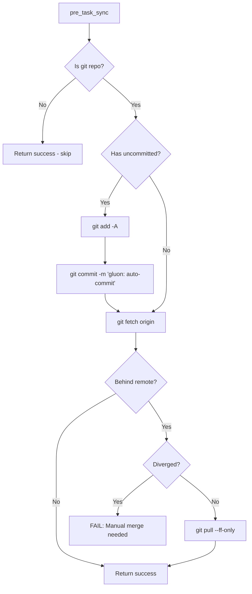
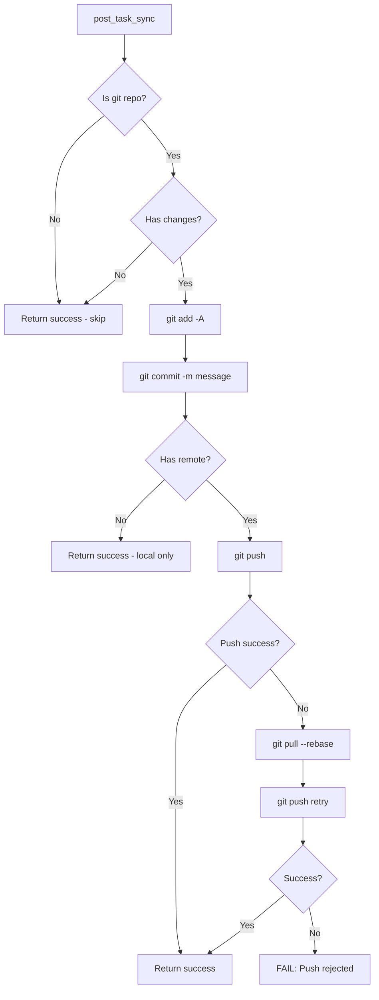
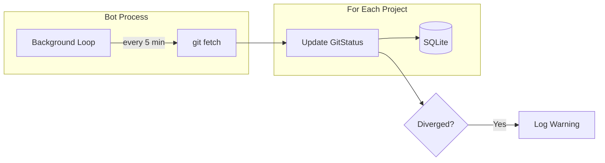
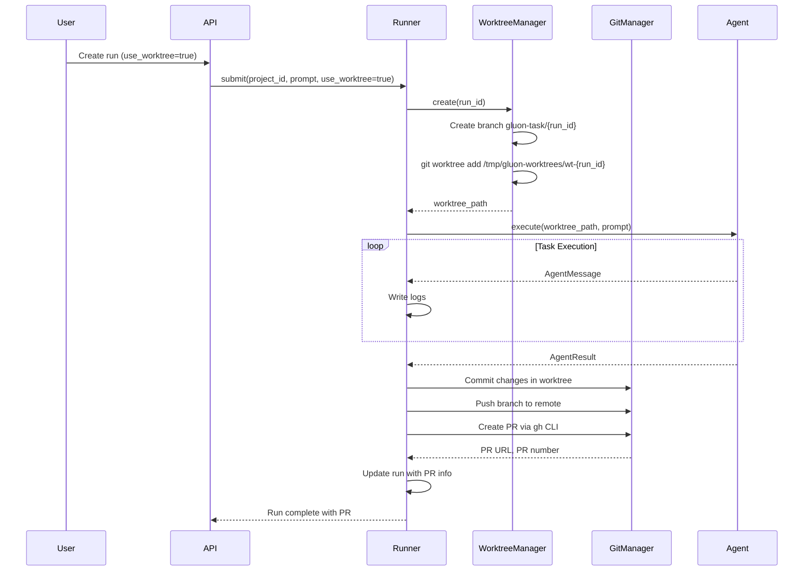
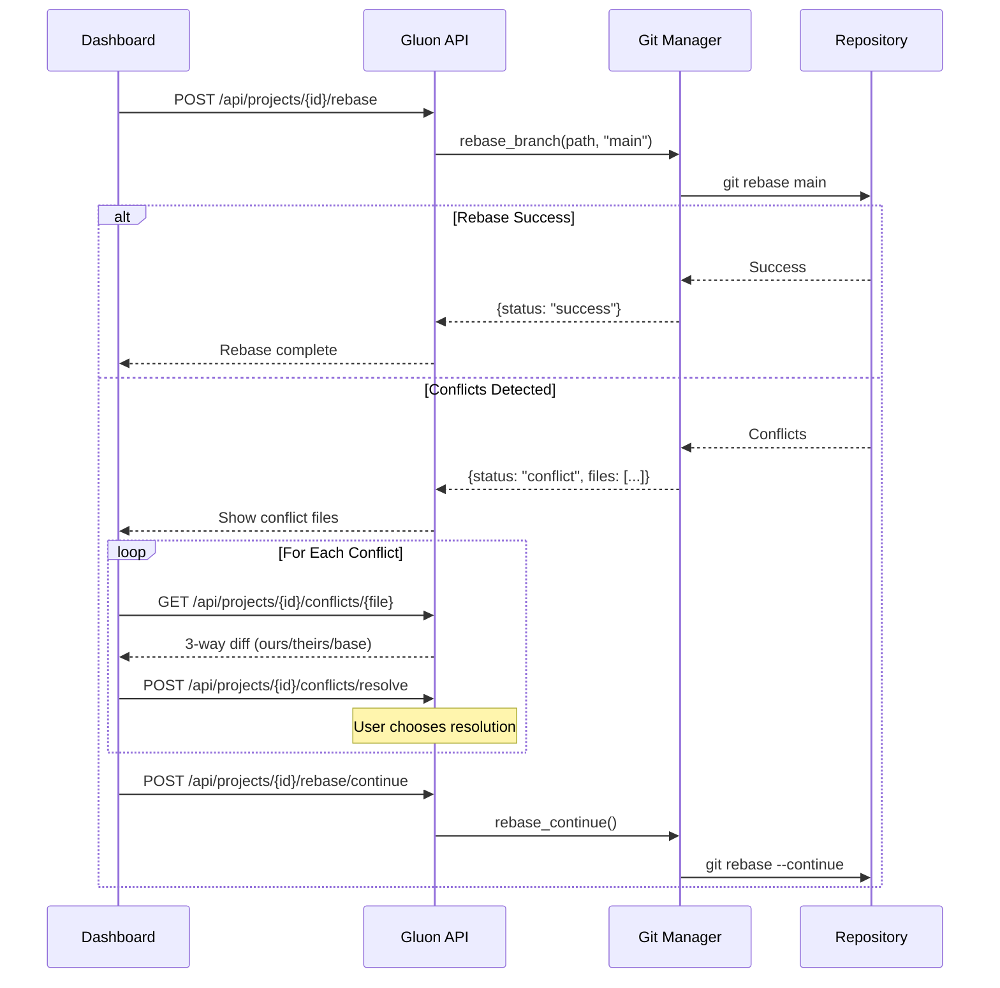
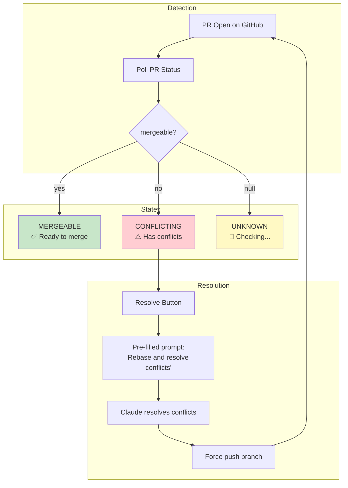
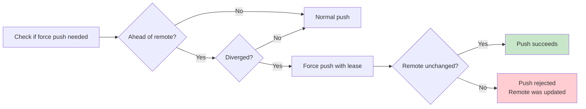

# Git Operations

Gluon provides comprehensive git integration including automatic synchronization, worktree isolation for parallel tasks, PR integration, and advanced operations like rebase and conflict resolution.

## Automatic Synchronization

Gluon automatically keeps projects synchronized with remote Git repositories to prevent conflicts when multiple Claude instances work on the same codebase.

### Pre-task Sync

Before running a task, Gluon will:
1. Auto-commit any uncommitted changes
2. Fetch from remote
3. Fast-forward if behind (fails if diverged)



### Post-task Sync

After successful task completion:
1. Stage and commit all changes
2. Push to remote



### Background Sync

Bot transports (Telegram, Discord) periodically fetch all projects (every 5 minutes) to maintain status awareness.



### Configuration

```bash
# Environment variables
GLUON_GIT_ENABLED=true              # Enable/disable git sync (default: true)
GLUON_GIT_SYNC_INTERVAL=300         # Background fetch interval in seconds
GLUON_GIT_AUTO_COMMIT=true          # Auto-commit before/after tasks
GLUON_GIT_AUTO_PUSH=true            # Auto-push after tasks
GLUON_GIT_COMMIT_PREFIX="gluon:"    # Prefix for auto-commit messages
```

### Error Handling

| Scenario | Behavior |
|----------|----------|
| Not a git repo | Skip git operations, proceed normally |
| No remote configured | Commit locally only |
| Diverged branches | **FAIL** pre-task with error |
| Push rejected | Pull with rebase, retry once |
| Network error (fetch) | **WARN** but proceed |

## Git Worktree Isolation

Tasks can run in isolated git worktrees, creating a dedicated branch without affecting the main codebase.

### How It Works



### Directory Structure

```
/tmp/gluon-worktrees/
└── wt-{run_id}/           # Isolated worktree
    ├── .gluon-images/     # Attached images copied here
    ├── .env.local         # Copied from parent repo
    └── ... project files
```

### Benefits

- Tasks don't affect the main branch until merged
- Multiple tasks can run in parallel on different branches
- Easy PR review and selective merging
- Rollback by simply not merging

## PR Integration

Gluon integrates with GitHub for PR creation, status tracking, and merging.

### Requirements

- GitHub CLI (`gh`) must be installed and authenticated
- Repository must have a GitHub remote

### PR Workflow

```mermaid
flowchart TD
    subgraph "Task Completion"
        RUN[Run completes in worktree]
        PUSH[Push branch to remote]
        CREATE[Create PR via gh CLI]
    end

    subgraph "Review Phase"
        PR[PR Open on GitHub]
        STATUS[Poll PR status]
        MERGE_CHECK{Mergeable?}
    end

    subgraph "Actions"
        MERGE[Merge locally + push]
        RESOLVE[AI resolves conflicts]
        CLOSE[PR auto-closed]
    end

    RUN --> PUSH --> CREATE --> PR
    PR --> STATUS --> MERGE_CHECK
    MERGE_CHECK -->|Yes| MERGE --> CLOSE
    MERGE_CHECK -->|Conflicts| RESOLVE --> PUSH
```



### Dashboard PR Features

| Feature | Description |
|---------|-------------|
| **PR Badge** | Shows PR number, status (open/merged/closed), conflict indicator |
| **Create PR** | Button to manually create PR for worktree runs |
| **Merge** | Merge branch locally and push (GitHub auto-closes PR) |
| **Resolve Conflicts** | One-click to resume task with conflict resolution prompt |

### Conflict Resolution

When a PR has merge conflicts, the dashboard shows a "Resolve" button that:

1. Pre-fills a prompt instructing Claude to rebase and resolve conflicts
2. Resumes the session in the existing worktree
3. Claude rebases onto main and intelligently merges changes
4. Force-pushes the resolved branch

## Advanced Git Operations

Gluon provides a comprehensive API for advanced git operations.

### Rebase Operations



### API Endpoints

| Endpoint | Method | Description |
|----------|--------|-------------|
| `/api/projects/{id}/rebase` | POST | Start rebase onto target branch |
| `/api/projects/{id}/rebase/continue` | POST | Continue after resolving conflicts |
| `/api/projects/{id}/rebase/abort` | POST | Abort rebase and restore state |
| `/api/projects/{id}/rebase/skip` | POST | Skip current commit during rebase |
| `/api/projects/{id}/conflicts` | GET | List files with conflicts |
| `/api/projects/{id}/conflicts/{file}` | GET | Get 3-way diff for conflict |
| `/api/projects/{id}/conflicts/resolve` | POST | Mark conflict as resolved |
| `/api/projects/{id}/force-push-check` | GET | Check if force push is needed |
| `/api/projects/{id}/force-push` | POST | Force push with lease (safe) |

### Branch Management

| Endpoint | Method | Description |
|----------|--------|-------------|
| `/api/projects/{id}/branches` | GET | List local and remote branches |
| `/api/projects/{id}/branches/rename` | POST | Rename a branch |
| `/api/projects/{id}/branches/change-base` | POST | Change base branch for PR |
| `/api/projects/{id}/branches/{name}` | DELETE | Delete a branch |

### Conflict Detection



### Force Push Safety

Force push uses `--force-with-lease` for safety:



## CLI Commands

```bash
gluon git status [project]    # Show git status for project(s)
gluon git fetch [project]     # Fetch latest from remote
gluon git sync <project>      # Commit, fetch, fast-forward
gluon git push <project>      # Commit and push changes
```
