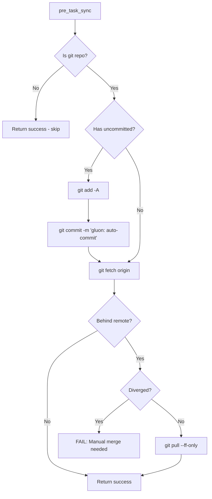
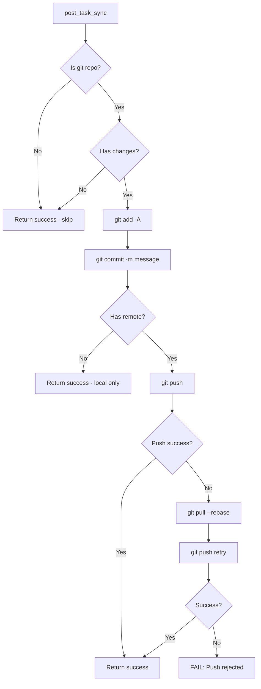
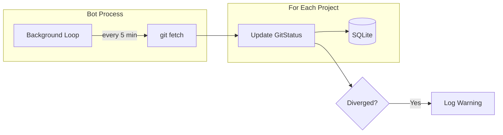
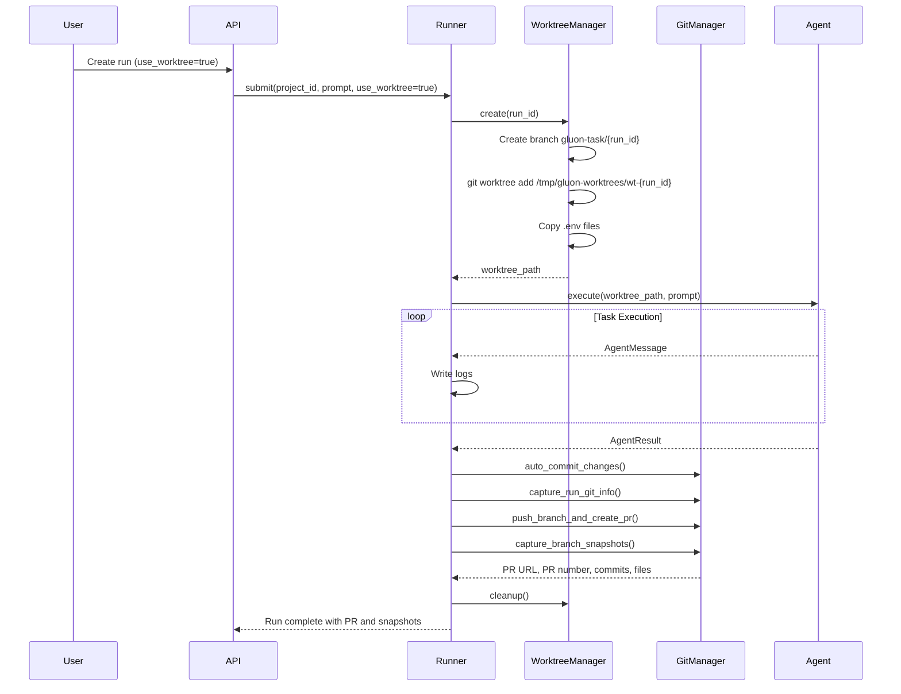
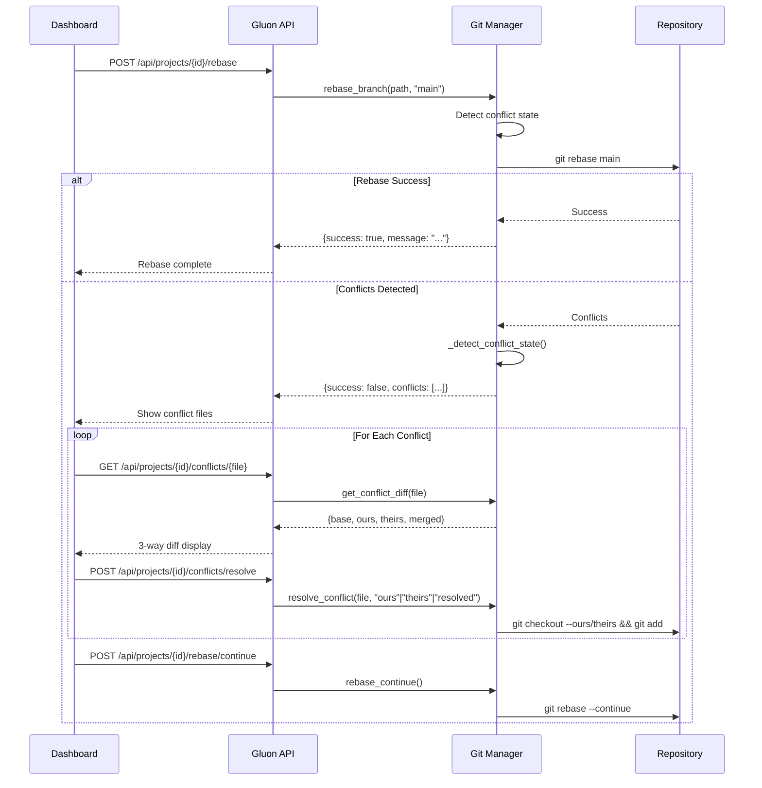
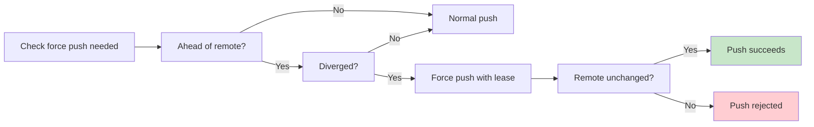
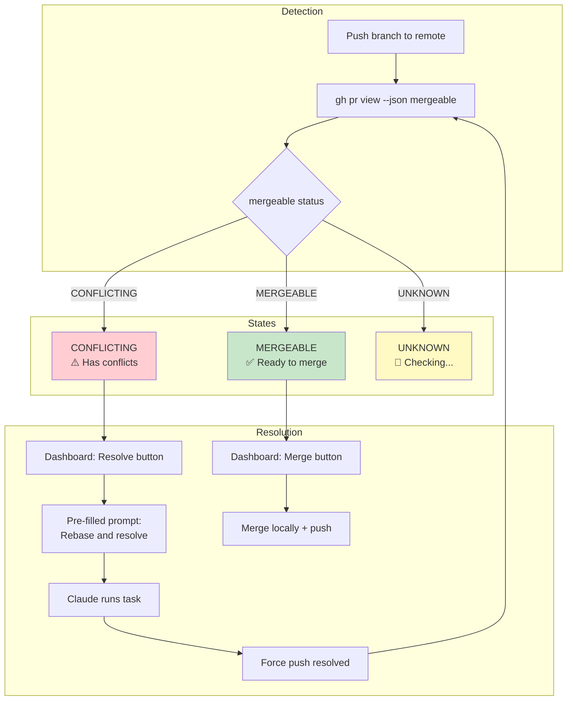

# Git Operations

Gluon provides comprehensive git integration including automatic synchronization, worktree isolation for parallel tasks, PR integration, and advanced operations like rebase and conflict resolution.

**Note:** All git operations in Gluon are async and operate within a Python subprocess context, ensuring isolation from the main agent process. Environment variables (`GIT_USER_NAME`, `GIT_USER_EMAIL`) or database settings configure git authorship.

## Automatic Synchronization

Gluon automatically keeps projects synchronized with remote Git repositories to prevent conflicts when multiple Claude instances work on the same codebase.

### Pre-task Sync

Before running a task, Gluon will:
1. Auto-commit any uncommitted changes
2. Fetch from remote
3. Fast-forward if behind (fails if diverged)



### Post-task Sync

After successful task completion:
1. Stage and commit all changes
2. Push to remote



### Background Sync

Bot transports (Telegram, Discord) periodically fetch all projects (every 5 minutes) to maintain status awareness.



### Configuration

```bash
# Environment variables
GLUON_GIT_ENABLED=true              # Enable/disable git sync (default: true)
GLUON_GIT_SYNC_INTERVAL=300         # Background fetch interval in seconds
GLUON_GIT_AUTO_COMMIT=true          # Auto-commit before/after tasks
GLUON_GIT_AUTO_PUSH=true            # Auto-push after tasks
GLUON_GIT_COMMIT_PREFIX="gluon:"    # Prefix for auto-commit messages
```

### Error Handling

| Scenario | Behavior |
|----------|----------|
| Not a git repo | Skip git operations, proceed normally |
| No remote configured | Commit locally only |
| Diverged branches | **FAIL** pre-task with error |
| Push rejected | Pull with rebase, retry once |
| Network error (fetch) | **WARN** but proceed |

## Git Worktree Isolation

Tasks can run in isolated git worktrees, creating a dedicated branch without affecting the main codebase. Worktrees provide browser session isolation per agent run (see `src/gluon/worktree.py`).

### How It Works



### Worktree Lifecycle

**Creation** (`WorktreeManager.create(run_id)`):
1. Validates repository is a git repo
2. Creates branch: `gluon-task/{run_id}` from HEAD
3. Creates worktree at `/tmp/gluon-worktrees/wt-{run_id}`
4. Copies environment files (.env*, .npmrc, local.settings.json) from parent repo
5. Returns worktree path

**During Execution**:
- Agent runs isolated in worktree, can modify files without affecting main repo
- Changes accumulate in the worktree branch
- No impact on main branch or other runs

**Finalization** (`WorktreeManager.cleanup()`):
1. Auto-commits any uncommitted changes (configurable)
2. Optionally merges back to source branch (configurable)
3. Removes worktree directory via `git worktree remove`
4. Deletes the task branch if merged
5. Cleans up stale worktree references via `git worktree prune` on error

**Recovery** (see `recreate_worktree()`):
- If worktree directory is lost (e.g., container restart), can recreate from existing branch
- Branches persist in git history for easy recovery

### Directory Structure

```
/tmp/gluon-worktrees/
└── wt-{run_id}/           # Isolated worktree
    ├── .env               # Copied from parent repo
    ├── .env.local         # Copied from parent repo
    ├── .npmrc             # Copied from parent repo
    └── ... project files with branch gluon-task/{run_id}
```

### Worktree Configuration

`WorktreeConfig` (in `src/gluon/worktree.py`) controls:
- `base_dir`: Where to create worktrees (default: `/tmp/gluon-worktrees`)
- `branch_prefix`: Branch naming pattern (default: `gluon-task`)
- `auto_commit`: Auto-commit changes on cleanup (default: True)
- `auto_merge`: Merge changes back to source branch (default: False)
- `cleanup_on_error`: Force-remove worktree on errors (default: True)
- `copy_patterns`: File patterns to copy (.env*, .npmrc, local.settings.json)

### Benefits

- Tasks don't affect the main branch until merged
- Multiple tasks can run in parallel on different branches
- Easy PR review and selective merging
- Rollback by simply not merging
- Browser session isolation per run (separate Playwright instances)

## PR Integration

Gluon integrates with GitHub for PR creation, status tracking, and merging via the GitHub CLI (`gh`).

### Requirements

- GitHub CLI (`gh`) must be installed and authenticated
- Repository must have a GitHub remote (origin)
- Worktree branch must be pushed before PR can be created

### PR Workflow

**After Task Completion:**
1. `auto_commit_changes()` - Commit any uncommitted changes in worktree
2. `push_branch_and_create_pr()` - Push branch to remote and create PR via `gh pr create`
   - PR title: First 60 chars of prompt
   - PR body: Full prompt + run ID reference
3. `capture_run_git_info()` - Capture PR number, URL, and status
4. `capture_branch_snapshots()` - Persist commit and file change history to database

**PR Status Methods:**
- `git_manager._get_pr_info(path, branch)` - Calls `gh pr view --json` to get: number, url, state, mergeable, mergeStateStatus
- Mergeable states: `MERGEABLE`, `CONFLICTING`, or `UNKNOWN` (checking)

**PR Operations:**
- Create PR: `GitManager.push_branch_and_create_pr()`
- Merge: `GitManager.merge_branch_locally()` (merges locally, pushes, GitHub auto-closes PR)
- Get comments: `GitManager.get_pr_comments(pr_number)` - Issue and review comments
- Get check runs: `GitManager.get_check_runs(commit_sha)` - CI/CD status
- Post comment: `GitManager.post_pr_comment(pr_number, body)`

### Commit Snapshots

After task completion, Gluon captures persistent snapshots of commits and file changes:
- `CommitSnapshot` - Records commit SHA, message, author, date, ordinal
- `FileChangeSnapshot` - Records file path, change type (added/modified/deleted/renamed), additions/deletions
- `CommitFileSnapshot` - Per-commit file details for detailed views

Snapshots are stored in database even after branch is merged/deleted, enabling:
- Historical tracking of what changed
- Change audit trail
- UI display of work summary

## Advanced Git Operations

Gluon provides a comprehensive API for advanced git operations. All operations detect conflict state and report progress for multi-step operations like rebase.

### Rebase Operations

**API Flow:**


**Rebase State Detection:**
- Checks `.git/rebase-merge` or `.git/rebase-apply` for in-progress rebase
- Reports current step and total steps from `msgnum` and `end` files
- Detects conflicted files via `git diff --name-only --diff-filter=U`

### Rebase Endpoints

| Endpoint | Method | Body | Description |
|----------|--------|------|-------------|
| `/api/projects/{id}/rebase` | POST | `{"onto_branch": "main"}` | Start rebase onto target branch |
| `/api/projects/{id}/rebase/continue` | POST | | Continue after resolving conflicts |
| `/api/projects/{id}/rebase/abort` | POST | | Abort rebase and restore state |
| `/api/projects/{id}/rebase/skip` | POST | | Skip current commit during rebase |

**Rebase Response:**
```json
{
  "success": bool,
  "message": "string",
  "conflicts": ["file1.ts", "file2.py"]  // Only on conflict
}
```

### Conflict Resolution Endpoints

| Endpoint | Method | Body | Description |
|----------|--------|------|-------------|
| `/api/projects/{id}/conflicts` | GET | | List conflicted files with markers count |
| `/api/projects/{id}/conflicts/{file}` | GET | | Get 3-way diff (base/ours/theirs/merged) |
| `/api/projects/{id}/conflicts/resolve` | POST | `{"file": "path", "resolution": "ours\|theirs\|resolved"}` | Resolve conflict by choosing version |

**Conflict Diff Response:**
```json
{
  "file_path": "string",
  "base": "string",      // Common ancestor version (null if unavailable)
  "ours": "string",      // Current HEAD version
  "theirs": "string",    // Incoming version
  "merged": "string"     // Current file with conflict markers
}
```

### Branch Management Endpoints

| Endpoint | Method | Body | Description |
|----------|--------|------|-------------|
| `/api/projects/{id}/branches` | GET | | List local and remote branches with tracking info |
| `/api/projects/{id}/branches/rename` | POST | `{"old_name": "str", "new_name": "str"}` | Rename a branch |
| `/api/projects/{id}/branches/change-base` | POST | `{"feature_branch": "str", "new_base": "str"}` | Rebase feature onto new base |

**Branch List Response:**
```json
{
  "branches": [
    {
      "name": "main",
      "is_current": true,
      "upstream": "origin/main",
      "ahead": 0,
      "behind": 2
    }
  ]
}
```

### Force Push Operations

Force push uses `--force-with-lease` for safety (rejects if remote changed):

**API Flow:**


**Force Push Endpoints:**

| Endpoint | Method | Body | Description |
|----------|--------|------|-------------|
| `/api/projects/{id}/force-push-check` | GET | `branch=str` | Check if force push needed |
| `/api/projects/{id}/force-push` | POST | `{"branch": "str"}` | Force push with lease safety |

**Force Push Check Response:**
```json
{
  "needed": bool,
  "commits_to_delete": int,
  "reason": "string"  // e.g., "Would delete 2 commit(s) from remote"
}
```

### Conflict Detection via PR Status

**Methods:**
- `git_manager._get_pr_info(path, branch)` calls `gh pr view --json mergeable,mergeStateStatus`
- Returns: `MERGEABLE` (✅), `CONFLICTING` (⚠️), `UNKNOWN` (🔄 checking)

**PR Merge Flow:**


**Related Endpoints:**
- `POST /api/runs/{run_id}/merge` - Merge branch locally and push
- `POST /api/runs/{run_id}/pr-status` - Poll and update PR status from GitHub

## Additional Git Operations

### File Diff and Analysis

| Method | Purpose |
|--------|---------|
| `get_branch_commits()` | Get commits on branch since it diverged from base |
| `get_changed_files()` | Get files changed on branch with stats |
| `get_commit_detail()` | Get detailed info for specific commit (message, files, author) |
| `get_file_diff()` | Get unified diff for specific file |
| `get_pr_comments()` | Get issue and review comments on PR |
| `get_check_runs()` | Get CI/CD check runs for commit (status, conclusion, output) |
| `get_failed_checks()` | Get only failed check runs (filtered by name pattern) |

### Local Merge Operations

**Method:** `GitManager.merge_branch_locally(path, branch_name, base_branch)`

**Flow:**
1. Stash uncommitted changes (if any)
2. Checkout base branch (fast-forward pull if tracking upstream)
3. Merge feature branch with `--no-edit` (uses author config)
4. If conflicts: abort merge, return error + conflicting files list
5. If success: delete remote branch, delete local feature branch, push merge
6. Restore stashed changes

**Return:**
```json
{
  "success": bool,
  "message": "string",
  "merged_commit_sha": "string or null",
  "error": "string or null",
  "has_conflicts": bool,
  "conflicting_files": ["file1", "file2"]
}
```

### Git Status Operations

| Method | Purpose |
|--------|---------|
| `refresh_status(project)` | Fetch and update status for single project |
| `refresh_all_statuses()` | Fetch and update status for all projects |
| `get_cached_status(project)` | Get cached status (no git operations) |
| `start_background_sync()` | Start periodic background fetch loop (interval: 300s) |
| `stop_background_sync()` | Stop background sync loop |

**GitStatus Model:**
```python
is_git_repo: bool
branch: str | None
remote: str | None          # e.g., "origin"
remote_url: str | None      # Full GitHub URL
has_uncommitted: bool
uncommitted_count: int
commits_ahead: int
commits_behind: int
is_diverged: bool           # Computed: ahead > 0 AND behind > 0
last_fetch_at: datetime | None
last_commit_at: datetime | None
last_push_at: datetime | None
```

### Background Sync

**Behavior:**
- Runs every 300 seconds (configurable via `GLUON_GIT_SYNC_INTERVAL`)
- Calls `refresh_all_statuses()` to fetch all projects
- Logs warnings for diverged branches or commits behind
- Can be disabled via `GLUON_GIT_ENABLED=false`

### Author Configuration

Git commits respect configured author identity in this priority order (highest first):

1. **Environment Variables** (subprocess level):
   - `GIT_AUTHOR_NAME` / `GIT_AUTHOR_EMAIL`
   - `GIT_COMMITTER_NAME` / `GIT_COMMITTER_EMAIL`

2. **Database Settings** (from UI):
   - `git_user_name` / `git_user_email` (stored in settings table)

3. **Environment Variables** (process level):
   - `GIT_USER_NAME` / `GIT_USER_EMAIL`

4. **Git Config** (system/global/local):
   - `.git/config` (project), `~/.gitconfig` (global), `/etc/gitconfig` (system)

Set author via:
```bash
# Environment (highest priority)
export GIT_USER_NAME="Claude Code"
export GIT_USER_EMAIL="claude@anthropic.com"

# Or via UI (Settings > Preferences)
# Stored in database and applied to all subprocess commits
```

## CLI Commands

```bash
gluon git status [project]    # Show git status for project(s)
gluon git fetch [project]     # Fetch latest from remote
gluon git sync <project>      # Commit, fetch, fast-forward
gluon git push <project>      # Commit and push changes
```

## Environment Variables

| Variable | Default | Description |
|----------|---------|-------------|
| `GLUON_GIT_ENABLED` | `true` | Enable/disable git sync |
| `GLUON_GIT_SYNC_INTERVAL` | `300` | Background fetch interval (seconds) |
| `GLUON_GIT_AUTO_COMMIT` | `true` | Auto-commit before/after tasks |
| `GLUON_GIT_AUTO_PUSH` | `true` | Auto-push after tasks |
| `GLUON_GIT_COMMIT_PREFIX` | `gluon:` | Prefix for auto-commit messages |
| `GIT_USER_NAME` | (unset) | Git author name (if not in db) |
| `GIT_USER_EMAIL` | (unset) | Git author email (if not in db) |
