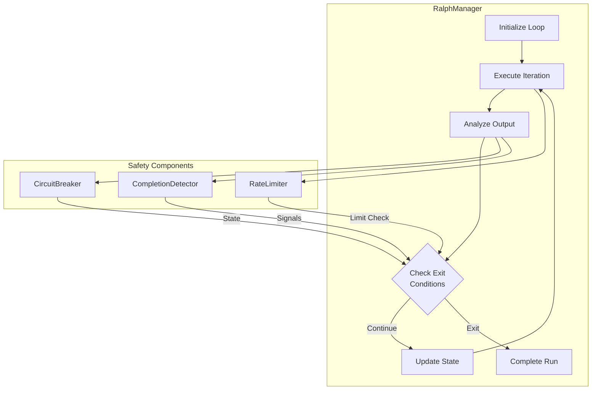
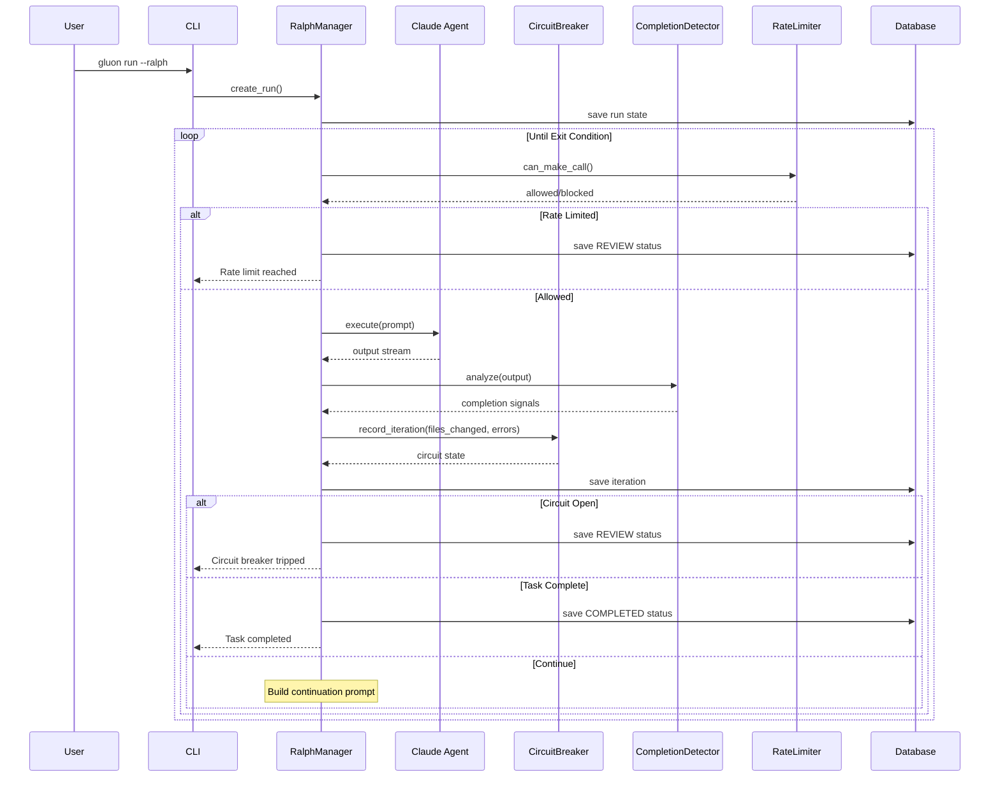
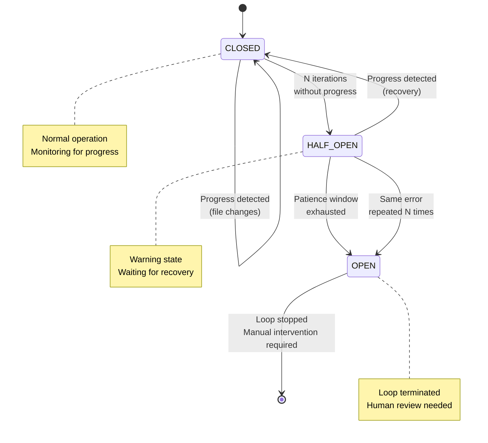
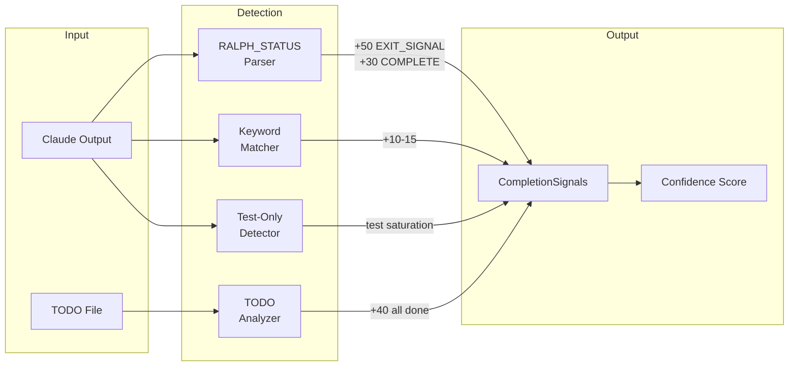
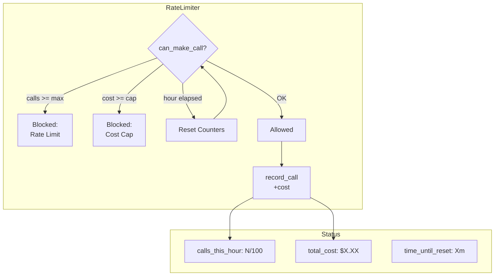
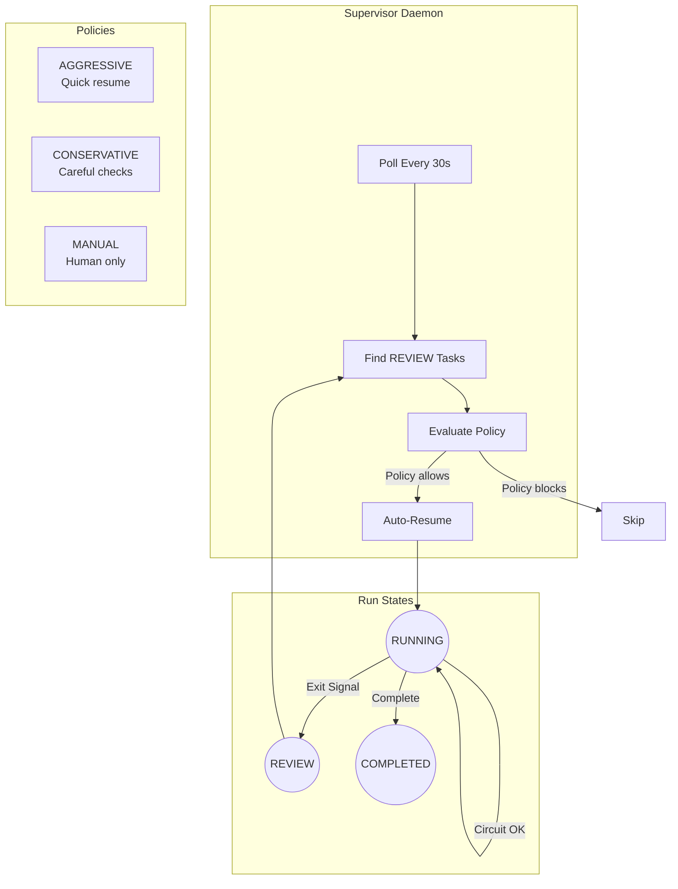
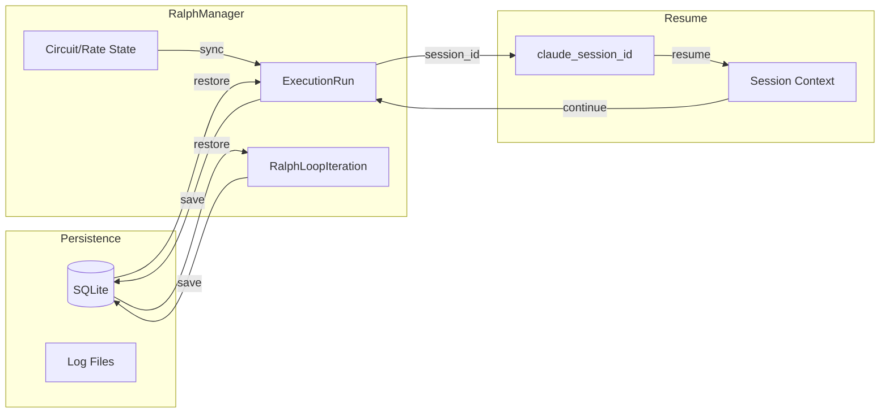
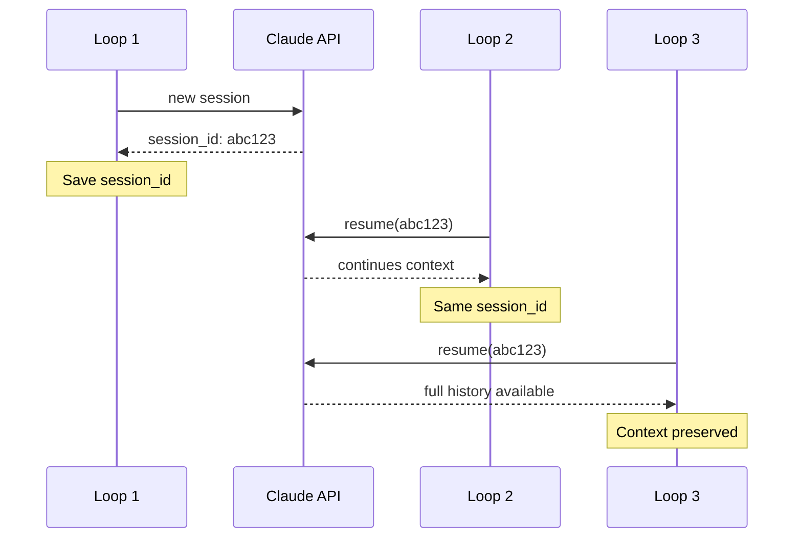

# Ralph Loop - Autonomous Execution Mode

Ralph Loop enables autonomous, continuous execution of Claude Code agents with intelligent completion detection and safety controls.

## Overview

Ralph Loop (named after the [original bash implementation](https://github.com/frankbria/ralph-claude-code)) runs Claude in an autonomous loop, allowing it to work on complex tasks without manual intervention. The loop continues until:

- The task is complete (detected via completion signals)
- A safety limit is reached (rate limit, cost cap, circuit breaker)
- The loop is manually stopped

## Quick Start

```bash
# Start a ralph-enabled run
gluon run myproject "Implement the new authentication system" --ralph

# With custom limits
gluon run myproject "Fix all test failures" --ralph --max-loops 20 --max-cost 5.00

# Monitor progress
gluon ralph status <run_id>
gluon logs <run_id> -f
```

## Architecture



## Loop Execution Flow



## Components

### RalphManager

Orchestrates the autonomous loop lifecycle:

- Initializes Claude agent with session continuity
- Executes iterations with rate limiting
- Analyzes output for completion/errors
- Updates circuit breaker and completion state
- Persists state to database for resumability

### CircuitBreaker

Prevents runaway loops with a 3-state machine:



| State | Description | Transition |
|-------|-------------|------------|
| **CLOSED** | Normal operation | → HALF_OPEN after N iterations without progress |
| **HALF_OPEN** | Warning state, watching for recovery | → CLOSED on progress, → OPEN after patience exhausted |
| **OPEN** | Loop stopped | Requires manual intervention |

**Triggers:**
- No file changes for consecutive iterations
- Same error repeated N times
- No progress detected after HALF_OPEN patience window

### CompletionDetector

Analyzes Claude output for completion signals:



1. **RALPH_STATUS Block** (highest priority)
   ```
   ---RALPH_STATUS---
   STATUS: COMPLETE
   EXIT_SIGNAL: true
   RECOMMENDATION: All tasks finished
   ---END_RALPH_STATUS---
   ```

2. **Keyword Detection**
   - "done", "complete", "finished"
   - "all tasks complete", "ready for review"

3. **TODO File Parsing**
   - Checks `@fix_plan.md` or `TODO.md` for completion
   - `- [x]` markers indicate done items
   - 100% completion triggers exit

4. **Test Saturation**
   - Multiple consecutive test-only loops
   - Indicates work is done, only verifying

**Confidence Scoring:**
- EXIT_SIGNAL: +50
- STATUS=COMPLETE: +30
- All TODOs done: +40
- Keywords: +10-15
- Threshold: 60% confidence triggers exit

### RateLimiter

Protects against runaway costs:



- **Hourly call limit**: Default 100 calls/hour
- **Cost cap**: Optional maximum spend per run
- Automatic reset after 1 hour
- State persisted across restarts

## Supervision System

The supervision system provides background auto-resume for tasks that exit to REVIEW status:



## CLI Commands

### Ralph Run Commands

```bash
# Start ralph-enabled run
gluon run <project> <prompt> --ralph [--max-loops 50] [--max-cost 10.00]

# Check ralph run status
gluon ralph status <run_id>

# View iteration history
gluon ralph iterations <run_id>

# List all ralph runs
gluon ralph runs
```

### Supervisor Daemon

The supervisor daemon provides background auto-resume for tasks in REVIEW status:

```bash
# Start supervisor daemon
gluon supervisor start [--poll-interval 30]

# Run in foreground (for debugging)
gluon supervisor start --foreground

# Check supervisor status
gluon supervisor status

# View supervisor logs
gluon supervisor logs [-f] [-n 50]

# Stop supervisor
gluon supervisor stop
```

### Supervision Commands (per-run)

```bash
# Check supervision status for a run
gluon supervision status <run_id>

# View supervision decision log
gluon supervision logs <run_id>

# Disable supervision for a run
gluon supervision disable <run_id> --reason "Manual completion"

# Manually evaluate a run
gluon supervision evaluate <run_id>
```

## Supervision Policies

| Policy | Description |
|--------|-------------|
| **AGGRESSIVE** | Auto-resume quickly, minimal delays |
| **CONSERVATIVE** | Longer cooldowns, more safety checks |
| **MANUAL** | No auto-resume, requires human approval |

Configure via run parameters or defaults in settings.

## Best Practices

### Writing Prompts for Ralph

1. **Be specific about completion criteria**
   ```
   Implement user authentication.
   Complete when: all tests pass, login/logout works, session handling verified.
   ```

2. **Use TODO files**
   Create `@fix_plan.md` with checkbox items - Ralph detects 100% completion.

3. **Include RALPH_STATUS in system prompt**
   Add to project's CLAUDE.md:
   ```
   When you complete a task, output:
   ---RALPH_STATUS---
   STATUS: COMPLETE
   EXIT_SIGNAL: true
   ---END_RALPH_STATUS---
   ```

### Tuning Thresholds

**CircuitBreaker:**
```python
CircuitBreakerConfig(
    no_progress_threshold=5,      # Loops without file changes
    same_error_threshold=5,       # Repeated same error
    half_open_threshold=2,        # Loops before HALF_OPEN
    half_open_patience=3,         # HALF_OPEN patience window
)
```

**CompletionDetector:**
```python
CompletionDetectorConfig(
    min_confidence=60.0,          # Minimum confidence to exit
    max_consecutive_done=2,       # Consecutive "done" signals
    max_consecutive_test_only=3,  # Test-only loop limit
)
```

**RateLimiter:**
```python
RateLimiterConfig(
    max_calls_per_hour=100,       # API call limit
    max_cost_usd=10.00,           # Cost cap (optional)
)
```

## Data Flow



## Troubleshooting

### Loop exits too early

1. Check completion confidence in logs
2. Increase `min_confidence` threshold
3. Review RALPH_STATUS block detection

### Loop doesn't exit

1. Verify RALPH_STATUS format in output
2. Check TODO file completion status
3. Review circuit breaker state

### Circuit breaker trips

1. Check for repeated errors in logs
2. Verify Claude is making progress (file changes)
3. Consider increasing thresholds

### Cost limit hit

1. Check rate limiter status: `gluon ralph status <run_id>`
2. Increase `max_cost_usd` if appropriate
3. Review task scope - may need splitting

## Session Continuity

Ralph maintains Claude session continuity across loop iterations:



- First iteration starts new session
- Subsequent iterations resume with `claude_session_id`
- Context preserved throughout the loop
- On restart, session continues from last state

This enables Claude to build on previous work without re-reading the entire codebase each iteration.

## State Persistence

All ralph state is persisted to SQLite:

- Loop count, circuit state, completion signals
- Rate limiter counters, hour start time
- Iteration history with metrics
- Session ID for resume capability

Runs can be resumed after restart:
```bash
gluon resume <run_id>
```

## Integration with Web Dashboard

The web dashboard provides real-time visibility:

- Loop progress and iteration timeline
- Circuit breaker state visualization
- Cost tracking and rate limit status
- Supervision decision history

Access via `gluon web` and navigate to run details.
