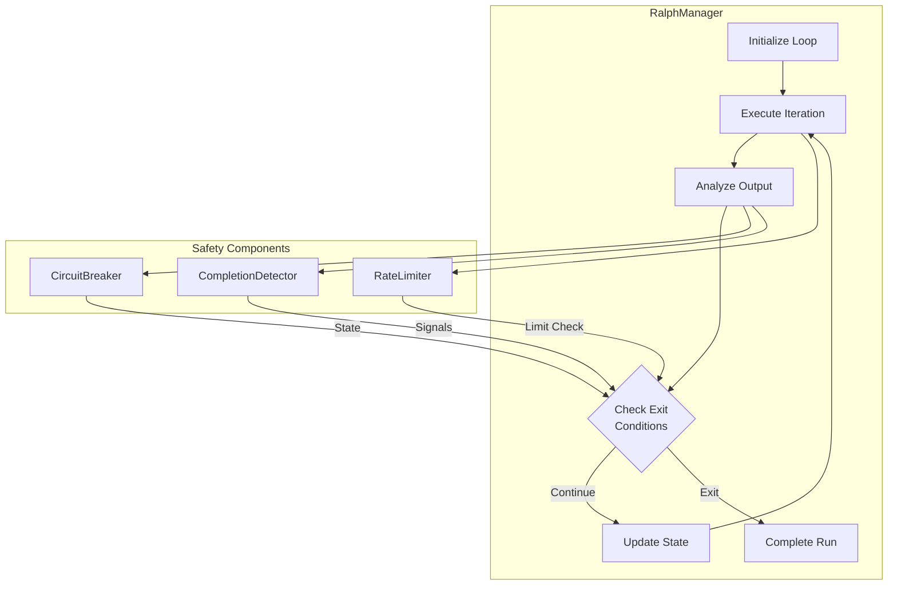
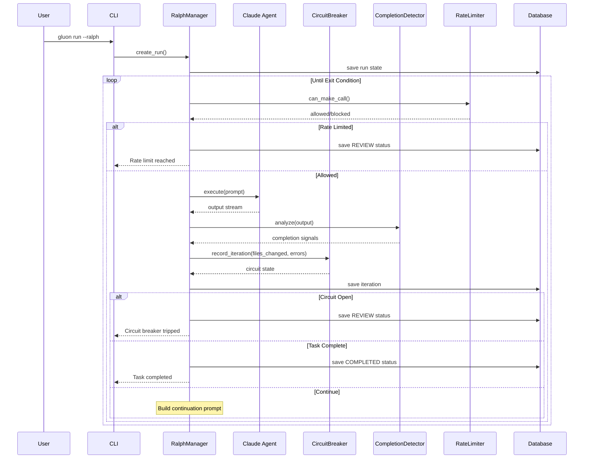
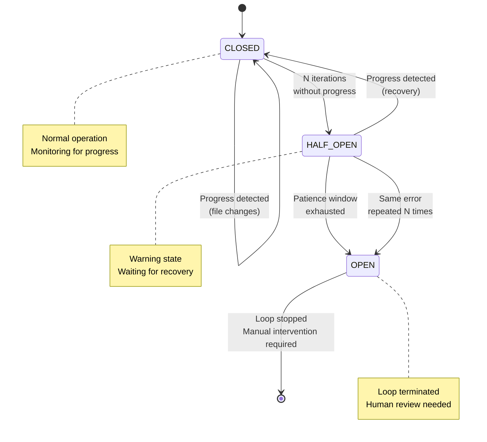
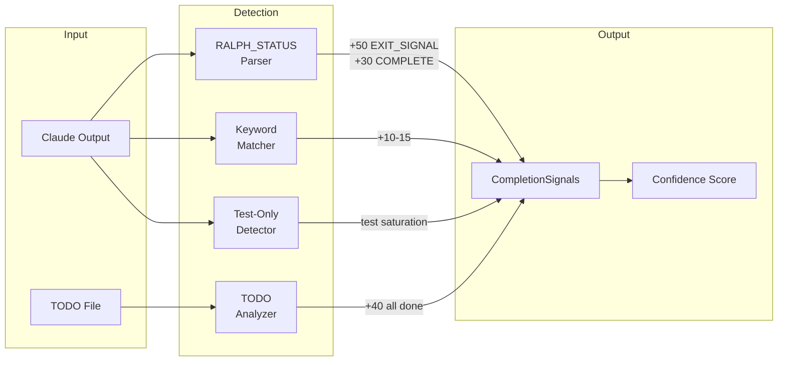
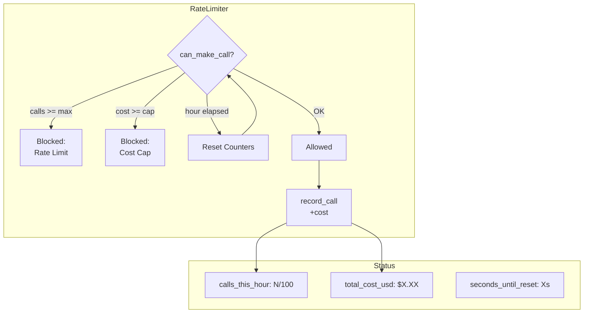
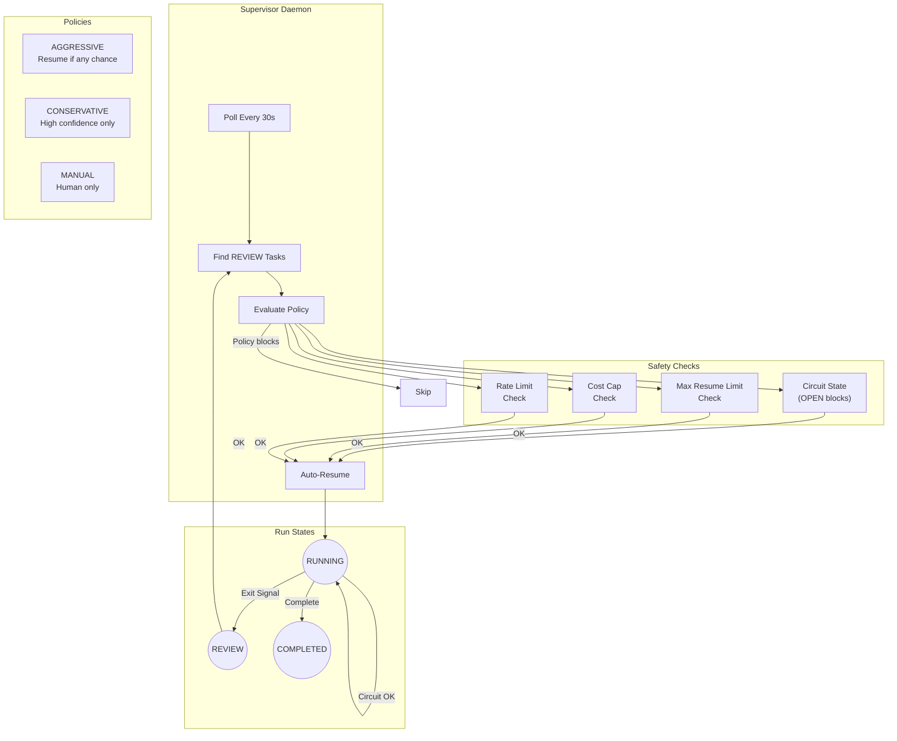
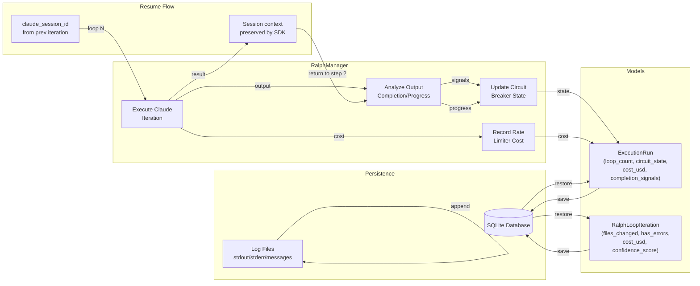
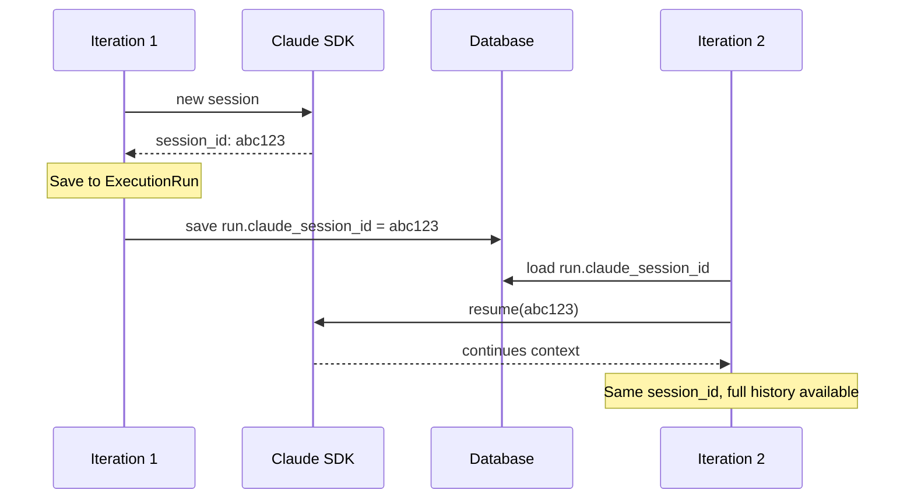

# Ralph Loop - Autonomous Execution Mode

Ralph Loop enables autonomous, continuous execution of Claude Code agents with intelligent completion detection and safety controls.

## Overview

Ralph Loop (named after the [original bash implementation](https://github.com/frankbria/ralph-claude-code)) runs Claude in an autonomous loop, allowing it to work on complex tasks without manual intervention. The loop continues until:

- The task is complete (detected via completion signals)
- A safety limit is reached (rate limit, cost cap, circuit breaker)
- The loop is manually stopped

## Quick Start

```bash
# Start a ralph-enabled run
gluon run myproject "Implement the new authentication system" --ralph

# With custom limits
gluon run myproject "Fix all test failures" --ralph --max-loops 20 --max-cost 5.00

# Monitor progress
gluon ralph status <run_id>
gluon logs <run_id> -f
```

## Architecture



## Loop Execution Flow



## Components

### RalphManager

Orchestrates the autonomous loop lifecycle in `/src/gluon/ralph_manager.py`:

**Responsibilities:**
- Initializes Claude agent with session continuity and auto-answer handler
- Executes iterations in a loop until exit condition
- Manages rate limiting (calls/hour and cost caps)
- Analyzes output for completion signals and errors
- Detects progress via git file changes
- Updates circuit breaker state
- Maintains iteration history in database
- Disables supervision when loop completes
- Handles planning phase (planning_complete flag for force_planning + ralph_mode)

**Loop Execution:**
1. Check for stop request (database poll)
2. Verify rate limiter (calls/hour, cost cap)
3. Execute Claude iteration
4. Capture iteration metrics (files changed, errors, cost)
5. Analyze output for completion signals
6. Update circuit breaker state
7. Persist iteration to database
8. Check exit conditions (completion, circuit break, rate limit)
9. Return to step 1 or exit

**Auto-Answer Handler:**
Ralph loops use auto-answer for tool questions instead of user interaction. Auto-selects:
- Recommended option (marked with "(Recommended)")
- First available option as fallback

### CircuitBreaker

Prevents runaway loops with a 3-state machine:



| State | Description | Transition |
|-------|-------------|------------|
| **CLOSED** | Normal operation | → HALF_OPEN after N iterations without progress |
| **HALF_OPEN** | Warning state, watching for recovery | → CLOSED on progress, → OPEN after patience exhausted |
| **OPEN** | Loop stopped | Requires manual intervention |

**Triggers:**
- No file changes for consecutive iterations
- Same error repeated N times
- No progress detected after HALF_OPEN patience window

### CompletionDetector

Analyzes Claude output for completion signals:



1. **RALPH_STATUS Block** (highest priority)
   ```
   ---RALPH_STATUS---
   STATUS: IN_PROGRESS | COMPLETE | BLOCKED
   TASKS_COMPLETED_THIS_LOOP: <number>
   FILES_MODIFIED: <number>
   TESTS_STATUS: PASSING | FAILING | NOT_RUN
   WORK_TYPE: IMPLEMENTATION | TESTING | DOCUMENTATION | REFACTORING
   EXIT_SIGNAL: false | true
   RECOMMENDATION: <one line summary>
   ---END_RALPH_STATUS---
   ```
   **Critical:** `EXIT_SIGNAL=true` means the ENTIRE task is 100% complete. A recommendation of "proceed", "continue", or any future action MUST have `EXIT_SIGNAL=false`.

2. **Keyword Detection**
   - "done", "complete", "finished", "completed"
   - "all tasks complete", "ready for review", "work is done"
   - Patterns indicating completion (+10-15 confidence)

3. **TODO File Parsing** (from `@fix_plan.md`, `TODO.md`)
   - Checks for `- [x]` completed items
   - Calculates completion percentage
   - 100% completion triggers signal (+40 confidence)

4. **Test Saturation**
   - Detects consecutive loops with only tests (no implementation changes)
   - Max 3 consecutive test-only loops before exit
   - Indicates work phase complete, verification in progress

**Confidence Scoring:**
- RALPH_STATUS with EXIT_SIGNAL=true: +50 (immediate exit)
- STATUS=COMPLETE: +30 (extra signal)
- All TODOs done: +40 (strong indicator)
- Keywords: +10-15 (moderate indicator)
- **Threshold:** 60% confidence OR consecutive signals trigger exit

**Config (CompletionDetectorConfig):**
```python
min_confidence: float = 60.0        # Exit at this confidence %
max_consecutive_done: int = 2       # Exit after N consecutive done signals
max_consecutive_test_only: int = 3  # Exit after N test-only loops
```

### RateLimiter

Protects against runaway costs in `/src/gluon/rate_limiter.py`:



**Limits:**
- **Hourly call limit**: 100 calls/hour (default, configurable)
- **Cost cap**: Optional maximum spend per run (e.g., `--max-cost 5.00`)
- **Automatic reset**: Counters reset after 1 hour window

**Behavior:**
- Checks rate limits before each iteration
- Blocks if `calls_this_hour >= max_calls_per_hour`
- Blocks if `total_cost_usd >= max_cost_usd` (if cost cap set)
- Returns REVIEW status when rate limit hit (can resume after hour window)
- Returns REVIEW status when cost cap hit (terminal for run)
- Cumulative cost persists across iterations/resumes

**Config (RateLimiterConfig):**
```python
max_calls_per_hour: int = 100       # API call limit per hour
max_cost_usd: float | None = None   # Optional cost cap (None = no limit)
```

## Supervision System

The supervision system provides background auto-resume for tasks that exit to REVIEW status:



**Key Features:**
- Runs continuously in background (separate daemon process)
- Polls every 30 seconds (configurable)
- Evaluates all REVIEW tasks against supervision policies
- Applies safety checks before resuming
- Maintains audit trail of all decisions
- Auto-disables for Ralph loop completion to prevent restart loops

## CLI Commands

### Ralph Loop Execution

```bash
# Start a ralph-enabled run (autonomous loop mode)
gluon run <project> <prompt> --ralph

# With iteration limit (default 50)
gluon run <project> <prompt> --ralph --max-loops 20

# With API call limit (default 100 calls/hour)
gluon run <project> <prompt> --ralph --max-calls 50

# With cost cap (optional)
gluon run <project> <prompt> --ralph --max-cost 5.00

# Run in background (recommended for long-running tasks)
gluon run <project> <prompt> --ralph --background

# All options combined
gluon run <project> <prompt> --ralph --max-loops 30 --max-calls 100 --max-cost 10.00 --background
```

### Ralph Status and History

```bash
# Check ralph run status (circuit state, completion signals, cost)
gluon ralph status <run_id>

# View iteration history (progress per loop)
gluon ralph iterations <run_id> [--limit 50]

# List all ralph-enabled runs
gluon ralph runs [--limit 10]
```

### Supervisor Daemon

The supervisor daemon runs in background, polls every 30 seconds for REVIEW tasks, and auto-resumes based on policies.

```bash
# Start supervisor daemon (background process)
gluon supervisor start [--poll-interval 30]

# Run supervisor in foreground (for debugging or testing)
gluon supervisor start --foreground

# Check supervisor status (running/stopped, PID, next check)
gluon supervisor status

# View supervisor logs (all polling activity and decisions)
gluon supervisor logs [--tail] [--lines 50]

# Stop supervisor daemon
gluon supervisor stop
```

### Supervision Control (per-run)

```bash
# Check supervision status for a run (policy, auto-resume count, last check)
gluon supervision status <run_id>

# View supervision decision log (all decisions made by supervisor)
gluon supervision logs <run_id> [--limit 50]

# Disable supervision for a specific run
gluon supervision disable <run_id> --reason "Manual completion"

# Manually trigger supervision evaluation (one-off check)
gluon supervision evaluate <run_id>
```

## Supervision Policies

Policies determine whether the supervisor auto-resumes a task in REVIEW status.

| Policy | Description | Behavior |
|--------|-------------|----------|
| **AGGRESSIVE** | Resume if ANY chance of success | Resumes with minimal safety checks, faster turnaround |
| **CONSERVATIVE** | Resume only with high confidence | Applies strict safety checks, longer wait periods between resumes |
| **MANUAL** | Never auto-resume | Requires human approval via `gluon supervision evaluate` |

**Safety Checks (applied to all policies):**
- Circuit breaker must be CLOSED (HALF_OPEN/OPEN blocks resume)
- Max auto-resumes not exceeded (default 5)
- Cost cap not reached
- Rate limit not hit
- Minimum time between resumes (default 60s)
- Run status is REVIEW
- Claude session ID exists

**Config (SupervisionConfig):**
```python
enabled: bool = True                              # Whether supervision is enabled
policy: SupervisionPolicy = CONSERVATIVE          # Decision policy
max_auto_resumes: int = 5                         # Maximum auto-resume attempts
min_time_between_resumes: int = 60                # Minimum seconds between resumes (cooldown)
auto_resume_triggers: list[str] = [...]          # ["incomplete_work", "test_only", "low_confidence"]
```

**Ralph Loop Integration:**
- Supervision is **auto-disabled** when Ralph loop completes
- Prevents supervisor from restarting completed tasks
- Enables manual review of loop output

## Best Practices

### Writing Prompts for Ralph

1. **Be specific about completion criteria**
   ```
   Implement user authentication.
   Complete when: all tests pass, login/logout works, session handling verified.
   Task is 100% done when:
   - User can register, login, logout
   - Session persists across requests
   - All unit tests pass
   ```

2. **Use TODO/Planning Files**
   Create `@fix_plan.md` with checkbox items - Ralph detects 100% completion:
   ```
   ## Implementation Plan
   - [ ] Create auth middleware
   - [ ] Implement login endpoint
   - [ ] Implement logout endpoint
   - [ ] Write integration tests
   ```

3. **Output RALPH_STATUS blocks consistently**
   Claude should include RALPH_STATUS at the end of EVERY response:
   ```
   ---RALPH_STATUS---
   STATUS: IN_PROGRESS | COMPLETE
   TASKS_COMPLETED_THIS_LOOP: 2
   FILES_MODIFIED: 3
   TESTS_STATUS: PASSING | FAILING | NOT_RUN
   WORK_TYPE: IMPLEMENTATION | TESTING
   EXIT_SIGNAL: false | true
   RECOMMENDATION: Move to next component / All tasks complete
   ---END_RALPH_STATUS---
   ```
   **Critical:** `EXIT_SIGNAL=true` ONLY when the entire task is 100% complete.

4. **Configure RALPH_STATUS in project's CLAUDE.md**
   Inject system prompt to guide Claude:
   ```python
   # In CLAUDE.md or project settings
   # Include the RALPH_SYSTEM_PROMPT that teaches Claude about RALPH_STATUS format
   ```

### Supervision Configuration

```python
# Conservative (default - safe for important tasks)
supervision_config = SupervisionConfig(
    enabled=True,
    policy=SupervisionPolicy.CONSERVATIVE,
    max_auto_resumes=5,
    min_time_between_resumes=60,
)

# Aggressive (faster but less safe)
supervision_config = SupervisionConfig(
    enabled=True,
    policy=SupervisionPolicy.AGGRESSIVE,
    max_auto_resumes=10,
    min_time_between_resumes=30,
)

# Manual (never auto-resume)
supervision_config = SupervisionConfig(
    enabled=True,
    policy=SupervisionPolicy.MANUAL,
)
```

### Tuning Safety Thresholds

**Circuit Breaker (ralph_manager.py):**
```python
CircuitBreakerConfig(
    no_progress_threshold=5,      # Open after 5 loops with no file changes
    same_error_threshold=5,       # Open after same error repeated 5x
    half_open_threshold=2,        # Enter HALF_OPEN after 2 no-progress loops
    half_open_patience=3,         # Stay in HALF_OPEN for 3 loops before OPEN
)
```

**Completion Detector (ralph_manager.py):**
```python
CompletionDetectorConfig(
    min_confidence=60.0,          # Exit if 60%+ confidence of completion
    max_consecutive_done=2,       # Exit after 2 consecutive "done" signals
    max_consecutive_test_only=3,  # Exit after 3 test-only loops
)
```

**Rate Limiter (ralph_manager.py):**
```python
RateLimiterConfig(
    max_calls_per_hour=100,       # API calls per hour (default)
    max_cost_usd=10.00,           # Cost cap (optional, None = no limit)
)
```

### Monitoring Ralph Runs

```bash
# Real-time monitoring
gluon logs <run_id> -f                    # Live log stream
gluon ralph status <run_id>               # Circuit state, confidence, cost
gluon ralph iterations <run_id>           # Per-loop metrics

# After completion
gluon logs <run_id>                       # Full execution transcript
gluon supervision logs <run_id>           # Auto-resume decisions (if supervised)
```

## Data Flow



**Persistence Strategy:**
- **ExecutionRun:** Entire run record (updated after each iteration)
- **RalphLoopIteration:** Individual iteration metrics (created once per loop)
- **Logs:** Streamed to `~/.gluon/logs/{run_id}/` files
  - `stdout.log`: Text output (timestamped)
  - `messages.jsonl`: Structured Claude messages (JSON lines)
  - `progress.json`: Real-time progress (turns, tool calls, elapsed time)
  - `tokens.json`: Token tracking (updated after each iteration)

**Session Resume:**
- First iteration creates new Claude session, gets `claude_session_id`
- Subsequent iterations resume with same session ID
- Session context automatically preserved by Claude SDK
- On restart, loop resumes from last `claude_session_id`
- Cost accumulates across iterations

## Troubleshooting

### Loop exits too early (false completion)

**Problem:** Loop exits before task is actually complete.

**Debug:**
```bash
gluon logs <run_id>                   # Check completion confidence scores
gluon ralph status <run_id>           # View completion_reason
```

**Solutions:**
1. Check logs for completion signal source (RALPH_STATUS vs keyword vs TODO)
2. Verify RALPH_STATUS blocks have correct EXIT_SIGNAL values
3. If keyword-based: increase `min_confidence` threshold in config
4. Add explicit TODO file with clear checkboxes
5. Ensure RALPH_STATUS has `EXIT_SIGNAL=false` for in-progress work

### Loop doesn't exit (false negative)

**Problem:** Loop continues when task should be complete.

**Debug:**
```bash
gluon logs <run_id> | grep -i "ralph_status"  # Check status blocks
gluon ralph status <run_id>                   # Check completion_confidence
gluon ralph iterations <run_id>               # Check for patterns
```

**Solutions:**
1. Verify RALPH_STATUS format is exact (spaces matter)
2. Check EXIT_SIGNAL is `true` (not `"true"` string)
3. Ensure RALPH_STATUS is at end of every response (not buried in middle)
4. Verify TODO file completion (all checkboxes done: `- [x]`)
5. Lower `min_confidence` threshold if needed
6. Check for test-only loops (may exit after N consecutive)

### Circuit breaker trips (OPEN state)

**Problem:** Loop enters OPEN state, execution halted.

**Debug:**
```bash
gluon ralph status <run_id>           # View circuit_state, reason
gluon logs <run_id> | tail -200       # Check for repeated errors
```

**Solutions:**
1. **No progress (files unchanged for 5+ loops):**
   - Verify Claude is making changes (check git diff in logs)
   - May indicate bad architecture or Claude confusion
   - Increase `no_progress_threshold` if expecting longer setup time

2. **Repeated same error:**
   - Fix underlying issue (missing dependency, bad config, etc)
   - Increase `same_error_threshold` for transient errors
   - Check if error is in logs - may be environmental issue

3. **HALF_OPEN patience exhausted:**
   - Circuit was already in HALF_OPEN (warning state)
   - No progress detected during patience window
   - Increase `half_open_patience` for complex tasks

### Rate limit hit

**Problem:** Loop stops with "rate limit" or "cost cap" message.

**Debug:**
```bash
gluon ralph status <run_id>           # Check calls_this_hour, cost_usd
gluon logs <run_id> | tail -50        # View limit reason
```

**Solutions - Rate limit (calls/hour):**
```bash
# Run exits to REVIEW status, can resume after 1 hour
# Or manually evaluate: gluon supervision evaluate <run_id>

# For future runs, reduce call frequency
gluon run <project> <prompt> --ralph --max-calls 50  # Lower limit
```

**Solutions - Cost cap:**
```bash
# Terminal limit - must resume with new run or manual approval
# For future runs:
gluon run <project> <prompt> --ralph --max-cost 20.00  # Increase cap

# Or reduce model tier: --profile quick (uses Haiku instead of Sonnet)
```

### Supervision not resuming

**Problem:** Supervisor daemon is running but task not resuming from REVIEW status.

**Debug:**
```bash
gluon supervisor status                      # Is daemon running?
gluon supervision status <run_id>            # Policy, disabled?
gluon supervision logs <run_id> | tail -20   # Latest decision
```

**Solutions:**
1. Start supervisor: `gluon supervisor start`
2. Check if supervision disabled: `gluon supervision status <run_id>`
3. Verify policy allows resume (not MANUAL)
4. Check safety guards: `gluon supervision logs <run_id>` for reasons
5. Manually evaluate: `gluon supervision evaluate <run_id>`

### High iteration cost

**Problem:** Loop is expensive, using more API credits than expected.

**Debug:**
```bash
gluon ralph status <run_id>           # Total cost, per-loop estimate
gluon logs <run_id> | grep "cost"     # Check iteration details
```

**Solutions:**
1. Use cheaper model: `--profile quick` (Haiku) instead of default (Sonnet)
2. Reduce thinking budget: `--thinking-budget low`
3. Set cost cap: `--max-cost 5.00` to auto-stop
4. Review task - may be too complex for autonomous loop
5. Break into smaller tasks

### Worktree issues

**Problem:** Worktree creation failed or branch missing.

**Debug:**
```bash
gluon logs <run_id> | grep -i "worktree"
ls -la <worktree_path>                # Check if still exists
```

**Solutions:**
1. Check git repository is valid: `git status` in project root
2. Verify branch exists: `git branch -a | grep <branch_name>`
3. Worktrees auto-recreated on resume if branch still exists
4. If branch merged, worktree cleanup is expected

## Session Continuity

Ralph maintains Claude session continuity across loop iterations:



**Benefits:**
- First iteration starts new Claude session, gets `claude_session_id`
- Subsequent iterations resume with same session ID
- Claude SDK automatically preserves full conversation context
- Claude can refer to previous iterations without re-reading codebase
- Context accumulates across iterations (helps with complex tasks)
- On restart after crash, session continues from last state

**Context Preservation:**
- Claude remembers previous iterations' decisions and output
- No need to re-read all code files each loop
- Faster iterations (fewer input tokens)
- Better continuity of thought across iterations
- Enables multi-day autonomous tasks

## Context Overflow Recovery

When Claude's context window fills up, the system automatically attempts recovery:

**Detection:**
- ContextOverflowError from Claude SDK
- Logged in stdout with warning marker

**Recovery Process:**
1. Extract recovery state from messages.jsonl
   - Completed TODO items
   - Last successful operations
   - Progress markers
2. Create new agent instance
3. Resume with fresh context (recovered state in prompt)
4. Continue from where left off

**Tracking:**
- `recovery_count` on ExecutionRun (incremented per recovery)
- `last_recovery_at` timestamp
- Recovery state persisted to logs with context overflow marker

**Limitations:**
- Cannot recursively recover (only one attempt per context overflow)
- If recovery fails, run marked REVIEW for manual intervention
- Accumulated cost from both original and recovery session persisted

**Log Location:**
```
~/.gluon/logs/{run_id}/messages.jsonl
# Look for: "recovery_session": true markers
```

## State Persistence

All ralph state is persisted to SQLite:

- Loop count, circuit state, completion signals, confidence score
- Rate limiter counters (calls_this_hour, hour_start, total_cost_usd)
- Iteration history with metrics (files_changed, errors, cost, etc)
- Session ID for resume capability
- Recovery tracking (recovery_count, last_recovery_at)

**Resume Capability:**
```bash
# Runs can be resumed after interrupt/crash
gluon resume <run_id>                   # Resume in-place with same session

# Or supervise auto-resumes after REVIEW status
gluon supervisor start                  # Start auto-resume daemon
```

**Data Retention:**
- SQLite database at `~/.gluon/gluon.db`
- Log files at `~/.gluon/logs/{run_id}/`
- Snapshots (commits/files) persisted after branch merge

## Integration with Web Dashboard

The web dashboard provides real-time visibility into Ralph loop execution:

**Run Details Page:**
- Loop progress and iteration count (current / max)
- Circuit breaker state (CLOSED / HALF_OPEN / OPEN) with reason
- Completion signals and confidence score
- Cost tracking and rate limit status

**Iteration Timeline:**
- Per-iteration metrics (files changed, errors, cost)
- Progress detection and state transitions
- Completion signal detection details

**Supervision Dashboard:**
- Supervision policy and status
- Auto-resume count and history
- Latest decision log entries
- Manual evaluation triggers

**Access:**
```bash
gluon web                               # Start web server
# Navigate to http://localhost:8000 (or configured port)
# Select run from board, view "Ralph" tab for loop details
```

## Cost Tracking

Ralph runs track costs throughout execution:

**Per-Run Costs:**
- Input tokens: number of input tokens across all iterations
- Output tokens: number of output tokens across all iterations
- Total cost: cumulative USD cost across all iterations
- Per-iteration breakdown in iteration history

**Cost Limits:**
```bash
# Set cost cap to auto-stop
gluon run project "task" --ralph --max-cost 5.00

# Check current cost
gluon ralph status <run_id> | grep "cost"

# Disable cost limit (use with caution)
# By default: $1000 or DEFAULT_RALPH_COST_LIMIT env var
```

**Cost Accumulation:**
- Accumulates across iterations (each loop adds cost)
- Persists across resumes (resume continues from accumulated total)
- Not reset on context overflow recovery (recovery costs added)
- Terminal limit: run stops when cost cap reached
