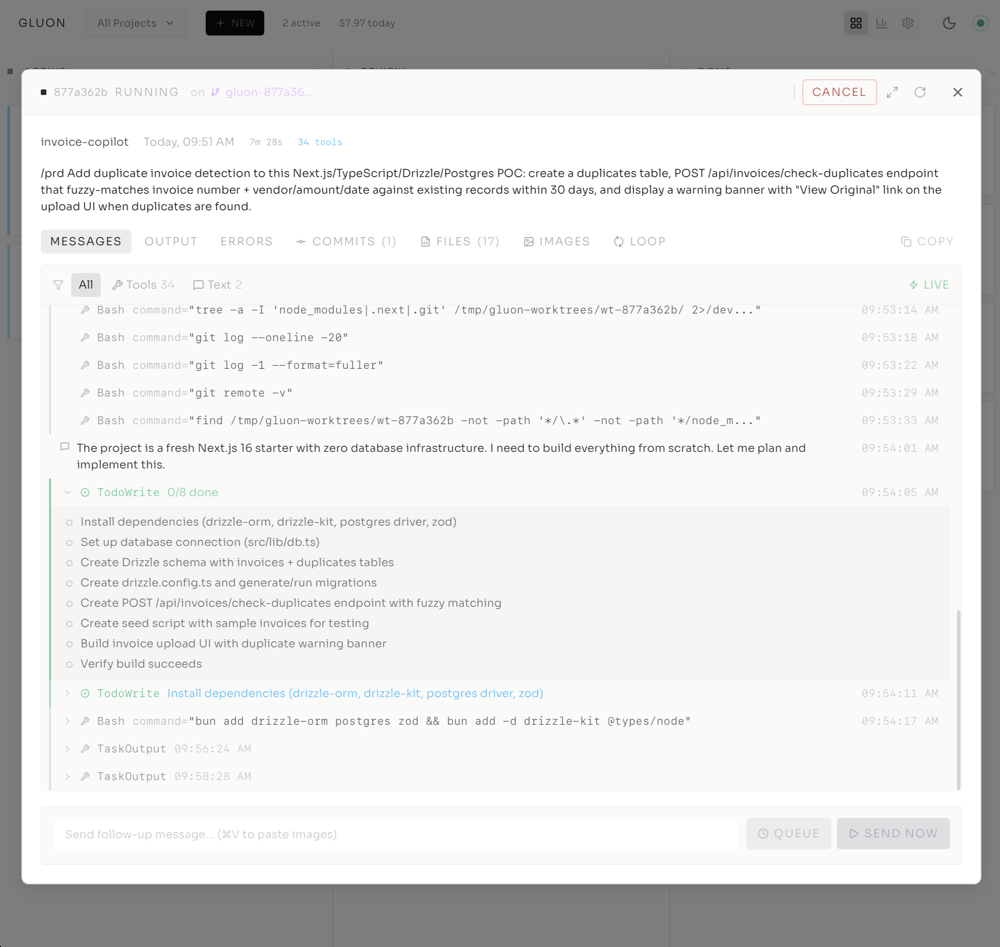
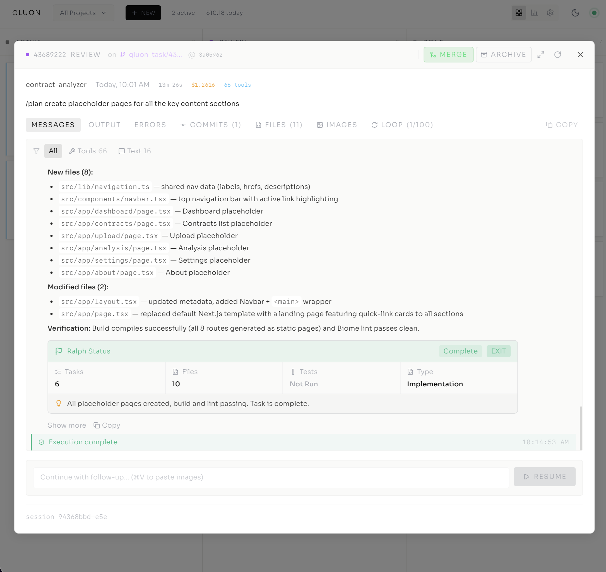
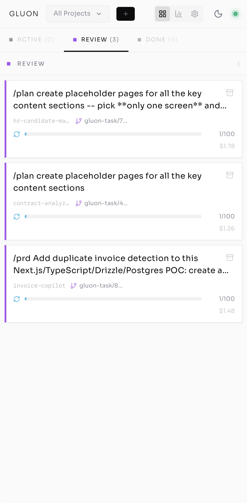
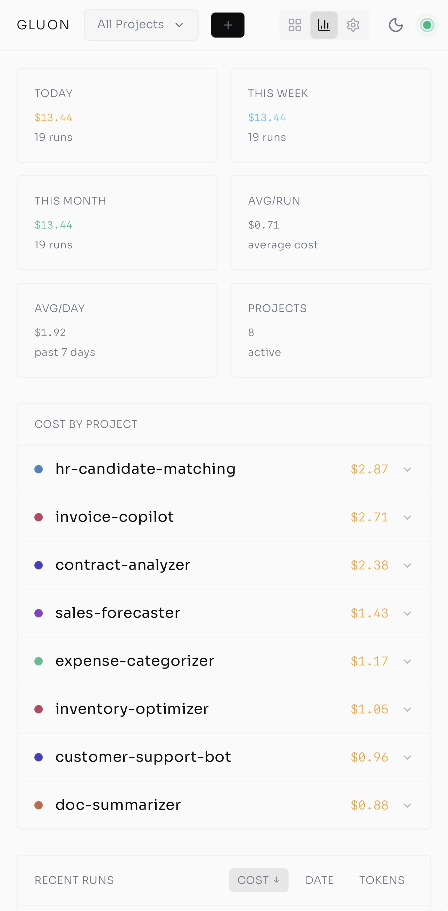
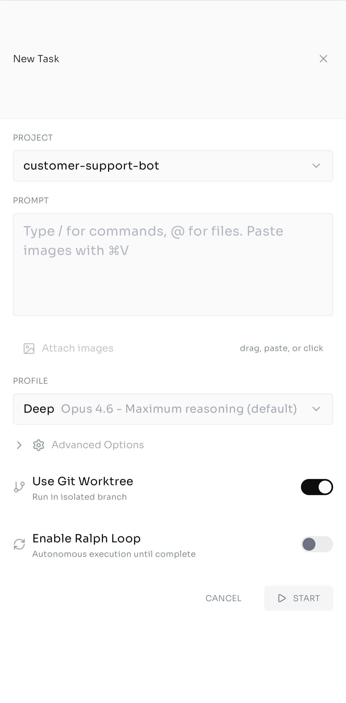
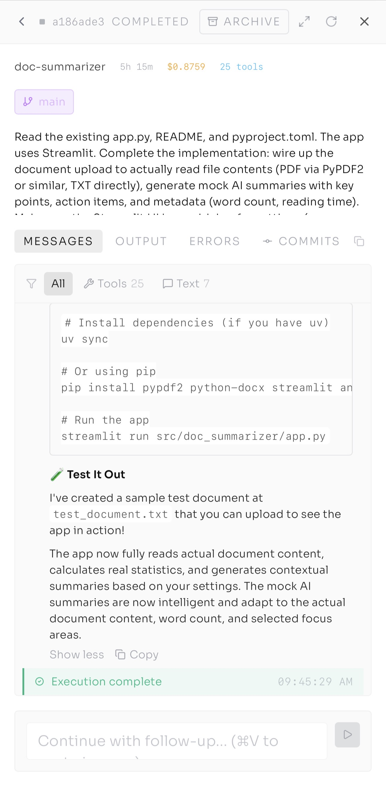
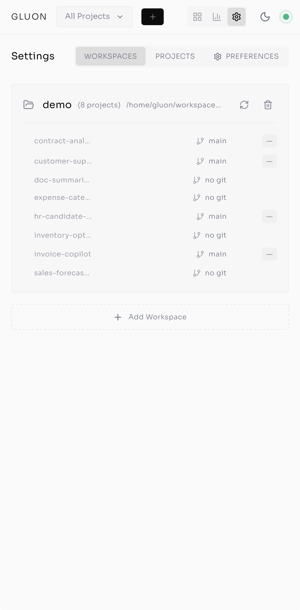

# Gluon Web UI Screenshots

## Dashboard

### Kanban Board
Active/Review/Done columns for tracking agent runs across projects.

### Cost Tracking
Per-project cost breakdown with recent runs list.

## Creating Runs

### Slash Command Autocomplete
New run dialog with slash command autocomplete.

### Execution Options
File picker, profile selection, and execution options (git worktree, Ralph Loop, cost limit).

## Task Details

### Active Task — Live Stream
Active task (sales-forecaster) showing live message stream with tool calls and task list.

### Active Task — Todo Checklist
Active task (invoice-copilot) with todo checklist and live output.

### Task in Review
Task in review (doc-summarizer) showing message history with file edits and bash commands.

### Commits
Commits tab listing files changed with additions/deletions per file.

### File Diffs
Files tab with inline unified diffs for each changed file.

### Ralph Loop — Iterations
Loop tab showing iteration history with files, tokens, cost, and Ralph Status exit signal.

### Ralph Loop — Complete
Completed task with Ralph Status summary, task count, file count, and verification result.

### Completed Task Summary
Rendered markdown output with resume button.

## Settings

### Workspaces
Workspace with auto-discovered projects and git status.

### Add Workspace
Add workspace form with name, path, and auto-scan option.

### Projects
All projects listed with workspace labels and git branches.

### Preferences
Git worktree, author identity, and sandbox isolation settings.

## Mobile PWA

### Kanban Board
Task cards with Active/Review/Done tabs, loop progress, and cost per run.

### Cost Dashboard
Summary stats (today, weekly, avg/run, avg/day) with per-project cost breakdown.

### New Task
New task form with project selector, prompt input, profile picker, git worktree and Ralph Loop toggles.

### Task Review
Completed task with rendered markdown output, tool call count, and message stream.

### Settings
Workspaces tab showing projects with git branch status.

