# Gluon Web UI Screenshots

## Dashboard

### Kanban Board
Active/Review/Done columns for tracking agent runs across projects.

### Cost Tracking
Per-project cost breakdown with recent runs list.
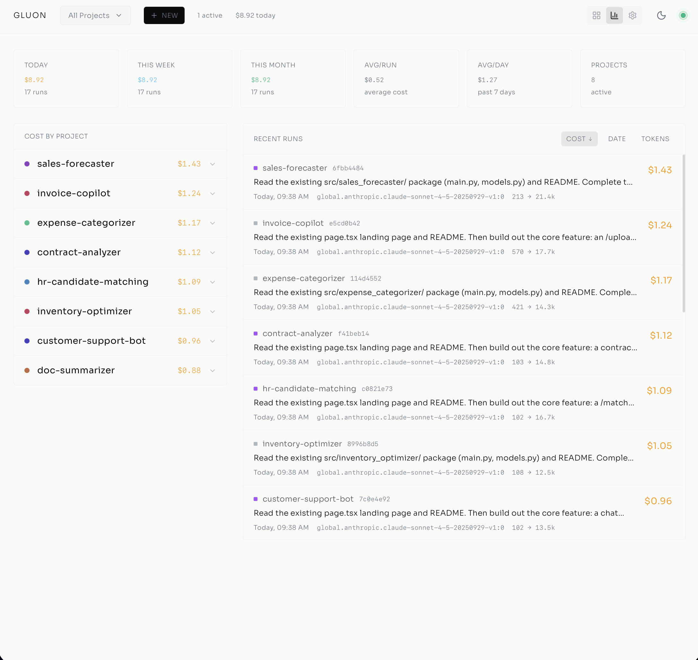

## Creating Runs

### Slash Command Autocomplete
New run dialog with slash command autocomplete.
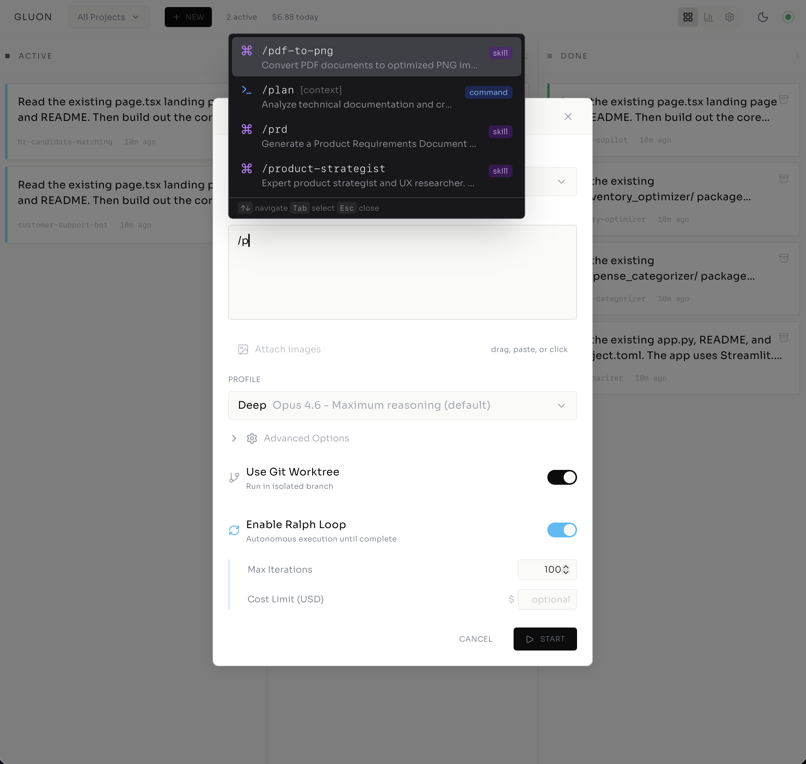

### Execution Options
File picker, profile selection, and execution options (git worktree, Ralph Loop, cost limit).
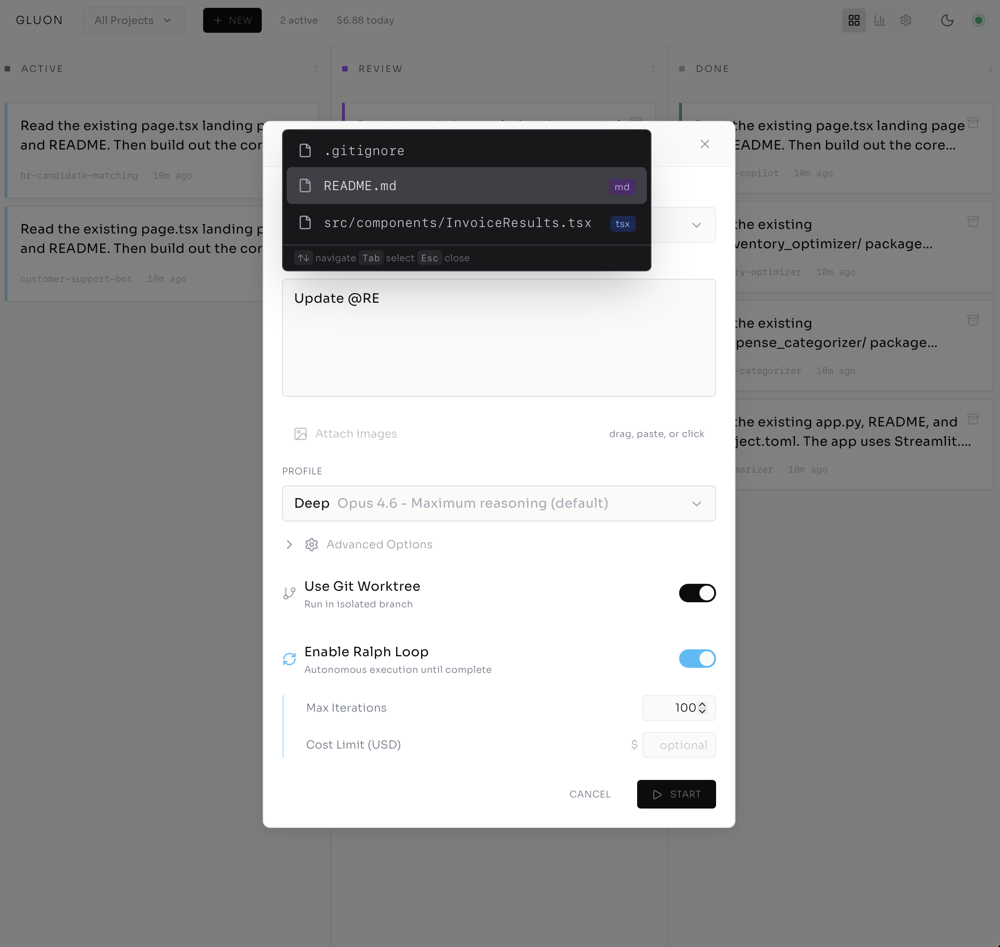

## Run Details

### Active Run — Live Stream
Active run (sales-forecaster) showing live message stream with tool calls and task list.
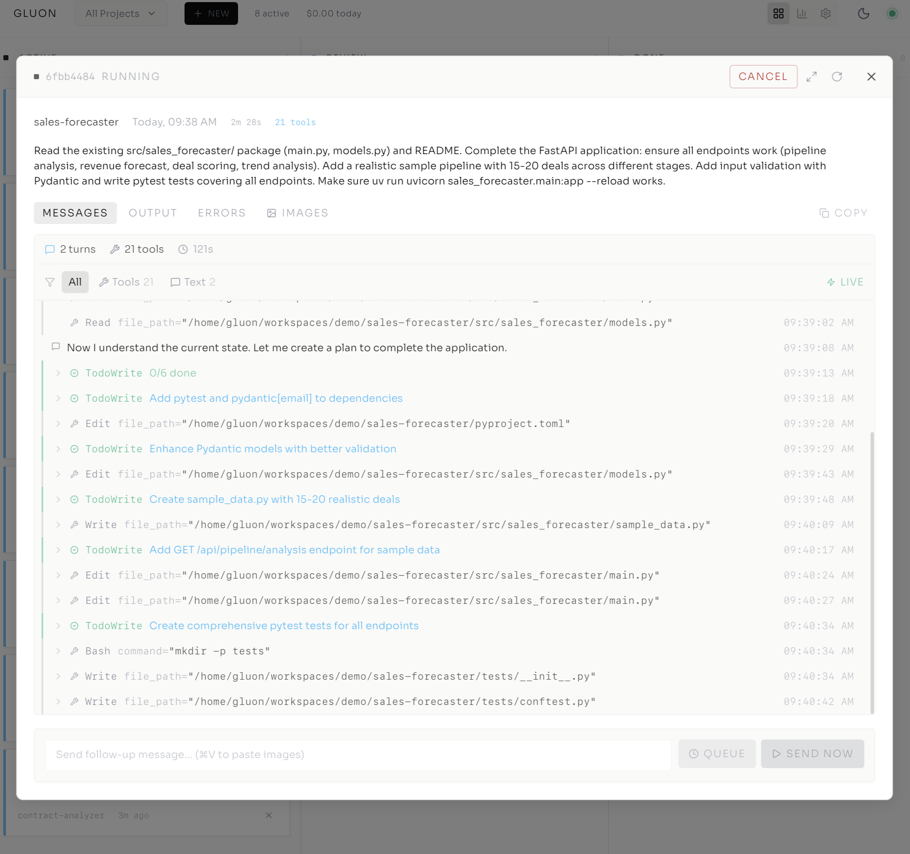

### Active Run — Todo Checklist
Active run (invoice-copilot) with todo checklist and live output.

### Run in Review
Run in review (doc-summarizer) showing message history with file edits and bash commands.

### Commits
Commits tab listing files changed with additions/deletions per file.
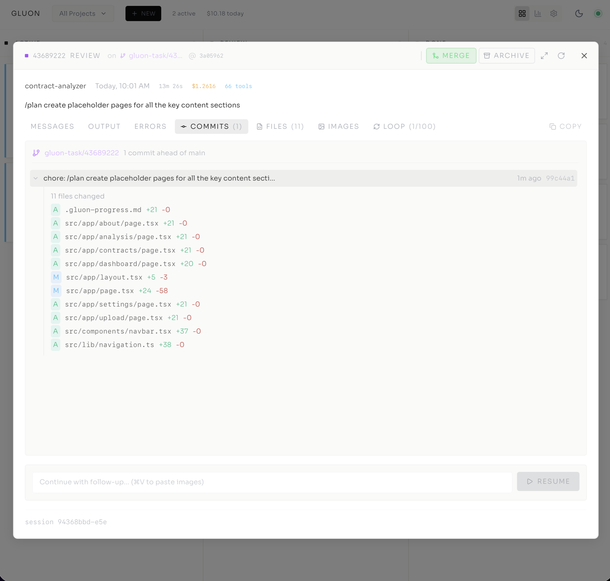

### File Diffs
Files tab with inline unified diffs for each changed file.
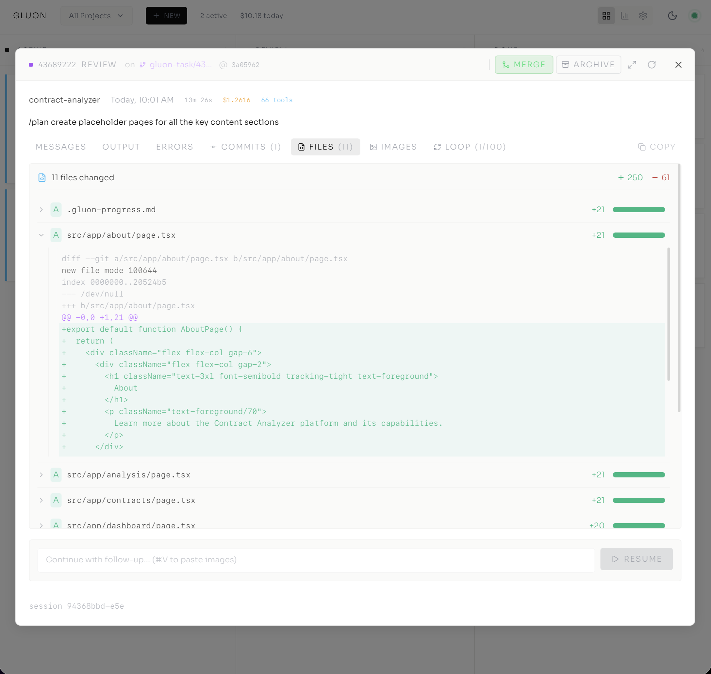

### Ralph Loop — Iterations
Loop tab showing iteration history with files, tokens, cost, and Ralph Status exit signal.
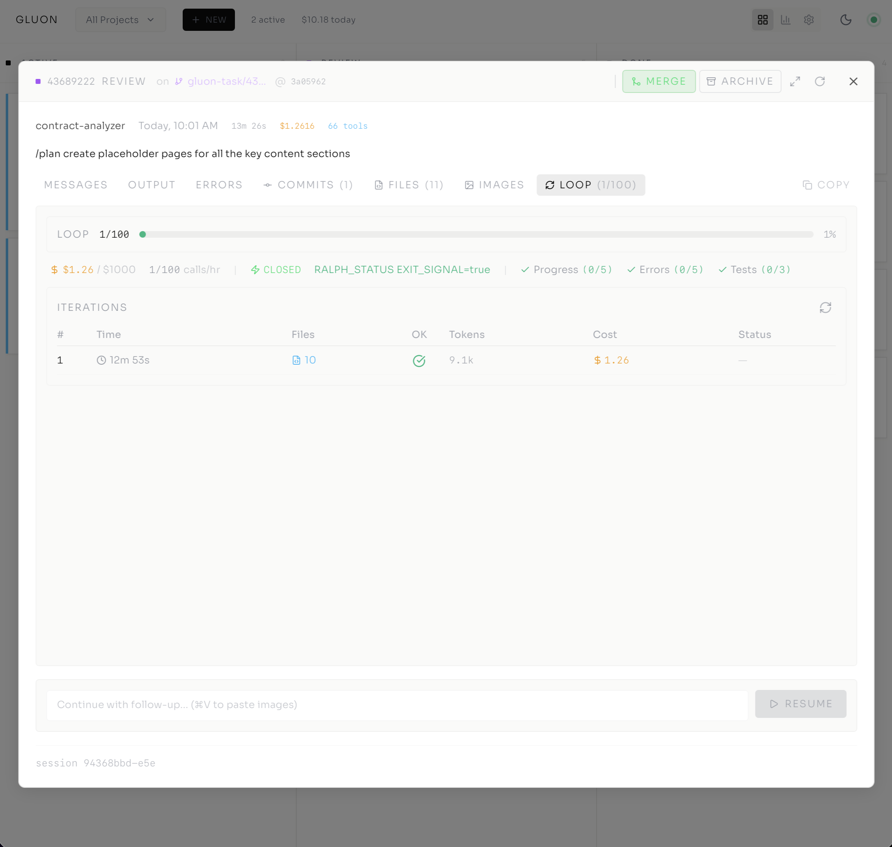

### Ralph Loop — Complete
Completed run with Ralph Status summary, task count, file count, and verification result.

### Completed Run Summary
Rendered markdown output with resume button.
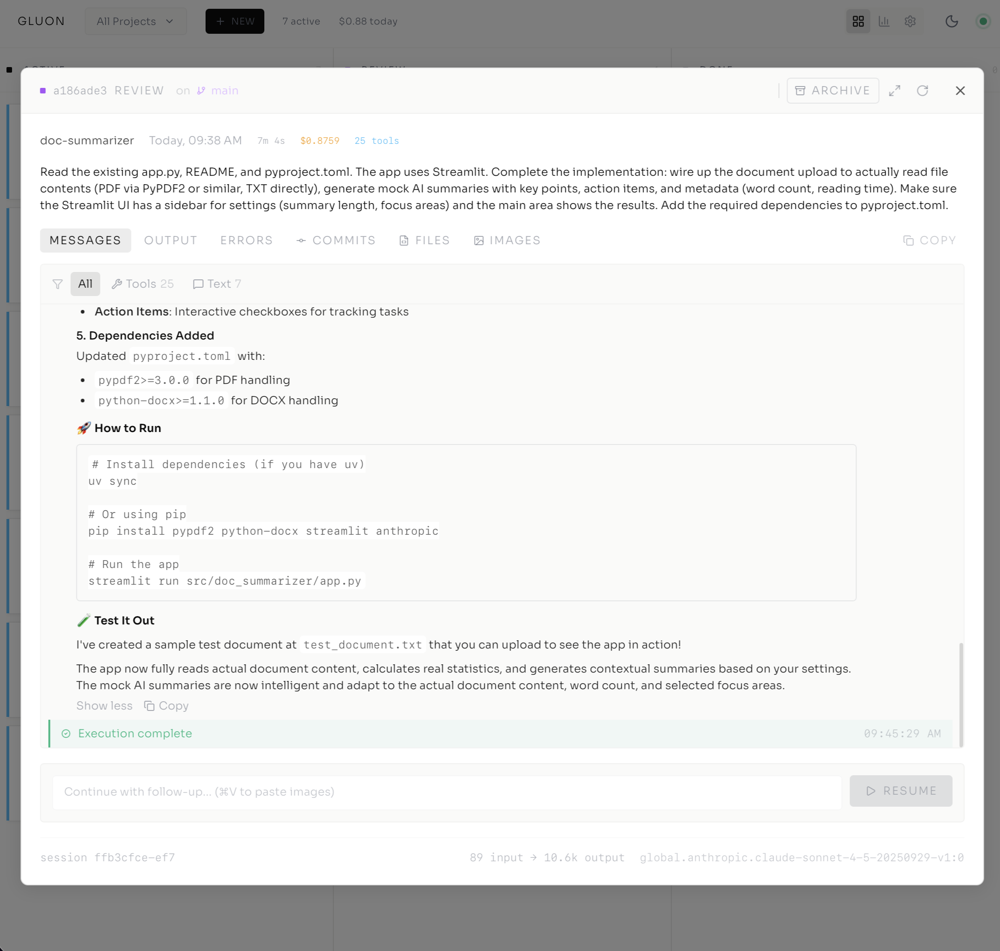

## Settings

### Workspaces
Workspace with auto-discovered projects and git status.
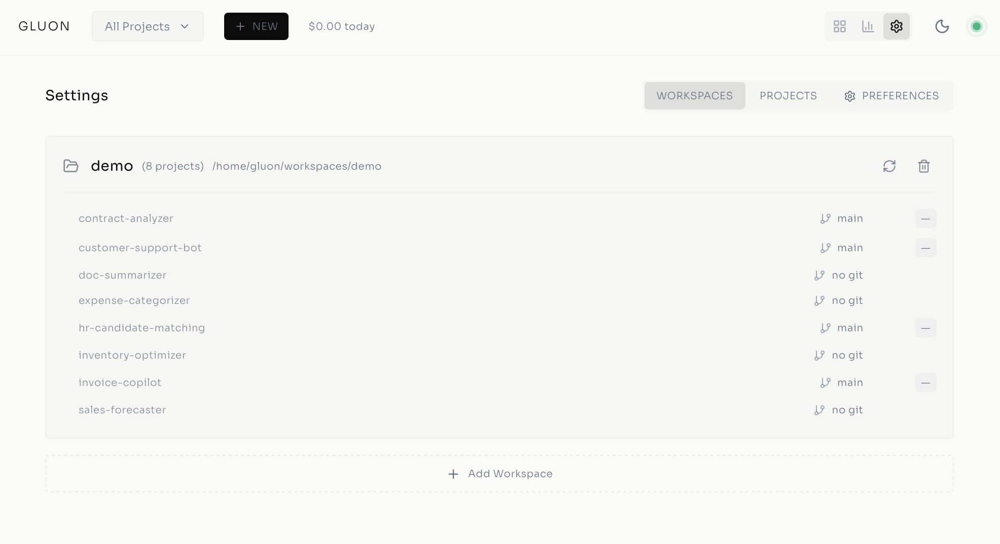

### Add Workspace
Add workspace form with name, path, and auto-scan option.
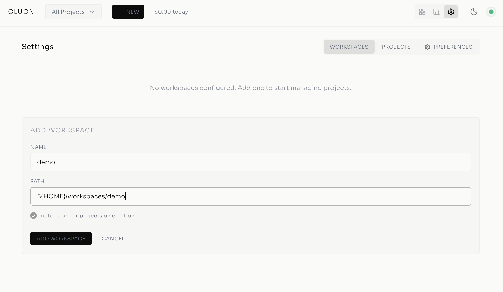

### Projects
All projects listed with workspace labels and git branches.
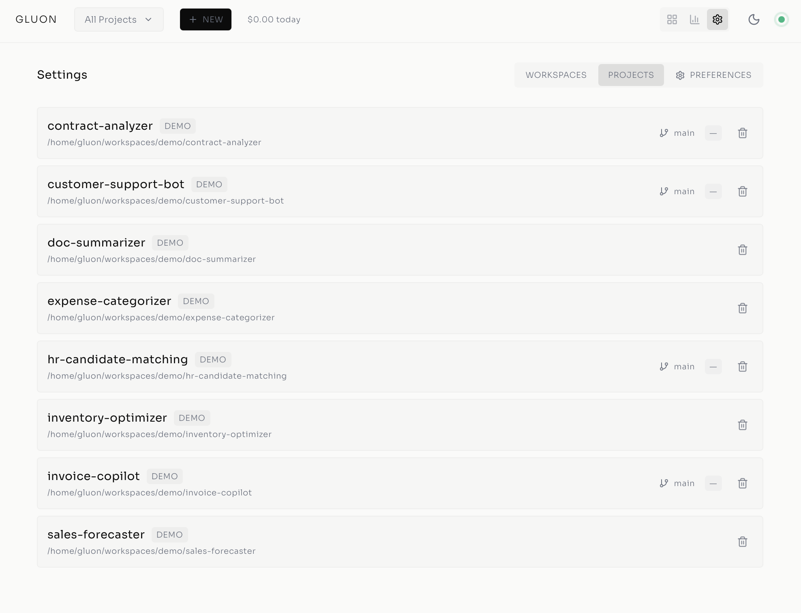

### Preferences
Git worktree, author identity, and sandbox isolation settings.
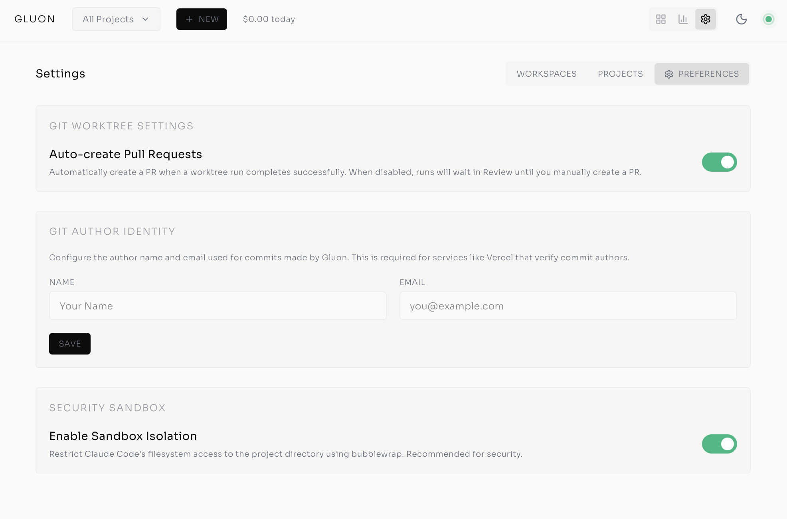
