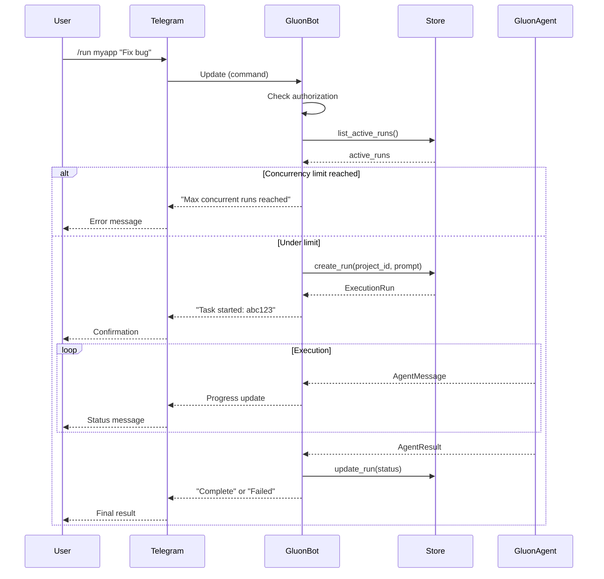

# Telegram Bot

Run Gluon as an always-on daemon via Telegram with support for multiple concurrent tasks.

## Setup

1. Message [@BotFather](https://t.me/BotFather) on Telegram
2. Send `/newbot` and follow instructions to create your bot
3. Copy the token you receive
4. (Optional) Get your user ID from [@userinfobot](https://t.me/userinfobot)

## Run the Bot

```bash
# Set token via environment variable
export GLUON_TELEGRAM_TOKEN="your-bot-token"

# Optional: restrict to specific users (comma-separated IDs)
export GLUON_TELEGRAM_USERS="123456789,987654321"

# Start the bot
gluon bot

# Or pass token directly
gluon bot --token "your-bot-token" --users "123456789"
```

## Commands

| Command | Description |
|---------|-------------|
| `/projects` | List registered projects |
| `/sessions [project]` | List sessions |
| `/run <project> <prompt>` | Run a task |
| `/resume <project> [session_id] [prompt]` | Resume session |
| `/runs` | List your background runs |
| `/runs all` | List all runs |
| `/status` | Show overall status |
| `/cancel` | Cancel your latest active run |
| `/cancel <run_id>` | Cancel specific run |
| `/clear` | Clear chat history |
| `/help` | Show help |

## Natural Language

Instead of commands, you can chat naturally with the bot:

| What you say | What happens |
|--------------|--------------|
| "Show me my projects" | Lists all registered projects |
| "What's the git status of myapp?" | Shows git branch, uncommitted changes, ahead/behind |
| "Run a task on myapp to fix the login bug" | Starts a coding task with Claude |
| "What tasks are running?" | Lists active background runs |
| "Cancel the last task" | Cancels most recent active run |
| "Search the web for React best practices" | Performs web search |
| "Read the README in myapp" | Reads file contents from project |
| "Find all Python files in myapp" | Searches for files by pattern |
| *(reply to completion)* "Also add tests" | Resumes the session with follow-up |

## Features

- **Multiple concurrent tasks** - Run tasks across multiple projects simultaneously
- **Persistent tracking** - All runs are tracked in SQLite and survive bot restarts
- **Global concurrency limit** - Configurable limit (default: 16) prevents resource exhaustion
- **Natural language support** - Chat naturally instead of using commands
- **Conversation context** - Bot remembers recent messages for follow-up questions
- **Reply to resume** - Reply to a completion message to automatically resume that session
- **Real-time updates** - Get progress updates as tasks execute

## Chat Agent Tools

The natural language interface has access to:

- **Gluon tools**: Project management, task execution, run monitoring, git status
- **File tools**: Read, Glob, Grep for exploring project code
- **Shell tools**: Bash, BashOutput for running commands
- **Web tools**: WebSearch, WebFetch for internet lookups

## Bot Flow



## Environment Variables

| Variable | Description |
|----------|-------------|
| `GLUON_TELEGRAM_TOKEN` | Telegram bot token (required) |
| `GLUON_TELEGRAM_USERS` | Comma-separated list of allowed user IDs |
