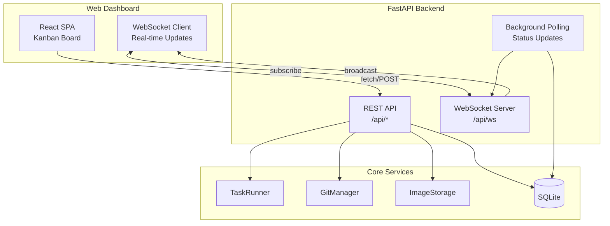
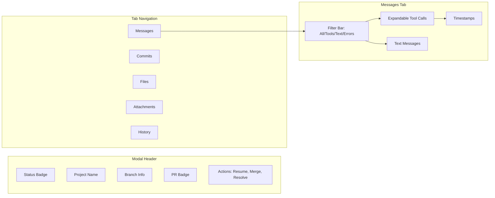
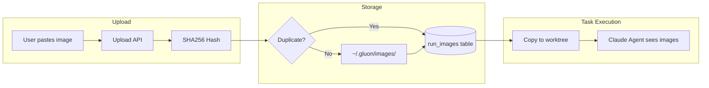

# Web Dashboard

Gluon includes a full-featured web dashboard built with FastAPI + React, providing a Kanban board view of all tasks with real-time WebSocket updates.

## Quick Start

```bash
# Start the web server (port 45866)
gluon web

# Or run in development mode
cd web-ui && npm run dev  # Terminal 1: Vite dev server
uvicorn gluon.web.api:app --reload --port 45866  # Terminal 2: FastAPI
```

Open http://localhost:45866 to access the dashboard.

## Features

- **Unified Task Visibility** - See all tasks from all interfaces (CLI, Telegram, Discord) in one place
- **Kanban Board** - Drag-and-drop task management across columns (Queued, Running, Review, Completed, Failed)
- **Real-time Updates** - WebSocket-powered live status updates
- **Project Filtering** - Filter tasks by project or workspace
- **Run Details Modal** - Comprehensive task viewer with multiple tabs
- **Image Attachments** - Upload screenshots for AI context (paste with ⌘V)
- **PR Integration** - Create PRs, view merge status, resolve conflicts with AI
- **Usage Dashboard** - Track costs and token usage by project/day

## Unified Task Tracking

The dashboard displays **all** tasks regardless of where they were initiated:

| Source | Visible in Dashboard | Initiator Field |
|--------|---------------------|-----------------|
| `gluon run` (foreground) | ✅ Yes | `cli:foreground` |
| `gluon run --background` | ✅ Yes | `cli:background` |
| Web Dashboard | ✅ Yes | `web:dashboard` |
| Telegram Bot | ✅ Yes | `telegram:{user_id}` |
| Discord Bot | ✅ Yes | `discord:{user_id}` |

This unified tracking means:
- Run `gluon run myapp "task"` from terminal → appears immediately in web dashboard
- Start a task from Telegram → monitor progress in web dashboard
- View all your team's tasks in one Kanban board regardless of interface used

## Architecture



## Run Details Modal

The modal provides a comprehensive view of each task with multiple tabs:



| Tab | Features |
|-----|----------|
| **Messages** | Filterable by type (All/Tools/Text/Errors), expandable tool calls with parameters, timestamps |
| **Commits** | Expandable commit list with author, message, files changed, diff viewer |
| **Files** | All files changed on branch with additions/deletions, inline diff viewer |
| **Attachments** | Image gallery with preview, download, upload new images |
| **History** | Session history showing all runs in the conversation thread |

## Image Attachments

Attach images (screenshots, diagrams, mockups) to tasks to provide visual context to the AI agent.

### Upload Methods

1. **Paste** - Press ⌘V (Cmd+V) in the task creation dialog or resume textarea
2. **API** - POST multipart form to `/api/runs/{run_id}/attachments`

### How It Works



### Features

- **Deduplication** - Same image uploaded twice only stored once (SHA256)
- **Worktree Copy** - Images copied to `.gluon-images/` in worktree for AI visibility
- **Gallery View** - View all images attached to a run in the dashboard
- **Supported Formats** - PNG, JPEG, GIF, WebP (max 50MB)

## Usage Tracking

Monitor costs and token usage across all runs.

### Dashboard View

The Usage page (`/usage`) shows:

- **Today's Cost** - Total spend today
- **Weekly Cost** - 7-day rolling total
- **Cost by Project** - Breakdown per project
- **Daily Chart** - Visual cost/token trends
- **Run List** - Sortable by cost, tokens, date

### API Endpoints

```
GET /api/usage/summary      # Today/week totals
GET /api/usage/by-project   # Cost per project
GET /api/usage/by-day       # Daily aggregates
GET /api/usage/runs         # Runs with cost data
```

### Tracked Metrics

| Metric | Description |
|--------|-------------|
| `cost_usd` | Total API cost for the run |
| `input_tokens` | Tokens sent to Claude |
| `output_tokens` | Tokens received from Claude |
| `model_used` | Model tier (haiku/sonnet/opus) |

## REST API Reference

### Core Endpoints

| Endpoint | Method | Description |
|----------|--------|-------------|
| `/api/runs` | GET | List runs (filter by project, status, archived) |
| `/api/runs` | POST | Create new run |
| `/api/runs/{id}` | GET | Get run details |
| `/api/runs/{id}/cancel` | POST | Cancel running task |
| `/api/runs/{id}/resume` | POST | Resume with follow-up prompt |
| `/api/runs/{id}/logs` | GET | Get stdout/stderr/messages |
| `/api/runs/{id}/archive` | POST | Archive run (hide from board) |

### Git/PR Endpoints

| Endpoint | Method | Description |
|----------|--------|-------------|
| `/api/runs/{id}/commits` | GET | Commits on run's branch |
| `/api/runs/{id}/commits/{sha}` | GET | Get commit detail with files |
| `/api/runs/{id}/files` | GET | Files changed on branch |
| `/api/runs/{id}/files/{path}` | GET | Get file diff |
| `/api/runs/{id}/create-pr` | POST | Create PR for worktree run |
| `/api/runs/{id}/merge` | POST | Merge branch locally |

### Image Endpoints

| Endpoint | Method | Description |
|----------|--------|-------------|
| `/api/images/upload` | POST | Upload image (multipart) |
| `/api/images/{id}/file` | GET | Serve image file |
| `/api/runs/{id}/attachments` | GET | List attached images |
| `/api/runs/{id}/attachments` | POST | Attach image to run |

### WebSocket Events

Connect to `/api/ws` for real-time updates:

```json
{"type": "run_created", "run": {...}}
{"type": "run_updated", "run": {...}}
{"type": "log_line", "run_id": "...", "stream": "stdout", "line": "..."}
```
