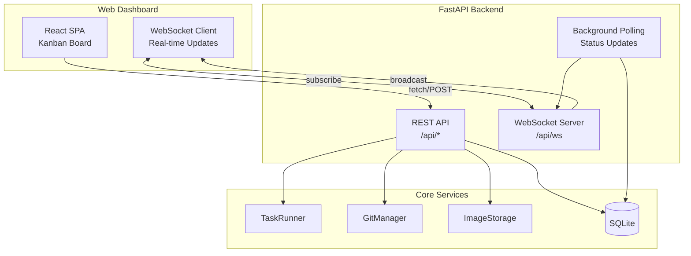
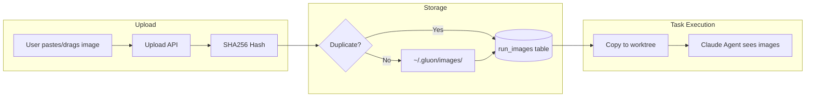
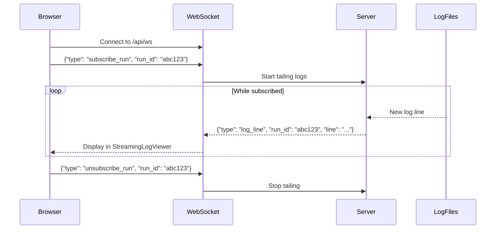

# Web Dashboard

Gluon includes a full-featured web dashboard built with FastAPI + React, providing a Kanban board view of all tasks with real-time WebSocket updates.

## Quick Start

```bash
# Start the web server (port 45866)
gluon web

# Or run in development mode
cd web-ui && bun dev  # Terminal 1: Vite dev server
uvicorn gluon.web.api:app --reload --port 45866  # Terminal 2: FastAPI
```

Open http://localhost:45866 to access the dashboard.

## Features

- **Unified Task Visibility** - See all tasks from all interfaces (CLI, Telegram, Discord) in one place
- **Kanban Board** - Task management across columns (Queued, Running, Review, Completed, Failed)
- **Real-Time Log Streaming** - WebSocket-powered live log output with tool call visualization
- **Project & Workspace Filtering** - Filter tasks by project, workspace, or view archived runs
- **Task Creation** - Dialog with slash command autocomplete, file mention autocomplete, model/profile selection
- **Run Details View** - Comprehensive task viewer with multiple tabs (Messages, Output, Errors, Commits, Files, Attachments, Loop Progress, History)
- **Image Attachments** - Upload screenshots for AI context (drag, paste with ⌘V, or click)
- **Git Integration** - View commits, files changed, diffs on branch
- **PR Management** - Create PRs, view merge status
- **Usage Analytics** - Track costs and token usage by project/day
- **Settings Management** - Manage workspaces, projects, preferences, git config, and sandbox status
- **PWA Features** - Offline overlay, pull-to-refresh, update banner, service worker support
- **Theme Toggle** - Light/dark mode support
- **Responsive Design** - Works on desktop and mobile
- **Ralph Loop Monitoring** - Track autonomous execution loops with iteration details

## Unified Task Tracking

The dashboard displays **all** tasks regardless of where they were initiated:

| Source | Visible in Dashboard | Initiator Field |
|--------|---------------------|-----------------|
| `gluon run` (foreground) | ✅ Yes | `cli:foreground` |
| `gluon run --background` | ✅ Yes | `cli:background` |
| Web Dashboard | ✅ Yes | `web:dashboard` |
| Telegram Bot | ✅ Yes | `telegram:{user_id}` |
| Discord Bot | ✅ Yes | `discord:{user_id}` |

This unified tracking means:
- Run `gluon run myapp "task"` from terminal → appears immediately in web dashboard
- Start a task from Telegram → monitor progress in web dashboard
- View all your team's tasks in one Kanban board regardless of interface used

## Architecture



## Run Details View

The run details dialog provides a comprehensive view of each task with multiple tabs and actions.

### Modal Header

- **Status Badge** - Current run status (pending, running, completed, failed, review, etc.)
- **Project Name** - Project this run belongs to
- **Duration** - Time elapsed or total duration
- **Cost** - USD cost for the run
- **Action Buttons**:
  - Resume - Continue with follow-up prompt (for completed/failed runs)
  - Cancel - Stop a running task
  - Archive - Hide from board
  - Merge - Merge worktree branch (for git-enabled runs)

### Tabs

| Tab | Features |
|-----|----------|
| **Output** | Streaming log viewer with live updates, auto-scroll, tool call visualization |
| **Errors** | Filtered error messages with stack traces and context |
| **Messages** | Full message history filterable by type (All/Tools/Text/Errors), expandable tool calls with parameters and results, inline screenshot thumbnails |
| **Commits** | Expandable commit list showing author, timestamp, message, and files changed; click commits for detailed diff view |
| **Files** | All files changed on branch with additions/deletions counts; inline diff viewer for each file |
| **Attachments** | Image gallery with square preview thumbnails; upload new images or view auto-captured screenshots (badged with SCREENSHOT label) |
| **Loop** | Ralph iteration progress (when ralph loop enabled), showing iteration count, status, cost, safety metrics |
| **History** | Session history showing all related runs in the conversation thread |

### Quick Actions

- **Queued Messages** - Queue follow-up prompts while task is running; edit/delete before execution
- **Questions Modal** - Respond to pending supervision questions with multi-select options
- **Recovery UI** - Recover failed runs or resume interrupted sessions
- **Status Update** - Manually update run status if needed

## Task Creation Dialog

The "New Task" dialog provides a powerful interface for creating tasks with advanced options.

### Basic Fields

- **Project** - Select from available projects, grouped by workspace
- **Prompt** - Enter task description with two autocomplete systems:
  - **Slash Commands** (type `/`) - Global and project-specific commands (e.g., `/fix-lint`, `/refactor`)
  - **File Mentions** (type `@`) - Quick file path references (e.g., `@src/index.ts`)

### Model & Profile Selection

**Quick Profiles** (Pre-configured combinations):

| Profile | Model | Use Case |
|---------|-------|----------|
| Quick | Haiku 4.5 | Fast responses, low cost |
| Standard | Sonnet 4.5 | Balanced quality/speed (default) |
| Deep | Opus 4.6 | Maximum reasoning, complex tasks |
| Planning | Opus 4.6 | Plan before execution mode |

**Advanced Options** (Override defaults):

- **Model Override** - Force specific model (opus-4.6, opus-4.5, sonnet, haiku)
- **Thinking Budget** - Extended thinking tokens (none, low 4k, medium 10k, high 16k, ultrathink 32k)
- **Max Budget (USD)** - Override profile cost limit

### Execution Options

- **Use Git Worktree** - Run in isolated git branch (default: enabled)
- **Enable Ralph Loop** - Autonomous execution until complete (default: disabled)
  - **Max Iterations** - Maximum loop cycles (default: 10)
  - **Cost Limit** - Max USD to spend on loop iterations

### Image Attachments

- **Upload Methods**:
  - Drag and drop
  - Paste with ⌘V (Cmd+V)
  - Click to browse
- **Grid Display** - Thumbnail previews of pending images
- **Supported Formats** - PNG, JPEG, GIF, WebP (max 50MB each)

### Keyboard Shortcuts

- **⌘Enter** (Mac) or **Ctrl+Enter** (Linux/Windows) - Submit task
- **Escape** - Close dialog

## Image Attachments

Attach images (screenshots, diagrams, mockups) to tasks to provide visual context to the AI agent.

### Upload Methods

1. **Paste** - Press ⌘V (Cmd+V) in the task creation dialog or resume textarea
2. **Drag & Drop** - Drag images into the attachment zone
3. **Click** - Click attachment zone to browse files
4. **API** - POST multipart form to `/api/runs/{run_id}/attachments`

### How It Works



### Features

- **Deduplication** - Same image uploaded twice only stored once (SHA256)
- **Worktree Copy** - Images copied to `.gluon-images/` in worktree for AI visibility
- **Gallery View** - View all images attached to a run in the attachments tab
- **Supported Formats** - PNG, JPEG, GIF, WebP (max 50MB each)

### Screenshot Interception

When an agent uses `agent-browser screenshot <path>`, Gluon automatically:

1. **Captures** the screenshot file from the agent's working directory via a PostToolUse hook
2. **Stores** it in the image storage service (SHA256-deduplicated)
3. **Attaches** it to the run with a `screenshot` source badge
4. **Injects** a `screenshot` message into `messages.jsonl` so it appears inline in the Messages tab

Screenshots are visible in two places:
- **Messages tab** — Clickable thumbnail inline with the message stream (harvest-colored border)
- **Images tab** — Square thumbnail in the image grid with a "SCREENSHOT" badge

The agent is guided by a system prompt to use `agent-browser` directly (Chromium is pre-installed in Docker) rather than attempting to install browsers or use `mcp_scraper` for localhost pages.

## Usage Tracking

Monitor costs and token usage across all runs.

### Usage Page

The Usage page (`/usage`) displays:

**Summary Cards**:
- **Today** - Cost and run count for today
- **This Week** - 7-day rolling total
- **This Month** - Monthly cumulative total
- **Avg/Run** - Average cost per run
- **Avg/Day** - Average daily spend (past 7 days)
- **Projects** - Count of active projects

**Cost by Project Panel**:
- Expandable list of projects with total costs
- Color-coded project indicators
- Sortable by cost

**Run List**:
- Sortable by cost (desc), date, or tokens
- Columns: cost, run count, input tokens, output tokens
- Pagination (50 runs per page)

### Tracked Metrics

| Metric | Description |
|--------|-------------|
| `cost_usd` | Total API cost for the run |
| `input_tokens` | Tokens sent to Claude |
| `output_tokens` | Tokens received from Claude |
| `model_used` | Model name (opus-4.6, sonnet-4.5, haiku-4.5, etc.) |
| `created_at` | Run creation timestamp |

### API Endpoints

```
GET /api/usage/summary      # Today/week/month totals and run counts
GET /api/usage/by-project   # Cost breakdown per project
GET /api/usage/by-day       # Daily aggregates
GET /api/usage/runs         # Runs with cost data (sortable, paginated)
```

## REST API Reference

### Run Management

| Endpoint | Method | Description |
|----------|--------|-------------|
| `/api/runs` | GET | List runs with filtering (project, status, archived, initiator) |
| `/api/runs` | POST | Create new run with options (profile, model, worktree, ralph loop) |
| `/api/runs/{id}` | GET | Get run details including PR status, branch info, cost |
| `/api/runs/{id}/cancel` | POST | Cancel a running task |
| `/api/runs/{id}/resume` | POST | Resume completed/failed run with follow-up prompt |
| `/api/runs/{id}/recover` | POST | Recover failed run or continue interrupted session |
| `/api/runs/{id}/logs` | GET | Get stdout/stderr logs (streamed or bulk) |
| `/api/runs/{id}/archive` | POST | Archive run (hide from board) |
| `/api/runs/{id}/unarchive` | POST | Restore archived run to board |
| `/api/runs/{id}/status` | POST | Manually update run status |

### Task Queue & Follow-ups

| Endpoint | Method | Description |
|----------|--------|-------------|
| `/api/runs/{id}/queue-followup` | POST | Queue message for running task (auto-resume on completion) |
| `/api/runs/{id}/queue/{msg_id}` | PUT | Edit queued message |
| `/api/runs/{id}/queue/{msg_id}` | DELETE | Delete queued message |
| `/api/runs/{id}/queue` | DELETE | Clear all queued messages |

### Questions & Supervision

| Endpoint | Method | Description |
|----------|--------|-------------|
| `/api/runs/{id}/questions` | GET | Get pending supervision questions |
| `/api/questions/{question_id}/answer` | POST | Answer supervision question with selected labels |
| `/api/runs/{id}/supervision` | GET | Get supervision status and policy |
| `/api/runs/{id}/supervision/evaluate` | POST | Evaluate if task needs supervision |
| `/api/runs/{id}/supervision/disable` | POST | Disable supervision for specific reason |

### Ralph Loop Monitoring

| Endpoint | Method | Description |
|----------|--------|-------------|
| `/api/runs/{id}/iterations` | GET | Get ralph loop iteration history (costs, status, circuit state) |
| `/api/runs/{id}/stop-loop` | POST | Stop autonomous loop early, mark as review |

### Git Integration

| Endpoint | Method | Description |
|----------|--------|-------------|
| `/api/runs/{id}/commits` | GET | Commits on run's branch |
| `/api/runs/{id}/commits/{sha}` | GET | Get commit detail with files changed |
| `/api/runs/{id}/files` | GET | All files changed on branch |
| `/api/runs/{id}/files/{path}/diff` | GET | Get file diff (unified or split format) |
| `/api/runs/{id}/session-history` | GET | Session history showing related runs |

### Projects & Workspaces

| Endpoint | Method | Description |
|----------|--------|-------------|
| `/api/projects` | GET | List all projects with paths and metadata |
| `/api/projects` | POST | Create new project |
| `/api/projects/{id}` | GET | Get project details (branch, status, git ahead/behind) |
| `/api/projects/{id}/commands` | GET | Project-specific slash commands |
| `/api/projects/{id}/files` | GET | Project source files for autocomplete |
| `/api/projects/{id}` | DELETE | Delete project |
| `/api/workspaces` | GET | List all workspaces |
| `/api/workspaces` | POST | Create workspace from path |
| `/api/workspaces/{id}` | DELETE | Delete workspace |
| `/api/workspaces/{id}/scan` | POST | Scan workspace directory for projects |

### Usage & Analytics

| Endpoint | Method | Description |
|----------|--------|-------------|
| `/api/usage/summary` | GET | Today/week/month totals and run counts |
| `/api/usage/by-project` | GET | Cost breakdown per project |
| `/api/usage/by-day` | GET | Daily cost aggregates |
| `/api/usage/runs` | GET | Runs with cost data (sortable, paginated) |

### System & Configuration

| Endpoint | Method | Description |
|----------|--------|-------------|
| `/api/status` | GET | System status (database, git, storage) |
| `/api/version` | GET | API version and build info |
| `/api/commands` | GET | Global slash commands |
| `/api/settings` | GET | User settings (git config, preferences) |
| `/api/settings/{key}` | PUT | Update user setting |
| `/api/sandbox/status` | GET | Sandbox availability and runtime |

### Image Attachments

| Endpoint | Method | Description |
|----------|--------|-------------|
| `/api/runs/{id}/attachments` | GET | List images attached to run |
| `/api/runs/{id}/attachments` | POST | Upload and attach image to run |
| `/api/images/{id}/file` | GET | Serve image file by ID |

### WebSocket

| Endpoint | Description |
|----------|-------------|
| `/api/ws` | Real-time updates (connect and subscribe to run_id for live logs and status) |

**WebSocket Events**:
```json
{"type": "run_created", "run": {...}}
{"type": "run_updated", "run": {...}, "project_name": "..."}
{"type": "log_line", "run_id": "...", "stream": "stdout", "line": "..."}
```

**WebSocket Subscribe**:
```json
{"type": "subscribe_run", "run_id": "abc123"}
{"type": "unsubscribe_run", "run_id": "abc123"}
```

## Real-Time Log Streaming

The dashboard supports live log streaming for running tasks via WebSocket subscriptions.

### How It Works



### StreamingLogViewer Component

The `StreamingLogViewer` component provides:

- **Live Output** - New log lines appear in real-time as the agent executes
- **Tool Call Visualization** - Tool calls are parsed and displayed with expandable details
- **Auto-Scroll** - Automatically scrolls to show latest output (with manual override)
- **Message Filtering** - Filter by message type (All, Tools, Text, Errors)
- **Search** - Full-text search within logs
- **Copy Support** - Copy selected log text

### Message Types

| Type | Display | Description |
|------|---------|-------------|
| `assistant` | 💬 | Text output from the agent |
| `tool_use` | 🔧 | Tool invocation with parameters (expandable) |
| `tool_result` | ✅/❌ | Tool execution result |
| `system` | ⚙️ | System messages |
| `error` | 🔴 | Error messages |
| `screenshot` | 📷 | Screenshot captured via agent-browser (clickable thumbnail) |

### Subscribing to Logs

When viewing the Run Details dialog for a running task, the client automatically:

1. Sends a subscription request for that run's logs
2. Receives historical log lines (last 100)
3. Receives new log lines as they're written
4. Unsubscribes when closing the dialog or navigating away

## Settings Page

The Settings page provides management for workspaces, projects, and user preferences.

### Workspaces Tab

- **List** - All configured workspaces with project counts
- **Add Workspace** - Form to add new workspace (name, path, auto-scan toggle)
- **Scan Workspace** - Manually scan directory for gluon projects
- **Delete** - Remove workspace with confirmation
- **Auto-Scan** - Automatically discover projects on creation

### Projects Tab

- **List** - All projects grouped by workspace
- **Git Status** - Current branch, ahead/behind indicator
- **Refresh Status** - Update git status for all projects
- **Delete** - Remove project from tracking

### Preferences Tab

- **Git Configuration**:
  - Git user name (auto-detected, editable)
  - Git user email (auto-detected, editable)
- **Features**:
  - Auto-create PR toggle
- **Sandbox Status**:
  - Sandbox enabled/disabled toggle
  - Runtime info (Podman, Docker, etc.)
  - Manual status refresh

## Ralph Loop Progress Tab

When a task runs with the Ralph Loop (autonomous execution) enabled, the "Loop" tab displays:

### Loop Status

- **Current Iteration** - Which loop cycle is running
- **Total Cost** - Cumulative cost across all iterations
- **Completion Reason** - Why the loop stopped (complete, cost limit, max iterations, circuit open, etc.)

### Iteration Timeline

- **Expandable List** - Each iteration shows:
  - Iteration number and status (running, completed, failed)
  - Duration and timestamp
  - Tokens used and cost for that iteration
  - Outcome (success, error, user input needed)

### Safety Monitoring

- **Circuit Breaker State** - CLOSED (healthy), HALF_OPEN (degrading), OPEN (stopped)
- **Error Count** - Consecutive failures (threshold: 5)
- **Cost Progress** - Against max budget limit
- **Iteration Count** - Against max iterations limit

### Loop Actions

- **Stop Loop** - Manually terminate loop, mark run as review

## PWA Features

The dashboard includes progressive web app capabilities for offline support and improved performance.

### Offline Support

- **Offline Overlay** - Full-screen UI when backend is unreachable
  - Animated robot character (waiting, searching, reconnecting states)
  - Status-specific messaging
  - Automatic retry with countdown timer
  - Manual retry button
  - Last connected timestamp

- **Offline Detection**:
  - Automatic backend connectivity checks
  - Status transitions: online → checking → backend-unreachable/offline
  - Exponential backoff for retry attempts

### Service Worker

- **Cache Strategy** - Network-first for API, cache-first for assets
- **Update Detection** - Background update checking
- **Version Management** - Tracks API and UI versions

### Pull-to-Refresh

- **Mobile-Optimized** - Drag down to refresh board/usage
- **Visual Feedback** - Animated refresh indicator
- **Threshold** - 60px to trigger refresh
- **Resistance** - Smooth deceleration on drag

### Update Banner

- **New Version Available** - Shows when server version differs from client
- **Version Display** - Current → Available version comparison
- **Refresh Action** - Clear caches and reload with new version
- **Dismiss** - Hide banner until next version

## Theme & UI

- **Light/Dark Mode** - Toggle in header, respects system preference
- **Sonar-Style Connection Indicator** - Animated pulse showing WebSocket status
- **Responsive Design** - Works on desktop, tablet, and mobile
- **Keyboard Navigation** - Tab through controls, arrow keys for lists
- **Accessibility** - ARIA labels, semantic HTML, high contrast colors

## Question Modal

Appears when Claude needs human input during execution:

- **Multi-Question Support** - Multiple questions in sequence
- **Question Types**:
  - Single-select (radio buttons)
  - Multi-select (checkboxes)
  - Free-form (text input)
- **Auto-Answer Timer** - Shows seconds until auto-answering with default
- **Status Tracking** - Indicates which question is current
- **Navigation** - Move through question batch

## Kanban Board

Drag-and-drop task management with real-time status updates:

- **Columns**:
  - Queued - Pending tasks waiting to start
  - Running - Currently executing tasks
  - Review - Completed, awaiting user action
  - Completed - Successfully finished
  - Failed - Ended with error

- **Card Display**:
  - Project name and initiator
  - Status badge
  - Cost indicator
  - Quick actions (resume, cancel, archive)
  - PR status indicator

- **Filtering**:
  - By project
  - By workspace
  - Archived runs
  - Status indicator in header (active count)

- **Real-Time Updates**:
  - New runs appear immediately
  - Status changes trigger card movement
  - Cost updates live
  - WebSocket-powered push updates
